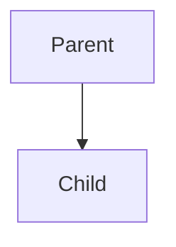
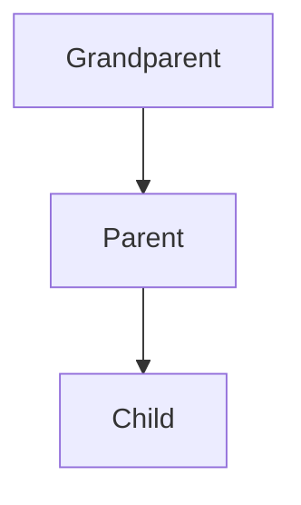
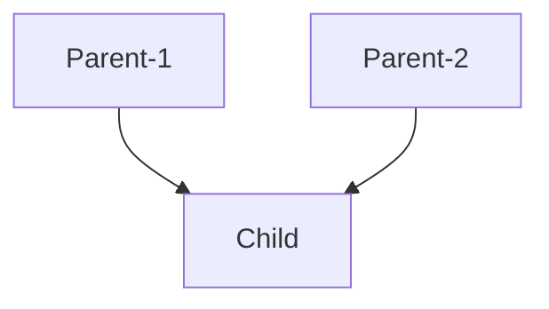

## C++ Object oriented Programming

## classes and objects

**Objects** are like the entities in the real world.  
**Classes** are the blueprints of the objects.

> **For example** Toyota made a blueprint (`class`) of cars. By using the blueprint they can build multiple cars (`object`).

A class can be a group of objects.

**Classes** are used as templates, so the developer doesn't need to write the same code multiple times.

---

### Properties and Methods

- **Properties** are the variables that hold data related to the object.  
  Example: In a `Car` class — `color`, `model`, `brand`, `speed` are properties.

- **Methods** are functions inside the class that define the behavior of the object.  
  Example: In a `Car` class — `startEngine()`, `accelerate()`, `brake()` are methods.

```cpp
#include<iostream>
#include<string>

using namespace std;

int main(){

    class class_name{
        // properties


        // methods
    };

    return 0;
}
```

**Example code**

```cpp
#include<iostream>
#include<string>

using namespace std;

class car{
    // properties or attributes
    string brand;
    string color;
    int year;
    double price;

    // methods or member functions
    string paintCar(car , string newColor){
        color = newColor;
    }
};

int main(){

    car c1; // Kinda like struct.

    c1.brand = "Toyota";
    c1.color = "Red";

    cout << c1.brand;

    return 0;
}
```
> Practice.cpp:23:8: error: 'std::__cxx11::string car::brand' is **private** within this context
     c1.brand = "Toyota";
        ^~~~~
Practice.cpp:8:12: note: declared **private** here
     string brand;
            ^~~~~
Practice.cpp:24:8: error: 'std::__cxx11::string car::color' is **private** within this context
     c1.color = "Red";
        ^~~~~
Practice.cpp:9:12: note: declared **private** here
     string color;
            ^~~~~
Practice.cpp:26:16: error: 'std::__cxx11::string car::brand' is **private** within this context
     cout << c1.brand;
                ^~~~~
Practice.cpp:8:12: note: declared **private** here
     string brand;
            ^~~~~
PS C:\Users\Abullah Al Mahmud\OneDrive\Desktop\Coding notes> 

Error : What is this `Private` thing ?? 🤷‍♂️
*Proceed to access modifiers*

---

### Access modifiers / Specifiers

Struct is public and class is private by default.

**Private :** Data & methods are accessible `inside class`. (`Default`)

**Public :** Data & methods are accessible `to everyone`.

**Protected :** Data & methods are accessible inside class and to it's derived class.

**Previous code error fix**
```cpp
#include<iostream>
#include<string>

using namespace std;

class car{
    public: // Made the class public.
        string brand;
        string color;
        int year;
        double price;

    // methods or member functions
    string paintCar(car , string newColor){
        color = newColor;
    }
};

int main(){

    car c1; // Kinda like struct.

    c1.brand = "Toyota";
    c1.color = "Red";

    cout << c1.brand;

    return 0;
}
```
> Toyota

Even other classes can access a public class.

**Use of private access modifiers**
```cpp
#include<iostream>
#include<string>

using namespace std;

class car{
    private:
        int insurance_number; // The insurance number shouls be kept private.🤐
    public:
        string brand;
        string color;
        int year;
        double price;

    // methods or member functions
    string paintCar(car , string newColor){
        color = newColor;
    }
};

int main(){

    car c1; // Kinda like struct.

    c1.brand = "Toyota";
    c1.color = "Red";
    c1.insurance_number;

    cout << c1.brand;

    return 0;
}
```
> int car::insurance_number' is `private` within this context

**We can set and get the values of a private attribute..**
With the help of a public function.

```cpp
#include<iostream>
#include<string>

using namespace std;

class car{
    private:
        int insurance_number; // The insurance number shouls be kept private.🤐
    public:
        string brand;
        string color;
        int year;
        double price;

    // Public functions.
        // setter : Sets the insurance number.
        int setIns(int newIns){
            insurance_number = newIns; // This function is inside the same class . so it can access the private attribute.
        }

        // getter : gets the insurance number.
        int getIns(){
            cout << insurance_number << '\n';
        }
};

int main(){

    car c1; // Kinda like struct.

    c1.setIns(33155);

    c1.getIns(); // Accessed private value.
    return 0;
}
```

**Encapsulation**

Encapsulation is wraping up of data and member function in a single unit called `class`.

> so , Encapsulation is the process of making a class.

**Data hiding :** Putting a data or method in private access modifier.

## Constructors

Is an special method that gets ivoked automatically at time of object creation. Used for initialisation .

- Same name as class.
- No return type.
- Only called once (automatically) , at object creation.
- Memory allocation happens when object is called.

---

A class doesn't take up any memory space . But when an object is created , it takes up some space. 

**Constructor example**
```cpp
#include<iostream>
#include<string>

using namespace std;

class car{
    private:
        int insurance_number;
    public:
        car(){ // Constructor
            cout << "This? It's a constructor, bro.\n";
        }
        string brand;
        string color;
        int year;
        double price;

    string paintCar(car , string newColor){
        color = newColor;
    }

    int setIns(int newIns){
        insurance_number = newIns; 
    }

    int getIns(){
        cout << insurance_number << '\n';
    }
};

int main(){

    car c1; 
    car c2; 
    car c3; 

    c1.setIns(33155);
    c1.getIns();

    // Didn't call any method / function here.
    return 0;
}
```
> This? It's a constructor, bro. (still printed this [`constructor`]) for c1
> This? It's a constructor, bro. (still printed this [`constructor`]) for c2
> This? It's a constructor, bro. (still printed this [`constructor`]) for c3
> 33155

Each time an object is created the constructor gets evoked automatically.

**We can assign common values for an object in a constructor**
```cpp
#include<iostream>
#include<string>

using namespace std;

class car{
    private:
        int insurance_number;
    public:
        car(){ 
            brand = "Toyota"; // Every car will be from toyota.
        }
        string brand;
        string color;
        int year;
        double price;
};

int main(){

    car c1; 
    car c2; 

    // Didn't assign any value. Stull it's printing 'Toyota' twice for c1 and c2.

    cout << c1.brand << '\n';
    cout << c2.brand << '\n';

    return 0;
}
```
> Toyota
> Toyota

---
**Note on Scope Resolution Operator (`::`) in C++**

The scope resolution operator `::` in C++ is used to **access something that is outside the current scope**. It helps you tell the compiler exactly where to find a variable, function, or class.

---

**Common Uses:**

1. **Access global variable when there's a local one with the same name:**

```cpp
int x = 10; // global

int main() {
    int x = 5; // local
    cout << ::x; // outputs 10 (global x)
}
```

2. **Define a class function outside the class:**

```cpp
class MyClass {
public:
    void sayHello(); // only declared here
};

void MyClass::sayHello() { // defined here using ::
    cout << "Hello from MyClass";
}
```

3. **Access static members of a class:**

```cpp
class A {
public:
    static int count;
};

int A::count = 0; // define static variable outside using ::
```

4. **Use namespaces (like std):**

```cpp
std::cout << "Hey there"; // std is the namespace, cout is inside it
```

---

**Summary:**

* `::` lets you **be specific** about which version of something you want.
* It's used with **global variables**, **class definitions**, **static members**, and **namespaces**.
* Think of it as saying: “Hey, I mean *this* one, not the other one.”

Let me know if you want practice problems on this.


There are 3 types of constructors
1. Non-parameterized constructor.
2. Parameterized constructor.
3. Copy constructor.

### Non-parameterized constructor
```cpp
car(){ 
            cout << "This? It's a constructor, bro.\n";
}
```
### Parameterized constructor
```cpp
#include<iostream>
#include<iomanip>

using namespace std;

class student {
    private:

    public:
        student(string n , string sub , string dept){ // parameterised constructor
            name = n;
            subject = sub;
            department = dept;
        }
    
        void display(){
            cout << name << endl;
            cout << subject << endl;
            cout << department << endl;
        }

    string name;
    string subject;
    string department;
};

int main(){
    student s1("Mahmud" , "C++" , "CSE"); // Create an object with parameters.
    s1.display();

    return 0;
}
```
**Constructor overloading**
We can make multiple parameterised constructors with the same name in a class but with different parameters and there won't be any errors.
```cpp
student(string n , string sub , string dept){ // parameterised constructor 1
            name = n;
            subject = sub;
            department = dept;
        }

student(int age, string hobby , string ethnicity , string height){ // parameterised constructor 2
//..... ..... .....
}
```
> Constructor overloading is an example of **Polimorphism** ( We'll discuss about it later )
#### this

**this** is a special pointer in C++ that points to the current object.
> `this -> property` is same as `*(this).property`

what if someone codes like this....it's his choice 😠
```cpp
student(string name, string subject , string dept){ // parameterised constructor 1
            name = name;
            subject = subject;
            dept = dept;
        }
```
Which one's object / parameter ?😕
> `Just assigns the parameter name to itself` — the member variable gets ignored. So the actual name inside the object stays uninitialized. 💀

Do it like this instead ⤵️
```cpp
class student {
    private:

    public:
        student(string name, string sub , string dept){
            this -> name = name;
            this -> sub = sub;
            this -> dept = dept;
        }
    
        void display(){
            cout << name << endl;
            cout << sub << endl;
            cout << dept << endl;
        }

    string name;
    string sub;
    string dept;
};
```

**🧠 So why use the same name , if i could use a different keyword to prevent naming conflicts ?**
Honestly? It’s all about readability, consistency, and sometimes just developer laziness (aka `efficiency` if you're tryna sound professional 😅).

**When the constructor takes a bunch of params, it's kinda satisfying to match them up like this:**
```cpp
Person(string name, int age, string gender) {
    this->name = name;
    this->age = age;
    this->gender = gender;
}
```
Looks clean, easy to match. You instantly know which param belongs to which member.

**Align with pointer :** Put the `name`(parameter) in the address of the `name`(object).


### Copy constructors:

C++ compiler can build default copy constructors or we can make our own custom copy constructor.
**Default copy constructor**
```cpp
#include<iostream>
#include<iomanip>

using namespace std;

class student {
    private:

    public:
        student(string name, string sub , string dept){ // parameterised constructor
            this -> name = name;
            this -> sub = sub;
            this -> dept = dept;
        }
    
        void display(){
            cout << name << endl;
            cout << sub << endl;
            cout << dept << endl;
        }

    string name;
    string sub;
    string dept;
};

int main(){
    student s1("Mahmud" , "C++" , "CSE"); // Create an object with parameters.
    
    student s2(s1); // We can copy the properties of s1 just by passing s1 in s2.
    // Default copy constructor...copies all properties.
    
    s2.display(); //---> Same output as s1.display();

    return 0;
}
```
> Mahmud
> C++
> CSE

**Custom copy constructor**
```cpp
class student {
    private:

    public:
        student(string name, string sub , string dept){
            this -> name = name;
            this -> sub = sub;
            this -> dept = dept;
        }

        //Custom copy constructor
        student(student &original_object){
            cout << "This is a custom copy constructor." << endl;
            this -> name = original_object.name; // Says , "copy the name from the address of the original object".
            // Copies only the name from the original object.
        }
        
    
        void display(){
            cout << name << endl;
            cout << sub << endl;
            cout << dept << endl;
        }

    string name;
    string sub;
    string dept;
};

int main(){
    student s1("Mahmud" , "C++" , "CSE"); // Create an object with parameters.
    
    student s2(s1);     
    s2.display();

    return 0;
}
```
> This is a custom copy constructor.                (Automatically generated)
> Mahmud

**There are 2 types of copy while making a copy constructor**
1. Shallow copy.
2. Deep copy.

#### Shallow copy

A **shallow copy** of an object copies all the member values **as they are**, including pointers.
The issue pops up when dynamic memory is involved—both objects end up pointing to the **same memory**, which can lead to problems like **double deletion** or **unexpected data changes**.

**Recap : Dynamic memory allocation**
Alright, imagine this:

You're a toddler playing with blocks. You have two toy boxes:

- 🧺 **Stack Box**: It’s small and already has spots for blocks when you start playing. It’s fast, but not very flexible.
- 🧳 **Heap Box**: It's bigger and more flexible. You can ask your parents (the computer) for more blocks anytime *while* you’re playing.

Now, **dynamic memory** is like saying:

> “Hey Mom! I don’t know how many blocks I’ll need yet... Can you give me more *when I ask*?”

That’s what the **`new`** keyword does in C++ — it asks the computer for space *while* the program is running, not before.

So if you don't know how many toys (data) you're gonna play with until later, you use dynamic memory to be chill and ready for anything.

👶💬 “Gimme moar blockz!”  
💻✨ “Here you go! From the heap!”

Wanna see that in toddler-code?

```cpp
int* blocks = new int[5]; // "I need 5 blocks!" at playtime
```

Boom. Dynamic. Just like your energy at bedtime 😅

Memory that is allocated after the program
is already compiled & running.
Use the `new` operator to allocate
memory in the heap rather than the stack


Useful when we don't know how much memory
we will need. Makes our programs more flexible,
especially when accepting user input.

```cpp
#include<iostream>    
#include<iomanip>     
#include<ctime>       
#include<cstdlib>   

using namespace std;

int main(){
    int size;

    // Ask user for the number of grades to input
    cin >> size;

    // Dynamically allocate memory to store 'size' number of grades
    char *pGrades = new char[size];

    // Take input for each grade
    for(int i = 0 ; i < size ; i ++){
        cout << "Enter grade no. " << i + 1 << " : ";
        cin >> pGrades[i];
    }

    // Print all the entered grades
    for(int i = 0 ; i < size ; i++){
        cout << pGrades[i] << " ";
    }
    cout << endl;

    // Free the dynamically allocated memory to avoid memory leaks****
    delete[] pGrades;

    return 0;
}
```
**🧨 What is a Memory Leak?**

A **memory leak** happens when your program grabs memory (using `new`) but **forgets to return it** (using `delete`). That memory stays reserved forever (until the program ends), but it’s not usable anymore.

Basically:

> You rented a room. You left.  
> But you **never returned the key**, so no one else can use it.  
> That room = wasted memory. 🙃

---

**🔍 Example in Code:**

```cpp
void leakExample() {
    int* p = new int[100];  // You booked 100 rooms 🏨
    // forgot to delete[] p;
    // boom 💥 memory leak
}
```

Every time that function runs, your system loses a chunk of RAM it can’t use anymore. Stack that up and your PC starts lagging harder than a 2008 laptop running GTA V 😬.

---

**📉 Why It's Bad:**
- Wastes memory (obviously).
- Slows down performance.
- Over time, can crash the program or even the system if it's really bad.
- In long-running programs (like games, servers, or robots), it’s a big no-no 🚫.

---

**✅ How to Avoid It:**
- **Always `delete` what you `new`.**
- Even better: use **smart pointers** like `std::unique_ptr` or `std::shared_ptr` in C++. They clean up for you like a good roommate.

---

**TL;DR:**

A **memory leak** is like leaving food in the fridge and forgetting about it. You don’t eat it, no one else eats it, it just rots there… forever. 🧀🧂

---

#### 🔁 Deep Copy vs Shallow Copy (in dynamic memory)

* **Shallow Copy**:
  Copies the **pointer only** → both objects point to the **same memory**.
  Any change in one affects the other.

* **Deep Copy**:
  Creates a **new memory block** and copies the **actual value** into it.
  Both objects work independently.

---

> ⚠️ **This difference only matters when you're dealing with dynamic memory (using `new`).**
> If there’s **no dynamic allocation**, shallow copy usually works just fine.

---

**TL;DR:**
Shallow = same address, shared data 💀
Deep = new address, cloned data 🧠✅

**Code**
```cpp
#include<iostream>
using namespace std;

class Student {

public:
    string name;
    double *cgpaPtr; // Pointer to dynamically allocated CGPA

    Student(string name, double cgpa) {
        this->name = name;
        cgpaPtr = new double;      // Allocating memory for CGPA
        *cgpaPtr = cgpa;           // Storing value in that memory
    }

    ~Student() {
        delete cgpaPtr;            // Freeing memory to avoid leaks 💀
    }

    void display() {
        cout << "Name : " << name << endl;
        cout << "CGPA : " << *cgpaPtr << endl;
    }
};

int main() {

    Student s1("Mahmud", 3.35);
    Student s2(s1); // 🚨 Shallow copy: s2.cgpaPtr points to the same memory as s1.cgpaPtr

    s1.display();

    *(s2.cgpaPtr) = 3.45; 
    // ❗ Modifying s2's CGPA actually changes s1's too
    // because both cgpaPtr point to the same memory address (shallow copy issue)

    s1.display(); // Value changed unexpectedly due to shared pointer

    return 0;
}
```
```
Name : Mahmud
CGPA : 3.35

Name : Mahmud
CGPA : 3.45 (cpga changed)
```
When we create `s1`, its CGPA is stored in a memory location using dynamic allocation. But when we copy `s1` into `s2` using a shallow copy, both `s1` and `s2` end up pointing to the **same memory address** for the CGPA. So, if we change `s2`'s CGPA, it actually changes the CGPA of `s1` too — because they’re both using the **same memory**. This is exactly the problem with shallow copies when using dynamic memory: different objects accidentally share the same data, which can cause unexpected changes and bugs.

**This is where deep copy comes in**

#### Deep copy

* In **shallow copy**, the original and the copy both point to the **same memory address**.
  → Changing one affects the other.

* In **deep copy**, the original and the copy each point to **different memory addresses**.
  → Changing one doesn't affect the other.

**For deep copy we have to make our custom copy constructor first**
```cpp
Student(string name ,double cgpa){
        this -> name = name;
        cgpaPtr = new double;
        *cgpaPtr = cgpa;
    }

// Custom copy consructor (Still shallow copy)
    Student(Student &obj){ // Pointing to the address of the object created in Student class
        this -> name = obj.name;
        this -> cgpaPtr = obj.cgpaPtr;
    }
```

To make it deep copy we have to allocate another dynamic memory for the copy.
```cpp
Student(string name ,double cgpa){
            this -> name = name;
            cgpaPtr = new double;
            *cgpaPtr = cgpa;
        }

        Student(Student &obj){ 
            this -> name = obj.name;
            cgpaPtr = new double; // New memory allocated
            *cgpaPtr = *(obj.cgpaPtr); // This points to the new value at the new address of the new object
        }
```

**Full code**
```cpp
#include<iostream>

using namespace std;

class Student{
    
    public:    
    string name;
    double *cgpaPtr;

        Student(string name ,double cgpa){
            this -> name = name;
            cgpaPtr = new double;
            *cgpaPtr = cgpa;
        }

        Student(Student &obj){ 
            this -> name = obj.name;
            cgpaPtr = new double; // New memory allocated
            *cgpaPtr = *(obj.cgpaPtr);
        }

        ~ Student(){
            delete cgpaPtr;
        }

        void display(){
            cout << "Name : " << name << endl;
            cout << "CGPA : " << *cgpaPtr << endl;
            cout << endl;
        }
};

int main(){

    Student s1("Mahmud" , 3.35) , s2(s1);

    s1.display();
    *(s2.cgpaPtr) = 3.45; // Change s2's cgpa

    s1.display();

    return 0;
}
```
```
Name : Mahmud
CGPA : 3.35

Name : Mahmud
CGPA : 3.35 (S1's cgpa stays the same) 🥳
```
**S2's cgpa**
```cpp
int main(){

    Student s1("Mahmud" , 3.35) , s2(s1);

    s1.display();
    *(s2.cgpaPtr) = 3.45; // Change s2's cgpa

    s2.display();

    return 0;
}
```
```
Name : Mahmud
CGPA : 3.35

Name : Mahmud
CGPA : 3.45 (s2's cgpa is changed) 🥳
```

## Destructor
De-allocates a memory
```cpp
~class_name(){
    delete ptr;
}
```
Prevents memory leak

If we allocate a dynamic memory , we must delete it at the end , to prevent memory leak. 

## Inheritence 
When **<font color = "red">properties and member functions</font>** of a **<font color = "yellow">base / parent</font>** class are passed on the **<font color = "cyan">derived / child</font>** class.


```cpp
#include<iostream>
#include<string>

using namespace std;

// Base class (parent)
class parentClass {
protected:
    string parent_surname; // Protected so child class can directly access
public:
    // Parent constructor that accepts a surname
    parentClass(string parent_surname) {
        cout << "Parent constructor.\n";
        this->parent_surname = parent_surname;
    }
};

// childClass inherits publicly from parentClass
class childClass : public parentClass {
    string firstName;
public:
    // Child constructor calls the parent constructor using initializer list
    childClass(string surName = "Alam") : parentClass(surName) {
        cout << "Child constructor.\n";
    }

    // The child has direct access to parent_surname because it's protected
    void setName() {
        cout << "Enter first name : \n";
        cin >> firstName;
    }

    // Combines child’s first name with inherited parent surname
    void showName() {
        cout << firstName << " " << parent_surname << endl;
    }
};

int main() {
    // Each child object calls the parent constructor during creation
    childClass child_1, child_2, child_3, child_4;

    child_1.setName();
    child_2.setName();
    child_3.setName();
    child_4.setName();

    child_1.showName();
    child_2.showName();
    child_3.showName();
    child_4.showName();

    return 0;
}
```
**Output**
```Parent constructor.
Child constructor.
Parent constructor.
Child constructor.
Parent constructor.
Child constructor.
Parent constructor.
Child constructor.
Enter first name :
Mahmud
Enter first name :
Rifat
Enter first name :
Ayon
Enter first name :
Ninad

Mahmud Alam
Rifat Alam
Ayon Alam
Ninad Alam
```
### Mode of inheritance

|Derived class |Private Mode       | Protected Mode    | Public Mode       |
|--------------|-------------------|-------------------|-------------------|
| Base Class   |                   |                   |                   |
| **Private**  | Not Inherited     | Not Inherited     | Not Inherited     |
| **Protected**| Private           | Protected         | Protected         |
| **Public**   | Private           | Protected         | Public            |

### Types of inheritance
1. **Single inheritance**


2. **Multi level inheritance**

```cpp
#include<iostream>
#include<string>

using namespace std;

class person{
    protected:
        string name;
        int age;
};

class student : public person{ // student inherits the name and age from person class
    protected:
        int roll;
};

class gradStudent : public student{ // gradStudent inherits the roll from student class
    public:
        string research_area;
};

int main(){

    gradStudent s1;

    s1.name = "Mahmud";
    s1.age = 21;

    return 0;
}
```
<font color = "red">error: 'std::__cxx11::string person::name' is protected within this context</font>

> Because `protected` members can't be accessed directly from `main()` — only from within derived class methods. 

**Solve : We have to define a public setter function inside `gradStudent` class**
```cpp
#include<iostream>
#include<string>

using namespace std;

class person{
    protected:
        string name;
        int age;
};

class student : public person{ // student inherits the name and age from person class
    protected:
        int roll;
};

class gradStudent : public student{ // gradStudent inherits the roll from student class
    public:
        string research_area;

    void setValue(string name , int age , int roll , string research_area){
        this -> name = name;
        this -> age = age;
        this -> roll = roll;
        this -> research_area = research_area;
    }

    void display(){
        cout << "Name : " << name << "\n";
        cout << "Age : " << age << "\n";
        cout << "Roll : " << roll << "\n";
        cout << "Research area : " << research_area << "\n";
    }
};

int main(){

    gradStudent s1;
    s1.setValue("Mahmud" , 21 , 240137 , "NULL");
    s1.display();

    return 0;
}
```
```
Name : Mahmud
Age : 21
Roll : 240137
Research area : NULL
```

3. **Multiple inhertance**

```cpp
#include<iostream>
#include<string>

using namespace std;

class characteristics_1{
    protected:
        string name;
        int age;
};

class characteristics_2{
    protected:
        int roll;
        string research_area;
};

class student : public characteristics_1 , characteristics_2 { // Inherit from characteristics_1 and characteristics_2
    public: 
        student(string name , int age , int roll , string research_area){
            this -> name = name;
            this -> age = age;
            this -> roll = roll;
            this -> research_area = research_area;

            cout << "\n";
            cout << "Name : " << name << endl;
            cout << "Age : " << age << endl;
            cout << "Roll : " << roll << endl;
            cout << "Research area : " << research_area << endl;
    }

    ~student(){
        cout << "END.\n";
    }
};

int main(){

    student s1("Mahmud" , 21 , 240137 , "Cybersecurity");
    student s2("Abdullah" , 21 , 240138 , "Machine learning");

    return 0;
}
```
```

Name : Mahmud
Age : 21
Roll : 240137
Research area : Cybersecurity

Name : Abdullah
Age : 21
Roll : 240138
Research area : Machine learning
END.
END.
```