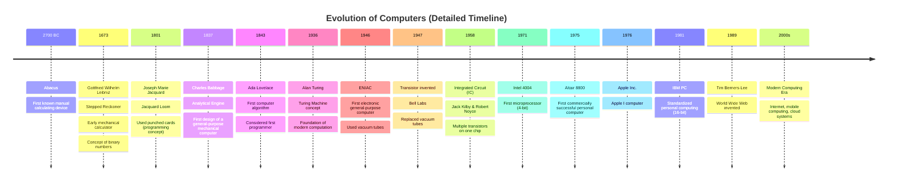
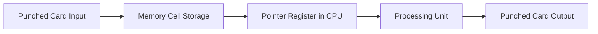

# Computer Archtechture and Operating system

---

# Foundations of Computing: Memory, CPU, and Early Computers

Suppose this is a RAM or hard disk. Each section is called a **cell**.

**RAM (Random Access Memory)** – Volatile memory; also called primary memory.
_Volatile_ means the memory **loses its contents when the power is turned off**.

**Hard Disk** – Non-volatile memory; also called secondary memory.
_Non-volatile_ means the memory **retains its contents even when the power is turned off**.

**CPU (Central Processing Unit)** – Can perform basic operations such as:
Addition (`+`), Subtraction (`-`), Multiplication (`*`), Division (`/`), AND (`&`), OR (`|`), NOT (`!`).

> The size of each cell of RAM, Hard disc and Register should be the same..
> **Example:** A computer is 32 bit means each cell is 32 bit (4 byte)

---

**Evolution of computer**

## How did the Analytical Engine work?

**Components of the CPU:**

1. **Processing Unit (PU):** Performs basic operations like addition, subtraction, multiplication, division, and others.
2. **Register Set:** Stores addresses, pointers, and intermediate results during computation.

**Input:** Punched cards
Example: Input binary `1011111` (decimal 95)

**Memory (conceptual “cells”):**

| Cell  | 0   | 1   | 2   | 3   | …   |
| ----- | --- | --- | --- | --- | --- |
| Value |     | 95  |     |     |     |

- The **pointer register** in the CPU holds the address of the data to be processed.
- The **processing unit** fetches the data from memory, performs the operation, and stores intermediate results in registers.

**Output:** Punched cards with holes representing the computed results, later decoded manually.

**Notes:**

- The Analytical Engine had **no hard disk or electronic memory**. All storage was mechanical.

**Data Flow (Mermaid Diagram):**

---

# Operating system intro

