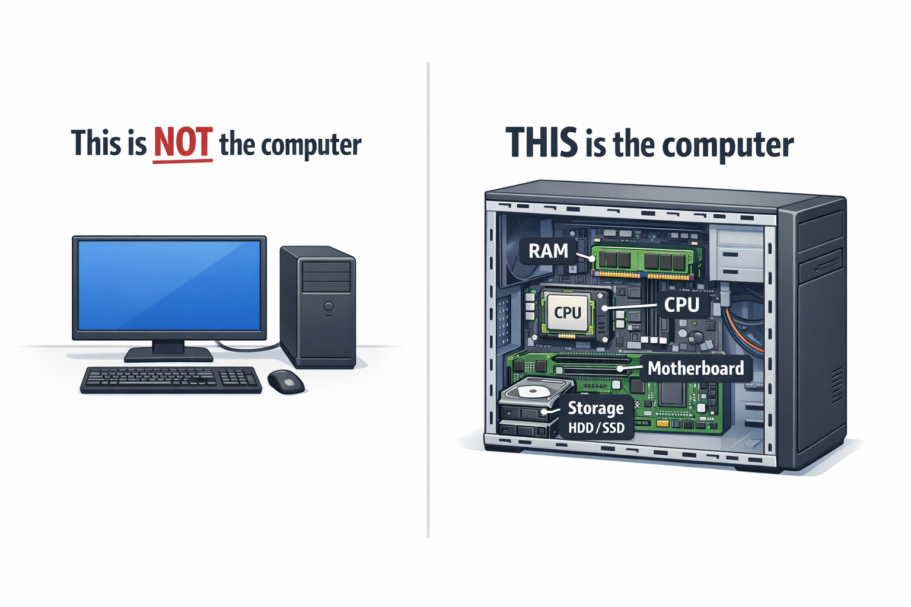
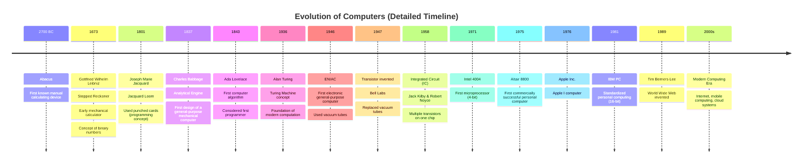

# Computer Archtechture and Operating system

---

# Heading

|     |     |     |     |     |     |     |     |
| --- | --- | --- | --- | --- | --- | --- | --- |

Suppose this is a RAM/Hard disc, Each section is called a cell

**Ram** - Volatile (_Define volatile here_) memory / Primary memory

**Hard disc** - Non volatile / secondary memory

**CPU** - Can perform 7 ops (+, -, *, /, &, |, !)

---

**Evolution of computer**

