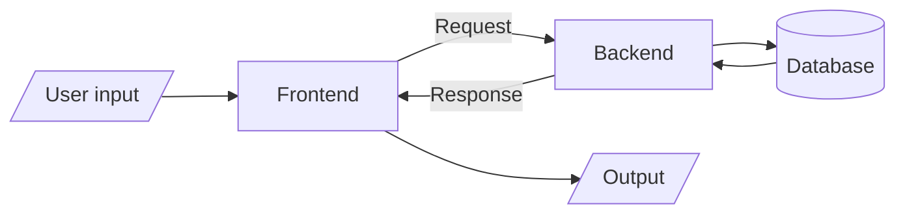

# Golang

**Habib bhai's note :** [https://nesohq.github.io/bgce-archive/](https://nesohq.github.io/bgce-archive/)

## Frontend vs Backend

**[Video](https://youtu.be/BMP5VujjDIc?list=PLpCqPSEm2Xe8sEY2haMDUVgwbkIs5NCJI)**

