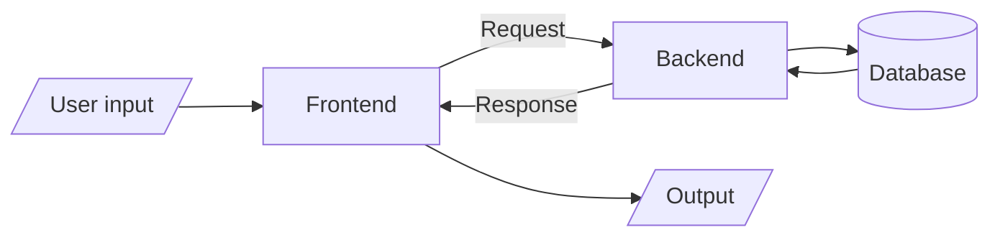
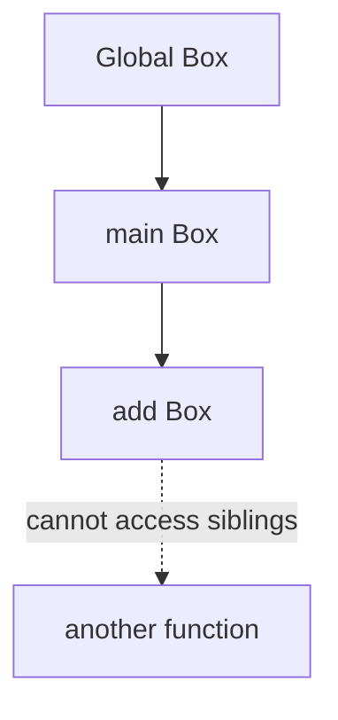
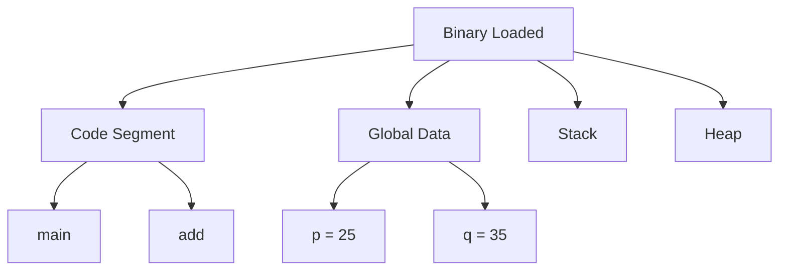
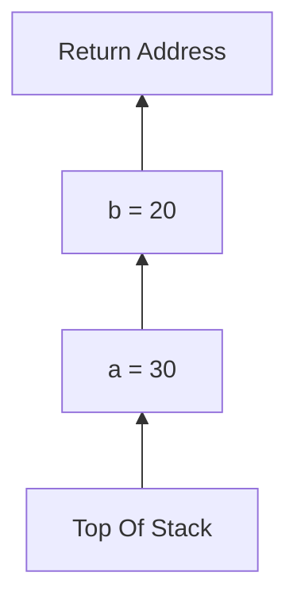
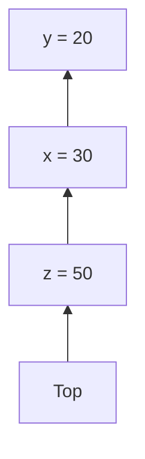
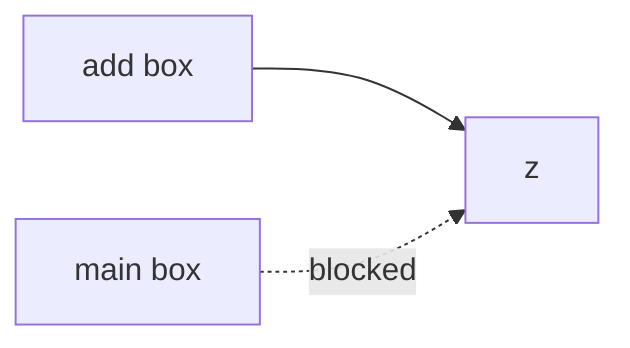
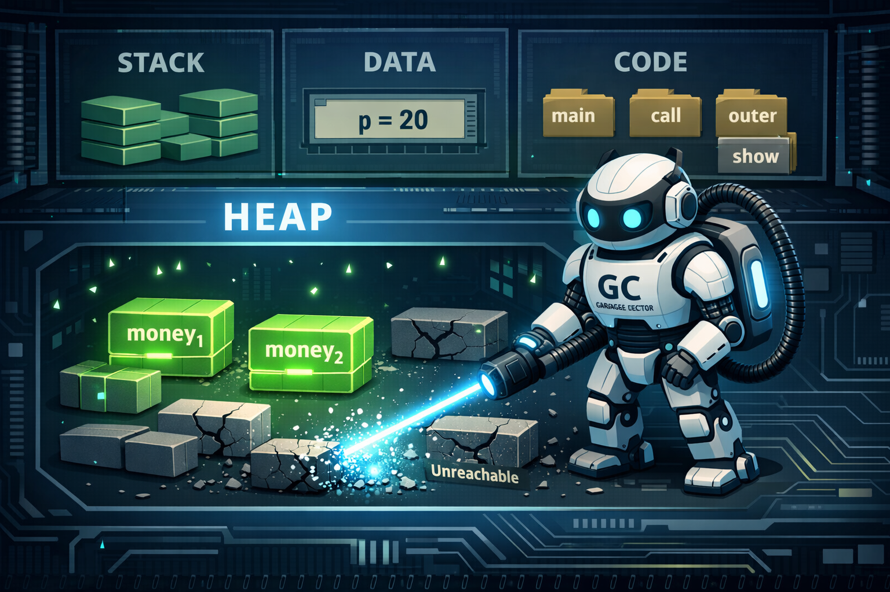

# Golang

**Habib bhai's note :** [https://nesohq.github.io/bgce-archive/](https://nesohq.github.io/bgce-archive/)

## Frontend vs Backend

**[Video](https://youtu.be/BMP5VujjDIc?list=PLpCqPSEm2Xe8sEY2haMDUVgwbkIs5NCJI)**



# Golang basics

**Go Basics — C++ Dev Quick Cheatsheet**

**Philosophy**

- Go → minimal, opinionated, fast compile, built for concurrency.
- C++ → highly flexible, complex, performance-tuned with manual control.

---

**Project Structure**

- Go uses modules (`go.mod`) for dependency management.
- Similar vibe to `CMake` / `vcpkg`, but way simpler.

Example:

```
go mod init app-name
```

---

**Package & Import**

- `package main` → entry point package.
- `import` → kinda like C++ `#include`, but it pulls compiled packages, not raw headers.

```
package main

import "fmt"
```

👉 Think:

- Go import = headers + linker handled automatically.
- No header/source split.

---

**Main Function**

```
func main() {
    fmt.Println("Hello")
}
```

- `func` replaces return-type-first syntax.

C++:

```
int main() {}
```

Go:

```
func main() {}
```

Cleaner, less ceremony.

---

**Variables**

**Declaration**

```
var age int = 20
```

**Type inference**

```
var age = 20
```

**Short syntax (MOST used)**

```
age := 20
```

👉 `:=` has no direct C++ equivalent.  
Closest is `auto`, but shorter.

---

**Constants**

```
const Pi = 3.14
```

- Immutable like `const` in C++.
- But no pointer weirdness.

---

**Data Types**
Common ones:

- `int`
- `float64`
- `string`
- `bool`
- `rune` (char-ish)
- `byte`

👉 No implicit conversions.  
Go hates hidden behavior.

C++ lets you get away with more.

---

**Functions**

```
func add(a int, b int) int {
    return a + b
}
```

Shortcut:

```
func add(a, b int) int
```

**Multiple returns (huge feature)**

```
func divide(a, b int) (int, int) {
    return a/b, a%b
}
```

C++ → structs / tuples.  
Go → built-in.

---

**Error Handling**
No exceptions.

```
value, err := doThing()
if err != nil {
    return err
}
```

👉 Explicit > magical.

C++:

- exceptions (optional)
- error codes

Go forces discipline.

---

**Pointers**
Yes, but chill.

```
x := 10
p := &x
```

No pointer arithmetic 😌  
Safer than C++.

---

**Structs (like lightweight classes)**

```
type User struct {
    Name string
    Age  int
}
```

Usage:

```
u := User{Name: "Mahmud", Age: 20}
```

👉 No constructors needed.

---

**Methods**

```
func (u User) greet() {
    fmt.Println("Hi", u.Name)
}
```

Receiver ≈ `this` in C++.

---

**Interfaces**
Implicit implementation — big brain design.

```
type Speaker interface {
    speak()
}
```

If a struct has `speak()`, it automatically satisfies the interface.

C++ requires inheritance.

Go says:

> "If it walks like a duck… ship it."

---

**Control Flow**

**If**

```
if x > 10 {
}
```

No parentheses needed.

---

**For (only loop type)**

```
for i := 0; i < 5; i++ {}
```

While-style:

```
for condition {}
```

Infinite:

```
for {}
```

Minimal API > many keywords.

---

**Switch**
Cleaner than C++.

```
switch day {
case "Mon":
    ...
default:
}
```

- Auto break.
- Cases can be expressions.

---

**Arrays vs Slices**

**Array**

```
var a [5]int
```

Fixed size — rarely used.

**Slice (dynamic)**

```
s := []int{1,2,3}
s = append(s, 4)
```

Think:
vector from STL, but built-in.

---

**Maps**

```
m := map[string]int{
    "age": 20,
}
```

Equivalent → `unordered_map`.

---

**Concurrency (Go's superpower)**

**Goroutine**

```
go doWork()
```

Cheaper than threads.

**Channels**

```
ch := make(chan int)
ch <- 5
value := <-ch
```

Message passing > shared memory.

C++ can do this, but setup is heavier.

---

**Memory Management**

- Garbage collected.
- No `new/delete`.
- No RAII stress.

Tradeoff:

- Slight runtime cost
- Massive dev speed

---

**Visibility**
Capitalized = public  
lowercase = private

```
func Exported()
func hidden()
```

No `public/private` keywords.

---

**Formatting**
Run this and forget about style debates:

```
go fmt
```

Imagine forcing every C++ dev to obey one formatter 😄

---

**Build & Run**

```
go run main.go
go build
```

Produces a single static binary most of the time.

Deployment becomes stupid easy.

---

**When Go Beats C++**

- Backend services
- Cloud infra
- Networking tools
- CLI apps
- Concurrency-heavy workloads

**When C++ Still Wins**

- Game engines
- Embedded systems
- Ultra low-latency apps
- GPU-heavy compute

---

**Mental Shift for C++ Dev**
Stop trying to be clever.

Go rewards:

- clarity
- small abstractions
- readable code

Not template wizardry.

# Scope

Attached code:

```go
package main

import "fmt"

var p = 25
var q = 35

func add(x int, y int) int {
	var z = x + y
	return z
}

func main() {
	a := 30
	b := 20
	fmt.Println(add(a,b))
	fmt.Println(add(p,q))
	fmt.Println(add(p,z))
}
```

---

## **What is Scope?**

Scope is the **visibility boundary** of a variable — it decides **where the variable can be used** in your program.

### **Refined Core Rule (Lock This In)**

> A variable can be accessed from **inside its own box** or from **outside into that box**, but **never from another separate box**.

Think of every `{}` as a memory box.

- Parent box → can be seen by child boxes
- Child box → invisible to sibling or parent once execution leaves it

---

### **Example Mental Model**



- `add` can read globals ✅
- `main` can read globals ✅
- `main` CANNOT read `z` ❌

Why? Different box.

---

## **Types of Scope**

### **1. Global Scope**

Declared outside functions.

```go
var p = 25
```

Accessible everywhere in the package.

**Lifetime:** entire program.

---

### **2. Function (Local) Scope**

```go
func main(){
    a := 30
}
```

Exists only while the function runs.

When the function returns → memory gone instantly.

---

### **3. Block Scope (Even Smaller Box)**

```go
if true {
    x := 10
}
```

`x` dies right after the block ends.

Ultra-temporary memory.

---

## **Full RAM Execution Walkthrough**

## **Stage 1 — Program Loaded Into RAM**



### Immediate Truth:

Allocated now:

- `p`
- `q`

Not allocated yet:

- `a`
- `b`
- `x`
- `y`
- `z`

Functions live in the **code segment** — they are instructions, not variables.

---

## **Stage 2 — Entry Point**

Execution ALWAYS starts from:

```
func main()
```

No main → program won't build as an executable.

---

## **Stage 3 — main() Stack Frame**



### Stack Grid

| Frame | Variable | Value |
| ----- | -------- | ----- |
| main  | a        | 30    |
| main  | b        | 20    |

Stack allocation = extremely fast
(just pointer movement).

---

## **Stage 4 — add(a,b) Call**

New frame pushed.



| Frame | Variable | Value |
| ----- | -------- | ----- |
| add   | x        | 30    |
| add   | y        | 20    |
| add   | z        | 50    |

Return happens → entire frame disappears.

No cleanup needed.

Pointer moves back.

---

## **Stage 5 — add(p,q)**

Globals copied into parameters.

| Frame | Variable | Value |
| ----- | -------- | ----- |
| add   | x        | 25    |
| add   | y        | 35    |
| add   | z        | 60    |

Globals remain unchanged.

---

## **Stage 6 — Compile Error**

```
fmt.Println(add(p,z))
```

Error:

```
undefined: z
```

### Why?

Because of the refined scope rule:

> You cannot jump from one box into another unrelated box.

Visualization:



Once `add` returns:

```
z = destroyed
```

It literally stops existing in RAM.

---

## **Lifetime Table**

| Variable | Stored In      | Created       | Destroyed   |
| -------- | -------------- | ------------- | ----------- |
| p,q      | Global segment | Program start | Program end |
| a,b      | Stack          | main call     | main return |
| x,y,z    | Stack          | add call      | add return  |

---

## **Stack vs Heap (Precision Mode)**

### **Stack**

- Automatic memory
- Extremely fast
- Temporary
- Function-based

### **Heap**

- Dynamic memory
- Slower
- Garbage collected
- Used when data must survive function return

Example:

```go
func test() *int {
    x := 10
    return &x
}
```

Compiler moves `x` to heap via **escape analysis**.

You don't control it — Go decides.

---

**Critical Correction**

Wrong mental model:

> space allocated for add and main like variables

Correct model:

| Item          | Stored Where |
| ------------- | ------------ |
| Functions     | Code Segment |
| Globals       | Data Segment |
| Locals        | Stack        |
| Escaping vars | Heap         |

Separate memory worlds.

---

**Elite Insight**

Go stacks are **dynamic**.

Goroutines start tiny (~2KB)
then grow when needed.

This is why Go can run massive concurrency without melting RAM.

---

**Ultra-Clean Mental Model**

When program starts:

```
Globals → alive
Functions → ready
Stack → empty
```

During execution:

```
Call function → push frame
Return → pop frame
```

Variables exist ONLY while their box is active.

---

**Final Brain Rule**

🔥 Every `{}` is a memory boundary.

> Accessible from inside the box.
> Accessible from outer boxes into inner ones.
> NEVER accessible sideways between boxes.

Understand this early → debugging becomes surgical instead of guesswork.

## Global vs Local

**Global Scope (Go)**

- Declared outside all functions.
- Visible across the entire package.
- Usually avoided unless truly necessary.

```go
package main

import "fmt"

// Global variable
var appName = "ScopeDemo"

func main() {
    fmt.Println("App:", appName)
    printApp()
}

func printApp() {
    // Accessible here too
    fmt.Println("Inside function:", appName)
}
```

**Local Scope (Go)**

- Declared inside a function or block.
- Cannot be accessed outside that block.

```go
package main

import "fmt"

func main() {

    // Local variable
    user := "Mahmud"

    if true {
        // Block-level local
        age := 20
        fmt.Println(user, age)
    }

    // fmt.Println(age) ❌ Error: age not defined
}
```

## Package scope

Folder structure:

```
Go/
├─ add.go
└─ main.go
```

Both files are inside the same folder and use the same package name (`package main`).
In Go, files in the same folder and same package share scope.

---

**main.go**

```go
package main

func main() {
	add(4, 5)
}
```

---

**add.go**

```go
package main // must match the package of main.go

import "fmt"

func add(x int, y int) {
	var z = x + y
	fmt.Println(z)
}
```

---

**Important Concept**

- Go compiles packages, not individual files.
- When files are in the same folder and have the same package name, they are compiled together.
- Functions defined in one file are accessible in another file within the same package.

---

**Wrong Way to Run**

```
go run main.go
```

Error:

```
.\main.go:4:2: undefined: add
```

Why?

Because:

- `add.go` does not contain a `main()` function.
- You’re trying to run only one file.
- Go needs the full package context.

---

**Correct Way to Run**

```
go run main.go add.go
```

Output:

```
9
```

---

**Better Way (Recommended)**

Instead of listing all files manually:

```
go run .
```

This runs the entire package (all `.go` files in the folder).

---

**Key Takeaways**

- Same folder + same package = shared scope.
- Go builds packages as a whole.
- Use `go run .` to avoid file-specific errors.
- Only one `main()` function is allowed in `package main`.

Clean, simple, no confusion.

**Creating a Custom Package in Go (Proper Way)**

---

**Step 1 — Create a Separate Folder for the Package**

Create a new folder for your custom package.
Use lowercase for folder names (Go convention).

```
Go/
├─ mathlib/
│  └─ add.go
└─ main.go
```

---

**add.go**

```go
package mathlib // custom package name (must match folder name)

func Add(x int, y int) int {
	return x + y
}
```

Important:

- Package name should match the folder name.
- Function must start with a capital letter to be exported.
- No need for `fmt` here since we are returning, not printing.

---

**Why This Won’t Work Yet**

If you try:

```go
import "mathlib"
```

You’ll get:

```
could not import mathlib (cannot find package in GOROOT)
```

Reason:

- Go only knows standard library packages (`fmt`, `math`, etc.).
- Your custom package needs a **module path**.

---

**Step 2 — Initialize a Module**

Inside the root folder (`Go/`), run:

```
go mod init example.com
```

This creates:

```
Go/
├─ mathlib/
│  └─ add.go
├─ go.mod
└─ main.go
```

`go.mod` defines your module path:

```
module example.com
```

Now Go understands that everything inside this folder belongs to `example.com`.

---

**Step 3 — Import Using Module Path**

In `main.go`:

```go
package main

import (
	"fmt"
	"example.com/mathlib"
)

func main() {
	result := mathlib.Add(4, 5)
	fmt.Println(result)
}
```

Notice:

- Import path = `module name + folder name`
- `Add` is capitalized (exported)
- Folder name is lowercase

---

**Run the Program**

```
go run .
```

Output:

```
9
```

---

**Key Rules to Remember**

- Folder name → lowercase
- Package name → same as folder
- Exported functions → start with capital letter
- Import path → `module-name/folder-name`
- Always initialize a module for custom packages
- Use `go run .` to run the whole module

---

This is the correct structure for building real-world Go projects.

## variable shadowing

Variable shadowing happens when you declare a variable inside a smaller scope with the same name as a variable in an outer scope.

The inner variable “shadows” (hides) the outer one.

---

**Example 1 — Basic Shadowing**

```go
package main

import "fmt"

func main() {
	x := 10
	fmt.Println("Outer x:", x)

	{
		x := 20 // shadows outer x
		fmt.Println("Inner x:", x)
	}

	fmt.Println("Outer x again:", x)
}
```

Output:

```
Outer x: 10
Inner x: 20
Outer x again: 10
```

Explanation:

- The inner `x := 20` creates a new variable.
- It does NOT modify the outer `x`.
- Once the block ends, the inner `x` disappears.

---

**Example 2 — Shadowing Inside if Block**

```go
package main

import "fmt"

func main() {
	x := 5

	if true {
		x := 100 // new variable
		fmt.Println(x)
	}

	fmt.Println(x)
}
```

Output:

```
100
5
```

Same concept. Two different variables. Same name. Different scopes.

---

**Common Mistake (Very Important)**

```go
package main

import "fmt"

func main() {
	x := 10

	if true {
		x := x + 5
		fmt.Println(x)
	}
}
```

This causes an error:

```
undefined: x
```

Why?

Because:

- `x := x + 5` tries to declare a NEW `x`
- But while declaring it, it tries to use itself
- The outer `x` is hidden at that moment

Correct way:

```go
x := 10

if true {
	x = x + 5 // no :=
	fmt.Println(x)
}
```

Now you're modifying the original variable.

---

**Short Declaration Gotcha (`:=`)**

This is where shadowing usually happens.

```go
err := doSomething()

if err != nil {
    return err
}
```

Now inside another block:

```go
if something {
    err := doAnotherThing() // shadows previous err
}
```

Now you have TWO `err` variables.

That can cause subtle bugs.

---

**Key Rules**

- `:=` creates a new variable
- `=` updates an existing variable
- Inner scope variables hide outer scope variables
- Shadowing is allowed but dangerous if unnoticed

---

**Scopes in Go**

New scope is created by:

- `{ }` blocks
- `if`
- `for`
- `switch`
- function bodies

---

**Takeaway**

Shadowing is not an error.
It’s legal.

But if you don’t notice it, your logic can break silently.

Most beginners debug this for hours.

Be careful with `:=`.

# Types of functions

1. Standard Function
2. Anonymous Function
3. Function Expression
4. Higher-Order Function
5. Callback Function
6. Variadic Function
7. `init` Function
8. Closure (Close Over)
9. `defer` Function Call
10. Receiver Function (Method)
11. IIFE — Immediately Invoked Function Expression

## standard function

AKA named function

```go
func Add(x int, y int) int {
	var z = x + y;
	return  z;
}
```

## init function

we can't call an init function, the compiler calls it automatically

```go
package main

import (
	"fmt"
	"example.com/mathLib"
)

func main() {
	result := mathLib.Add(4, 5);
	fmt.Println(result);
}

func init(){
	fmt.Println("Called init function");
}
```

init function always gets called first

```
Called init function
9
```

## Anonymous function and IIFE

- **Anonymous Function:** A function without a name.
- **IIFE (Immediately Invoked Function Expression):** A function that is defined and executed immediately. An anonymous function can also be an IIFE.

**Example in Go:**

```go
func(a int, b int) {
    c := a + b
    fmt.Println(c)
}(4, 7)
```

- Here, the function has no name (anonymous) and is invoked immediately with arguments `4` and `7`.
- **Output:** `11`

## 1st Order vs Higher Order Functions

**First Order Function**

- Standard function
- Anonymous function
- IIFE (Immediately Invoked Function Expression)

**Conceptual connection:**

- Works with objects, properties, and relations (1st-order logic in discrete math)
- Functions operate on values but cannot take/return other functions

**Higher Order Function (HOF)**

- Any function satisfying at least one of:
  - Takes a function as a parameter (callback)
  - Returns a function
  - Both

- Also referred to as **First-Class Functions**

**Example in Go:**

```go
package main

import "fmt"

// HOF: takes a function as parameter
func processOp(x int, y int, op func(a int, b int) int) int {
	return op(x, y)
}

func add(p int, q int) int {
	return p + q
}

func main() {
	sum := processOp(4, 5, add)
	fmt.Println(sum) // 9
}
```

**Notes:**

- HOFs allow abstraction and functional patterns (map, filter, reduce).
- Bridges programming paradigm with discrete math: functions as relations, higher-order reasoning, modularity.
# Internal memory

## Sample code

**`main.go`**

```go
package main

import "fmt"

var a = 10;

func add(x int,y int){
	z := x + y;
	fmt.Println(z);
}

func main(){
	add(5,4);
	add(a,3);
}

func init(){
	fmt.Println("Init function");
}
```
A program goes through 2 phases

1. Compilation phase
2. Execution phase 

When a Go program executes, the OS loads it into RAM. Memory is logically divided into segments:

| code segment | Data segment | Stack | Heap |
| ------------ | ------------ | ----- | ---- |

**Code segment:** Stores functions
**Data segment (Global memory):** Stores global variables

## **Simulating `main.go`**

### Compilation phase

The `main.go` creates a binary file named `main` and the variables and functions are stored in the code segment and data segment

### Execution phase

1. The compiler finds the `init` function in the `code segment`.

| add | main | init |
| --- | ---- | ---- |

2. It pushes `init()` onto the `stack` for execution. The allocated space is called the `stack frame` of the `init` function.

**Stack**

| `init()` stackframe |   |   |
| ------------------- | - | - |

Run `init()` → `stack.pop()` → removes `init()`

3. It finds `main()` in the code segment and sees that `add()` is called inside it.

```go
func add(x int,y int){
	z := x + y;
	fmt.Println(z);
}

func main(){ // code segment
	add(5,4);
	add(a,3);
}
```

4. It pushes `main()` onto the stack → then pushes `add(5,4)` onto the stack.

| `main()` stackframe | `add(5,4)` stackframe |   |
| ------------------- | --------------------- | - |

Run `add()` → `stack.pop()`

5. Again, it pushes `add(a,3)` → finds `a` in the data segment (`a = 10`).

| `main()` stackframe | `add(10,3)` stackframe |   |
| ------------------- | ---------------------- | - |

Run `add()` → `stack.pop()`

| `main()` stackframe |   |   |
| ------------------- | - | - |

6. End of `main()` → `stack.pop()`

7. All data in RAM is cleared.
Your note is structurally correct. Below is the same format, with **explicit inclusion of `closure` and `escape analysis` inside the simulation**, without changing your structure.

---

# Closure + Some more simulation

> In this simulation we'll need `heap` of the RAM

Closure is a `function` that remembers and can access variables from its outer scope, even after the outer function finishes executing.

**Sample code**

```go
package main

import "fmt"

const a = 10

var p = 20

func outer() func() {
	money := 100
	age := 21

	fmt.Println("Age =",age)

	show := func() { // closure
		money = money + a + p
		fmt.Println(money)
	}

	return show
}

func call() {
	inc_1 := outer()
	inc_1()
	inc_1()

	inc_2 := outer()
	inc_2()
	inc_2()
}

func main() {
	call()
}

func init() {
	fmt.Println("=== Bank ===")
}
```

---

## **Simulation**

---

### **1. Compilation phase**

The compiler generates a binary file.

**Code segment stores:**

| outer | call | main | init | show |
| ----- | ---- | ---- | ---- | ---- |

* `show` is compiled as normal function code.
* `show` is marked as a **closure**, because it captures `money` from `outer`.
* `const a = 10` is usually inlined by the compiler.
* `var p = 20` goes to the **Data segment**.

**Data segment**

| p = 20 |

No heap allocation happens at compile time.

---

### **2. Execution phase**

When the program runs, OS loads it into RAM.

| Code segment | Data segment | Stack | Heap |
| ------------ | ------------ | ----- | ---- |

---

**Step 1 — Execute `init()`**

Push `init()` to stack.

**Stack**

| `init()` frame |
| -------------- |

Prints:

```
=== Bank ===
```

Pop `init()`.

Stack becomes empty.

---

**Step 2 — Execute `main()`**

Push `main()`.

**Stack**

| `main()` |
| -------- |

Inside `main()` → calls `call()`.

Push `call()`.

**Stack**

| `main()` | `call()` |
| -------- | -------- |

---

**Step 3 — `inc_1 := outer()`**

Push `outer()`.

**Stack**

| `main()` | `call()` | `outer()` |
| -------- | -------- | --------- |

Inside `outer()`:

```
money := 100
age := 21
```

Now important part:

`show` is a **closure** because it captures the variable `money` from the outer function.

When the compiler sees this, it performs **Escape Analysis**.

### 🔎 Escape Analysis (what the compiler checks)

Question the compiler asks:

> Will `money` live beyond the lifetime of `outer()`?

Answer:

Yes — because `outer()` returns `show`, and `show` uses `money`.

Therefore:

* `money` **escapes** the stack frame of `outer()`
* So it must be allocated on the **Heap**
* `age` does NOT escape → stays on **Stack**

Memory now:

**Heap**

| money₁ = 100 |

**Stack**

| `main()` | `call()` | `outer()` (age=21) |

Prints:

```
Age = 21
```

`outer()` returns the **closure value**.

Important:

A closure value internally contains:

* Pointer to function code (`show`)
* Pointer to captured variables (`money₁` on heap)

Pop `outer()`.

**Stack**

| `main()` | `call()` |

Now:

```
inc_1 →
   - show (code segment)
   - heap cell (money₁)
```

---

**Step 4 — `inc_1()` first call**

Push `show()`.

**Stack**

| `main()` | `call()` | `show()` |
| -------- | -------- | -------- |

Inside `show()`:

```
money = money + a + p
```

Where:

* `money` → Heap (captured by closure)
* `a` → inlined constant
* `p` → Data segment

Calculation:

```
100 + 10 + 20 = 130
```

Heap becomes:

| money₁ = 130 |

Prints `130`.

Pop `show()`.

---

**Step 5 — `inc_1()` second call**

Push `show()` again.

Heap currently:

| money₁ = 130 |

Update:

```
130 + 10 + 20 = 160
```

Heap:

| money₁ = 160 |

Prints `160`.

Pop `show()`.

---

**Step 6 — `inc_2 := outer()`**

Push new `outer()`.

**Stack**

| `main()` | `call()` | `outer()` |

Inside new `outer()`:

```
money := 100
age := 21
```

Again compiler performs **Escape Analysis**.

Result:

* This new `money` also escapes
* New heap allocation created

Heap now:

| money₁ = 160 |
| money₂ = 100 |

Prints:

```
Age = 21
```

Pop `outer()`.

Now:

```
inc_2 →
   - show (code segment)
   - heap cell (money₂)
```

---

**Step 7 — `inc_2()` twice**

First call:

```
100 + 10 + 20 = 130
```

Heap:

| money₁ = 160 |
| money₂ = 130 |

Second call:

```
130 + 10 + 20 = 160
```

Heap:

| money₁ = 160 |
| money₂ = 160 |

Notice:

`inc_1` and `inc_2` use the same function code,
but each closure has its own separate heap allocation.

---

**Step 8 — End of `call()`**

Pop `call()`.

Stack:

| `main()` |

Now:

`inc_1` and `inc_2` go out of scope.

No references remain to `money₁` and `money₂`.

They become eligible for **Garbage Collection**.

---

**Step 9 — End of `main()`**

Pop `main()`.

Stack becomes empty.

Program exits.

OS clears stack, heap, data, and code from RAM.

---

## **Final Memory Summary**

| Item                 | Location                           |
| -------------------- | ---------------------------------- |
| `show` function code | Code segment                       |
| `p`                  | Data segment                       |
| `money`              | Heap (due to escape analysis)      |
| `age`                | Stack                              |
| `inc_1`, `inc_2`     | Stack (holding closure references) |

---

## **Critical Insight**

Each call to `outer()`:

* Creates a new heap allocation for `money`
* Happens because of **Escape Analysis**
* Returns a **closure** that captures that specific heap cell

`inc_1` and `inc_2` share the same function code,
but they do NOT share the same captured state.

That separation is the entire point of closures in Go.

> There is another mechanism related to the heap called the Garbage Collector (GC).
> When no live references point to money anymore (for example, after inc_1 and inc_2 go out of scope), the GC marks those heap allocations as unreachable and later reclaims that memory automatically.

