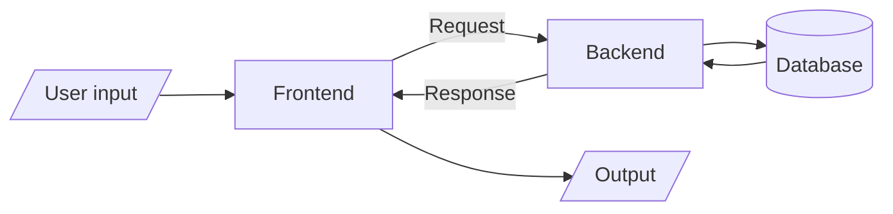
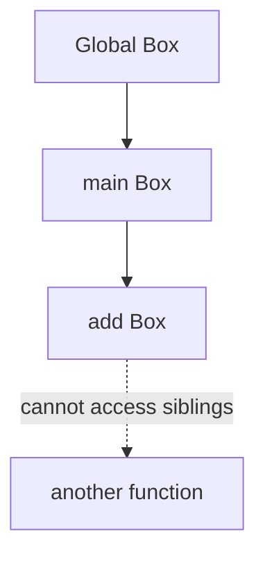
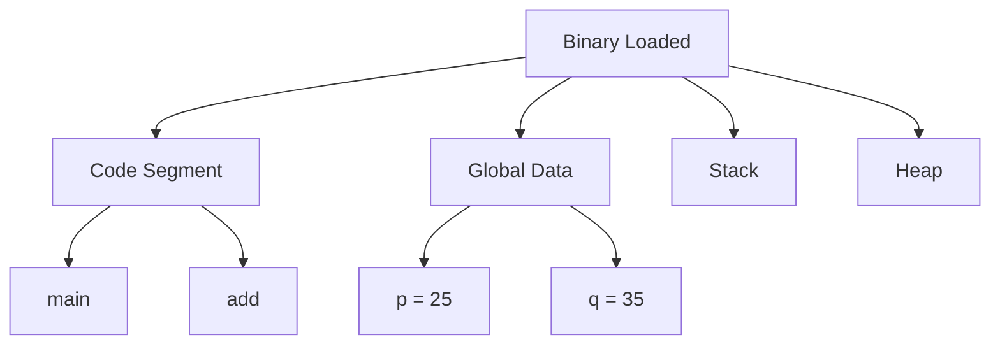
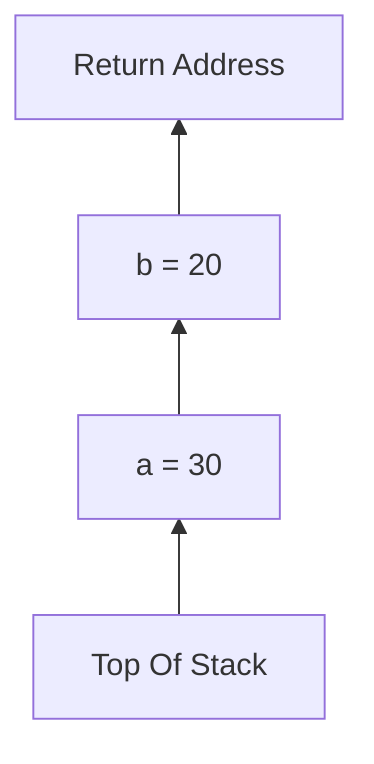
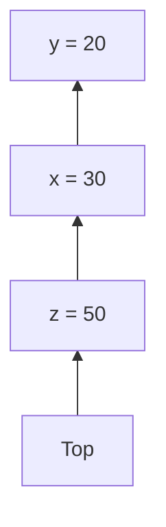
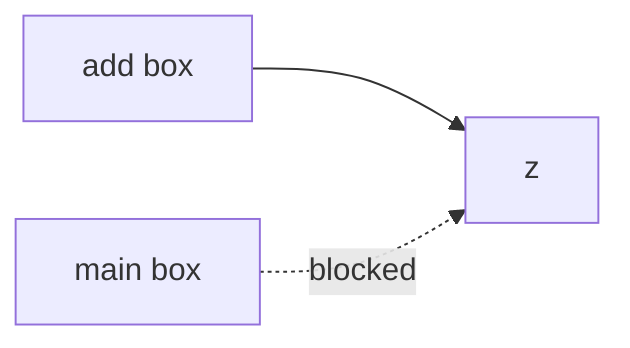

# Golang

**Habib bhai's note :** [https://nesohq.github.io/bgce-archive/](https://nesohq.github.io/bgce-archive/)

## Frontend vs Backend

**[Video](https://youtu.be/BMP5VujjDIc?list=PLpCqPSEm2Xe8sEY2haMDUVgwbkIs5NCJI)**


```mermaid
flowchart LR
A[/User input/] --> B[Frontend]
B -->|Request| C[Backend] --> D[(Database)]
D --> C
C -->|Response| B
B --> E[/Output/]
```

# Golang basics

**Go Basics — C++ Dev Quick Cheatsheet**

**Philosophy**

- Go → minimal, opinionated, fast compile, built for concurrency.
- C++ → highly flexible, complex, performance-tuned with manual control.

---package main

import "fmt"

func main(){
fmt.Println("Hello world");
fmt.Println("SUUUUUUUUUUUUUUUUUUUUIi");
}

**Project Structure**

- Go uses modules (`go.mod`) for dependency management.
- Similar vibe to `CMake` / `vcpkg`, but way simpler.

Example:

```
go mod init app-name
```

---

**Package & Import**

- `package main` → entry point package.
- `import` → kinda like C++ `#include`, but it pulls compiled packages, not raw headers.

```
package main

import "fmt"
```

👉 Think:

- Go import = headers + linker handled automatically.
- No header/source split.

---

**Main Function**

```
func main() {
    fmt.Println("Hello")
}
```

- `func` replaces return-type-first syntax.

C++:

```
int main() {}
```

Go:

```
func main() {}
```

Cleaner, less ceremony.

---

**Variables**

**Declaration**

```
var age int = 20
```

**Type inference**

```
var age = 20
```

**Short syntax (MOST used)**

```
age := 20
```

👉 `:=` has no direct C++ equivalent.  
Closest is `auto`, but shorter.

---

**Constants**

```
const Pi = 3.14
```

- Immutable like `const` in C++.
- But no pointer weirdness.

---

**Data Types**
Common ones:

- `int`
- `float64`
- `string`
- `bool`
- `rune` (char-ish)
- `byte`

👉 No implicit conversions.  
Go hates hidden behavior.

C++ lets you get away with more.

---

**Functions**

```
func add(a int, b int) int {
    return a + b
}
```

Shortcut:

```
func add(a, b int) int
```

**Multiple returns (huge feature)**

```
func divide(a, b int) (int, int) {
    return a/b, a%b
}
```

C++ → structs / tuples.  
Go → built-in.

---

**Error Handling**
No exceptions.

```
value, err := doThing()
if err != nil {
    return err
}
```

👉 Explicit > magical.

C++:

- exceptions (optional)
- error codes

Go forces discipline.

---

**Pointers**
Yes, but chill.

```
x := 10
p := &x
```

No pointer arithmetic 😌  
Safer than C++.

---

**Structs (like lightweight classes)**

```
type User struct {
    Name string
    Age  int
}
```

Usage:

```
u := User{Name: "Mahmud", Age: 20}
```

👉 No constructors needed.

---

**Methods**

```
func (u User) greet() {
    fmt.Println("Hi", u.Name)
}
```

Receiver ≈ `this` in C++.

---

**Interfaces**
Implicit implementation — big brain design.

```
type Speaker interface {
    speak()
}
```

If a struct has `speak()`, it automatically satisfies the interface.

C++ requires inheritance.

Go says:

> "If it walks like a duck… ship it."

---

**Control Flow**

**If**

```
if x > 10 {
}
```

No parentheses needed.

---

**For (only loop type)**

```
for i := 0; i < 5; i++ {}
```

While-style:

```
for condition {}
```

Infinite:

```
for {}
```

Minimal API > many keywords.

---

**Switch**
Cleaner than C++.

```
switch day {
case "Mon":
    ...
default:
}
```

- Auto break.
- Cases can be expressions.

---

**Arrays vs Slices**

**Array**

```
var a [5]int
```

Fixed size — rarely used.

**Slice (dynamic)**

```
s := []int{1,2,3}
s = append(s, 4)
```

Think:
vector from STL, but built-in.

---

**Maps**

```
m := map[string]int{
    "age": 20,
}
```

Equivalent → `unordered_map`.

---

**Concurrency (Go's superpower)**

**Goroutine**

```
go doWork()
```

Cheaper than threads.

**Channels**

```
ch := make(chan int)
ch <- 5
value := <-ch
```

Message passing > shared memory.

C++ can do this, but setup is heavier.

---

**Memory Management**

- Garbage collected.
- No `new/delete`.
- No RAII stress.

Tradeoff:

- Slight runtime cost
- Massive dev speed

---

**Visibility**
Capitalized = public  
lowercase = private

```
func Exported()
func hidden()
```

No `public/private` keywords.

---

**Formatting**
Run this and forget about style debates:

```
go fmt
```

Imagine forcing every C++ dev to obey one formatter 😄

---

**Build & Run**

```
go run main.go
go build
```

Produces a single static binary most of the time.

Deployment becomes stupid easy.

---

**When Go Beats C++**

- Backend services
- Cloud infra
- Networking tools
- CLI apps
- Concurrency-heavy workloads

**When C++ Still Wins**

- Game engines
- Embedded systems
- Ultra low-latency apps
- GPU-heavy compute

---

**Mental Shift for C++ Dev**
Stop trying to be clever.

Go rewards:

- clarity
- small abstractions
- readable code

Not template wizardry.

# Scope

Attached code:

```go
package main

import "fmt"

var p = 25
var q = 35

func add(x int, y int) int {
	var z = x + y
	return z
}

func main() {
	a := 30
	b := 20
	fmt.Println(add(a,b))
	fmt.Println(add(p,q))
	fmt.Println(add(p,z))
}
```

---

## **What is Scope?**

Scope is the **visibility boundary** of a variable — it decides **where the variable can be used** in your program.

### **Refined Core Rule (Lock This In)**

> A variable can be accessed from **inside its own box** or from **outside into that box**, but **never from another separate box**.

Think of every `{}` as a memory box.

- Parent box → can be seen by child boxes
- Child box → invisible to sibling or parent once execution leaves it

---

### **Example Mental Model**


```mermaid
flowchart TD
    A[Global Box] --> B[main Box]
    B --> C[add Box]

    C -.cannot access siblings.-> D[another function]
```

- `add` can read globals ✅
- `main` can read globals ✅
- `main` CANNOT read `z` ❌

Why? Different box.

---

## **Types of Scope**

### **1. Global Scope**

Declared outside functions.

```go
var p = 25
```

Accessible everywhere in the package.

**Lifetime:** entire program.

---

### **2. Function (Local) Scope**

```go
func main(){
    a := 30
}
```

Exists only while the function runs.

When the function returns → memory gone instantly.

---

### **3. Block Scope (Even Smaller Box)**

```go
if true {
    x := 10
}
```

`x` dies right after the block ends.

Ultra-temporary memory.

---

## **Full RAM Execution Walkthrough**

## **Stage 1 — Program Loaded Into RAM**


```mermaid
flowchart TD
    A[Binary Loaded] --> B[Code Segment]
    A --> C[Global Data]
    A --> D[Stack]
    A --> E[Heap]

    B --> F[main]
    B --> G[add]

    C --> H[p = 25]
    C --> I[q = 35]
```

### Immediate Truth:

Allocated now:

- `p`
- `q`

Not allocated yet:

- `a`
- `b`
- `x`
- `y`
- `z`

Functions live in the **code segment** — they are instructions, not variables.

---

## **Stage 2 — Entry Point**

Execution ALWAYS starts from:

```
func main()
```

No main → program won't build as an executable.

---

## **Stage 3 — main() Stack Frame**


```mermaid
flowchart BT
    A[Top Of Stack] --> B[a = 30]
    B --> C[b = 20]
    C --> D[Return Address]
```

### Stack Grid

| Frame | Variable | Value |
| ----- | -------- | ----- |
| main  | a        | 30    |
| main  | b        | 20    |

Stack allocation = extremely fast
(just pointer movement).

---

## **Stage 4 — add(a,b) Call**

New frame pushed.


```mermaid
flowchart BT
    A[Top] --> B[z = 50]
    B --> C[x = 30]
    C --> D[y = 20]
```

| Frame | Variable | Value |
| ----- | -------- | ----- |
| add   | x        | 30    |
| add   | y        | 20    |
| add   | z        | 50    |

Return happens → entire frame disappears.

No cleanup needed.

Pointer moves back.

---

## **Stage 5 — add(p,q)**

Globals copied into parameters.

| Frame | Variable | Value |
| ----- | -------- | ----- |
| add   | x        | 25    |
| add   | y        | 35    |
| add   | z        | 60    |

Globals remain unchanged.

---

## **Stage 6 — Compile Error**

```
fmt.Println(add(p,z))
```

Error:

```
undefined: z
```

### Why?

Because of the refined scope rule:

> You cannot jump from one box into another unrelated box.

Visualization:


```mermaid
flowchart LR
    A[main box]
    B[add box]

    B --> z
    A -.blocked.-> z
```

Once `add` returns:

```
z = destroyed
```

It literally stops existing in RAM.

---

## **Lifetime Table**

| Variable | Stored In      | Created       | Destroyed   |
| -------- | -------------- | ------------- | ----------- |
| p,q      | Global segment | Program start | Program end |
| a,b      | Stack          | main call     | main return |
| x,y,z    | Stack          | add call      | add return  |

---

## **Stack vs Heap (Precision Mode)**

### **Stack**

- Automatic memory
- Extremely fast
- Temporary
- Function-based

### **Heap**

- Dynamic memory
- Slower
- Garbage collected
- Used when data must survive function return

Example:

```go
func test() *int {
    x := 10
    return &x
}
```

Compiler moves `x` to heap via **escape analysis**.

You don't control it — Go decides.

---

**Critical Correction**

Wrong mental model:

> space allocated for add and main like variables

Correct model:

| Item          | Stored Where |
| ------------- | ------------ |
| Functions     | Code Segment |
| Globals       | Data Segment |
| Locals        | Stack        |
| Escaping vars | Heap         |

Separate memory worlds.

---

**Elite Insight**

Go stacks are **dynamic**.

Goroutines start tiny (~2KB)
then grow when needed.

This is why Go can run massive concurrency without melting RAM.

---

**Ultra-Clean Mental Model**

When program starts:

```
Globals → alive
Functions → ready
Stack → empty
```

During execution:

```
Call function → push frame
Return → pop frame
```

Variables exist ONLY while their box is active.

---

**Final Brain Rule**

🔥 Every `{}` is a memory boundary.

> Accessible from inside the box.
> Accessible from outer boxes into inner ones.
> NEVER accessible sideways between boxes.

Understand this early → debugging becomes surgical instead of guesswork.

## Global vs Local

**Global Scope (Go)**

- Declared outside all functions.
- Visible across the entire package.
- Usually avoided unless truly necessary.

```go
package main

import "fmt"

// Global variable
var appName = "ScopeDemo"

func main() {
    fmt.Println("App:", appName)
    printApp()
}

func printApp() {
    // Accessible here too
    fmt.Println("Inside function:", appName)
}
```

**Local Scope (Go)**

- Declared inside a function or block.
- Cannot be accessed outside that block.

```go
package main

import "fmt"

func main() {

    // Local variable
    user := "Mahmud"

    if true {
        // Block-level local
        age := 20
        fmt.Println(user, age)
    }

    // fmt.Println(age) ❌ Error: age not defined
}
```

## Package scope

Folder structure:

```
Go/
├─ add.go
└─ main.go
```

Both files are inside the same folder and use the same package name (`package main`).
In Go, files in the same folder and same package share scope.

---

**main.go**

```go
package main

func main() {
	add(4, 5)
}
```

---

**add.go**

```go
package main // must match the package of main.go

import "fmt"

func add(x int, y int) {
	var z = x + y
	fmt.Println(z)
}
```

---

**Important Concept**

- Go compiles packages, not individual files.
- When files are in the same folder and have the same package name, they are compiled together.
- Functions defined in one file are accessible in another file within the same package.

---

**Wrong Way to Run**

```
go run main.go
```

Error:

```
.\main.go:4:2: undefined: add
```

Why?

Because:

- `add.go` does not contain a `main()` function.
- You’re trying to run only one file.
- Go needs the full package context.

---

**Correct Way to Run**

```
go run main.go add.go
```

Output:

```
9
```

---

**Better Way (Recommended)**

Instead of listing all files manually:

```
go run .
```

This runs the entire package (all `.go` files in the folder).

---

**Key Takeaways**

- Same folder + same package = shared scope.
- Go builds packages as a whole.
- Use `go run .` to avoid file-specific errors.
- Only one `main()` function is allowed in `package main`.

Clean, simple, no confusion.

**Creating a Custom Package in Go (Proper Way)**

---

**Step 1 — Create a Separate Folder for the Package**

Create a new folder for your custom package.
Use lowercase for folder names (Go convention).

```
Go/
├─ mathlib/
│  └─ add.go
└─ main.go
```

---

**add.go**

```go
package mathlib // custom package name (must match folder name)

func Add(x int, y int) int {
	return x + y
}
```

Important:

- Package name should match the folder name.
- Function must start with a capital letter to be exported.
- No need for `fmt` here since we are returning, not printing.

---

**Why This Won’t Work Yet**

If you try:

```go
import "mathlib"
```

You’ll get:

```
could not import mathlib (cannot find package in GOROOT)
```

Reason:

- Go only knows standard library packages (`fmt`, `math`, etc.).
- Your custom package needs a **module path**.

---

**Step 2 — Initialize a Module**

Inside the root folder (`Go/`), run:

```
go mod init example.com
```

This creates:

```
Go/
├─ mathlib/
│  └─ add.go
├─ go.mod
└─ main.go
```

`go.mod` defines your module path:

```
module example.com
```

Now Go understands that everything inside this folder belongs to `example.com`.

---

**Step 3 — Import Using Module Path**

In `main.go`:

```go
package main

import (
	"fmt"
	"example.com/mathlib"
)

func main() {
	result := mathlib.Add(4, 5)
	fmt.Println(result)
}
```

Notice:

- Import path = `module name + folder name`
- `Add` is capitalized (exported)
- Folder name is lowercase

---

**Run the Program**

```
go run .
```

Output:

```
9
```

---

**Key Rules to Remember**

- Folder name → lowercase
- Package name → same as folder
- Exported functions → start with capital letter
- Import path → `module-name/folder-name`
- Always initialize a module for custom packages
- Use `go run .` to run the whole module

---

This is the correct structure for building real-world Go projects.

## variable shadowing

Variable shadowing happens when you declare a variable inside a smaller scope with the same name as a variable in an outer scope.

The inner variable “shadows” (hides) the outer one.

---

**Example 1 — Basic Shadowing**

```go
package main

import "fmt"

func main() {
	x := 10
	fmt.Println("Outer x:", x)

	{
		x := 20 // shadows outer x
		fmt.Println("Inner x:", x)
	}

	fmt.Println("Outer x again:", x)
}
```

Output:

```
Outer x: 10
Inner x: 20
Outer x again: 10
```

Explanation:

- The inner `x := 20` creates a new variable.
- It does NOT modify the outer `x`.
- Once the block ends, the inner `x` disappears.

---

**Example 2 — Shadowing Inside if Block**

```go
package main

import "fmt"

func main() {
	x := 5

	if true {
		x := 100 // new variable
		fmt.Println(x)
	}

	fmt.Println(x)
}
```

Output:

```
100
5
```

Same concept. Two different variables. Same name. Different scopes.

---

**Common Mistake (Very Important)**

```go
package main

import "fmt"

func main() {
	x := 10

	if true {
		x := x + 5
		fmt.Println(x)
	}
}
```

This causes an error:

```
undefined: x
```

Why?

Because:

- `x := x + 5` tries to declare a NEW `x`
- But while declaring it, it tries to use itself
- The outer `x` is hidden at that moment

Correct way:

```go
x := 10

if true {
	x = x + 5 // no :=
	fmt.Println(x)
}
```

Now you're modifying the original variable.

---

**Short Declaration Gotcha (`:=`)**

This is where shadowing usually happens.

```go
err := doSomething()

if err != nil {
    return err
}
```

Now inside another block:

```go
if something {
    err := doAnotherThing() // shadows previous err
}
```

Now you have TWO `err` variables.

That can cause subtle bugs.

---

**Key Rules**

- `:=` creates a new variable
- `=` updates an existing variable
- Inner scope variables hide outer scope variables
- Shadowing is allowed but dangerous if unnoticed

---

**Scopes in Go**

New scope is created by:

- `{ }` blocks
- `if`
- `for`
- `switch`
- function bodies

---

**Takeaway**

Shadowing is not an error.
It’s legal.

But if you don’t notice it, your logic can break silently.

Most beginners debug this for hours.

Be careful with `:=`.

# Types of functions

1. Standard Function
2. Anonymous Function
3. Function Expression
4. Higher-Order Function
5. Callback Function
6. Variadic Function
7. `init` Function
8. Closure (Close Over)
9. `defer` Function Call
10. Receiver Function (Method)
11. IIFE — Immediately Invoked Function Expression

## standard function

AKA named function

```go
func Add(x int, y int) int {
	var z = x + y;
	return  z;
}
```

## init function

we can't call an init function, the compiler calls it automatically

```go
package main

import (
	"fmt"
	"example.com/mathLib"
)

func main() {
	result := mathLib.Add(4, 5);
	fmt.Println(result);
}

func init(){
	fmt.Println("Called init function");
}
```

init function always gets called first

```
Called init function
9
```

## Anonymous function and IIFE

- **Anonymous Function:** A function without a name.
- **IIFE (Immediately Invoked Function Expression):** A function that is defined and executed immediately. An anonymous function can also be an IIFE.

**Example in Go:**

```go
func(a int, b int) {
    c := a + b
    fmt.Println(c)
}(4, 7)
```

- Here, the function has no name (anonymous) and is invoked immediately with arguments `4` and `7`.
- **Output:** `11`

## 1st Order vs Higher Order Functions

**First Order Function**

- Standard function
- Anonymous function
- IIFE (Immediately Invoked Function Expression)

**Conceptual connection:**

- Works with objects, properties, and relations (1st-order logic in discrete math)
- Functions operate on values but cannot take/return other functions

**Higher Order Function (HOF)**

- Any function satisfying at least one of:
  - Takes a function as a parameter (callback)
  - Returns a function
  - Both

- Also referred to as **First-Class Functions**

**Example in Go:**

```go
package main

import "fmt"

// HOF: takes a function as parameter
func processOp(x int, y int, op func(a int, b int) int) int {
	return op(x, y)
}

func add(p int, q int) int {
	return p + q
}

func main() {
	sum := processOp(4, 5, add)
	fmt.Println(sum) // 9
}
```

**Notes:**

- HOFs allow abstraction and functional patterns (map, filter, reduce).
- Bridges programming paradigm with discrete math: functions as relations, higher-order reasoning, modularity.

# Internal memory

## Sample code

**`main.go`**

```go
package main

import "fmt"

var a = 10;

func add(x int,y int){
	z := x + y;
	fmt.Println(z);
}

func main(){
	add(5,4);
	add(a,3);
}

func init(){
	fmt.Println("Init function");
}
```

A program goes through 2 phases

1. Compilation phase
2. Execution phase

When a Go program executes, the OS loads it into RAM. Memory is logically divided into segments:

| code segment | Data segment | Stack | Heap |
| ------------ | ------------ | ----- | ---- |

**Code segment:** Stores functions
**Data segment (Global memory):** Stores global variables

## **Simulating `main.go`**

### Compilation phase

The `main.go` creates a binary file named `main` and the variables and functions are stored in the code segment and data segment

### Execution phase

1. The compiler finds the `init` function in the `code segment`.

| add | main | init |
| --- | ---- | ---- |

2. It pushes `init()` onto the `stack` for execution. The allocated space is called the `stack frame` of the `init` function.

**Stack**

| `init()` stackframe |     |     |
| ------------------- | --- | --- |

Run `init()` → `stack.pop()` → removes `init()`

3. It finds `main()` in the code segment and sees that `add()` is called inside it.

```go
func add(x int,y int){
	z := x + y;
	fmt.Println(z);
}

func main(){ // code segment
	add(5,4);
	add(a,3);
}
```

4. It pushes `main()` onto the stack → then pushes `add(5,4)` onto the stack.

| `main()` stackframe | `add(5,4)` stackframe |     |
| ------------------- | --------------------- | --- |

Run `add()` → `stack.pop()`

5. Again, it pushes `add(a,3)` → finds `a` in the data segment (`a = 10`).

| `main()` stackframe | `add(10,3)` stackframe |     |
| ------------------- | ---------------------- | --- |

Run `add()` → `stack.pop()`

| `main()` stackframe |     |     |
| ------------------- | --- | --- |

6. End of `main()` → `stack.pop()`

7. All data in RAM is cleared.
   Your note is structurally correct. Below is the same format, with **explicit inclusion of `closure` and `escape analysis` inside the simulation**, without changing your structure.

---

# Closure + Some more simulation

> In this simulation we'll need `heap` of the RAM

Closure is a `function` that remembers and can access variables from its outer scope, even after the outer function finishes executing.

**Sample code**

```go
package main

import "fmt"

const a = 10

var p = 20

func outer() func() {
	money := 100
	age := 21

	fmt.Println("Age =",age)

	show := func() { // closure
		money = money + a + p
		fmt.Println(money)
	}

	return show
}

func call() {
	inc_1 := outer()
	inc_1()
	inc_1()

	inc_2 := outer()
	inc_2()
	inc_2()
}

func main() {
	call()
}

func init() {
	fmt.Println("=== Bank ===")
}
```

---

## **Simulation**

---

### **1. Compilation phase**

The compiler generates a binary file.

**Code segment stores:**

| outer | call | main | init | show |
| ----- | ---- | ---- | ---- | ---- |

- `show` is compiled as normal function code.
- `show` is marked as a **closure**, because it captures `money` from `outer`.
- `const a = 10` is usually inlined by the compiler.
- `var p = 20` goes to the **Data segment**.

**Data segment**

| p = 20 |

No heap allocation happens at compile time.

---

### **2. Execution phase**

When the program runs, OS loads it into RAM.

| Code segment | Data segment | Stack | Heap |
| ------------ | ------------ | ----- | ---- |

---

**Step 1 — Execute `init()`**

Push `init()` to stack.

**Stack**

| `init()` frame |
| -------------- |

Prints:

```
=== Bank ===
```

Pop `init()`.

Stack becomes empty.

---

**Step 2 — Execute `main()`**

Push `main()`.

**Stack**

| `main()` |
| -------- |

Inside `main()` → calls `call()`.

Push `call()`.

**Stack**

| `main()` | `call()` |
| -------- | -------- |

---

**Step 3 — `inc_1 := outer()`**

Push `outer()`.

**Stack**

| `main()` | `call()` | `outer()` |
| -------- | -------- | --------- |

Inside `outer()`:

```
money := 100
age := 21
```

Now important part:

`show` is a **closure** because it captures the variable `money` from the outer function.

When the compiler sees this, it performs **Escape Analysis**.

### 🔎 Escape Analysis (what the compiler checks)

Question the compiler asks:

> Will `money` live beyond the lifetime of `outer()`?

Answer:

Yes — because `outer()` returns `show`, and `show` uses `money`.

Therefore:

- `money` **escapes** the stack frame of `outer()`
- So it must be allocated on the **Heap**
- `age` does NOT escape → stays on **Stack**

Memory now:

**Heap**

| money₁ = 100 |

**Stack**

| `main()` | `call()` | `outer()` (age=21) |

Prints:

```
Age = 21
```

`outer()` returns the **closure value**.

Important:

A closure value internally contains:

- Pointer to function code (`show`)
- Pointer to captured variables (`money₁` on heap)

Pop `outer()`.

**Stack**

| `main()` | `call()` |

Now:

```
inc_1 →
   - show (code segment)
   - heap cell (money₁)
```

---

**Step 4 — `inc_1()` first call**

Push `show()`.

**Stack**

| `main()` | `call()` | `show()` |
| -------- | -------- | -------- |

Inside `show()`:

```
money = money + a + p
```

Where:

- `money` → Heap (captured by closure)
- `a` → inlined constant
- `p` → Data segment

Calculation:

```
100 + 10 + 20 = 130
```

Heap becomes:

| money₁ = 130 |

Prints `130`.

Pop `show()`.

---

**Step 5 — `inc_1()` second call**

Push `show()` again.

Heap currently:

| money₁ = 130 |

Update:

```
130 + 10 + 20 = 160
```

Heap:

| money₁ = 160 |

Prints `160`.

Pop `show()`.

---

**Step 6 — `inc_2 := outer()`**

Push new `outer()`.

**Stack**

| `main()` | `call()` | `outer()` |

Inside new `outer()`:

```
money := 100
age := 21
```

Again compiler performs **Escape Analysis**.

Result:

- This new `money` also escapes
- New heap allocation created

Heap now:

| money₁ = 160 |
| money₂ = 100 |

Prints:

```
Age = 21
```

Pop `outer()`.

Now:

```
inc_2 →
   - show (code segment)
   - heap cell (money₂)
```

---

**Step 7 — `inc_2()` twice**

First call:

```
100 + 10 + 20 = 130
```

Heap:

| money₁ = 160 |
| money₂ = 130 |

Second call:

```
130 + 10 + 20 = 160
```

Heap:

| money₁ = 160 |
| money₂ = 160 |

Notice:

`inc_1` and `inc_2` use the same function code,
but each closure has its own separate heap allocation.

---

**Step 8 — End of `call()`**

Pop `call()`.

Stack:

| `main()` |

Now:

`inc_1` and `inc_2` go out of scope.

No references remain to `money₁` and `money₂`.

They become eligible for **Garbage Collection**.

---

**Step 9 — End of `main()`**

Pop `main()`.

Stack becomes empty.

Program exits.

OS clears stack, heap, data, and code from RAM.

---

## **Final Memory Summary**

| Item                 | Location                           |
| -------------------- | ---------------------------------- |
| `show` function code | Code segment                       |
| `p`                  | Data segment                       |
| `money`              | Heap (due to escape analysis)      |
| `age`                | Stack                              |
| `inc_1`, `inc_2`     | Stack (holding closure references) |

---

## **Critical Insight**

Each call to `outer()`:

- Creates a new heap allocation for `money`
- Happens because of **Escape Analysis**
- Returns a **closure** that captures that specific heap cell

`inc_1` and `inc_2` share the same function code,
but they do NOT share the same captured state.

That separation is the entire point of closures in Go.

> There is another mechanism related to the heap called the Garbage Collector (GC).
> When no live references point to money anymore (for example, after inc_1 and inc_2 go out of scope), the GC marks those heap allocations as unreachable and later reclaims that memory automatically.


# Struct

It's stored in `code segment`

```go
package main

import "fmt"

type User struct {
	Name string
	Age  int
}

func main() {
	user_1 := User{  // Instance of `User` type
		Name: "Mahmud",
		Age:  21,
	}

	user_2 := User{ // Instance of `User` type
		Name: "Habib",
		Age:  30,
	}

	fmt.Println(user_1.Name)
	fmt.Println(user_1.Age)
	fmt.Println(user_2.Name)
	fmt.Println(user_2.Age)
}
```

**Example of reciever function**

```go
package main

import "fmt"

type User struct {
	Name string
	Age  int
}

func printUser(user User){ // reciever function
	fmt.Println(user.Name);
	fmt.Println(user.Age);
}

func main() {
	user_1 := User{
		Name: "Mahmud",
		Age:  21,
	}

	user_2 := User{
		Name: "Habib",
		Age:  30,
	}

	printUser(user_1);
	printUser(user_2);
}
```

# Array

## Sample Code

**`main.go`**

```go
package main

import "fmt"

var globalArr = [3]int{1, 2, 3}

func modify(arr [3]int) {
	arr[0] = 100
	fmt.Println("Inside modify:", arr)
}

func main() {
	localArr := [3]int{4, 5, 6}

	fmt.Println("Before modify:", localArr)
	modify(localArr)
	fmt.Println("After modify:", localArr)

	fmt.Println("Global array:", globalArr)
}
```

---

A program goes through 2 phases

1. Compilation phase
2. Execution phase

When a Go program executes, the OS loads it into RAM. Memory is logically divided into segments:

| Code segment | Data segment | Stack | Heap |
| ------------ | ------------ | ----- | ---- |

**Code segment:** Stores compiled functions
**Data segment (Global memory):** Stores global variables
**Stack:** Stores function calls and local variables
**Heap:** Stores dynamically allocated data (if escape happens)

---

## Simulating `main.go`

---

### Compilation phase

The `main.go` creates a binary file named `main`.

Stored in memory layout:

| Code Segment | Data Segment |
| ------------ | ------------ |
| modify       | globalArr    |
| main         |              |

Important compile-time rule:

- `[3]int` and `[4]int` are **different types**
- Array size is part of the type
- `modify([3]int)` only accepts `[3]int`

No heap allocation yet.

---

### Execution phase

---

**1️⃣ Runtime calls `main()`**

| main() stackframe |
| ----------------- |

Inside `main()`:

```
localArr := [3]int{4, 5, 6}
```

`localArr` is created inside the stack frame.

Stack:

| main() stackframe  |
| ------------------ |
| localArr = [4 5 6] |

---

**2️⃣ Call `modify(localArr)`**

Push `modify()` onto stack.

| main() | modify(localArr) |
| ------ | ---------------- |

Critical concept:

👉 Arrays are **value types**

So `localArr` is **copied** into `modify`.

Stack now:

| main() stackframe  |
| ------------------ |
| localArr = [4 5 6] |

| modify() stackframe |
| ------------------- |
| arr = [4 5 6]       |

Two separate arrays exist.

---

**3️⃣ Inside `modify()`**

```
arr[0] = 100
```

This changes only the copied array.

Stack:

| modify() stackframe |
| ------------------- |
| arr = [100 5 6]     |

Prints:

```
Inside modify: [100 5 6]
```

---

**4️⃣ `modify()` ends**

Stack pop.

| main() stackframe  |
| ------------------ |
| localArr = [4 5 6] |

Original array unchanged.

Prints:

```
After modify: [4 5 6]
```

---

**5️⃣ Accessing Global Array**

```
fmt.Println(globalArr)
```

`globalArr` lives in **Data Segment**

Memory layout:

| Data Segment        |
| ------------------- |
| globalArr = [1 2 3] |

It is not on the stack.

---

**6️⃣ End of `main()`**

Stack cleared.

Program ends.

---

## Important Internal Concepts

---

### 1️⃣ Arrays Are Value Types

- Passing array → full copy
- Assigning array → full copy

Example:

```go
a := [3]int{1,2,3}
b := a
```

Memory:

| a       | b       |
| ------- | ------- |
| [1 2 3] | [1 2 3] |

Two different arrays.

---

### 2️⃣ Stack vs Heap

In this program:

- localArr → stack
- arr (inside modify) → stack copy
- globalArr → data segment
- heap → NOT used

No escape → no heap allocation.

# Pointer

A variable that stores the address of a value.

**Sample code**

```go
package main

import "fmt"

func print(numbers [5]int){
	fmt.Println(numbers);
}

func main(){
	arr := [5]int{1,3,4,5,7};

	print(arr);
}
```

Here, the array is copied when it is passed as a function parameter.

That means a new copy of the entire array is created inside the `print` function.

If the size of the array is 10,000,000, copying each element will take extra time and consume more memory.

To solve this, we can pass the address of the array instead of copying the whole array.

Like,

Suppose there is a paper where 1,2,3 is written. Someone reads the numbers, memorizes them, goes to RAM and writes 1,2,3 again on another paper. This takes extra time and uses extra paper.

Instead, he should just tell RAM where the paper is. RAM will go and look at the original paper himself.

```go
package main

import "fmt"

func print(numbers *[5]int){ // * means pointer (now the address using `&` must be passed)
	fmt.Println(numbers);
}

func main(){
	arr := [5]int{1,3,4,5,7};

	print(&arr); // passing the address of the array
}
```

Now the array is not copied. Only its memory address is passed to the function.

**Pointer x struct**

```go
package main

import "fmt"

type User struct {
	Name string
	Age int
	Salary float64
}

func main(){
	user_1 := User {
		Name: "Mahmud",
		Age: 21,
		Salary: 4000,
	}

	p := &user_1

	fmt.Println(*p);
	// {Mahmud 21 4000}
}
```

Here:

- `p := &user_1` → `p` stores the address of `user_1`
- `*p` → dereferencing the pointer (accessing the actual value stored at that address)

Instead of copying the whole struct, we work with its address.

**Theory**

**Pass by value:**

A copy of the variable is passed to the function.  
Any change inside the function does not affect the original variable.  
In Go, arrays and structs are passed by value by default.

**Pass by reference (using pointer in Go):**

Go does not have true pass-by-reference. Instead, we pass a pointer to the variable.

The function receives the address of the original value.  
Using that address, it can read or modify the original data.  
No large data copying happens in this case.

# Slice

A **Go slice** is a dynamically-sized, flexible view over an array. It lets you work with a sequence of elements without managing the underlying array size directly.

Key points:

- Has a **length** (number of elements) and **capacity** (size of underlying array).
- Can **grow or shrink** using built-in functions like `append`.
- Supports **indexing** like arrays.

Example:

```go
arr := [5]int{1,2,3,4,5}
s := arr[1:4] // slice of arr from index 1 to 3 → [2 3 4]
```

**Declaring and slice**

```go
package main

import "fmt"

func main()  {
    sl := []int{1,2,3,4,5} // slice literal (no size defined)
    sli :=  []int{} // empty / nil slice
}
```

**We can declate a slice like this too**

```go
package main

import "fmt"

func main()  {
    s := make([]int,5)
    fmt.Println(s); // --> [0 0 0 0 0]
}
```

```go
package main

import "fmt"

func main()  {
    s := make([]int,5,6)
    fmt.Println(s); // --> [0 0 0 0 0]
    fmt.Println("Length:",len(s)) // --> Length: 5
    fmt.Println("Capacity:",cap(s)) // --> Capacity: 6
}
```

Now, let's stress test something.. if, a slice has a length 3 capacity 5. can we assign a value at index 4 ?

```go
package main

import "fmt"

func main()  {
    s := make([]int,3,5)

    s[4] = 10

    fmt.Println(s); // --> [0 0 0 0 0]
    fmt.Println("Length:",len(s)) // --> Length: 5
    fmt.Println("Capacity:",cap(s)) // --> Capacity: 6
}
```

```
panic: runtime error: index out of range [4] with length 3
```

Slice **length** controls what you can access. **Capacity** only matters when appending or extending the slice.

**More code**

```go
package main

import "fmt"

func show(s []int){
    fmt.Println()
    fmt.Println("Slice:",s)
    fmt.Println("Length:",len(s))
    fmt.Println("Capacity:",cap(s))
}


func main()  {
    s:= []int{} // an empty slice
    show(s);

    s = append(s,1,2,3)
    show(s);
}
```

```
Slice: []
Length: 0
Capacity: 0

Slice: [1 2 3]
Length: 3
Capacity: 3
```

**Let's append another number, and look at the capacity**

```go
s = append(s,5)
show(s);
```

```
Slice: [1 2 3]
Length: 3
Capacity: 3

Slice: [1 2 3 5]
Length: 4
Capacity: 6
```

Capacity doubled

> in Go, when a slice grows beyond its capacity, the underlying array is reallocated. The capacity **usually doubles** for small slices, up to 1024 elements; beyond that, it grows by about **25%** each time.

## Code simulation

**Code**

```go
package main

import "fmt"

func main()  {
    var x[]int

    x = append(x,1)
    x = append(x,2)
    x = append(x,3)

    y := x

    x = append(x,4)

    y = append(y,5)

    x[0] = 10

    fmt.Println(x)
    fmt.Println(y)
}
```

The output will not be

```
[10 2 3 4]
[1 2 3 5]
```

It'll be

```
[10 2 3 5]
[10 2 3 5]
```

**People assume** from here `y := x` , y will create a new slice and will run seperately , actually `y` just points to the same underlying array as x, so changes to one slice can affect the other unless ...

the slice is explicitly **copied or reallocated.**

Which means if after `y := x` we somehow reallocate the slices, they will act seperatly..

They get reallocated if the capacity is changed

We'll understand better in simulation

### Simulation

#### **Step 1**

| code segment | data segment | stack | heap |
| ------------ | ------------ | ----- | ---- |

```go
var x[]int
x = append(x,1)
```

1. A stackframe for `append()` will be created in stack
2. Here, the go compiler will create a temporary array (`temp_arr = {1}`) which will be transfered to `heap` because

   > Go wants the slice to persist after append() returns, so the backing array must survive beyond the function’s stack frame, hence heap allocation.

3. A temporary slice will be created in the stackframe having
   > Pointer: Address of 1 (in heap), lenght: 1, Capacity: 1

**Stackframe**

i.

| 1   | slice |     |     |     |     |     |
| --- | ----- | --- | --- | --- | --- | --- |

ii.

|     | slice |     |     |     |     |     |
| --- | ----- | --- | --- | --- | --- | --- |

```
Slice

ptr = heap[0] ( not literally like this)
len = 1
cap = 1

```

Heap

| Address | 0   | 1   | 2   | 3   | 4   | 5   |
| ------- | --- | --- | --- | --- | --- | --- |
| 1       |     |     |     |     |     |     |
| ---     | --- | --- | --- | --- | --- | --- |

#### **Step 2**

```go
x = append(x,2)
```

While appending another value, the compiler will check if we have enough capacity

since the capacity is 1, we can't append another value..

1. A stackframe for `append()` will be created in stack
2. Here, the go compiler will copy the previous slice's value as a temporary array (`temp_arr = {1}`) but it'll have take 2 memory cells (1 for the old value, 1 empty cell for appending the new value)

and then the new value will be placed beside it (`temp_arr = {1,2}`)

which will be transfered to `heap` because

> Go wants the slice to persist after append() returns, so the backing array must survive beyond the function’s stack frame, hence heap allocation.

Heap

| Address | 0   | 1   | 2   | 3   | 4   | 5   |
| ------- | --- | --- | --- | --- | --- | --- |
| 1(old)  | 1   | 2   |     |     |     |     |
| ---     | --- | --- | --- | --- | --- | --- |

3. A temporary slice will be created in the stackframe having

   > Pointer: Address of 1 (heap[1]), length: 2, Capacity: 2

4. The slice will be assigned to `s`

5. stack.pop() --> (Empty stack)

#### **Step 3**

```go
x = append(x,3)
```

1. A stackframe for `append()` will be created in stack
2. Here, the go compiler will copy the previous slice's value as a temporary array (`temp_arr = {1,2}`) but it'll have take 4 memory cells (2 for the old value, 2 empty cell for appending the new value)

> if the compiler needs to increase capacity, the no. of cells will be doubled upto 1024 cells

and then the new value will be placed beside it (`temp_arr = {1,2,3}`)

which will be transfered to `heap` because

> Go wants the slice to persist after append() returns, so the backing array must survive beyond the function’s stack frame, hence heap allocation.

Heap

| Address | 0      | 1      | 2   | 3   | 4   | 5   |
| ------- | ------ | ------ | --- | --- | --- | --- |
| 1(old)  | 1(old) | 2(old) | 1   | 2   | 3   |     |
| ---     | ---    | ---    | --- | --- | --- | --- |

3. A temporary slice will be created in the stackframe having

   > Pointer: Address of 1 (heap[3]), length: 3, Capacity: 4

4. The slice will be assigned to `s`

5. stack.pop() --> (Empty stack)

**Currently, slice = [1,2,3]**

#### **Step 4**

```go
y := x
```

Now, y = [1,2,3]

```
Pointer = heap[6]
length = 3
capacity = 4
```

As we saw, the array **reallocates only when the capacity is exceeded**.

Since there is **one extra slot remaining**, no reallocation happens this time.

Both `x` and `y` **point to the same underlying array**. Therefore, when a new value is appended to `y`, the value is written into the same shared array. Because both slices reference that same memory, **the change becomes visible in both `x` and `y`.**

#### **Step 5**

```go
x = append(x,4)
```

Since there is **one extra slot remaining**, no reallocation happens this time.

the go compiler will copy the previous slice's value as a temporary array (`temp_arr = {1,2,3}`)

and then the new value will be placed beside it (`temp_arr = {1,2,3,4}`)

which will be transfered to `heap` because

Heap

| 1      | 2      | 3   | 4   | 5   | 6   |
| ------ | ------ | --- | --- | --- | --- |
| 1(old) | 2(old) | 1   | 2   | 3   | 4   |
| ---    | ---    | --- | --- | --- | --- |

3. A temporary slice will be created in the stackframe having

   > Pointer: Address of 1 (heap[3]), length: 3, Capacity: 4

4. The slice will be assigned to `s`

5. stack.pop() --> (Empty stack)

Both slices reference that same memory, **the change becomes visible in both `x` and `y`.**

#### **Step 6** 

```go
y = append(y,5)
```

y copied x when x had 1 empty slot left..

hence y will not double cells..

now `y = 1,2,3,5`

- But now **`y` overwrites the same shared slot that `x` used for `4`**, because both slices still reference the **same underlying array** and there was **only one free cell** available.

So when `y = append(y, 5)` runs:

* `y` has **len = 3, cap = 4**
* The append fits within the existing capacity
* No reallocation happens
* The value **5 is written into index 3 of the shared array**

Since `x` also points to that same array, the value **4 gets replaced by 5**.

As a result, the underlying array becomes:

```
[1, 2, 3, 5]
```

Therefore both slices now see the same data:

```
x = [1 2 3 5]
y = [1 2 3 5]
```

#### **Step 7**

```go
x[0] = 10
```

Both `x` and `y` still **point to the same underlying array**.

So when we modify the first element through `x`, the change is written directly to the **shared memory location in the heap**.

Since `y` references the same array, it will **see the same updated value**.

Heap

| Address | 0   | 1   | 2   | 3   | 4   | 5   |
| ------- | --- | --- | --- | --- | --- | --- |
| Value   | 10  | 2   | 3   | 5   |     |     |
| ---     | --- | --- | --- | --- | --- | --- |

Both slices now reference this same array.

```
x = [10,2,3,5]
y = [10,2,3,5]
```

Therefore, modifying an element through one slice **affects the other slice as well**, because they still **share the same underlying array in memory**
**What if we add a line `x := append(x,5)` before this `y := x`**

```go
package main

import "fmt"

func main() {
	var x []int

	x = append(x, 1)
	x = append(x, 2)
	x = append(x, 3)
	x = append(x, 5)

	y := x

	x = append(x, 4)

	y = append(y, 5)

	x[0] = 10

	fmt.Println(x)
	fmt.Println(y)
}
```

### Simulation

#### **Step 1–3**

After the first three appends:

```go
x = append(x,1)
x = append(x,2)
x = append(x,3)
```

The slice grows like before.

```
Slice

ptr = heap[0]
len = 3
cap = 4
```

Heap

| Address | 0   | 1   | 2   | 3   |
| ------- | --- | --- | --- | --- |
| Value   | 1   | 2   | 3   |     |
| ---     | --- | --- | --- | --- |

**Currently, slice = [1,2,3]**

---

#### **Step 4**

```go
x = append(x,5)
```

Since there is **one extra slot remaining**, no reallocation happens.

The value `5` is written to the next free cell.

Heap

| Address | 0   | 1   | 2   | 3   |
| ------- | --- | --- | --- | --- |
| Value   | 1   | 2   | 3   | 5   |
| ---     | --- | --- | --- | --- |

Slice metadata becomes

```
ptr = heap[0]
len = 4
cap = 4
```

**Currently, slice = [1,2,3,5]**

---

#### **Step 5**

```go
y := x
```

Now `y` becomes a **copy of the slice header**, not the array.

So both slices point to the **same underlying array**.

```
x → ptr = heap[0], len = 4, cap = 4
y → ptr = heap[0], len = 4, cap = 4
```

Heap

| Address | 0   | 1   | 2   | 3   |
| ------- | --- | --- | --- | --- |
| Value   | 1   | 2   | 3   | 5   |
| ---     | --- | --- | --- | --- |

---

#### **Step 6**

```go
x = append(x,4)
```

Now the slice is **full** (`len = cap = 4`).

So Go must **reallocate a new array**.

1. A new array with **double capacity (8)** is created.
2. Old values are copied.
3. The new value `4` is appended.

Heap

| Address | 0(old) | 1(old) | 2(old) | 3(old) | 4   | 5   | 6   | 7   |
| ------- | ------ | ------ | ------ | ------ | --- | --- | --- | --- |
| Value   | 1      | 2      | 3      | 5      | 4   |     |     |     |
| ---     | ---    | ---    | ---    | ---    | --- | --- | --- | --- |

Slice metadata now becomes

```
x → ptr = heap[new], len = 5, cap = 8
```

But **y still points to the old array**.

```
y → ptr = heap[old], len = 4, cap = 4
```

So now the slices are **completely independent**.

---

#### **Step 7**

```go
y = append(y,5)
```

Since `y` also has **len = cap = 4**, it must **reallocate a new array as well**.

A new array is created and the values are copied.

Heap

| Address | 0   | 1   | 2   | 3   | 4   |
| ------- | --- | --- | --- | --- | --- |
| Value   | 1   | 2   | 3   | 5   | 5   |
| ---     | --- | --- | --- | --- | --- |

Slice metadata becomes

```
y → ptr = heap[new2], len = 5, cap = 8
```

Now `x` and `y` **point to completely different arrays**.

---

#### **Step 8**

```go
x[0] = 10
```

Now the change only affects **x's array**, because `y` no longer shares the same memory.

Heap for `x`

| Address | 0   | 1   | 2   | 3   | 4   |
| ------- | --- | --- | --- | --- | --- |
| Value   | 10  | 2   | 3   | 5   | 4   |
| ---     | --- | --- | --- | --- | --- |

Heap for `y`

| Address | 0   | 1   | 2   | 3   | 4   |
| ------- | --- | --- | --- | --- | --- |
| Value   | 1   | 2   | 3   | 5   | 5   |
| ---     | --- | --- | --- | --- | --- |

Final result

```go
x = [10 2 3 5 4]
y = [1 2 3 5 5]
```

> The old values will be removed by the garbage collector

