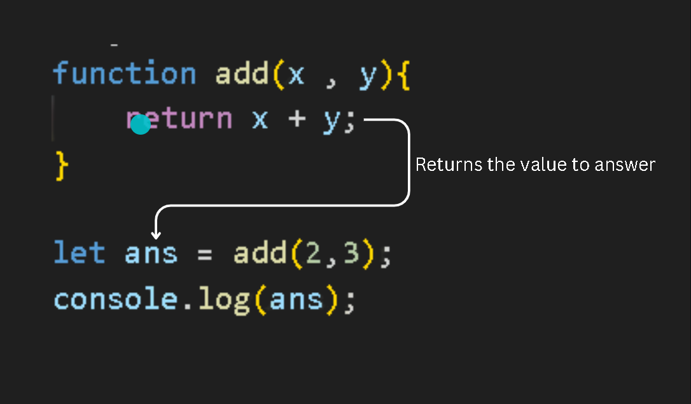
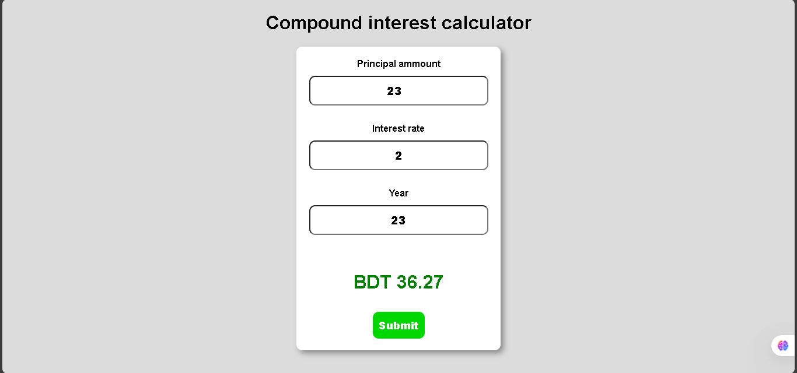

## JavaScript
[Video tutorial](https://youtu.be/lfmg-EJ8gm4)

**I know the basics (Data type variable stuff)**

[SKipped to 45 mins](https://youtu.be/lfmg-EJ8gm4?t=2693)

**Project :** Counter

```JS
const decreaseBtn = document.getElementById("decreaseBtn");
const resetBtn = document.getElementById("resetBtn");
const increaseBtn = document.getElementById("increaseBtn");
const countLabel = document.getElementById("countLabel");
let count = 0;

increaseBtn.onclick = function(){
    count++;
    countLabel.textContent = count;
}

decreaseBtn.onclick = function(){
    count--;
    countLabel.textContent = count;
}

resetBtn.onclick = function(){
    count = 0;
    countLabel.textContent = count;
}
```
Built-in object that provides a collection 
of properties and methods

## Math objects
```JS

let x = 3;
let y = 2;
let z = 1;

z = Math.round(x);
z = Math.floor(x);
z = Math.ceil(x);
z = Math.trunc(x);
z = Math.pow(x, y);
z = Math.sqrt(x);
z = Math.log(x);
z = Math.sin(x);
z = Math.cos(x);
z = Math.tan(x);
z = Math.abs(x);
z = Math.sign(x);
```

**Project :** Random Number Generator:
```JS
<!DOCTYPE html>
<html lang="en">
<head>
    <meta charset="UTF-8">
    <meta name="viewport" content="width=device-width, initial-scale=1.0">
    <title>My website</title>
    <link rel="stylesheet" href="style.css">
</head>
<body>
    <button id="myButton">roll</button><br>
    <label id="label1" class="my"></label><br>
    <label id="label2"></label><br>
    <label id="label3"></label><br>
    <script src="index.js"></script>
</body>
</html>


const myButton = document.getElementById("myButton");
const label1 = document.getElementById("label1");
const label2 = document.getElementById("label2");
const label3 = document.getElementById("label3");
const min = 1;
const max = 6;
let randomNum1;
let randomNum2;
let randomNum3;

myButton.onclick = function() {
    randomNum1 = Math.floor(Math.random() * max) + min;
    randomNum2 = Math.floor(Math.random() * max) + min;
    randomNum3 = Math.floor(Math.random() * max) + min;
    label1.textContent = randomNum1;
    label2.textContent = randomNum2;
    label3.textContent = randomNum3; 
}
```  
## Checked
[Video](https://youtu.be/SgxzJdqhyfw?list=PLZPZq0r_RZOO1zkgO4bIdfuLpizCeHYKv)

```js
<!DOCTYPE html>
<html lang="en">
<head>
    <meta charset="UTF-8">
    <meta name="viewport" content="width=device-width, initial-scale=1.0">
    <title>Document</title>
</head>
<body>
    <input name="payment" type="radio" id="Bkash"><label for="Bkash">Bkash</label><br>
    <input name="payment" type="radio" id="Nagad"><label for="Nagad">Nagad</label><br>
    <input name="payment" type="radio" id="COD"><label for="COD">Cash on delivery</label><br>

    <br>
    <input type="submit" name="submit" id="submit">

    <p id="text"></p>
    <script>
        let bkash = document.getElementById("Bkash");
        let nagad = document.getElementById("Nagad");
        let cod = document.getElementById("COD");
        let text = document.getElementById("text");

document.getElementById("submit").onclick = function() {
        if (bkash.checked) {
        text.textContent = "You're paying with Bkash";
        } else if (nagad.checked) {
            text.textContent = "You're paying with Nagad";
        } else if (cod.checked) {
           text.textContent = "You're paying with COD";
        } else {
        text.textContent = "Please select a payment method";
        }
    }
    </script>
</body>
</html>
```
## Ternary operator

*conditin ? if_true : if_false ;*

```js
let age = 12;
let messege = age >= 18 ? "Adult" : "Minor";

console.log(messege);
```
## switch statement
switch is like a multiple choice question for your code.
It checks the value of a variable, and runs the matching case.

**Format**

```js
switch(variable) {
  case value1:
    // do something
    break;
  case value2:
    // do something else
    break;
  default:
    // if nothing matches
}
```
**Example**

```js
    var day = 2;

    switch(day){
        case 1:
            console.log("It's Saturday");
            break;
        case 2:
            console.log("It's Sunday");
            break;
        case 3:
            console.log("It's Monday");
            break;
        case 4:
            console.log("It's Tuesday");
            break;
        case 5:
            console.log("It's Wednesday");
            break;
        case 6:
            console.log("It's Thursday");
            break;
        case 7:
            console.log("It's Friday");
            break;
        default:
            console.log("Invalid day!");
    }
```

## String methods
String methods are built-in tools in JavaScript that help you work with text (called strings).

You can use them to:

- Find something in a string
- Change part of the string
- Make it uppercase/lowercase
- Cut or split the string
- Add new text

**Example**

```js
let name = "Mahmud";

// Makes it uppercase
console.log(name.toUpperCase()); // "MAHMUD"

// Checks if it includes "mud"
console.log(name.includes("mud")); // true

// Gets part of the string
console.log(name.slice(0, 3)); // "Mah"
```

**Common String Methods**

| Method          | What it does                                   | Example/Output                               |
|-----------------|------------------------------------------------|----------------------------------------------|
| `length`        | Counts characters                              | `"Mahmud".length` -> `6`                     |
| `toUpperCase()` | Makes all letters BIG                          | `"Mahmud".toUpperCase()` -> `"MAHMUD"`       |
| `toLowerCase()` | Makes all letters small                        | `"Mahmud".toLowerCase()` -> `"mahmud"`       |
| `includes()`    | Checks if something is inside                  | `"Mahmud".includes("mud")` -> `true`         |
| `startsWith()`  | Checks if string starts with given substring   | `"Mahmud".startsWith("Mah")` -> `true`       |
| `endsWith()`    | Checks if string ends with given substring     | `"Mahmud".endsWith("mud")` -> `true`         |
| `slice()`       | Cuts a part of the string                      | `"Mahmud".slice(0, 3)` -> `"Mah"`            |
| `replace()`     | Replaces part of the string                    | `"Mahmud".replace("mud", "mat")` -> `"Mahmat"`|
| `trim()`        | Removes spaces at the ends                     | `"  Mahmud  ".trim()` -> `"Mahmud"`          |
| `padStart()`    | Adds padding at the beginning of the string    | `"Mahmud".padStart(10, "0")` -> `"000Mahmud"`|
| `padEnd()`      | Adds padding at the ending of the string       | `"Mahmud".padEnd(10, "0")` -> `"Mahmud000"`  |

## String slicing
Slices a portion from a string

**Format:**string_name.slice(startingIndex , endingIndex);

```js
let string = "A random string";

console.log(string);
console.log(string.slice(0,9));//sliced from index 0 t0 9
console.log(string.slice(9));//sliced from index 9 t0 rest
```

**Seperating 1st and last name from full name**

In this case we don't know the length of someone's name , so , we can't specify the index for slicing first name or last name
```js
let Name = "Abdullah Al Mahmud";
let firstName = Name.slice(0 , Name.indexOf(" ")); //From index 0 to the 1st empty space.
let lastName = Name.slice(Name.indexOf(" ") + 1); //`+ 1` : gotta start from after the 1st space , not from the 1st space.

console.log(firstName); 
console.log(lastName); 
```
##  Method chaining
[Video tutorial](https://youtu.be/J4YhlDsNqeE?list=PLZPZq0r_RZOO1zkgO4bIdfuLpizCeHYKv)

Calling one method after another in one continuous line of code.

**Task :** Get a user name with *window.prompt* then if there's any extra space , unorganised capitalisations , the code should fix it.

`maHmuD ---> Mahmud`

**Without method chaining**

```js
let username = window.prompt("Enter your username : ");

username = username.trim();//removes extra spaces

let firstLetter = username.charAt(0);//gets character at index 0 (1st character)
firstLetter = firstLetter.toUpperCase();

let otherLetters = username.slice(1);//gets other chars from index 1
otherLetters = otherLetters.toLowerCase();
console.log(firstLetter + otherLetters);
```

**With method chaining**
```js
let username = window.prompt("Enter your username : ");
username = username.trim().charAt(0).toUpperCase() + username.slice(1).toLocaleLowerCase();
console.log(username);
```
## Strict equality (`===`) concept
[video](https://youtu.be/O7aUm0AuUy4?list=PLZPZq0r_RZOO1zkgO4bIdfuLpizCeHYKv)

In JavaScript, **strict equality** is written as `===`

It **compares both**:

- The **value**
- AND the **type**

No jokes, no auto type conversion — it's the "I said what I said" of comparisons.

**Loose vs Strict:**
```js
5 == "5"     // true (loose equality - just compares value)
5 === "5"    // false (strict equality - type mismatch)
```

| Operator | Name            | Compares Value?| Compares Type? | Auto Converts? |
|----------|-----------------|----------------|----------------|----------------|
| `==`     | Loose Equality  | Yes            | No             | Yes            |
| `===`    | Strict Equality | Yes            | Yes            | No             |

---

**Examples:**
```js
console.log(7 === 7);        // true (same value and type)
console.log("7" === 7);      // false (string vs number)
console.log(true === 1);     // false (boolean vs number)
console.log(null === null);  // true
```
***Same for inequality `!== (Strict inequality)`***
---
## While loop
*I already know this*
repeat some code `WHILE` some condition is true

**Example code**
```js
let loggedIn = false;
let username;
let password;

while(!loggedIn){
    username = window.prompt(`Enter your username`);
    password = window.prompt(`Enter your password`);

    if(username === "myUsername" && password === "myPassword"){
        loggedIn = true;
        console.log("You are logged in!");
    }
    else{
        console.log("Invalid credentials! Please try again");
    }
}
```
## do while
It runs the code **first**, then checks the condition. So the loop body *will always execute at least once*.

---

**Example code:**
```js
let loggedIn = false;
let username;
let password;

do {
    username = window.prompt(`Enter your username`);
    password = window.prompt(`Enter your password`);

    if(username === "myUsername" && password === "myPassword"){
        loggedIn = true;
        console.log("You are logged in!");
    }
    else {
        console.log("Invalid credentials! Please try again");
    }
} while (!loggedIn);
```
**Why use `do...while` instead of `while`?**

- `while`: **checks first**, runs only **if** condition is true.
- `do...while`: **runs once**, then checks — perfect for login prompts, menus, etc.

So if you wanna make sure something runs **at least once**, no matter what — `do...while` is your go-to.

## for loop
Repeat same code for a limited amount of time.

---

## Project 01 : Number guessing game
This code 

- 🎯 Generates a random number between min (1) and max (100).
- ⌨️ Takes user input using window.prompt() to guess the number.
- 🔁 Runs a loop (while) until the user guesses the correct number.
- 🔼 Gives a hint if the guess is too high.
- 🔽 Gives a hint if the guess is too low.
- ✅ Shows a congratulatory message and the total number of attempts when guessed correctly.
- 🔢 Uses Math.floor() and Math.random() to generate a whole number within the specified range.
- 📈 Tracks how many tries the user took using the attempts variable.
```js
let min = 1;
let max = 100;
let UserInput = window.prompt(`Enter a number form ${min} to ${max} : `);
let randomNumber = Math.floor(Math.random() * (max - min + 1)) + min;
let isRunning = true;
let attempts = 0;

while(isRunning){
    if(UserInput > randomNumber){
        UserInput = window.prompt(`The number is lower than ${UserInput},Enter another number`);
        attempts++;
    }
    else if(UserInput < randomNumber){
        UserInput = window.prompt(`The number is higher than ${UserInput},Enter another number`);
        attempts++;
    }
    else{
        window.alert(`Congratulations,You've guessed it right in ${attempts} attempts`);
        isRunning = false;
    }
}
```
## Function
A section of reusable code . Declare it once . use it whenever you want.

*functon name(parameter){*

*--code--*

*}*

*name(argument);*

**Example code**
```js
function happyBirthday(username, age){ //Function definition 
    console.log('Happy birthday to you!');
    console.log('Happy birthday to you!');
    console.log('Happy birthday dear ${username}!');
    console.log('Happy birthday to you!');
    console.log('You are ${age} years old');
}

happyBirthday('BroCode', 25);//Function call
happyBirthday('Spongebob', 30);
happyBirthday('Patrick', 37);
```
---
**Return**

Returns a value from the function to a variable
```js
function add (x , y){
    let sum = x + y;
    return sum;
}

let ans = add(2,3);
console.log(ans);
```
**OR**
```js
function add(x , y){
    return x + y;
}

let ans = add(2,3);
console.log(ans);
```



## Variable scope

```javascript
// Global scope
let globalVar = "I am a global variable";

function exampleFunction() {
    // Local scope (Function scope)
    let functionVar = "I am a function-scoped variable";
    console.log(globalVar);  // Accessible, since globalVar is declared globally
    console.log(functionVar); // Accessible within the function

    if (true) {
        // Block scope (let and const are block-scoped)
        let blockVar = "I am a block-scoped variable";
        console.log(blockVar);  // Accessible within the block
    }
    
    // Uncommenting the following line will throw an error
    // console.log(blockVar); // blockVar is not accessible here, outside the block
}

exampleFunction();

console.log(globalVar); // Accessible
// Uncommenting the following line will throw an error
// console.log(functionVar); // functionVar is not accessible outside the function
```
---
- **Global scope**: `globalVar` is accessible anywhere in the code, even inside functions.
- **Function scope**: `functionVar` is only accessible inside the function `exampleFunction`.
- **Block scope**: `blockVar` is scoped to the `if` block and can’t be accessed outside it.

## Project 2 : Temperature converter

**HTML**
```html
!DOCTYPE html>
<html lang="en">
<head>
    <meta charset="UTF-8">
    <meta name="viewport" content="width=device-width, initial-scale=1.0">
    <title>My website</title>
    <link rel="stylesheet" href="style.css">
</head>
<body>
    
    <form>
        <h1>Temperature conversion:</h1>
        <input type="number" id="textBox" value="0"><br>

        <input type="radio" id="toFahrenheit" name="unit">
        <label for="toFahrenheit">Celsius ➡ Fahrenheit</label><br>

        <input type="radio" id="toCelsius" name="unit">
        <label for="toCelsius">Fahrenheit ➡ Celsius</label><br>

        <button type="button" onclick="convert()">submit</button>
        <p id="result"></p>
    </form>
    
    <script src="index.js"></script>
</body>
</html>
```
**JavaScript**

```JS
const textBox = document.getElementById("textBox");
const toFahrenheit = document.getElementById("toFahrenheit");
const toCelsius = document.getElementById("toCelsius");
const result = document.getElementById("result");
let temp;

function convert(){

    if(toFahrenheit.checked){
        temp = Number(textBox.value);
        temp = temp * 9 / 5 + 32;
        result.textContent = temp.toFixed(1) + "°F";
    }
    else if(toCelsius.checked){
        temp = Number(textBox.value);
        temp = (temp - 32) * (5/9);
        result.textContent = temp.toFixed(1) + "°C";
    }
    else{
        result.textContent = "Select a unit"; 
    }
}
```
---
## Array
A variable like structure that holds more than 1 value.
```js
let fruits = ["apple", "banana", "orange", "grape", "mango", "pineapple", "kiwi", "strawberry", "peach", "watermelon"];
```

| Function                             | Console Output Example                        | What does it do?                                        |
|--------------------------------------|-----------------------------------------------|---------------------------------------------------------|
| `console.log(fruits.length)`         | `10`                                          | Returns the total number of items in the array         |
| `console.log(fruits[0])`             | `"apple"`                                     | Accesses the first element                             |
| `console.log(fruits.at(-1))`         | `"watermelon"`                                | Accesses the last element                              |
| `fruits.push("papaya")`              | `11`                                          | Adds "papaya" to the end, returns new length           |
| `fruits.pop()`                       | `"papaya"`                                    | Removes the last item and returns it                   |
| `fruits.unshift("lemon")`            | `11`                                          | Adds "lemon" to the start, returns new length          |
| `fruits.shift()`                     | `"lemon"`                                     | Removes the first element and returns it               |
| `console.log(fruits.includes("mango"))` | `true`                                      | Checks if "mango" exists in the array                  |
| `console.log(fruits.indexOf("grape"))` | `3`                                         | Returns the index of "grape"                           |
| `fruits.reverse()`                   | `[...]` (reversed list)                       | Reverses the array in-place                            |
| `fruits.sort()`                      | `[...]` (sorted list)                         | Sorts the array alphabetically                         |
| `fruits.splice(2, 1)`                | `["grape"]`                                   | Removes 1 item at index 2                              |
| `fruits.splice(2, 0, "lychee")`      | `[]`                                          | Inserts "lychee" at index 2                            |
| `console.log(fruits.slice(1, 4))`    | `["banana", "lychee", "mango"]`               | Returns a shallow copy from index 1 to 3               |
| `fruits.map(f => f.toUpperCase())`   | `["APPLE", "BANANA", ...]`                    | Creates a new array by transforming each item          |
| `fruits.filter(f => f.length > 6)`   | `["pineapple", "strawberry", "watermelon"]`   | Returns items where condition is true                  |
| `fruits.find(f => f.startsWith("p"))`| `"pineapple"`                                 | Returns the first match                               |
| `fruits.every(f => f.length > 3)`    | `true`                                        | Checks if **all** items satisfy condition              |
| `fruits.some(f => f.startsWith("z"))`| `false`                                       | Checks if **any** item satisfies condition             |
| `fruits.reduce((acc, f) => acc + ", " + f)` | `"apple, banana, ..."`                     | Combines all elements into a single string             |
| `fruits.forEach((f, i) => ...)`      | Logs each item and index                      | Runs a function on each item (no return)               |
| `fruits.join("-")`                 | `"apple-banana-..."`                      | Joins elements into a single string with separator     |
| `fruits.flatMap(f => [f, f.length])` | `["apple", 5, "banana", 6, ...]`              | Maps and flattens the array one level deep             |
| `let [a,b,...rest]=fruits`           | `a="apple", b="banana"`                       | Destructures array into variables                      |

---
## Foreach loop (Iterates through an array)

```js
let fruits = ["apple", "orange", "banana", "coconut"];

for (let fruit of fruits) {
    console.log(fruit);
}
```
---

## 2D array

```js
let matrix = [
            [1,2,3],
            [4,5,6],
            [7,8,9]
            ];

for(let row of matrix){
    console.log(row);
}
// Output
// (3) [1, 2, 3]
// (3) [4, 5, 6]
// (3) [7, 8, 9]
```
```js
let matrix = [
            [1,2,3],
            [4,5,6],
            [7,8,9]
            ];

for(let row of matrix){
    let rowstring = row.join(' ');//Joining the elements with a space and then printing them as a string
    console.log(rowstring);
}
// Output
// 1 2 3
// 4 5 6
// 7 8 9
```
---
**Will be explained further while doing projects.**
---
## Spread operator (...)
... allows an iterable such as an array or string to be expanded in to separate elements (unpacks the elements)

suppose we have to find the max number in an array:
```js
let numbers = [2,4,5,6,7,4,7,10];
let max = Math.max(numbers);

console.log(max); 

//Output : NaN
```
Why didn’t it show the max number?
Because `Math.max()` works with individual numbers, not an entire array or string.

So, we need to unpack the array into separate elements using the `spread operator (...)`.
```js
let numbers = [2,4,5,6,7,4,7,10];
let max = Math.max(...numbers);//used '... (spread operator)'

console.log(max); 

//Output : 10
```
---

Let's unpack multiple arrays and put the elements in one single array
```js
let fruits = ["apple" , "banana" , "mango" , "pear"];
let vegetables = ["brochli" , "tomato" , "carrot"];

let foods = [fruits , vegetables];
console.log(foods);

//Output : (2) [Array(4) , Array(3)]❌
```
We need to unpack them first:

```js
let fruits = ["apple" , "banana" , "mango" , "pear"];
let vegetables = ["brochli" , "tomato" , "carrot"];

let foods = [...fruits , ...vegetables];
console.log(foods);

//Output : (7) ['apple', 'banana', 'mango', 'pear', 'brochli', 'tomato', 'carrot']✅
```
Now, Let's unpack a string and then join the characters with '-'
```js
let name = "Mahmud";
console.log([...name].join("-")); 
//Output : M-a-h-m-u-d
```
## Rest parameters:   
Works inside a function

Allow a function work with a variable , number of arguments bundled into an array

spread = expands an array into seperate elements 

rest =  bundles elementd into an array
---
```js
function openFridge(...food){
    return food;   
}

let food_1 = "Pizza";
let food_2 = "Hamburger";
let food_3 = "Sushi";
let food_4 = "Rice";
let food_5 = "Fish";
let food_6 = "Meat";
let food_7 = "Beef";

let foods = openFridge(food_1 , food_2 , food_3 , food_4 , food_5 , food_6 , food_7);
//All the elements passed as parameters

console.log(foods);
```
**Output**
```js
(7) ['Pizza', 'Hamburger', 'Sushi', 'Rice', 'Fish', 'Meat', 'Beef']
```

> We can use an array for multiple parameters , while calling the function.😜

```js
function function_name(...single_parameter){
    return single_parameter;
}

let element_1 = "Element-1"
let element_2 = "Element-2"
let element_3 = "Element-3"
.
.
.
.
let array = function_name(element_1 , element_2); // The array has 2 elements.
console.log(array); //---> (2) ['Element-1', 'Element-2']

```
**Application**

**Sum**
```js
function sum(...numbers){
    let result = 0;
    for(let number of numbers){
        result += number;
    }
    return result;
}

let addition = sum(1 , 2 , 3 , 4 , 5 , 6 , 7 , 8 , 10);
console.log(`Your total is $${addition}`);

//Output : Your total is $46
```
**Average**
```js
function average(...numbers){
    let result = 0;
    for(let number of numbers){
        result += number;
    }
    return (result/numbers.length).toFixed(2);
}

let avg = average(1 , 2 , 3 , 4 , 5 , 6 , 7 , 8 , 10);
console.log(`Your average is $${avg}`);

//Output : Your average is $5.11
```
**Combining strings**
```js
function getFullName(...name){
    return name.join(" ");
}

let fullName = getFullName("Abdullah" , "Al" , "Mahmud");
console.log(fullName);

//Output : Abdullah Al Mahmud
```
## Project 3 : Dice roller

**Dice Roller - What It Does**

- Takes user input for how many dice to roll
- Generates a random number between 1 and 6 for each dice roll
- Displays the list of rolled numbers in text form
- Dynamically shows the corresponding dice images based on the rolled values
- Clears the previous results each time a new roll is made to avoid duplication
- Works instantly on button click using JavaScript without refreshing the page

**HTML**
```html
<!DOCTYPE html>
<html lang="en">
<head>
    <meta charset="UTF-8">
    <meta name="viewport" content="width=device-width, initial-scale=1.0">
    <title>Document</title>
    <link rel="stylesheet" href="style.css">
</head>
<body>
    <div class="container">
        <h1>Dice roller</h1>
        <input type="number" id="diceNumber" placeholder="How many dice do you want to roll ?" min="1">
        <input type="submit" id="submit" onclick="rollDice()">

        <div id="displayText">Values</div>
        <div id="displayImage">Images</div>
    </div>
    <script src="script.js"></script>
</body>
</html>
```
**JavaScript**
```js
let submit = document.getElementById("submit");
let displayText = document.getElementById("displayText");
let displayImage = document.getElementById("displayImage");

let values = [];
let diceImages = [];

function rollDice(){ // submit button
    let diceNumber = document.getElementById("diceNumber").value;
    for(let i = 0 ; i < diceNumber ; i++){
        value = Math.floor(Math.random()*6) + 1;
        values.push(value);
        diceImages.push(``);
    }

    console.log(values);
    displayText.textContent = `${values.join(' , ')}`;
    displayImage.innerHTML = `${diceImages.join(' ')}`;
    values.length = 0;  // Refresh the array
    diceImages.length = 0;  // Refresh the array
}
```

## Project 4 : Random password generator

**Password Generator Function - Explanation**

**What it does:**
This JavaScript function generates a random password with a fixed length of 12 characters. It includes uppercase letters, lowercase letters, numbers, and symbols based on predefined character sets.

**Breakdown:**
- `generatePassword(upperCase, lowerCase, numberChars, symbolChars)`:  
  A function that takes four character sets as arguments.

- Inside the function:
  - It enables all character types using `allowUpperCase`, `allowLowerCase`, `allowNumbers`, and `allowSybmols`, all set to `true`.
  - It defines a total password length of `12`.
  - It initializes an empty string `allowedChars` to collect all selected characters.
  - Based on the enabled types, it appends corresponding characters to `allowedChars`.
  - It loops 12 times, and in each iteration:
    - Picks a random character from `allowedChars`.
    - Appends it to the `password` string.
  - Finally, it returns the generated `password`.

**Character Sets Used:**
- `upperCase`: `"ABCDEFGHIJKLMNOPQRSTUVWXYZ"`
- `lowerCase`: All lowercase versions of `upperCase`
- `numberChars`: `"1234567890"`
- `symbolChars`: `"~!@#$%^&*()_+{}|\:;,./?><"`

**How it’s used:**
- The character sets are defined.
- The function is called with all four sets.
- The result is stored in `password` and logged to the console.

**Note:**
There is a typo in the variable name `allowSybmols`, it should be `allowSymbols`.

```js
function generatePassword(upperCase , lowerCase , numberChars , symbolChars){
    const allowUpperCase = true;
    const allowLowerCase = true;
    const allowNumbers = true;
    const allowSybmols = true;
    const passwordLength = 12;
    let password = "";
    let allowedChars = "";

    
    
    if (allowUpperCase) allowedChars += upperCase;
    if (allowLowerCase) allowedChars += lowerCase;
    if (allowNumbers) allowedChars += numberChars;
    if (allowSybmols) allowedChars += symbolChars;
    
    for(let i = 0 ; i < passwordLength ; i++){
        let randomIndex = Math.floor(Math.random() * allowedChars.length);
        password += allowedChars[randomIndex];
    }
    return password;
}
const upperCase = "ABCDEFGHIJKLMNOPQRSTUVWXYZ";
const lowerCase = upperCase.toLowerCase();
const numberChars = "1234567890";
const symbolChars = "~!@#$%^&*()_+{}|\:;,./?><";

let password = generatePassword(upperCase , lowerCase , numberChars , symbolChars);
console.log(password)
```
## Callback

A function that is passed as an argument to another function.

```js
function hello(callback){
    console.log("Hello!!!");
    callback()
}

function goodbye(){
    console.log("Goodbye..");
}

hello(goodbye);
```
> Hello!!!
> Goodbye..

Here,
```js
function hello(callback){
    console.log("Hello!!!");
    callback()
}
```
This is the callback function .

The `goodbye()` function is used as parameter in the `hello()` function.

**Let's use it more.**
```js
function hello(callback){
    console.log("Hello!!!");
    callback()
}

function goodbye(){
    console.log("Goodbye..");
}

function hi(){
    console.log("Hi !!!!");
}

function wp(){
    console.log("whut up ??");
}

hello(goodbye); // goodbye() will be ivoked right after hello()
hello(hi); // hi() will be ivoked right after hello()
hello(wp); // wp() will be ivoked right after hello()
```
> Hello!!!
> Goodbye..
> 
> Hello!!!
> Hi !!!!
> 
> Hello!!!
> whut up ??

```js
function hello(callback){
    console.log("Hello!!!");
    callback()
}
```
This is the callback caller.

Every function can be used as a parameter (`callback`) of this function while calling it.

---
```js
function sum(callback , x , y ){
    let result = x + y;
    callback(result);
}

function showResult(result){
    console.log(result);
}

sum(showResult , 5 , 6); // showresult() gets ivoked right after sum.
```
**callback is** Used to handle asynchronus operations.
- Reading a file 
- Network requests
- Interacting with database
**"Hey , when you're done , call this next.", says callback**

---

## foreach() method

Method used to iterate over all the elements of an array and apply a specific function (`callback`) to each element.
```js
array.foreach(callback);
```
**Doubling each element of an array and printin them.**
```js
let numbers = [1 , 5 , 12 , 6 , 8 , 9];

function double(element){
    element *= 2;
    console.log(element);
}

//array.foreach(callback);
numbers.forEach(double);
```
**To upperCase**
```js
let fruits = ["apple" , "orange" , "banana" , "pinapple"];

function upperCase(element , index , array){
    array[index] = element.toUpperCase();
}

fruits.forEach(upperCase);
console.log(fruits);
```

**What's wrong with this ?...this works fine**
```js
function upperCase(element) {
    element = element.toUpperCase();  // Convert to uppercase
    console.log(element);             // Log it
}
```
> APPLE
> ORANGE
> BANANA
> PINAPPLE
> *This ain't an array..😕*

This prints the element as uppercases but the original array still stays the same.

The purpose of forEach was to edit the actuall array.

That's why we have to work with the whole array and the index of each element and pass them as parameters.

```js
function upperCase(element , index , array){
    array[index] = element.toUpperCase();
}

fruits.forEach(upperCase);
console.log(fruits);
```
> (4) ['APPLE', 'ORANGE', 'BANANA', 'PINAPPLE']
**So , this one's better.**

**Capitalise each element**

> apple --> Apple
```js
let fruits = ["apple" , "orange" , "banana" , "pinapple"];

function upperCase(element , index , array){
    array[index] = element.slice(0,1).toUpperCase() + element.slice(1);
}

fruits.forEach(upperCase);
console.log(fruits);
```
> (4) ['Apple', 'Orange', 'Banana', 'Pinapple']
---
## map() Method
Applies a function(callback) to each element of an array and returns a new array.

---

**🔥 `map()` is basically `forEach()` on steroids 💪**

Both go through each element in an array —  
But while `forEach()` just *does stuff and leaves*, 
`map()` does stuff AND gives you a fresh new array like:

> "Here you go king 👑 — the glow-up version."

- `map()` = “copy + upgrade”  
- `forEach()` = “task done, peace out ✌️”

**UpperCase each element of an array using map()**
```js
let fruits = ["apple" , "orange" , "banana" , "pinapple"];

function upperCase(element){
    return element.toUpperCase(); // Return the output...
}

let newArray = fruits.map(upperCase); // ...to a new array
console.log(newArray);
```
> (4) ['APPLE', 'ORANGE', 'BANANA', 'PINAPPLE']
---
## filter() methods
```js
array.filter(callback);
```
Creates a new array by filtering out elements.

```js
filteredArray.length != originalArray.
```

**Filtering out the even numbers from an array.**
```js
let nums = [1 , 10 , 20 , 25 , 40 , 35 , 24 , 2];

function even(element){
    return element % 2 === 0;
}

let evenNums = nums.filter(even);
console.log(evenNums);
```
> (5) [10, 20, 40, 24, 2]

**Find the adults**
```js
const ages = [10 , 12 , 14 , 16 , 18 , 20 , 22 , 24 , 25];

function findAdults(element){
    return element > 17;
}

let adults = ages.filter(findAdults);
console.log(adults);
```
> (5) [18, 20, 22, 24, 25]

## reduce() method
```js
array.reduce(callback);
```

Reduces the array in a single value.

**Sum of the elements of an array**
```js
const array = [1,2,3,4,5,6,7,8,9,10];

function sum(previousElement , nextElement){
    return previousElement + nextElement;
}

let SUM = array.reduce(sum);
console.log(SUM);
```
**Didn't understand this part.**
```js
function sum(previousElement , nextElement){
    return previousElement + nextElement;
}
```
`How does the previousElement , nextElement parameters iterate ??`
**Step by step execution**
```js
array = [1,2,3,4,5,6,7,8,9,10];
```
<pre>          
         sum(1, 2)
             ↓
             3 (Now this is the prev)
             ↓
         sum(3, 3) --> (prev , next) 
             ↓
             6
             ↓
         sum(6, 4)
             ↓
             10
             ↓
         sum(10, 5)
             ↓
         15 (Final Result)
</pre>
## Function expressions
A way to define functions as valus or variables

**Function declaration vs Function expression**

**Function declaration**
```js
function hello(){
    console.log("Hello");
}
```
**Function expression**
```js
const hello = function(){
    console.log("Hello");
}
```
## setTimeOutz()

```js
setTimeOut(callback , `time in milliseconds`);
```
```js
const hello = function(){
    console.log("hello");
}
setTimeout(hello,4000);
```
> Hello             (printed after 4s / 4000 ms)

*Or , we can pass an intire function expression as an argument*
```js
setTimeout(
    function(){
        console.log("Hello world !");
    } , 4000
);
```
> Hello world !             (printed after 4s / 4000 ms)
```js
// Applied on map()
const numbers = [1,23,4,5,6,78,9];
const square = numbers.map(function(element){ // Intire function expression in map as a callback
    return Math.pow(element,2);
})

console.log(square);
```
> (7) [1, 529, 16, 25, 36, 6084, 81]

## Arrow function

A concise way to learn function expressions. Good for simple functions we use once only.
```js
(parameters) => code;
```
```js
cconst hello = (name , age) => {
    console.log(`Hello ${name} , you are ${age} years old`);
}
hello("Mahmud" , 21);
```
> Hello Mahmud , you are 21 years old

**Use it in setTimeOut()**
```js
setTimeout(
    () => {
    console.log(`Hello`)
},4000);
```
> Hello             (Printed after 4s)
---
**Using it on map , filter and reduce**
```js
const numbers = [1,2,3,4,5,6,7,8,9,10];

// map 
const double = numbers.map(
    (element) => {
        return 2*element;
    }
);

// filter
const evenNums = numbers.filter(
    (element) => {
        return element % 2 === 0;
    }
);

// reduce
const sum = numbers.reduce(
    (accumulator , current) => {
        return accumulator + current;
    }
);

console.log(double);
console.log(evenNums);
console.log(sum);
```
> (10) [2, 4, 6, 8, 10, 12, 14, 16, 18, 20]
> (5) [2, 4, 6, 8, 10]
> 55

## Object
A collection of related properties or methods.
```js
object = {
    key: value;
    function();
}
```
**Method :** The function called in an object.
```js
object = {
    key: value;
    function(); // This is a method.
}
```
**Example**
```js
const person_1 = {
    name: "Spongebob",
    age: 21,
    hello: () => {
        console.log(`Hi I am Spongebob`);
    }
};

person_1.hello();
```

## this:
Reference to the object where `this` is used.
(It depends on the immediate context.
person_1.name = this.name)
**Application**
```js
const person_1 = {
    name: "Spongebob",
    age: 21,
    hello: () => {
        console.log(`Hi I am ${this.name}`);
    }
};

person_1.hello();
```
> Hi I am 

Where's the name 😕 ?

**`This` does not work for arrow function**
**Use a regular function instead**
```js
const person_1 = {
    name: "Spongebob",
    age: 21,
    hello: function(){
        console.log(`My name is ${this.name}`)
    }
};

const person_2 = {
    name: "Squidward",
    age: 32,
    hello: function(){
        console.log(`My name is ${this.name}`)
    }
};

person_1.hello();
person_2.hello();
```
> My name is Spongebob
> My name is Squidward
## Constructor
Special methods of defining the properties and methods of an object.
```js
function car(make , name , year , color , callback){ // Constructor
    this.make = make,
    this.name = name,
    this.year = year,
    this.color = color

    callback.call(this); // "Yo callback, I want you to run as if you are this object (this). Use my properties like they're your own."
    // So , it's gonna use the properties as it's own parameters.

const display = function(){
    console.log(`Make : ${this.make}`);
    console.log(`Name : ${this.name}`);
    console.log(`Year : ${this.year}`);
    console.log(`Color : ${this.color}`);
}
const car_1 = new car("Ford" , "Mustang" , "2022" , "Blue" , display);
const car_2 = new car("Toyota" , "Supra" , "2024" , "zet black" , display);
```
**This is the main part (Constructor) ⤵️**
```js
function car(make , name , year , color , callback){ // Constructor
    this.make = make,
    this.name = name,
    this.year = year,
    this.color = color
}
```
> Make : Ford
> Name : Mustang
> Year : 2022
> Color : Blue 

> Make : Toyota
> Name : Supra
> Year : 2024
> Color : zet black

Applied callback concept in it.

What if I didn't have to call a callback every time I make an object.
**Proceed to classes ⤵️**

## Class
(ES6 feature) Provides a more structured and clearer way to work with objects compared to traditional constructor functions.
```js
class car {
    constructor(name , price) {
        this.name = name;
        this.price = price;
    }

    display() {
        console.log(`The price of the ${this.name} is $${this.price}`);
    }
}

const car_1 = new car("Mustang" , 25000);
const car_2 = new car("Cavero" , 35000);
const car_3 = new car("Supra" , 45000);

car_1.display();
car_2.display();
car_3.display();
```
> The price of the Mustang is $25000
> The price of the Cavero is $35000
> The price of the Supra is $45000

**Let's add sales tax**
```js
class car {
    constructor(name , price) {
        this.name = name;
        this.price = price;
    }

    display() {
        console.log(`The price of the ${this.name} is $${this.addTax()} (Including sales tax))`);
    }// Called addTax(); function here , Which will edit the price by adding 5% sales tax to it.

    addTax(){
        return this.price + this.price*0.05;
    }
}

const car_1 = new car("Mustang" , 25000);
const car_2 = new car("Cavero" , 35000);
const car_3 = new car("Supra" , 45000);

car_1.display();
car_2.display();
car_3.display();
```
> The price of the Mustang is $26250 (Including sales tax)
> The price of the Cavero is $36750 (Including sales tax)
> The price of the Supra is $47250 (Including sales tax)

## Static keyword 
Keyword that defines properties or methods that belong to a class itself rather than the objects created from that class ( Class own anything static , not the objects )

Suppose I've made a class. And accessed it like this
```js
class car{
    constructor(name , price){
        this.name = name;
        this.price = price;
    }
}

const car_1 = new car("Mustang" , 25000);
console.log(car_1.name);
```
I can define the name in the class and access it immediatly with the `static` keyword
```js
class car{
    static name = "Mustang";
}
console.log(car.name);
```
> Mustang

**EASY 😎**

**Now add tax to the price**
```js
class car{
    static name = "Mustang";
    static price = 25000;

    static addTax(price){
        return price + price*0.05;
    }
}
console.log(car.name);
console.log(car.addTax(car.price));
```
> Mustang
> 26250

**Mini project : Enter usernames and count the users using `static` keyword**
```js
class user{
    static userCount = 0;

    constructor(username){
        this.username = username;
        user.userCount++;
    }

    displayUser(){
        console.log(`Hi ! Iam ${this.username}`);
    }

    static displayUserCount(){
        console.log(`There are ${user.userCount} users online`);
    }
}

const user_1 = new user("Spongebob");     
const user_2 = new user("Patrick");     
const user_3 = new user("Sandy");     

user_1.displayUser();
user_2.displayUser();
user_3.displayUser();

user.displayUserCount();
```
> Hi ! Iam Spongebob
> Hi ! Iam Patrick
> Hi ! Iam Sandy
> There are 3 users online

## Inheritance

Inheritance allows a new class to inherit properties and methods from an existing class (Parent → Child).

- It helps with **code reusability**, so you don’t have to repeat yourself.

```js
// Parent class
class Animal {
    isAlive = true;

    eat() {
        console.log(`This ${this.name} is eating.`);
    }

    sleep() {
        console.log(`This ${this.name} is sleeping.`);
    }
}

// Child classes
class Rabbit extends Animal { // Rabbit is a child class of Animal
    name = "rabbit";
}

class Hawk extends Animal { // Hawk is a child class of Animal
    name = "hawk";
}

const rabbit = new Rabbit();
const hawk = new Hawk();

rabbit.sleep();
hawk.sleep();
```

> Output:
> This rabbit is sleeping.
> This hawk is sleeping.

Even though the `sleep()` and `eat()` methods belong to the `Animal` class, we can still call them from `rabbit` and `hawk` objects.
That’s because `Rabbit` and `Hawk` *inherit* from `Animal` — they're child classes and get access to all its properties and methods.

**Each child class can have their own properties or methods too.**
```js
//Parent class
class animal{
    isAlive = true;

    eat(){
        console.log(`This ${this.name} is eating.`);
    }

    sleep(){
        console.log(`This ${this.name} is sleeping.`);
    }
}

//Child class
class Rabbit extends animal{ // Rabbit is a child class of animal
    name = "rabbit";
    run(){
        console.log(`The ${this.name} is running`);
    }
}

class Hawk extends animal{ // Hawk is a child class of animal
    name = "hawk";
    fly(){
        console.log(`The ${this.name} is flying`);
    }
}

const rabbit = new Rabbit();
const hawk = new Hawk();

rabbit.run(); // The rabbit is running
hawk.fly(); // The hawk is flying
hawk.run(); // Error (A child can't access a method from another child)
```
## Super keyword
Keyword used in classes to call the constructor or to access the properties and methods of a parent (AKA `superclass`) 
- this = this object
- super = the parent
```js
class Animal {
    isAlive = true;
}

class Rabit extends Animal {
    constructor(name , age , runSpeed){
        this.name = name;
        this.age = age;
        this.runSpeed = runSpeed;
    }
}

class Fish extends Animal {
    constructor(name , age , swimSpeed){
        this.name = name;
        this.age = age;
        this.swimSpeed = swimSpeed;
    }
}

class Hawk extends Animal {
    constructor(name , age , flySpeed){
        this.name = name;
        this.age = age;
        this.flySpeed = flySpeed;
    }
}

const rabit = new Rabit("Bugs" , 1 , 25);
```
> Error messege : Must call super constructor in derived class before accessing 'this' or returning from derived constructor

* `super()` calls the constructor of the parent class.
* It's **mandatory** in a child class constructor **before** using `this`.
* It sets up the parent part (`Animal`) of the object properly.
* Without it, JavaScript doesn’t know how to initialize `this`, so it throws an error.
* Think of it like setting up the base model before adding custom features.
* Once `super()` runs, you can safely assign things like `this.name`, `this.age`, etc.

```js
class Animal {
    isAlive = true;
}

class Rabit extends Animal {
    constructor(name , age , runSpeed){
        super(); // Called super
        this.name = name;
        this.age = age;
        this.runSpeed = runSpeed;
    }
}

class Fish extends Animal {
    constructor(name , age , swimSpeed){
        super(); // Called super
        this.name = name;
        this.age = age;
        this.swimSpeed = swimSpeed;
    }
}

class Hawk extends Animal {
    constructor(name , age , flySpeed){
        super(); // Called super
        this.name = name;
        this.age = age;
        this.flySpeed = flySpeed;
    }
}

const rabit = new Rabit("Bugs bunny" , 1 , 25);
console.log(`${rabit.name} is ${rabit.age} years old , his running speed is ${rabit.runSpeed} mph.`)
```
> Bugs bunny is 1 years old , his running speed is 25 mph.

 Since `name` and `age` are common properties, we can move them to the parent class's constructor. However, we'll still need to pass them from the child class using `super(name, age)` in the constructor.

```js
class Animal {
    isAlive = true;
    constructor(name , age){
        this.name = name;
        this.age = age;
    }
}

class Rabit extends Animal {
    constructor(name , age , runSpeed){
        super(name , age); // we'll still need to pass them from the child class using `super(name, age)` in the constructor.
        this.runSpeed = runSpeed;
    }
}

class Fish extends Animal {
    constructor(name , age , swimSpeed){
        super(name , age); 
        this.swimSpeed = swimSpeed;
    }
}

class Hawk extends Animal {
    constructor(name , age , flySpeed){
        super(name , age); 
        this.flySpeed = flySpeed;
    }
}

const rabit = new Rabit("Bugs Bunny", 1, 25);
console.log(`${rabit.name} is ${rabit.age} years old, his running speed is ${rabit.runSpeed} mph.`);

const fish = new Fish("Nemo", 2, 10);
console.log(`${fish.name} is ${fish.age} years old, his swimming speed is ${fish.swimSpeed} mph.`);

const hawk = new Hawk("Sky Hunter", 3, 60);
console.log(`${hawk.name} is ${hawk.age} years old, his flying speed is ${hawk.flySpeed} mph.`);

```
> 'Bugs Bunny is 1 years old, his running speed is 25 mph.'
'Nemo is 2 years old, his swimming speed is 10 mph.'
'Sky Hunter is 3 years old, his flying speed is 60 mph.'

Now , let's define a method in parnet class and call it through child class

```js
class Animal {
    isAlive = true;
    constructor(name , age){
        this.name = name;
        this.age = age;
    }
    move(speed){ // Define
        console.log(`${this.name} can move at the speed of ${speed} mph`);
    }
}


class Rabit extends Animal {
    constructor(name , age , runSpeed){
        super(name , age);
        this.runSpeed = runSpeed;
        super.move(this.runSpeed); // Call
    }

}

class Fish extends Animal {
    constructor(name , age , swimSpeed){
        super(name , age); 
        this.swimSpeed = swimSpeed;
        super.move(this.swimSpeed);
    }
}

class Hawk extends Animal {
    constructor(name , age , flySpeed){
        super(name , age); 
        this.flySpeed = flySpeed;
        super.move(this.flySpeed);
    }
}

const rabit = new Rabit("Bugs Bunny", 1, 25);
const fish = new Fish("Nemo", 2, 10);
const hawk = new Hawk("Sky Hunter", 3, 60);
```
> 'Bugs Bunny can move at the speed of 25 mph'
> 'Nemo can move at the speed of 10 mph'
> 'Sky Hunter can move at the speed of 60 mph'

## Getters and setters (*doesn't make sense ... yet*)

**Getter :** Special method that makes a property readable; 
**Setter :** Special method that makes a property writable; 

Validate and modify a value when reading/writing a property.

```js
class rectangle{
    constructor(width , height){
        this.width = width;
        this.height = height;
    }
}

const rectangle_1 = new rectangle(-111 , "Apple");

console.log(rectangle_1.width);
console.log(rectangle_1.height);
```
> -111
'Apple'

Which doesn't make any sense ... let's fix it by using setters and getters.

```js
class rectangle{
    constructor(height , width){
        this.height = height;
        this.width = width;

    }
    getArea(){
       return this.height * this.width;
    }

    set width(newWidth){
        if(newWidth > 0){
            this._width = newWidth; // _width , here _ represents a private property , When you give your code to other devs , it tells them to not to mess with it.
        }
        else{
            console.error(`The width should be positive`);
        }
    }

    set height(newHeight){
        if(newHeight > 0){
            this._height = newHeight; // _height , here _ represents a private property , When you give your code to other devs , it tells them to not to mess with it.
        }
        else{
            console.error(`The height should be positive`);
        }
    }
}

const rectangle_1 = new rectangle(200 , 25);
console.log(`Height = ${rectangle_1.height}`);
console.log(`width = ${rectangle_1.width}`);

```
**Output**
<pre>
'Height = undefined'
'width = undefined'
</pre>

Now it's not showing anything. **This is where getter comes in.😎**

```js
class rectangle{
    constructor(height , width){
        this.height = height;
        this.width = width;

    }
    getArea(){
       return this.height * this.width;
    }

    set width(newWidth){
        if(newWidth > 0){
            this._width = newWidth; // _width , here _ represents a private property , When you give your code to other devs , it tells them to not to mess with it.
        }
        else{
            console.error(`The width should be positive`);
        }
    }

    set height(newHeight){
        if(newHeight > 0){
            this._height = newHeight; // _height , here _ represents a private property , When you give your code to other devs , it tells them to not to mess with it.
        }
        else{
            console.error(`The height should be positive`);
        }
    }


    // Getters
    get width(){
        return this._width;
    }

    get height(){
        return this._height;
    }
}

const rectangle_1 = new rectangle(200 , 25);
console.log(`Height = ${rectangle_1.height}`);
console.log(`width = ${rectangle_1.width}`);
```
<pre>
'Height = 200'
'width = 25'
</pre>

We can also get a property that doesn't exist.
Let's get `area`.

```js
class rectangle{
    constructor(height , width){
        this.height = height;
        this.width = width;

    }
    getArea(){
       return this.height * this.width;
    }

    set width(newWidth){
        if(newWidth > 0){
            this._width = newWidth; // _width , here _ represents a private property , When you give your code to other devs , it tells them to not to mess with it.
        }
        else{
            console.error(`The width should be positive`);
        }
    }

    set height(newHeight){
        if(newHeight > 0){
            this._height = newHeight; // _height , here _ represents a private property , When you give your code to other devs , it tells them to not to mess with it.
        }
        else{
            console.error(`The height should be positive`);
        }
    }

    get width(){
        return this._width;
    }

    get height(){
        return this._height;
    }

    get area(){
        return this._height * this._width;
    }
}

const rectangle_1 = new rectangle(200 , 25);
console.log(`Height = ${rectangle_1.height}`);
console.log(`width = ${rectangle_1.width}`);
console.log(`Area = ${rectangle_1.area}`);
```
<pre>
'Height = 200'
'width = 25'
'Area = 5000'
</pre>

```js
class person{
    constructor(firsName , lastName , age){
        this.firsName = firsName;
        this.lastName = lastName;
        this.age = age;
    }
// Setters
    set firsName(newFirstName){
        if(typeof(newFirstName) === 'string' && newFirstName.length > 0){
            this._firstName = newFirstName;
        }
        else{
            console.error(`Name should be a string.`)
        }
    }

    set lastName(newLastName){
        if(typeof(newLastName) === 'string' && newLastName.length > 0){
            this._lastName = newLastName;
        }
        else{
            console.error(`Name should be a string.`);
        }
    }

    set age(newAge){
        if(typeof(newAge) === 'number'){
            this._age = newAge;
        }
        else{
            console.error(`Age should be a number`);
        }
    }
// Getters
    get fullName(){
        return `${this._firstName} ${this._lastName}` 
    }
    
    get age(){
        return this._age;
    }
}

const person1 = new person("Abdullah","Al Mahmud",21);

console.log(`Name = ${person1.fullName}`);
console.log(`Age = ${person1.age}`);
```
<pre>
'Name = Abdullah Al Mahmud'
'Age = 21'
</pre>
---
**Why Use Getters & Setters:**

* 🔒 **Control access** to properties (no wild data allowed)
* ✅ **Validate** values before setting (e.g. age must be a number)
* 🧼 **Cleaner syntax** for accessing computed data (`user.fullName` instead of `user.getFullName()`)
* 🚫 **Prevent direct modification** of sensitive/internal data (`_balance`, `_password`, etc.)
* 🔁 **Auto-update related stuff** when one value changes
* 🪄 **Hide internal logic** while keeping API simple (`obj.prop` feels like a regular variable)
* ♻️ **Maintain flexibility** — you can switch from a static value to a dynamic one without breaking outside code
* 📦 **Encapsulation** — class manages its own state like a grown adult

## Destructuring
Extract values from arrays and objects . Then assign them in a variable in a convinient way.

- [] is used to perform **array** destructuring
- {} is used to perform **object** destructuring


**Examples**

**1. Swap values**
```js
let a = 5;
let b = 4;

console.log(`Before swap > a = ${a} and b = ${b}`);

[a , b] = [b , a];

console.log(`Before swap > a = ${a} and b = ${b}`);
```
<pre>
'Before swap > a = 5 and b = 4'
'Before swap > a = 4 and b = 5'
</pre>

**2. Swap elements of an array**
```js
let colors = ["Red" , "Green" , "Blue" , "Yellow"];
console.log(`Before swap : ${colors}`);

[colors[0] , colors[2]] = [colors[2] , colors[0]];
 // Swaps red and blue
console.log(`After swap : ${colors}`);
```
<pre>
'Before swap : Red,Green,Blue,Yellow'
'After swap : Blue,Green,Red,Yellow'
</pre>

**3. Assigning array elements to a variable**
```js
let colors = ["Red", "Green", "Blue", "Yellow", "Orange", "Purple", "Pink", "Brown", "Black", "White"];
 
[firstColor , secondColor , thirdColor , ...ExtraColors] = colors;
// You can use rest parameters to assign them in an array

console.log(thirdColor);
console.log(firstColor);
console.log(secondColor);
console.log(ExtraColors);
```
<pre>
'Blue'
'Red'
'Green'
Array(7) [ 'Yellow', 'Orange', 'Purple', 'Pink', 'Brown', ... ]
</pre>

**4. Extract values from object**
```js
const car_1 = {
    brand : "Toyota",
    name : "Mazda",
    price : 25000,
}
const car_2 = {
    brand: "Honda",
    name: "Civic",
    price: 22000,
}

const car_3 = {
    brand: "Ford",
    name: "Mustang",
    price: 35000,
}

const {brand , name , price} = car_1;
console.log(brand)
console.log(name)
console.log(price)
```
<pre>
'Toyota'
'Mazda'
25000
</pre>

We can assign custom values iff it's not provided
```js
const car_1 = {
    brand : "Toyota",
    name : "Mazda",
    price : 25000,
}
const car_2 = {
    brand: "Honda",
    name: "Civic",
    price: 22000,
}

const car_3 = {
    brand: "Ford",
    name: "Mustang", // Price missing
}

const {brand , name , price = 30000} = car_3; // Assigned price
console.log(brand)
console.log(name)
console.log(price)
```
<pre>
'Ford'
'Mustang'
30000
</pre>

**5. Destructure in function parameters**
```js
const car_1 = {
    brand : "Toyota",
    name : "Mazda",
    price : 25000,
}
const car_2 = {
    brand: "Pegani",
    name: "Zonda-7",
    price: 80000,
}

function displayCar({brand , name , price}){
    console.log(`Name : ${name}`);
    console.log(`Brand : ${brand}`);
    console.log(`Price : ${price}`);
}

displayCar(car_1); // Call
```
<pre>
'Name : Mazda'
'Brand : Toyota'
'Price : 25000'
</pre>
```js
displayCar(car_2); // Call
```
<pre>
'Name : Zonda-7'
'Brand : Pegani'
'Price : 80000'
</pre>

## Nested object
Objects inside an object.
```js
const car = {
    Name : "Pagani zonda cinque",
    body : {
        color : "White",
        material : "Carbotitanium",
        door : "Swan",
        frame : "Tubular",
    }
}

console.log(`Name : ${car.Name}`);
console.table(`Name : ${car.body}`);
console.table(`Color : ${car.body.color}`);
 
```
**Output**
'Name : Pagani zonda cinque'
| **Index** | **Values**       |
|-----------|------------------|
| color     | White            |
| material  | Carbotitanium    |
| door      | Swan             |
| frame     | Tubular          |

'Color : White'
---

You can loop through the properties of a **nested object**
```js
const car = {
    Name : "Pagani zonda cinque",
    body : {
        color : "White",
        material : "Carbotitanium",
        door : "Swan",
        frame : "Tubular",
    }
}

for(property in car.body){
    console.log(car.body[property]);
}
```
<pre>
'White'
'Carbotitanium'
'Swan'
'Tubular'
</pre>

## Arrays of objects
```js
const fruits = [{name: "Apple" , color: "Red" , calorie: 95},
                {name: "Mango" , color: "Mango" , calorie: 100},
                {name: "Banana" , color: "White" , calorie: 105},
]

console.log(fruits[0].name);
```
> 'Apple'

**forEach()**
```js
const fruits = [{name: "Apple" , color: "Red" , calorie: 95},
                {name: "Mango" , color: "Mango" , calorie: 100},
                {name: "Banana" , color: "White" , calorie: 105},
]

fruits.forEach(fruit => console.log(fruit));
```
<pre>
{ name: 'Apple', color: 'Red', calorie: 95 }
{ name: 'Mango', color: 'Mango', calorie: 100 }
{ name: 'Banana', color: 'White', calorie: 105 }
</pre>

**map()**
```js
const fruits = [{name: "Apple" , color: "Red" , calorie: 95},
                {name: "Mango" , color: "Mango" , calorie: 100},
                {name: "Banana" , color: "White" , calorie: 105},
]

const fruitNames = fruits.map(fruit => fruit.name);
console.log(fruitNames);
```
<pre>
[ 'Apple', 'Mango', 'Banana' ]
</pre>

**filter() method**
```js
const fruits = [{name: "Apple" , color: "Red" , calorie: 95},
    {name: "Mango" , color: "Yellow" , calorie: 100},
    {name: "Banana" , color: "Yellow" , calorie: 105},
    {name: "Orange" , color: "Orange" , calorie: 60},
]

let yellowFruits = fruits.filter(fruit => fruit.color == "Yellow"); // Used filter() here

yellowFruits = yellowFruits.map(fruit => fruit.name);
console.log(yellowFruits);
```
> [ 'Mango', 'Banana' ]

**reduce() method**
```js
const fruits = [{name: "Apple" , color: "Red" , calorie: 95},
    {name: "Mango" , color: "Yellow" , calorie: 100},
    {name: "Banana" , color: "Yellow" , calorie: 105},
    {name: "Orange" , color: "Orange" , calorie: 60},
]

let maxCalFruit = fruits.reduce((max , fruit) => fruit.calorie > max.calorie ? fruit : max);
console.log(maxCalFruit)
```
> { name: 'Banana', color: 'Yellow', **calorie: 105** }

## Sorting array using sort() method
- Method used to sort the elements of an array in place.
- Sorts elements as **strings in lexicographical order**
- **Lexicographic:** When you mix a string, a number, and a symbol, the whole thing still counts as a string. Lexicographically, everything gets treated like characters, not values. So "a" + 5 + "@" becomes "a5@", and it’s all just one big string of text, not math.
```js
const numbers = [1,4,3,2,5,7,6,9,8,10];
console.log(numbers.sort());
```
> [ 1, 10, 2, 3, 4, 5, 6, 7, 8, 9 ]

**Why is it sorted like this ? 😕**

It’s treating the numbers like strings, not actual numbers.

10 comes before 2 because as strings, "10" comes before "2"
(Since "1" is less than "2" in string comparison)

**Sorting in numerical order**
```js
const numbers = [1,4,3,2,5,7,6,9,8,10];
numbers.sort((a , b) => a - b);
console.log(numbers);
```
> [ 1, 2, 3, 4, 5, 6, 7, 8, 9, 10 ]
**Reverse**
```js
const numbers = [1,4,3,2,5,7,6,9,8,10];
numbers.sort((a , b) => b - a);
console.log(numbers);
```
> [ 10, 9, 8, 7, 6, 5, 4, 3, 2, 1 ]

**How does it work ?**
The sort() method uses what we call a "comparison function", and the math you write inside controls who gets in line first.

**📥 How a - b works (ascending):**
- If the result is negative → a comes before b
- If it’s positive → b comes before a
- If it’s 0 → they’re equal, order stays

## Shuffling array
```js
const numbers = [1,4,3,2,5,7,6,9,8,10];
console.log(numbers.sort(() => Math.random() - 0.5));

```
> [ 9, 5, 7, 8, 2, 6, 3, 4, 10, 1 ]


It’s basically this logic running in the background:

```js
for each (a, b) pair in the array:
    if (Math.random() - 0.5 > 0) {
        place a after b;
    } else {
        place a before b;
    }
```

But it's not doing **every** possible pair. Just enough to think it sorted it.

---

**💣 So Why It Works (kinda)?**

Because it does **just enough randomness** to mess up the order.
But if you're doing:

* Card shuffling?
* Fair random picking?
* Generating permutations?

👉 Use **Fisher–Yates**, the king of shuffles.

**Fisher-yates algorithm**
- Using a dedicated function.
- It swaps the current element with a random element.
```js
const numbers = [1,4,3,2,5,7,6,9,8,10];

shuffle(numbers);
console.log(numbers);


// Function definition
function shuffle(array){
    for(let i = array.length - 1 ; i > 0 ; i--){
        let random = Math.floor(Math.random() * (i+1));

        [array[i] , array[random]] = [array[random] , array[i]];
    }
}
```
> [ 10, 3, 4, 6, 5, 1, 9, 2, 8, 7 ]

## Date objects
```js
const date = new Date(); // Object instance
console.log(date);
```
> new Date('2025-05-14T10:05:34.000Z')
---
**Printing other stuff of Date , like month , day , year , time** 
```js
cconst date = new Date(); // Object instance
console.log(`Date : ${date.getDate()} / ${date.getMonth() + 1} / ${date.getFullYear()}`);
// Month + 1 .. why ? --> month works like a array ( 0 - 11 )
console.log(`Time : ${date.getHours()} : ${date.getMinutes()}`);
```
> 'Date : 14 / 5 / 2025'
> 'Time : 16 : 15'

**Custom date and time**
```js
// Date(year , month , date , hour , second)
const date = new Date(2026 , 11 , 11 , 3 , 35); // Object instance
console.log(`Date : ${date.getDate()} / ${date.getMonth() + 1} / ${date.getFullYear()}`);
// Month + 1 .. why ? --> month works like a array ( 0 - 11 )
console.log(`Time : ${date.getHours()} : ${date.getMinutes()}`);
```
> 'Date : 11 / 12 / 2026'
> 'Time : 3 : 35'

Or do it like this 
```js

const date = new Date(); // Object instance

date.setDate(12);
date.setMonth(1);
date.setFullYear(2012);
date.setHours(12);
date.setMinutes(25);

console.log(`Date : ${date.getDate()} / ${date.getMonth() + 1} / ${date.getFullYear()}`);
// Month + 1 .. why ? --> month works like a array ( 0 - 11 )
console.log(`Time : ${date.getHours()} : ${date.getMinutes()}`);
```
> 'Date : 12 / 2 / 2012'
> 'Time : 12 : 25'

## Closure

- A **closure** happens when you define a function **inside another function**.
- The **inner function can access** variables from the **outer function**, even after the outer is done running.
- It helps you create **private variables** — like stuff that can’t be accessed from outside.
- Super useful for **keeping state** and is used a lot in frameworks like **React, Vue, and Angular**.

```js
function outer(){
    let messege = "Hello world."
    function inner(){
        console.log(messege);
        
    }
}

outer();
```
> `No output` 😶

A closure in JavaScript is created when a function is defined inside another function, allowing the inner function to access variables from the outer function’s scope. Even after the outer function finishes executing, the inner function retains access to those variables. However, just defining a closure doesn’t do anything unless the inner function is actually called. In the given code, although the closure is properly formed by defining `inner()` inside `outer()`, it never runs because `inner()` is not invoked. That’s why there’s no output — the inner function exists, but it was never told to execute.

```js
function outer(){
    let messege = "Hello world."
    function inner(){
        console.log(messege);
        
    }
    inner(); // Fixed here.
} 

outer();
```
> 'Hello world.'

**Example - 2**
```js
function increase(){
    let count = 1;
    count++;
    console.log(count);
}

increase();
increase();
increase();
increase();
increase();
increase();
increase();
```
> 2
2
2
2
2
2
2

Every single time I call it , it stays the same. Because when we call it , the function reassigns the count value to 1.
```js
// This is the outer function — it creates a private variable called 'count'
function container() {
    let count = 1; // 'count' is private, only accessible inside 'container'

    // This inner function is a closure — it remembers 'count' from the outer scope
    function increase() {
        count++; // increase the value of 'count' by 1
        console.log(count); // show the updated value
    }

    // We're returning an object with the 'increase' function,
    // so we can use it outside while still keeping 'count' private
    return { increase };
}

// Calling 'container()' runs the outer function once and returns the object with 'increase'
const counter = container(); 
// Now 'counter.increase' is the inner function — and it still has access to 'count'

// These are the closure magic moments 🪄
// Every time we call counter.increase(), it updates the same 'count'
counter.increase(); // 2
counter.increase(); // 3
counter.increase(); // 4
counter.increase(); // 5
counter.increase(); // 6
counter.increase(); // 7
counter.increase(); // 8
counter.increase(); // 9
counter.increase(); // 10
counter.increase(); // 11
counter.increase(); // 12
counter.increase(); // 13
```
> 2
3
4
5
6
7
8
9
10
11
12
13

Let's try accessing a private variable.`count`
```js

function container(){
    let count = 1; 
    function increase(){
    count++;
    console.log(count);
}    
return {increase}
}

const counter = container();
console.log(counter.count); // Trying to access
```
> Undefined (You can't access a private variable)

**Here'a how you access it.**

You define a function that gets the private variable.
```js

function container(){
    let count = 1; 
    function increase(){
    count++;
    console.log(count);
}    

function getCount(){
    console.log(count);
}

return {increase}
}

const counter = container();
counter.getCount();
```
> counter.getCount is not a function (ERROR).

**Fix**
```js

function container(){
    let count = 1; 
    function increase(){
    count++;
    console.log(count);
}    

function getCount(){
    console.log(count);
}

return {increase , getCount} // You gotta return the functions
}

const counter = container();
counter.getCount();
```
> 1

**Mini project**
```js
function createGame(){
    let score = 0;

    function inceaseScore(inc){
        score+=inc;
        console.log(`+ ${inc} pts`);
    }

    function decreaseScore(dec){
        score-= dec;
        console.log(`- ${dec} pts`);
    }

    function getScore(){
        console.log(`Score = ${score}`);
    }

    return {inceaseScore , decreaseScore , getScore};
}

const myGame = createGame();

myGame.inceaseScore(5);
myGame.inceaseScore(5);
myGame.decreaseScore(5);
myGame.inceaseScore(5);
myGame.getScore();
```

> '+ 5 pts'
> '+ 5 pts'
> '- 5 pts'
> '+ 5 pts'
> 'Score = 10'

**Another example**
```js
function showAccount(Name) {
    console.log(`Name = ${Name}`);

    let balance = 0;
    function showBalance(){
        console.log(`There is $${balance} in ${Name}'s account.`);
    }

    function diposit(money){
        balance += money;
    }

    return {showBalance , diposit};
}

const myAccount = showAccount("Mahmud");
myAccount.diposit(5);
myAccount.diposit(5);
myAccount.diposit(5);
myAccount.diposit(5);

myAccount.showBalance();
```
<pre>
'Name = Mahmud'
'There is $20 in Mahmud`s account.'
</pre>

## setTimeOut()

Function in javascript that allows you to schedule the execution of a function after an amount of time ( in miliseconds ) 

> Times are approximate , It varies based on the workload of the js runtime environment.

**Basic structure**
```js
setTimeOut(callback , delay);
``` 
**Print `Hello world !` after 3 seconds**

**Method - 1**
```js
setTimeout(sayHello , 3000);

function sayHello(){
    console.log(`Hello world !`);
}
```
**Method - 2**
```js
setTimeout(function(){
    console.log(`Hello world !`)
}, 3000);
```
**Method - 3**
```js
setTimeout(() => {
    console.log(`Hello world !`)
}, 3000);
```
<pre>
Hello world !    ( Printed after 3 seconds )
</pre>

**ClearTimeout()**

Can cancel a timeout before it triggers.
```js
clearTimeout(timeout_ID);
```
```js
const timeoutID = setTimeout(() => {
    console.log(`Hello world !`)
}, 3000);


clearTimeout(timeoutID);
``` 
> Nothing printed... Cancelled before execution.

**Mini task**
- Create two buttons (Start , Clear)
- Start : Starts a timeout function
- Clear : Cancels before execution

**HTML**
```html
<button onclick="start()">Start</button>
<button onclick="clear()">Clear</button>
```

**JavaScript**
```js
let timeoutID;

function start(){
    timeoutID = setTimeout(() => window.alert(`Hello`),5000);
    console.log(`Started`);
    
}

function clear(){
    clearTimeout(timeoutID);
    console.log(`Cancelled`);
}
```

**What does it do ?**
* Shows two buttons: "Start" and "Clear"
* Clicking "Start" sets a 5-second timer
* After 5 seconds, it shows an alert saying "Hello"
* The timer ID is stored in a variable
* Clicking "Clear" cancels the timer before it finishes
* If cleared in time, the alert will not show
* Logs "Started" to console when Start is clicked
* Logs "Cancelled" to console when Clear is clicked

## console.time()

Tool that allows you to measure the time it takes for a section of code or process to execute.

Great for identifying performance "bottlenecks"

**Basic format**
```js
console.time("label");
console.timeEnd("label");
```
**Application**
```js
console.time("test");

for(let i = 0 ; i < 100000 ; i++){
    // code
}

console.timeEnd("test");
```
> test: 10.162ms  (This shit took approximately 10 miliseconds)

This code shows the execution time from `console.time() to console.timeEnd()` section..

## Formating currency 

**.toLocaleString()** - Returns a string with a language sensitive representation of a number.

```js
number.toLocaleString("locale" , {opject});
```

**US english format**
```js
let number = 12345.675;
number = number.toLocaleString("en-US");

console.log(number);
```


In this context:

```js
let number = 12345.675;
number = number.toLocaleString("en-US");
```
> 123,45.675

`"en-US"` tells JavaScript to format the number using **U.S. English conventions**.

So it will:

* Use **commas** for thousands → `12,345.675`
* Use **periods** for decimals (instead of commas, like in many European formats)
* Follow **U.S. style** number grouping and punctuation

Basically, `"en-US"` makes sure the output looks like a regular number in American formatting.

**Indian**
```js
let number = 192345.675;
number = number.toLocaleString("hi-IN");

console.log(number);
```
> '1,92,345.675'

**Currency formating (USD)**
```js
let number = 192345.675;
number = number.toLocaleString("en-US" , {style:"currency", currency: "USD"});

console.log(number);
``` 

> $192,345.68

**Currency formating (INR - indian)**
```js
let number = 192345.675;
number = number.toLocaleString("en-US" , {style:"currency", currency: "INR"});

console.log(number);
```

> '₹192,345.68'

## Project 5 : Compound interest calculator

1. Takes user input for **principal amount**, **interest rate**, and **number of years**.
2. Converts the **interest rate** from percentage to decimal.
3. Uses the **compound interest formula**:
   $A = P \times (1 + r)^t
4. Calculates the **future value** based on the input.
5. Formats the result as **Bangladeshi Taka** using currency formatting.
6. Displays the formatted result in the `<p id="total">` element.
7. Applies basic styling with CSS for a clean UI.
8. Adds a green submit button that changes color on hover.
9. Shows result instantly when the "Submit" button is clicked.
10. Keeps everything responsive and centered inside a styled box.


**Formula : A = P(1 + r)^t**

;

**HTML**
```html
<!DOCTYPE html>
<html lang="en">
<head>
    <meta charset="UTF-8">
    <meta name="viewport" content="width=device-width, initial-scale=1.0">
    <title>Document</title>
    <link rel="stylesheet" href="style.css">
</head>
<body>

    <h1>Compound interest calculator</h1>
    <div class="container">

        <label for="principal">Principal ammount</label>
        <input id="principal" type="number">

        <label for="rate">Interest rate</label>
        <input id="rate" type="text">
        
        <label for="year">Year</label>
        <input id="year" type="text">

        <p id="total">0.00</p>

        <button id="submit" type="button" onclick="calculate()">Submit</button>
    </div>

    <script src="script.js"></script>
</body>
</html>
```

**CSS**
```css
body{
    background-color: gainsboro;
    font-family: Arial, Helvetica, sans-serif;
}
h1{
    text-align: center;
    font-weight: bolder;
}

.container{
    padding: 20px;
    box-sizing: border-box;
    margin: 0 auto;
    background-color: white;
    max-width: 350px;
    display: flex;
    flex-direction: column;
    align-items: center;
    font-weight: bolder;
    border-radius: 10px;
    box-shadow: 5px 5px 10px hsla(0, 0%, 0%, 0.389);
}

input{
    margin-top: 10px;
    margin-bottom: 30px;
    border-radius: 10px;
    padding: 10px;
    text-align: center;
    font-weight: bolder;
    font-size: larger;
}

#submit{
    background-color: rgb(0, 214, 0);
    border-radius: 10px;
    border: none;
    padding: 10px;
    font-size: large;
    font-weight: bolder;
    color: white;
    cursor: pointer;
    transition: background-color 0.3s;
}

#total{
    font-size: 2em;
    color: hsl(120, 100%, 25%);
}

#submit:hover{
    background-color: hsl(120, 100%, 25%);
}
```
**JavaScript**
```js

function calculate(){
    const principal = document.getElementById("principal").value;
    const rate = document.getElementById("rate").value/100;
    const year = document.getElementById("year").value;


    const result = (principal*Math.pow((1 + rate),year)).toLocaleString(undefined,{style:"currency", currency:"BDT"});
    document.getElementById("total").textContent = `${result}`;
}
```

**It's not done yet , we have fix some things. Such as:**
- What if someone enters a negetive number ?
- What if someone enters something that is not a number (NaN) ?

**After adding validation checkers**
```js

function calculate(){
    let principal = document.getElementById("principal").value;
    let rate = document.getElementById("rate").value/100;
    let year = document.getElementById("year").value;

    // Validation check
    if (principal < 0 || rate < 0 || year < 0 || isNaN(principal) || isNaN(rate) || isNaN(year)) {
        window.alert(`Invalid input`);

        document.getElementById("principal").value = " ";
        document.getElementById("rate").value = " ";
        document.getElementById("year").value = " ";

        result = 0;
    }


    let result = (principal*Math.pow((1 + rate),year)).toLocaleString(undefined,{style:"currency", currency:"BDT"});
    document.getElementById("total").textContent = `${result}`;
}
```
## Project 6 : Digital clock

;

**✅ What it does:**
- Shows the current time on the page
- Automatically updates every second
- Formats it to 12-hour time with AM/PM
- Adds leading zeros to hours, minutes, and seconds if needed
- Easy to plug into any webpage

**HTML**
```html
<!DOCTYPE html>
<html lang="en">
<head>
    <meta charset="UTF-8">
    <meta name="viewport" content="width=device-width, initial-scale=1.0">
    <title>Document</title>
    <link rel="stylesheet" href="style.css">
</head>
<body>
    <div id="container">
        <div id="clock">00:00:00</div>
    </div>    
<script src="script.js"></script>
</body>
</html>
```


