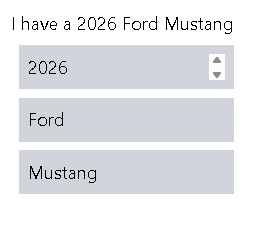

## JavaScript
[Video tutorial](https://youtu.be/lfmg-EJ8gm4)

**I know the basics (Data type variable stuff)**

[SKipped to 45 mins](https://youtu.be/lfmg-EJ8gm4?t=2693)

**Project :** Counter

```JS
const decreaseBtn = document.getElementById("decreaseBtn");
const resetBtn = document.getElementById("resetBtn");
const increaseBtn = document.getElementById("increaseBtn");
const countLabel = document.getElementById("countLabel");
let count = 0;

increaseBtn.onclick = function(){
    count++;
    countLabel.textContent = count;
}

decreaseBtn.onclick = function(){
    count--;
    countLabel.textContent = count;
}

resetBtn.onclick = function(){
    count = 0;
    countLabel.textContent = count;
}
```
Built-in object that provides a collection 
of properties and methods

## Math objects
```JS

let x = 3;
let y = 2;
let z = 1;

z = Math.round(x);
z = Math.floor(x);
z = Math.ceil(x);
z = Math.trunc(x);
z = Math.pow(x, y);
z = Math.sqrt(x);
z = Math.log(x);
z = Math.sin(x);
z = Math.cos(x);
z = Math.tan(x);
z = Math.abs(x);
z = Math.sign(x);
```

**Project :** Random Number Generator:

```JS
<!DOCTYPE html>
<html lang="en">
<head>
    <meta charset="UTF-8">
    <meta name="viewport" content="width=device-width, initial-scale=1.0">
    <title>My website</title>
    <link rel="stylesheet" href="style.css">
</head>
<body>
    <button id="myButton">roll</button><br>
    <label id="label1" class="my"></label><br>
    <label id="label2"></label><br>
    <label id="label3"></label><br>
    <script src="index.js"></script>
</body>
</html>


const myButton = document.getElementById("myButton");
const label1 = document.getElementById("label1");
const label2 = document.getElementById("label2");
const label3 = document.getElementById("label3");
const min = 1;
const max = 6;
let randomNum1;
let randomNum2;
let randomNum3;

myButton.onclick = function() {
    randomNum1 = Math.floor(Math.random() * max) + min;
    randomNum2 = Math.floor(Math.random() * max) + min;
    randomNum3 = Math.floor(Math.random() * max) + min;
    label1.textContent = randomNum1;
    label2.textContent = randomNum2;
    label3.textContent = randomNum3; 
}
```  
## Checked
[Video](https://youtu.be/SgxzJdqhyfw?list=PLZPZq0r_RZOO1zkgO4bIdfuLpizCeHYKv)

```js
<!DOCTYPE html>
<html lang="en">
<head>
    <meta charset="UTF-8">
    <meta name="viewport" content="width=device-width, initial-scale=1.0">
    <title>Document</title>
</head>
<body>
    <input name="payment" type="radio" id="Bkash"><label for="Bkash">Bkash</label><br>
    <input name="payment" type="radio" id="Nagad"><label for="Nagad">Nagad</label><br>
    <input name="payment" type="radio" id="COD"><label for="COD">Cash on delivery</label><br>

    <br>
    <input type="submit" name="submit" id="submit">

    <p id="text"></p>
    <script>
        let bkash = document.getElementById("Bkash");
        let nagad = document.getElementById("Nagad");
        let cod = document.getElementById("COD");
        let text = document.getElementById("text");

document.getElementById("submit").onclick = function() {
        if (bkash.checked) {
        text.textContent = "You're paying with Bkash";
        } else if (nagad.checked) {
            text.textContent = "You're paying with Nagad";
        } else if (cod.checked) {
           text.textContent = "You're paying with COD";
        } else {
        text.textContent = "Please select a payment method";
        }
    }
    </script>
</body>
</html>
```
## Ternary operator

*conditin ? if_true : if_false ;*

```js
let age = 12;
let messege = age >= 18 ? "Adult" : "Minor";

console.log(messege);
```
## switch statement
switch is like a multiple choice question for your code.
It checks the value of a variable, and runs the matching case.

**Format**

```js
switch(variable) {
  case value1:
    // do something
    break;
  case value2:
    // do something else
    break;
  default:
    // if nothing matches
}
```
**Example**

```js
    var day = 2;

    switch(day){
        case 1:
            console.log("It's Saturday");
            break;
        case 2:
            console.log("It's Sunday");
            break;
        case 3:
            console.log("It's Monday");
            break;
        case 4:
            console.log("It's Tuesday");
            break;
        case 5:
            console.log("It's Wednesday");
            break;
        case 6:
            console.log("It's Thursday");
            break;
        case 7:
            console.log("It's Friday");
            break;
        default:
            console.log("Invalid day!");
    }
```

## String methods
String methods are built-in tools in JavaScript that help you work with text (called strings).

You can use them to:

- Find something in a string
- Change part of the string
- Make it uppercase/lowercase
- Cut or split the string
- Add new text

**Example**

```js
let name = "Mahmud";

// Makes it uppercase
console.log(name.toUpperCase()); // "MAHMUD"

// Checks if it includes "mud"
console.log(name.includes("mud")); // true

// Gets part of the string
console.log(name.slice(0, 3)); // "Mah"
```

**Common String Methods**

| Method          | What it does                                   | Example/Output                               |
|-----------------|------------------------------------------------|----------------------------------------------|
| `length`        | Counts characters                              | `"Mahmud".length` -> `6`                     |
| `toUpperCase()` | Makes all letters BIG                          | `"Mahmud".toUpperCase()` -> `"MAHMUD"`       |
| `toLowerCase()` | Makes all letters small                        | `"Mahmud".toLowerCase()` -> `"mahmud"`       |
| `includes()`    | Checks if something is inside                  | `"Mahmud".includes("mud")` -> `true`         |
| `startsWith()`  | Checks if string starts with given substring   | `"Mahmud".startsWith("Mah")` -> `true`       |
| `endsWith()`    | Checks if string ends with given substring     | `"Mahmud".endsWith("mud")` -> `true`         |
| `slice()`       | Cuts a part of the string                      | `"Mahmud".slice(0, 3)` -> `"Mah"`            |
| `replace()`     | Replaces part of the string                    | `"Mahmud".replace("mud", "mat")` -> `"Mahmat"`|
| `trim()`        | Removes spaces at the ends                     | `"  Mahmud  ".trim()` -> `"Mahmud"`          |
| `padStart()`    | Adds padding at the beginning of the string    | `"Mahmud".padStart(10, "0")` -> `"000Mahmud"`|
| `padEnd()`      | Adds padding at the ending of the string       | `"Mahmud".padEnd(10, "0")` -> `"Mahmud000"`  |

## String slicing
Slices a portion from a string

**Format:**string_name.slice(startingIndex , endingIndex);

```js
let string = "A random string";

console.log(string);
console.log(string.slice(0,9));//sliced from index 0 t0 9
console.log(string.slice(9));//sliced from index 9 t0 rest
```

**Seperating 1st and last name from full name**

In this case we don't know the length of someone's name , so , we can't specify the index for slicing first name or last name
```js
let Name = "Abdullah Al Mahmud";
let firstName = Name.slice(0 , Name.indexOf(" ")); //From index 0 to the 1st empty space.
let lastName = Name.slice(Name.indexOf(" ") + 1); //`+ 1` : gotta start from after the 1st space , not from the 1st space.

console.log(firstName); 
console.log(lastName); 
```
##  Method chaining
[Video tutorial](https://youtu.be/J4YhlDsNqeE?list=PLZPZq0r_RZOO1zkgO4bIdfuLpizCeHYKv)

Calling one method after another in one continuous line of code.

**Task :** Get a user name with *window.prompt* then if there's any extra space , unorganised capitalisations , the code should fix it.

`maHmuD ---> Mahmud`

**Without method chaining**

```js
let username = window.prompt("Enter your username : ");

username = username.trim();//removes extra spaces

let firstLetter = username.charAt(0);//gets character at index 0 (1st character)
firstLetter = firstLetter.toUpperCase();

let otherLetters = username.slice(1);//gets other chars from index 1
otherLetters = otherLetters.toLowerCase();
console.log(firstLetter + otherLetters);
```

**With method chaining**
```js
let username = window.prompt("Enter your username : ");
username = username.trim().charAt(0).toUpperCase() + username.slice(1).toLocaleLowerCase();
console.log(username);
```
## Strict equality (`===`) concept
[video](https://youtu.be/O7aUm0AuUy4?list=PLZPZq0r_RZOO1zkgO4bIdfuLpizCeHYKv)

In JavaScript, **strict equality** is written as `===`

It **compares both**:

- The **value**
- AND the **type**

No jokes, no auto type conversion — it's the "I said what I said" of comparisons.

**Loose vs Strict:**
```js
5 == "5"     // true (loose equality - just compares value)
5 === "5"    // false (strict equality - type mismatch)
```

| Operator | Name            | Compares Value?| Compares Type? | Auto Converts? |
|----------|-----------------|----------------|----------------|----------------|
| `==`     | Loose Equality  | Yes            | No             | Yes            |
| `===`    | Strict Equality | Yes            | Yes            | No             |

---

**Examples:**
```js
console.log(7 === 7);        // true (same value and type)
console.log("7" === 7);      // false (string vs number)
console.log(true === 1);     // false (boolean vs number)
console.log(null === null);  // true
```
***Same for inequality `!== (Strict inequality)`***
---
## While loop
*I already know this*
repeat some code `WHILE` some condition is true

**Example code**
```js
let loggedIn = false;
let username;
let password;

while(!loggedIn){
    username = window.prompt(`Enter your username`);
    password = window.prompt(`Enter your password`);

    if(username === "myUsername" && password === "myPassword"){
        loggedIn = true;
        console.log("You are logged in!");
    }
    else{
        console.log("Invalid credentials! Please try again");
    }
}
```
## do while
It runs the code **first**, then checks the condition. So the loop body *will always execute at least once*.

---

**Example code:**
```js
let loggedIn = false;
let username;
let password;

do {
    username = window.prompt(`Enter your username`);
    password = window.prompt(`Enter your password`);

    if(username === "myUsername" && password === "myPassword"){
        loggedIn = true;
        console.log("You are logged in!");
    }
    else {
        console.log("Invalid credentials! Please try again");
    }
} while (!loggedIn);
```
**Why use `do...while` instead of `while`?**

- `while`: **checks first**, runs only **if** condition is true.
- `do...while`: **runs once**, then checks — perfect for login prompts, menus, etc.

So if you wanna make sure something runs **at least once**, no matter what — `do...while` is your go-to.

## for loop
Repeat same code for a limited amount of time.

---

## Project 01 : Number guessing game
This code 

-🎯 Generates a random number between min (1) and max (100).

-⌨️ Takes user input using window.prompt() to guess the number.

-🔁 Runs a loop (while) until the user guesses the correct number.

-🔼 Gives a hint if the guess is too high.

-🔽 Gives a hint if the guess is too low.

-✅ Shows a congratulatory message and the total number of attempts when guessed correctly.

-🔢 Uses Math.floor() and Math.random() to generate a whole number within the specified range.

-📈 Tracks how many tries the user took using the attempts variable.
```js
let min = 1;
let max = 100;
let UserInput = window.prompt(`Enter a number form ${min} to ${max} : `);
let randomNumber = Math.floor(Math.random() * (max - min + 1)) + min;
let isRunning = true;
let attempts = 0;

while(isRunning){
    if(UserInput > randomNumber){
        UserInput = window.prompt(`The number is lower than ${UserInput},Enter another number`);
        attempts++;
    }
    else if(UserInput < randomNumber){
        UserInput = window.prompt(`The number is higher than ${UserInput},Enter another number`);
        attempts++;
    }
    else{
        window.alert(`Congratulations,You've guessed it right in ${attempts} attemps`);
        isRunning = false;
    }
}
```