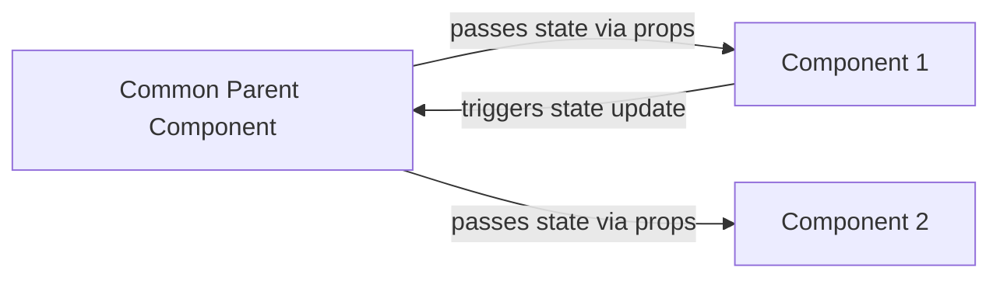

I’ll be skipping certain topics along the way, mainly the ones I’m already familiar with or have already documented in my previous notes, so I can focus more on the areas that are new to me or require deeper understanding.

I skipped the styling part , because Iam gonna use tailwind ot other ui libraries.

Here are some famous ui libraries

BTW Ima use `Chakra UI` for the final project.

- **[Material-UI (MUI)](https://mui.com/)** – React components following Google Material Design.
- **[Tailwind CSS](https://tailwindcss.com/)** – Utility-first CSS framework for rapid UI development.
- **[Bootstrap](https://getbootstrap.com/)** – Classic CSS framework with components and grid system.
- **[Chakra UI](https://chakra-ui.com/)** – Modular, accessible, and themeable React components.
- **[Ant Design (AntD)](https://ant.design/)** – Enterprise-grade React UI library with a large component set.
- **[Styled-Components](https://styled-components.com/)** – Popular CSS-in-JS library for React.
- **[Framer Motion](https://www.framer.com/motion/)** – React animation library for smooth interactions.
- **[React Icons](https://react-icons.github.io/react-icons/)** – Collection of popular icon packs as React components.

> **Suggestion:**  
> **[Shadcn/UI](https://ui.shadcn.com/)** – Prebuilt, accessible React components using Tailwind + Radix primitives; great for rapid UI building in Tailwind projects.

**Shadcn/UI** is an excellent choice for modern React projects, especially when combined with Tailwind CSS. Unlike traditional component libraries, it provides **prebuilt, accessible components based on Radix primitives**, giving developers full control over styling while maintaining best practices for accessibility. It’s lightweight, fully responsive, and highly customizable, allowing rapid UI development without the overhead of heavy theming systems like MUI or AntD. For anyone building Tailwind-based projects, Shadcn/UI acts as a **powerful toolkit** that accelerates development while keeping the design system clean and consistent.

# Using icons in react

1. we gotta install react icons first

```
npm i react-icons@latest
```

It'll be installed in the `node_modules` folder

2. Go to the website **[https://www.react-icons.com/](https://www.react-icons.com/)**

3. Copy the icon you need


4. Go to `App.tsx` and import the icon

```tsx
import { FaAddressCard } from "react-icons/fa"; // this is gonna be copied if you copy the icon from the website.

function App() {
  return <FaAddressCard />;
}

export default App;
```


# Managing component state

skipped some stuff : [Check skipped parts](./reactJS.md/#usestate)

## State Hook

`useState` lets a component **store and manage dynamic data** that persists across re-renders, like counters, form inputs, or fetched data.

```javascript
const [count, setCount] = useState(0);
```

## Asynchronous Updates

React **updates state asynchronously**, meaning changes are **queued and applied before the next render**, not instantly.

```javascript
setCount(count + 1); // Queued update
console.log(count); // Might still log old value
```

## State Storage

State is **stored outside the component function**, so React can **remember it between renders**.

## Top-Level Hook Usage

Hooks **must be used at the top level** of the component. You **cannot call them inside loops, conditions, or nested functions** because React relies on the **order of hook calls** to maintain state.

```javascript
function Counter() {
  const [count, setCount] = useState(0); // ✅ top-level

  return <button onClick={() => setCount(count + 1)}>{count}</button>;
}
```

# Best Practices for State

## Avoid Redundant State Variables

Only store in state what **truly needs to trigger a re-render**. Avoid duplicating values that can be derived from existing state or props. Storing redundant data not only wastes memory but can also lead to inconsistencies and bugs.

**Example – Wrong:**

```javascript
const [firstName, setFirstName] = useState("John");
const [fullName, setFullName] = useState("John Doe"); // redundant
```

Here, `fullName` can be computed from `firstName` and `lastName`. Storing it separately is unnecessary.

**Example – Right:**

```javascript
const [firstName, setFirstName] = useState("John");
const [lastName, setLastName] = useState("Doe");

// fullName can be derived
const fullName = `${firstName} ${lastName}`;
```

This way, you keep your state minimal, reduce bugs, and ensure easier maintenance.

---

## Group Related Variables Inside an Object

When you have multiple related state variables, combine them into a **single object**. This makes state management easier, especially when updating multiple properties together.

**Example – Wrong:**

```javascript
const [name, setName] = useState("");
const [email, setEmail] = useState("");
const [password, setPassword] = useState("");
```

Updating related fields separately can become repetitive and messy.

**Example – Right:**

```javascript
const [form, setForm] = useState({ name: "", email: "", password: "" });

// Update only the name
setForm({ ...form, name: "John" });

// Update multiple fields together
setForm({ ...form, email: "john@example.com", password: "123456" });
```

Using a single object also makes it easier to pass the entire state around to components or functions.

---

## Avoid Deeply Nested Structures

Deeply nested state objects make updates **complex, error-prone, and harder to debug**. Flatten your state whenever possible.

**Example – Wrong:**

```javascript
const [user, setUser] = useState({
  profile: { firstName: "", lastName: "", address: { city: "", country: "" } },
});

// Updating city
setUser({
  ...user,
  profile: {
    ...user.profile,
    address: { ...user.profile.address, city: "New York" },
  },
});
```

This approach is verbose, repetitive, and can easily lead to mistakes.

**Example – Right:**

```javascript
const [user, setUser] = useState({
  firstName: "",
  lastName: "",
  city: "",
  country: "",
});

// Updating city
setUser({ ...user, city: "New York" });
```

Flattening the state structure simplifies updates, reduces errors, and improves readability.

# Updating objects


```tsx
import { useState } from "react";

export default function Car() {
  const [car, setCar] = useState({
    name: "Bugatti",
    price: 36000,
    speed: 300,
  });

  function handleClick() {
    let newSpeed = car.speed - 1;
    setCar({ ...car, speed: newSpeed });
  }

  return (
    <>
      <h1 className="text-4xl font-extrabold">{car.name}</h1>
      <p>{car.price} USD</p>
      <p>{car.speed} mph</p>
      <button onClick={handleClick} className="btn m-4">
        Decrease speed
      </button>
    </>
  );
}
```

**Explanation**

You’re building a small React component that shows a **car’s details** — its name, price, and speed. When you click the button, the car’s **speed decreases by 1** using the `useState` hook.

---

**Step 1 – Importing `useState`**

```js
import { useState } from "react";
```

`useState` lets your component **remember data between renders**. Without it, values would reset every time the page updates.

---

**Step 2 – Setting up the state**

```js
const [car, setCar] = useState({
  name: "Bugatti",
  price: 36000,
  speed: 300,
});
```

- **car** → the current state object that holds all the car info.
- **setCar** → the function that updates this state.
- The object inside `useState()` is the **initial data**.

At the beginning, the value of `car` is
`{ name: "Bugatti", price: 36000, speed: 300 }`.

---

**Step 3 – Updating speed on click**

```js
function handleClick() {
  let newSpeed = car.speed - 1;
  setCar({ ...car, speed: newSpeed });
}
```

Here’s what’s happening:

- `car.speed - 1` reduces the current speed by one.
- `{ ...car }` copies all the existing key-value pairs from the car object.
- `speed: newSpeed` replaces only the speed value.

After one click, the new state becomes
`{ name: "Bugatti", price: 36000, speed: 299 }`.
All other properties stay the same because of the spread operator.

---

**Step 4 – Displaying the state**

```jsx
<h1>{car.name}</h1>
<p>{car.price} USD</p>
<p>{car.speed} mph</p>
```

Each time the state updates, React **automatically re-renders** and shows the new data on the screen.

---

**Step 5 – The button**

```jsx
<button onClick={handleClick}>Decrease speed</button>
```

When the button is clicked, React calls `handleClick`, updates the state with `setCar`, and triggers a re-render with the new speed.

---

**Key takeaway:**
In React, when your state is an object, using `{ ...car, property: newValue }` ensures that only the changed property updates while the rest remain intact.

Without spreading, something like `setCar({ speed: 250 })` would delete the other properties (`name` and `price`).
Using the spread operator keeps everything else safe while changing just what you need.

## Updating nested objects

**React useState and Nested Object Updates 🚗**

**1. State Initialization (The car Object)**  
The component initializes its state with **useState**, where **car** is a nested object.

**JavaScript**

```js
const [car, setCar] = useState({
  brand: {
    // <- Nested Object
    make: "Pagani",
    name: "zonda-7",
  },
  color: "Black", // <- Top-level property
});
```

- **car:** Holds the current state.
- **setCar:** Updates the state and triggers re-rendering.

---

**2. Updating Nested State Immutably**
The **changeCar** function shows how to correctly update both **top-level** and **nested** properties without mutating the original state.
React state must always be replaced with a **new object**, or it won’t detect the change.

**JavaScript**

```js
function changeCar() {
  setCar({
    // 1. Copy all properties from the current 'car' state
    ...car,

    // 2. Update the top-level property 'color'
    color: car.color === "Black" ? "Red" : "Black",

    // 3. Re-create the nested 'brand' object
    //    so React detects the change.
    brand: {
      make: car.brand.make === "Pagani" ? "Bugatti" : "Pagani",
      name: car.brand.name === "Chiron" ? "Zonda-7" : "Chiron",
    },
  });
}
```

**Key Concept: The Spreading Rule 💡**
When updating a nested property, spread every level of the object hierarchy to maintain immutability.

Example: updating **brand.make** safely

```js
setCar({
  ...car, // Create new car object
  brand: {
    ...car.brand, // Create new brand object (safe for partial updates)
    make: newValue,
  },
});
```

---

**3. Using the Ternary Operator for Toggling**
The **ternary operator**
_(condition ? valueIfTrue : valueIfFalse)_
simplifies binary state switches.

| **Property** | **Condition**               | **If True** | **If False** |
| ------------ | --------------------------- | ----------- | ------------ |
| color        | car.color === "Black"       | "Red"       | "Black"      |
| brand.make   | car.brand.make === "Pagani" | "Bugatti"   | "Pagani"     |

This approach keeps the update logic clean and minimal.

**4. Component Structure**
The component displays the car’s **make**, **name**, and **color**, along with a button that calls **changeCar()**.
When clicked, React re-renders the component with updated state — showing how **state changes instantly reflect in the UI**.

**Final code**

```tsx
import { useState } from "react";

export default function Car() {
  const [car, setCar] = useState({
    brand: {
      make: "Pagani",
      name: "zonda-7",
    },
    color: "Black",
  });

  function changeCar() {
    setCar({
      ...car,
      color: car.color === "Black" ? "Red" : "Black",
      brand: {
        make: car.brand.make === "Pagani" ? "Bugatti" : "Pagani",
        name: car.brand.name === "Chiron" ? "Zonda-7" : "",
      },
    });
  }

  return (
    <>
      <div className="m-4">
        <h1 className="font-extrabold">
          {car.brand.make + " " + car.brand.name}
        </h1>
        <p>{"Color: " + car.color}</p>
      </div>
      <button className="btn" onClick={changeCar}>
        Change
      </button>
    </>
  );
}
```

# Updating array

**Here's an example code , updating an array**
Hope you'll get it..

```jsx
import { useState } from "react";

export default function Array() {
  const [cars, setCars] = useState(["Honda", "Ford"]);
  const [newCar, setNewCar] = useState("");

  function handleClick() {
    if (newCar.trim() === "") return; // ignore empty
    setCars([...cars, newCar]);
    setNewCar(""); // reset input
  }

  return (
    <>
      <div className="flex gap-2 mb-4">
        <input
          type="text"
          value={newCar}
          onChange={(e) => setNewCar(e.target.value)}
          className="input border p-2 rounded w-full"
          placeholder="Enter a car name..."
        />
        <button
          className="button bg-blue-500 text-white px-4 py-2 rounded hover:bg-blue-600 transition-colors"
          onClick={handleClick}
        >
          Add
        </button>
      </div>

      <ul className="list space-y-2">
        {cars.map((car, index) => (
          <li
            key={index}
            className="p-2 rounded bg-gray-100 hover:bg-gray-200 transition-colors duration-200 text-center"
          >
            {car}
          </li>
        ))}
      </ul>
    </>
  );
}
```


# Updating array of objects

There will be a button, and when we click it, the object will update.

We have to make the bug with `id: 1` **Fixed**

```jsx
import { useState } from "react";

export default function Array() {
  const [bug, setbug] = useState([
    { id: 1, title: "Bug 1", fixed: false },
    { id: 2, title: "Bug 2", fixed: false },
  ]);

  function handleClick() {
    // map the bug array to find which bug has id 1 and then fix it.
    setbug(bug.map((bug) => (bug.id === 1 ? { ...bug, fixed: true } : bug)));
  }

  return (
    <div className="p-4">
      <p>
        {bug[0].title} {bug[0].fixed === true ? "is fixed" : "is not fixed"}
      </p>
      <p>
        {bug[1].title} {bug[1].fixed === true ? "is fixed" : "is not fixed"}
      </p>
      <button className="button" onClick={handleClick}>
        Click me
      </button>
    </div>
  );
}
```


# Simplifying update logic with `immer`

If you know **C++ OOP**, you’ll get this quick.

## Setup

```bash
npm i immer@latest
```

## **What is Immer?**

**Immer** is a small library that makes updating **immutable state** in React **super easy**.

In React, state should **never be mutated directly**:

```javascript
const [person, setPerson] = useState({ name: "Alice", age: 25 });

// ❌ Bad: directly mutating
person.age = 26;
setPerson(person);
```

This is like changing a private member of an object **without going through proper setters** — React might not detect it, and your component won’t re-render correctly.

**Immer** lets you write code that **looks like mutation** but under the hood keeps it immutable.

---

## **Basic Usage**

```javascript
import { useState } from "react";
import produce from "immer";

export default function App() {
  const [person, setPerson] = useState({ name: "Alice", age: 25 });

  function incrementAge() {
    setPerson(
      produce(person, (draft) => {
        draft.age += 1; // looks like mutation
      })
    );
  }

  return (
    <>
      <p>
        {person.name} is {person.age} years old.
      </p>
      <button onClick={incrementAge}>Birthday</button>
    </>
  );
}
```

- **produce()** gives you a **draft object**.
- You can change it like normal (**draft.age += 1**).
- Immer produces a **new immutable object** for React automatically.

---

## **Why it’s dope**

1. **No deep spread hell:**
   Updating nested objects without Immer:

   ```javascript
   setPerson({
     ...person,
     address: {
       ...person.address,
       city: "London",
     },
   });
   ```

   With Immer:

   ```javascript
   setPerson(
     produce(person, (draft) => {
       draft.address.city = "London";
     })
   );
   ```

2. **Safe & clean:** No accidental mutation bugs.

3. **Feels like OOP:** You “mutate” the object directly, but it’s safe.

**Immer gives you a “draft” object that looks and behaves like the original object. You can mutate it freely.**

1. Import `produce` (function) from `immer`

```js
import { useState } from "react";
import { produce } from "immer";

export default function Array() {
  const [bug, setbug] = useState([
    { id: 1, title: "Bug 1", fixed: false },
    { id: 2, title: "Bug 2", fixed: false },
  ]);

  function handleClick() {
    setbug(
      // bug.map(bug => bug.id === 1 ? {...bug,fixed : true} : bug)
      // instead of map, use produce now

      produce((draft) => {
        // draft is a proxy object that records the changes we're gonna apply to the "bugs" array
        const bug = draft.find((bug) => bug.id === 1);
        if (bug) {
          bug.fixed = true;
        }
      })
    );
  }

  return (
    <div className="p-4">
      <p>
        {bug[0].title} {bug[0].fixed === true ? "is fixed" : "is not fixed"}
      </p>
      <p>
        {bug[1].title} {bug[1].fixed === true ? "is fixed" : "is not fixed"}
      </p>
      <button className="button" onClick={handleClick}>
        Click me
      </button>
    </div>
  );
}
```

**Doubt solve**

```js
const bug = draft.find((bug) => bug.id === 1);

if (bug) {
  bug.fixed = true;
}
```

👉 **Find the first object inside `draft` whose `id` is 1.**

Let’s break it down:

```js
const bug = draft.find((bug) => bug.id === 1);
```

- **`draft`** → It’s an array (copy of bug objects).

```js
const draft = [
  { id: 1, title: "Bug 1", fixed: false },
  { id: 2, title: "Bug 2", fixed: false },
];
```

- **`.find()`** → A built-in JS array method that loops through the array and returns **the first element** that matches a condition.

- **`bug => bug.id === 1`** → This is an **arrow function** used as the condition.
  It says: “check if the current element’s `id` is 1”.

So it returns the **first object** with `id` = 1.

Example output:

```js
const bug = { id: 1, title: "Bug 1", fixed: false };
```

If no match is found, `.find()` returns **undefined**.

# Sharing state between components

- React components are **isolated** by default; state in one does not affect another automatically.
- To share state between two components:
  - **Lift state up** to the closest common parent.
  - Parent holds the state and passes it down via **props**.
  - Comp 1 can **update the state**, and Comp 2 can **react to changes**.
- For distant or complex components, use:
  - **React Context**
  - **State management libraries** like Redux



This shows how **lifting state up** works visually, and the bullets summarize the key ideas.

**App.tsx**

```js
import { useState } from "react";
import Cart from "./Components/Cart";
import { NavBar } from "./Components/NavBar";

// Variables from parent can be passed to childrens as props

const App = () => {
  const [cartItems, setCartItems] = useState([
    "item_1",
    "item_2",
    "item_3",
    "item_4",
    "item_5",
  ]);

  return (
    <div>
      <NavBar cartItemCount={cartItems.length} />
      <Cart cartItems={cartItems} />
    </div>
  );
};

export default App;
```

**Cart.tsx**

```js
interface props {
  cartItems: string[];
}

const Cart = ({ cartItems }: props) => {
  return (
    <div>
      <ul className="p-4 bg-yellow-200 text-center">
        {cartItems.map((item) => {
          return (
            <li
              className="bg-blue-300 bg-opacity-70 p-2 m-2 rounded-lg"
              key={item}
            >
              {item}
            </li>
          );
        })}
      </ul>
    </div>
  );
};

export default Cart;
```

**NavBar.tsx**

```js
interface props {
  cartItemCount: number;
}

export const NavBar = ({ cartItemCount }: props) => {
  return (
    <div className="bg-yellow-400 font-extrabold p-3 text-center">
      Item count : {cartItemCount}
    </div>
  );
};
```


- **`App.tsx`** is the **parent** — it owns the `cartItems` state using `useState()`.
- That state (data) lives only in the parent — the **single source of truth**.
- Parent **shares** it with children via **props**:

  - `NavBar` gets `cartItemCount` (derived from `cartItems.length`).
  - `Cart` gets the full `cartItems` array.

- **Children can only read** what’s passed; they don’t hold the data themselves.
- If children ever need to **update** the same state, parent must pass down the **setter** (`setCartItems`) too.

🧩 **Concept:**
This is called **state lifting** — parent keeps the data, children just display or trigger updates through props.

**Extra : Add a button component to empty cart**

**Button.tsx**

```js
interface Props {
  emptyCart: () => void; // cleaner type than Function
}

export const Button = ({ emptyCart }: Props) => {
  return (
    <div>
      <button
        onClick={emptyCart}
        className="bg-blue-300 hover:bg-blue-400 p-2 m-2 rounded-lg font-extrabold"
      >
        Empty cart
      </button>
    </div>
  );
};
```

**App.tsx**

```js
// ...other code

<Button emptyCart={emptyCart} />
```


## Exercise : Building an `expandable text` component

**Code :** [https://github.com/mahmud-ops/Expandable_text](https://github.com/mahmud-ops/Expandable_text)

**Output :** [https://expandable-text-nu.vercel.app/](https://expandable-text-nu.vercel.app/)

**Component Goal:**
Toggle between showing a shortened and a full version of a long text — like a “Read more / Show less” feature.

**Logic Flow:**

- A prop called **expanded** decides the initial state.
- If **expanded** is true, text starts fully visible; otherwise, it starts shortened.
- The **useState** hooks track two things:

  - whether text is currently expanded (**isExpanded**)
  - how many characters to show (**currentMaxChar**)

**Click Behavior:**

- When the button is clicked, **isExpanded** flips between true and false.
- If collapsing, limit the text to **maxChar** (default 100).
- If expanding, set limit to **children.length** (the full text).

**Render Logic:**

- If **isExpanded** is true → show full text.
- If false → show sliced text up to **currentMaxChar**.
- The button text changes dynamically:

  - “Show less” when expanded
  - “...Show more” when collapsed

**Core Idea:**
Dynamic toggling + conditional slicing = controlled text preview.
Smooth user control over how much content is visible.

# Building forms

We’ll use **React Hook Form** to manage the form and **Zod** to validate the inputs.

## Building a basic form

Basic stuff...

```js
export const Form = () => {
  return (
    <>
      <div>
        <label htmlFor="name">Name</label>
        <input
          className="border border-black rounded-lg m-3 p-2"
          type="text"
          id="name"
        />
      </div>
      <div>
        <label htmlFor="age">Age</label>
        <input
          className="border border-black rounded-lg m-3 p-2"
          type="number"
          id="age"
        />
      </div>
      <button type="submit" className="bg-blue-400 rounded-lg p-2 m-2">
        Submit
      </button>
    </>
  );
};
```

**Adding functionality**

```js
function handleClick() {
  console.log("Submitted");
}
```

**Issue:**

Every time i press `submit`, The webpage reloads

When you click a **submit button** inside a `<form>`, the browser automatically triggers the form’s **default submission process**. This behavior comes from the original design of HTML — long before React or SPAs — where forms were used to send data directly to a server. If you don’t stop it, the browser assumes you want to submit the form, sends the data, and **reloads the page** to display the server’s response.

🔍 Breakdown:

- **HTML standard behavior:** Forms were built to send data via HTTP (GET or POST) to the URL in the `action` attribute.
- **If no `action` is provided:** The browser resubmits to the **current page’s URL**, causing a reload.
- **Type="submit":** Any button of this type automatically triggers that submit event.
- **React context:** React runs inside the browser, but the native HTML behavior still applies unless you block it.
- **Result:** Page refreshes before your JavaScript (`console.log`, state updates, etc.) can complete — unless you call `e.preventDefault()` to stop it.

```js
function handleClick(e: React.FormEvent) {
  e.preventDefault();
  console.log("Submitted");
}
```

Now it won’t reload, and the message will appear in the console.

## Accessing input fields

`useRef` in a form is mainly used to **directly access or control form elements** (like inputs) **without using state**.
Basically, instead of saving input data with `useState`, you grab it directly from the DOM.

**🧩 Example**

```jsx
import { useRef } from "react";

export const Form = () => {
  const nameRef = useRef(); // create ref

  function handleSubmit(e) {
    e.preventDefault();
    console.log(nameRef.current.value); // get input value
    nameRef.current.value = ""; // reset input
  }

  return (
    <form onSubmit={handleSubmit}>
      <label htmlFor="name">Name:</label>
      <input
        id="name"
        type="text"
        ref={nameRef} // connect ref to input
        className="border p-2 rounded"
      />
      <button className="bg-blue-500 text-white p-2 rounded">Submit</button>
    </form>
  );
};
```

**⚙️ What’s Happening**

- `useRef()` → creates a reference object `{ current: null }`.
- `<input ref={nameRef}>` → React attaches the actual DOM input element to `nameRef.current`.
- When you submit, you can **read or modify** it directly using `nameRef.current.value`.

**⚡ When to Use It**

- For **simple, uncontrolled forms** (you don’t need re-renders on every keystroke).
- When you just need the value **once** — like on submit.
- For **focus control** or auto-scroll:

```js
nameRef.current.focus();
```

---

> `useRef()` **returns a reference object**

---

```js
import { useRef } from "react";

// step 3:
export const Form = () => {
  function handleClick(e: React.FormEvent) {
    e.preventDefault();
    if (nameRef.current != null) {
      console.log(nameRef.current);
    }
  }
  // step 1
  const nameRef = useRef(null); // Storing the reference object in the `nameRef` variable
  // intial value is generally taken `null`
  return (
    <form onSubmit={handleClick}>
      <div>
        <label htmlFor="name">Name</label>
        <input
          ref={nameRef} // step 2: store value from here.
          className="border border-black rounded-lg m-3 p-2"
          type="text"
          id="name"
        />
      </div>
      <div>
        <label htmlFor="age">Age</label>
        <input
          className="border border-black rounded-lg m-3 p-2"
          type="number"
          id="age"
        />
      </div>
      <button type="submit" className="bg-blue-400 rounded-lg p-2 m-2">
        Submit
      </button>
    </form>
  );
};
```

**Output**

This prints..

> <input id="name" class="border border-black rounded-lg m-3 p-2" type="text">

the whole element.. we need the value.

so, in step 3

```js
// step 3:
export const Form = () => {
  function handleClick(e: React.FormEvent){
    e.preventDefault();
    if(nameRef.current != null){
      console.log(nameRef.current.value); // .value
    }
  }
```

> Error: Property 'value' does not exist on type 'never'

When you do:

```ts
const nameRef = useRef(null);
```

TypeScript sees **“null for now, I have no clue what this will be”**.

- Later you try `nameRef.current.value` → TS says **“I don’t know what `current` is, maybe it’s never, it might not have `.value`”** → error.

When you do:

```ts
const nameRef = useRef<HTMLInputElement | null>(null);
```

You tell TS: **“`current` will be an HTML input element (or null)”**.
Now TS knows `.value` exists on it.

**TL;DR:** TypeScript needs to know what kind of thing your ref will point to; otherwise it freaks out when you access properties like `.value`.

If you want, I can draw a **tiny diagram** to make it crystal clear.

so, we have to add `<HTMLInputElement | null>`.

```js
// step 1
const nameRef = (useRef < HTMLInputElement) | (null > null); // Storing the reference object in the `nameRef` variable
// intial value is generally taken `null`
```

Now. it'll log the output properly

**Final code**

```js
import { useRef } from "react";

// step 3:
export const Form = () => {
  
  // step 1
  const nameRef = (useRef < HTMLInputElement) | (null > null); 
  // Storing the reference object in the `nameRef` variable
  // intial value is generally taken `null`

  
  
  function handleClick(e: React.FormEvent) {
    e.preventDefault();
    if (nameRef.current != null) {
      console.log(nameRef.current.value);
    }
  }

  
  
  return (
    <form onSubmit={handleClick}>
      <div>
        <label htmlFor="name">Name</label>
        <input
          ref={nameRef} // step 2: store value from here.
          className="border border-black rounded-lg m-3 p-2"
          type="text"
          id="name"
        />
      </div>
      <div>
        <label htmlFor="age">Age</label>
        <input
          className="border border-black rounded-lg m-3 p-2"
          type="number"
          id="age"
        />
      </div>
      <button type="submit" className="bg-blue-400 rounded-lg p-2 m-2">
        Submit
      </button>
    </form>
  );
};
```
Now let's do the same for age
```js
import { useRef} from "react";

// step 3:
export const Form = () => {
  function handleClick(e: React.FormEvent){
    e.preventDefault();
    
    if(nameRef.current != null){
      console.log(nameRef.current.value);
    }

    if(ageRef.current != null){
      console.log(ageRef.current.value);
    }
  }
  // step 1
  const nameRef = useRef<HTMLInputElement | null>(null) // Storing the reference object in the `nameRef` variable
  const ageRef = useRef<HTMLInputElement | null>(null)

  return (
    <form onSubmit={handleClick}>
      <div>
        <label htmlFor="name">Name</label>
        <input
          ref = {nameRef} // step 2: store value from here.
          className="border border-black rounded-lg m-3 p-2"
          type="text"
          id="name"
        />
      </div>
      <div>
        <label htmlFor="age">Age</label>
        <input
          ref = {ageRef}
          className="border border-black rounded-lg m-3 p-2"
          type="number"
          id="age"
        />
      </div>
      <button type="submit" className="bg-blue-400 rounded-lg p-2 m-2">Submit</button>
    </form>
  );
};
```
> Mahmud
> 21

## Now, Return an object instead of raw value

Previously we printed value.. Let's return it as an object
```js
const person = {
  name: nameRef.current?.value,
  age: ageRef.current?.value 
}
```

```js
import { useRef} from "react";

export const Form = () => {

  const nameRef = useRef<HTMLInputElement | null>(null) // Storing the reference object in the `nameRef` variable
  const ageRef = useRef<HTMLInputElement | null>(null)
  
  function handleClick(e: React.FormEvent){
    e.preventDefault();
    
    // Made a person object and put the ref value in it
    const person = {
      name: nameRef.current?.value,
      age: ageRef.current?.value 
    }

    if(nameRef.current != null && ageRef.current != null){
        console.log(person)
    }
  }

  return (
    <form onSubmit={handleClick}>
      <div>
        <label htmlFor="name">Name</label>
        <input
          ref = {nameRef} // step 2: store value from here.
          className="border border-black rounded-lg m-3 p-2"
          type="text"
          id="name"
        />
      </div>
      <div>
        <label htmlFor="age">Age</label>
        <input
          ref = {ageRef}
          className="border border-black rounded-lg m-3 p-2"
          type="number"
          id="age"
        />
      </div>
      <button type="submit" className="bg-blue-400 rounded-lg p-2 m-2">Submit</button>
    </form>
  );
};
```

**Output**
```js
Object { name: "sdf", age: "2" }
```

> **Caution:** write the object creation inside the click handler function so it reads the current values.