I’ll be skipping certain topics along the way, mainly the ones I’m already familiar with or have already documented in my previous notes, so I can focus more on the areas that are new to me or require deeper understanding.

I skipped the styling part , because Iam gonna use tailwind ot other ui libraries.

Here are some famous ui libraries

BTW Ima use `Chakra UI` for the final project.

- **[Material-UI (MUI)](https://mui.com/)** – React components following Google Material Design.
- **[Tailwind CSS](https://tailwindcss.com/)** – Utility-first CSS framework for rapid UI development.
- **[Bootstrap](https://getbootstrap.com/)** – Classic CSS framework with components and grid system.
- **[Chakra UI](https://chakra-ui.com/)** – Modular, accessible, and themeable React components.
- **[Ant Design (AntD)](https://ant.design/)** – Enterprise-grade React UI library with a large component set.
- **[Styled-Components](https://styled-components.com/)** – Popular CSS-in-JS library for React.
- **[Framer Motion](https://www.framer.com/motion/)** – React animation library for smooth interactions.
- **[React Icons](https://react-icons.github.io/react-icons/)** – Collection of popular icon packs as React components.

> **Suggestion:**  
> **[Shadcn/UI](https://ui.shadcn.com/)** – Prebuilt, accessible React components using Tailwind + Radix primitives; great for rapid UI building in Tailwind projects.

**Shadcn/UI** is an excellent choice for modern React projects, especially when combined with Tailwind CSS. Unlike traditional component libraries, it provides **prebuilt, accessible components based on Radix primitives**, giving developers full control over styling while maintaining best practices for accessibility. It’s lightweight, fully responsive, and highly customizable, allowing rapid UI development without the overhead of heavy theming systems like MUI or AntD. For anyone building Tailwind-based projects, Shadcn/UI acts as a **powerful toolkit** that accelerates development while keeping the design system clean and consistent.

# Using icons in react

1. we gotta install react icons first

```
npm i react-icons@latest
```

It'll be installed in the `node_modules` folder

2. Go to the website **[https://www.react-icons.com/](https://www.react-icons.com/)**

3. Copy the icon you need

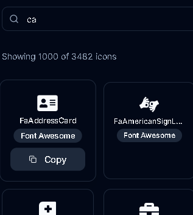

4. Go to `App.tsx` and import the icon

```tsx
import { FaAddressCard } from "react-icons/fa"; // this is gonna be copied if you copy the icon from the website.

function App() {
  return <FaAddressCard />;
}

export default App;
```


# Managing component state

skipped some stuff : [Check skipped parts](./reactJS.md/#usestate)

## State Hook

`useState` lets a component **store and manage dynamic data** that persists across re-renders, like counters, form inputs, or fetched data.

```javascript
const [count, setCount] = useState(0);
```

## Asynchronous Updates

React **updates state asynchronously**, meaning changes are **queued and applied before the next render**, not instantly.

```javascript
setCount(count + 1); // Queued update
console.log(count); // Might still log old value
```

## State Storage

State is **stored outside the component function**, so React can **remember it between renders**.

## Top-Level Hook Usage

Hooks **must be used at the top level** of the component. You **cannot call them inside loops, conditions, or nested functions** because React relies on the **order of hook calls** to maintain state.

```javascript
function Counter() {
  const [count, setCount] = useState(0); // ✅ top-level

  return <button onClick={() => setCount(count + 1)}>{count}</button>;
}
```

# Best Practices for State

## Avoid Redundant State Variables

Only store in state what **truly needs to trigger a re-render**. Avoid duplicating values that can be derived from existing state or props. Storing redundant data not only wastes memory but can also lead to inconsistencies and bugs.

**Example – Wrong:**

```javascript
const [firstName, setFirstName] = useState("John");
const [fullName, setFullName] = useState("John Doe"); // redundant
```

Here, `fullName` can be computed from `firstName` and `lastName`. Storing it separately is unnecessary.

**Example – Right:**

```javascript
const [firstName, setFirstName] = useState("John");
const [lastName, setLastName] = useState("Doe");

// fullName can be derived
const fullName = `${firstName} ${lastName}`;
```

This way, you keep your state minimal, reduce bugs, and ensure easier maintenance.

---

## Group Related Variables Inside an Object

When you have multiple related state variables, combine them into a **single object**. This makes state management easier, especially when updating multiple properties together.

**Example – Wrong:**

```javascript
const [name, setName] = useState("");
const [email, setEmail] = useState("");
const [password, setPassword] = useState("");
```

Updating related fields separately can become repetitive and messy.

**Example – Right:**

```javascript
const [form, setForm] = useState({ name: "", email: "", password: "" });

// Update only the name
setForm({ ...form, name: "John" });

// Update multiple fields together
setForm({ ...form, email: "john@example.com", password: "123456" });
```

Using a single object also makes it easier to pass the entire state around to components or functions.

---

## Avoid Deeply Nested Structures

Deeply nested state objects make updates **complex, error-prone, and harder to debug**. Flatten your state whenever possible.

**Example – Wrong:**

```javascript
const [user, setUser] = useState({
  profile: { firstName: "", lastName: "", address: { city: "", country: "" } },
});

// Updating city
setUser({
  ...user,
  profile: {
    ...user.profile,
    address: { ...user.profile.address, city: "New York" },
  },
});
```

This approach is verbose, repetitive, and can easily lead to mistakes.

**Example – Right:**

```javascript
const [user, setUser] = useState({
  firstName: "",
  lastName: "",
  city: "",
  country: "",
});

// Updating city
setUser({ ...user, city: "New York" });
```

Flattening the state structure simplifies updates, reduces errors, and improves readability.

# Updating objects

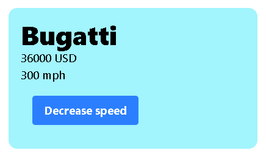

```tsx
import { useState } from "react";

export default function Car() {
  const [car, setCar] = useState({
    name: "Bugatti",
    price: 36000,
    speed: 300,
  });

  function handleClick() {
    let newSpeed = car.speed - 1;
    setCar({ ...car, speed: newSpeed });
  }

  return (
    <>
      <h1 className="text-4xl font-extrabold">{car.name}</h1>
      <p>{car.price} USD</p>
      <p>{car.speed} mph</p>
      <button onClick={handleClick} className="btn m-4">
        Decrease speed
      </button>
    </>
  );
}
```

**Explanation**

You’re building a small React component that shows a **car’s details** — its name, price, and speed. When you click the button, the car’s **speed decreases by 1** using the `useState` hook.

---

**Step 1 – Importing `useState`**

```js
import { useState } from "react";
```

`useState` lets your component **remember data between renders**. Without it, values would reset every time the page updates.

---

**Step 2 – Setting up the state**

```js
const [car, setCar] = useState({
  name: "Bugatti",
  price: 36000,
  speed: 300,
});
```

- **car** → the current state object that holds all the car info.
- **setCar** → the function that updates this state.
- The object inside `useState()` is the **initial data**.

At the beginning, the value of `car` is
`{ name: "Bugatti", price: 36000, speed: 300 }`.

---

**Step 3 – Updating speed on click**

```js
function handleClick() {
  let newSpeed = car.speed - 1;
  setCar({ ...car, speed: newSpeed });
}
```

Here’s what’s happening:

- `car.speed - 1` reduces the current speed by one.
- `{ ...car }` copies all the existing key-value pairs from the car object.
- `speed: newSpeed` replaces only the speed value.

After one click, the new state becomes
`{ name: "Bugatti", price: 36000, speed: 299 }`.
All other properties stay the same because of the spread operator.

---

**Step 4 – Displaying the state**

```jsx
<h1>{car.name}</h1>
<p>{car.price} USD</p>
<p>{car.speed} mph</p>
```

Each time the state updates, React **automatically re-renders** and shows the new data on the screen.

---

**Step 5 – The button**

```jsx
<button onClick={handleClick}>Decrease speed</button>
```

When the button is clicked, React calls `handleClick`, updates the state with `setCar`, and triggers a re-render with the new speed.

---

**Key takeaway:**
In React, when your state is an object, using `{ ...car, property: newValue }` ensures that only the changed property updates while the rest remain intact.

Without spreading, something like `setCar({ speed: 250 })` would delete the other properties (`name` and `price`).
Using the spread operator keeps everything else safe while changing just what you need.

## Updating nested objects

**React useState and Nested Object Updates 🚗**

**1. State Initialization (The car Object)**  
The component initializes its state with **useState**, where **car** is a nested object.

**JavaScript**

```js
const [car, setCar] = useState({
  brand: {
    // <- Nested Object
    make: "Pagani",
    name: "zonda-7",
  },
  color: "Black", // <- Top-level property
});
```

- **car:** Holds the current state.
- **setCar:** Updates the state and triggers re-rendering.

---

**2. Updating Nested State Immutably**
The **changeCar** function shows how to correctly update both **top-level** and **nested** properties without mutating the original state.
React state must always be replaced with a **new object**, or it won’t detect the change.

**JavaScript**

```js
function changeCar() {
  setCar({
    // 1. Copy all properties from the current 'car' state
    ...car,

    // 2. Update the top-level property 'color'
    color: car.color === "Black" ? "Red" : "Black",

    // 3. Re-create the nested 'brand' object
    //    so React detects the change.
    brand: {
      make: car.brand.make === "Pagani" ? "Bugatti" : "Pagani",
      name: car.brand.name === "Chiron" ? "Zonda-7" : "Chiron",
    },
  });
}
```

**Key Concept: The Spreading Rule 💡**
When updating a nested property, spread every level of the object hierarchy to maintain immutability.

Example: updating **brand.make** safely

```js
setCar({
  ...car, // Create new car object
  brand: {
    ...car.brand, // Create new brand object (safe for partial updates)
    make: newValue,
  },
});
```

---

**3. Using the Ternary Operator for Toggling**
The **ternary operator**
_(condition ? valueIfTrue : valueIfFalse)_
simplifies binary state switches.

| **Property** | **Condition**               | **If True** | **If False** |
| ------------ | --------------------------- | ----------- | ------------ |
| color        | car.color === "Black"       | "Red"       | "Black"      |
| brand.make   | car.brand.make === "Pagani" | "Bugatti"   | "Pagani"     |

This approach keeps the update logic clean and minimal.

**4. Component Structure**
The component displays the car’s **make**, **name**, and **color**, along with a button that calls **changeCar()**.
When clicked, React re-renders the component with updated state — showing how **state changes instantly reflect in the UI**.

**Final code**

```tsx
import { useState } from "react";

export default function Car() {
  const [car, setCar] = useState({
    brand: {
      make: "Pagani",
      name: "zonda-7",
    },
    color: "Black",
  });

  function changeCar() {
    setCar({
      ...car,
      color: car.color === "Black" ? "Red" : "Black",
      brand: {
        make: car.brand.make === "Pagani" ? "Bugatti" : "Pagani",
        name: car.brand.name === "Chiron" ? "Zonda-7" : "",
      },
    });
  }

  return (
    <>
      <div className="m-4">
        <h1 className="font-extrabold">
          {car.brand.make + " " + car.brand.name}
        </h1>
        <p>{"Color: " + car.color}</p>
      </div>
      <button className="btn" onClick={changeCar}>
        Change
      </button>
    </>
  );
}
```

# Updating array

**Here's an example code , updating an array**
Hope you'll get it..

```jsx
import { useState } from "react";

export default function Array() {
  const [cars, setCars] = useState(["Honda", "Ford"]);
  const [newCar, setNewCar] = useState("");

  function handleClick() {
    if (newCar.trim() === "") return; // ignore empty
    setCars([...cars, newCar]);
    setNewCar(""); // reset input
  }

  return (
    <>
      <div className="flex gap-2 mb-4">
        <input
          type="text"
          value={newCar}
          onChange={(e) => setNewCar(e.target.value)}
          className="input border p-2 rounded w-full"
          placeholder="Enter a car name..."
        />
        <button
          className="button bg-blue-500 text-white px-4 py-2 rounded hover:bg-blue-600 transition-colors"
          onClick={handleClick}
        >
          Add
        </button>
      </div>

      <ul className="list space-y-2">
        {cars.map((car, index) => (
          <li
            key={index}
            className="p-2 rounded bg-gray-100 hover:bg-gray-200 transition-colors duration-200 text-center"
          >
            {car}
          </li>
        ))}
      </ul>
    </>
  );
}
```

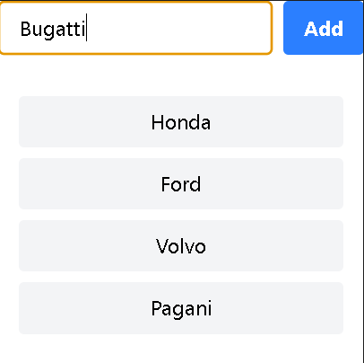

# Updating array of objects

There will be a button, and when we click it, the object will update.

We have to make the bug with `id: 1` **Fixed**

```jsx
import { useState } from "react";

export default function Array() {
  const [bug, setbug] = useState([
    { id: 1, title: "Bug 1", fixed: false },
    { id: 2, title: "Bug 2", fixed: false },
  ]);

  function handleClick() {
    // map the bug array to find which bug has id 1 and then fix it.
    setbug(bug.map((bug) => (bug.id === 1 ? { ...bug, fixed: true } : bug)));
  }

  return (
    <div className="p-4">
      <p>
        {bug[0].title} {bug[0].fixed === true ? "is fixed" : "is not fixed"}
      </p>
      <p>
        {bug[1].title} {bug[1].fixed === true ? "is fixed" : "is not fixed"}
      </p>
      <button className="button" onClick={handleClick}>
        Click me
      </button>
    </div>
  );
}
```


# Simplifying update logic with `immer`

If you know **C++ OOP**, you’ll get this quick.

## Setup

```bash
npm i immer@latest
```

## **What is Immer?**

**Immer** is a small library that makes updating **immutable state** in React **super easy**.

In React, state should **never be mutated directly**:

```javascript
const [person, setPerson] = useState({ name: "Alice", age: 25 });

// ❌ Bad: directly mutating
person.age = 26;
setPerson(person);
```

This is like changing a private member of an object **without going through proper setters** — React might not detect it, and your component won’t re-render correctly.

**Immer** lets you write code that **looks like mutation** but under the hood keeps it immutable.

---

## **Basic Usage**

```javascript
import { useState } from "react";
import produce from "immer";

export default function App() {
  const [person, setPerson] = useState({ name: "Alice", age: 25 });

  function incrementAge() {
    setPerson(
      produce(person, (draft) => {
        draft.age += 1; // looks like mutation
      })
    );
  }

  return (
    <>
      <p>
        {person.name} is {person.age} years old.
      </p>
      <button onClick={incrementAge}>Birthday</button>
    </>
  );
}
```

- **produce()** gives you a **draft object**.
- You can change it like normal (**draft.age += 1**).
- Immer produces a **new immutable object** for React automatically.

---

## **Why it’s dope**

1. **No deep spread hell:**
   Updating nested objects without Immer:

   ```javascript
   setPerson({
     ...person,
     address: {
       ...person.address,
       city: "London",
     },
   });
   ```

   With Immer:

   ```javascript
   setPerson(
     produce(person, (draft) => {
       draft.address.city = "London";
     })
   );
   ```

2. **Safe & clean:** No accidental mutation bugs.

3. **Feels like OOP:** You “mutate” the object directly, but it’s safe.

**Immer gives you a “draft” object that looks and behaves like the original object. You can mutate it freely.**

1. Import `produce` (function) from `immer`

```js
import { useState } from "react";
import { produce } from "immer";

export default function Array() {
  const [bug, setbug] = useState([
    { id: 1, title: "Bug 1", fixed: false },
    { id: 2, title: "Bug 2", fixed: false },
  ]);

  function handleClick() {
    setbug(
      // bug.map(bug => bug.id === 1 ? {...bug,fixed : true} : bug)
      // instead of map, use produce now

      produce((draft) => {
        // draft is a proxy object that records the changes we're gonna apply to the "bugs" array
        const bug = draft.find((bug) => bug.id === 1);
        if (bug) {
          bug.fixed = true;
        }
      })
    );
  }

  return (
    <div className="p-4">
      <p>
        {bug[0].title} {bug[0].fixed === true ? "is fixed" : "is not fixed"}
      </p>
      <p>
        {bug[1].title} {bug[1].fixed === true ? "is fixed" : "is not fixed"}
      </p>
      <button className="button" onClick={handleClick}>
        Click me
      </button>
    </div>
  );
}
```

**Doubt solve**

```js
const bug = draft.find((bug) => bug.id === 1);

if (bug) {
  bug.fixed = true;
}
```

👉 **Find the first object inside `draft` whose `id` is 1.**

Let’s break it down:

```js
const bug = draft.find((bug) => bug.id === 1);
```

- **`draft`** → It’s an array (copy of bug objects).

```js
const draft = [
  { id: 1, title: "Bug 1", fixed: false },
  { id: 2, title: "Bug 2", fixed: false },
];
```

- **`.find()`** → A built-in JS array method that loops through the array and returns **the first element** that matches a condition.

- **`bug => bug.id === 1`** → This is an **arrow function** used as the condition.
  It says: “check if the current element’s `id` is 1”.

So it returns the **first object** with `id` = 1.

Example output:

```js
const bug = { id: 1, title: "Bug 1", fixed: false };
```

If no match is found, `.find()` returns **undefined**.

# Sharing state between components

- React components are **isolated** by default; state in one does not affect another automatically.
- To share state between two components:
  - **Lift state up** to the closest common parent.
  - Parent holds the state and passes it down via **props**.
  - Comp 1 can **update the state**, and Comp 2 can **react to changes**.
- For distant or complex components, use:
  - **React Context**
  - **State management libraries** like Redux

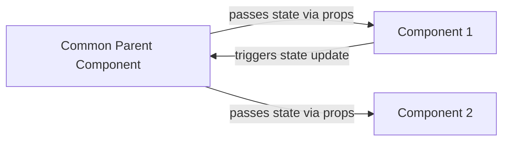

This shows how **lifting state up** works visually, and the bullets summarize the key ideas.

**App.tsx**

```js
import { useState } from "react";
import Cart from "./Components/Cart";
import { NavBar } from "./Components/NavBar";

// Variables from parent can be passed to childrens as props

const App = () => {
  const [cartItems, setCartItems] = useState([
    "item_1",
    "item_2",
    "item_3",
    "item_4",
    "item_5",
  ]);

  return (
    <div>
      <NavBar cartItemCount={cartItems.length} />
      <Cart cartItems={cartItems} />
    </div>
  );
};

export default App;
```

**Cart.tsx**

```js
interface props {
  cartItems: string[];
}

const Cart = ({ cartItems }: props) => {
  return (
    <div>
      <ul className="p-4 bg-yellow-200 text-center">
        {cartItems.map((item) => {
          return (
            <li
              className="bg-blue-300 bg-opacity-70 p-2 m-2 rounded-lg"
              key={item}
            >
              {item}
            </li>
          );
        })}
      </ul>
    </div>
  );
};

export default Cart;
```

**NavBar.tsx**

```js
interface props {
  cartItemCount: number;
}

export const NavBar = ({ cartItemCount }: props) => {
  return (
    <div className="bg-yellow-400 font-extrabold p-3 text-center">
      Item count : {cartItemCount}
    </div>
  );
};
```

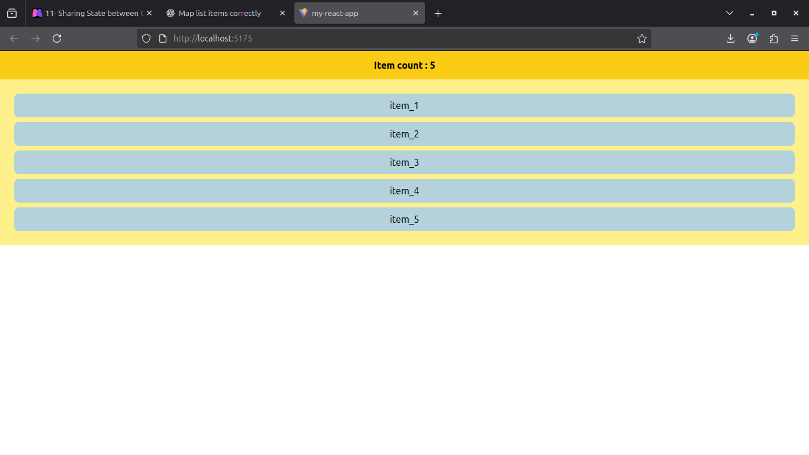

- **`App.tsx`** is the **parent** — it owns the `cartItems` state using `useState()`.
- That state (data) lives only in the parent — the **single source of truth**.
- Parent **shares** it with children via **props**:

  - `NavBar` gets `cartItemCount` (derived from `cartItems.length`).
  - `Cart` gets the full `cartItems` array.

- **Children can only read** what’s passed; they don’t hold the data themselves.
- If children ever need to **update** the same state, parent must pass down the **setter** (`setCartItems`) too.

🧩 **Concept:**
This is called **state lifting** — parent keeps the data, children just display or trigger updates through props.

**Extra : Add a button component to empty cart**

**Button.tsx**

```js
interface Props {
  emptyCart: () => void; // cleaner type than Function
}

export const Button = ({ emptyCart }: Props) => {
  return (
    <div>
      <button
        onClick={emptyCart}
        className="bg-blue-300 hover:bg-blue-400 p-2 m-2 rounded-lg font-extrabold"
      >
        Empty cart
      </button>
    </div>
  );
};
```

**App.tsx**

```js
// ...other code

<Button emptyCart={emptyCart} />
```

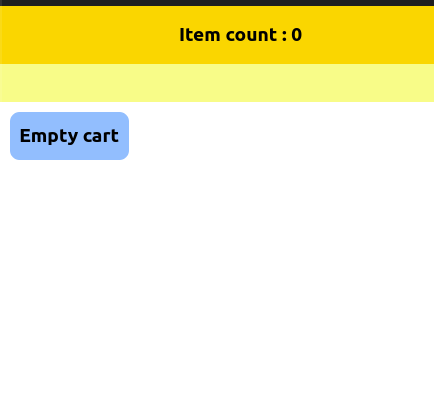

## Exercise : Building an `expandable text` component

**Code :** [https://github.com/mahmud-ops/Expandable_text](https://github.com/mahmud-ops/Expandable_text)

**Output :** [https://expandable-text-nu.vercel.app/](https://expandable-text-nu.vercel.app/)

**Component Goal:**
Toggle between showing a shortened and a full version of a long text — like a “Read more / Show less” feature.

**Logic Flow:**

- A prop called **expanded** decides the initial state.
- If **expanded** is true, text starts fully visible; otherwise, it starts shortened.
- The **useState** hooks track two things:

  - whether text is currently expanded (**isExpanded**)
  - how many characters to show (**currentMaxChar**)

**Click Behavior:**

- When the button is clicked, **isExpanded** flips between true and false.
- If collapsing, limit the text to **maxChar** (default 100).
- If expanding, set limit to **children.length** (the full text).

**Render Logic:**

- If **isExpanded** is true → show full text.
- If false → show sliced text up to **currentMaxChar**.
- The button text changes dynamically:

  - “Show less” when expanded
  - “...Show more” when collapsed

**Core Idea:**
Dynamic toggling + conditional slicing = controlled text preview.
Smooth user control over how much content is visible.

# Building forms

We’ll use **React Hook Form** to manage the form and **Zod** to validate the inputs.

## Building a basic form

Basic stuff...

```js
export const Form = () => {
  return (
    <>
      <div>
        <label htmlFor="name">Name</label>
        <input
          className="border border-black rounded-lg m-3 p-2"
          type="text"
          id="name"
        />
      </div>
      <div>
        <label htmlFor="age">Age</label>
        <input
          className="border border-black rounded-lg m-3 p-2"
          type="number"
          id="age"
        />
      </div>
      <button type="submit" className="bg-blue-400 rounded-lg p-2 m-2">
        Submit
      </button>
    </>
  );
};
```

**Adding functionality**

```js
function handleClick() {
  console.log("Submitted");
}
```

**Issue:**

Every time i press `submit`, The webpage reloads

When you click a **submit button** inside a `<form>`, the browser automatically triggers the form’s **default submission process**. This behavior comes from the original design of HTML — long before React or SPAs — where forms were used to send data directly to a server. If you don’t stop it, the browser assumes you want to submit the form, sends the data, and **reloads the page** to display the server’s response.

🔍 Breakdown:

- **HTML standard behavior:** Forms were built to send data via HTTP (GET or POST) to the URL in the `action` attribute.
- **If no `action` is provided:** The browser resubmits to the **current page’s URL**, causing a reload.
- **Type="submit":** Any button of this type automatically triggers that submit event.
- **React context:** React runs inside the browser, but the native HTML behavior still applies unless you block it.
- **Result:** Page refreshes before your JavaScript (`console.log`, state updates, etc.) can complete — unless you call `e.preventDefault()` to stop it.

```js
function handleClick(e: React.FormEvent) {
  e.preventDefault();
  console.log("Submitted");
}
```

Now it won’t reload, and the message will appear in the console.

## Accessing input fields

`useRef` in a form is mainly used to **directly access or control form elements** (like inputs) **without using state**.
Basically, instead of saving input data with `useState`, you grab it directly from the DOM.

**🧩 Example**

```jsx
import { useRef } from "react";

export const Form = () => {
  const nameRef = useRef(); // create ref

  function handleSubmit(e) {
    e.preventDefault();
    console.log(nameRef.current.value); // get input value
    nameRef.current.value = ""; // reset input
  }

  return (
    <form onSubmit={handleSubmit}>
      <label htmlFor="name">Name:</label>
      <input
        id="name"
        type="text"
        ref={nameRef} // connect ref to input
        className="border p-2 rounded"
      />
      <button className="bg-blue-500 text-white p-2 rounded">Submit</button>
    </form>
  );
};
```

**⚙️ What’s Happening**

- `useRef()` → creates a reference object `{ current: null }`.
- `<input ref={nameRef}>` → React attaches the actual DOM input element to `nameRef.current`.
- When you submit, you can **read or modify** it directly using `nameRef.current.value`.

**⚡ When to Use It**

- For **simple, uncontrolled forms** (you don’t need re-renders on every keystroke).
- When you just need the value **once** — like on submit.
- For **focus control** or auto-scroll:

```js
nameRef.current.focus();
```

---

> `useRef()` **returns a reference object**

---

```js
import { useRef } from "react";

// step 3:
export const Form = () => {
  function handleClick(e: React.FormEvent) {
    e.preventDefault();
    if (nameRef.current != null) {
      console.log(nameRef.current);
    }
  }
  // step 1
  const nameRef = useRef(null); // Storing the reference object in the `nameRef` variable
  // intial value is generally taken `null`
  return (
    <form onSubmit={handleClick}>
      <div>
        <label htmlFor="name">Name</label>
        <input
          ref={nameRef} // step 2: store value from here.
          className="border border-black rounded-lg m-3 p-2"
          type="text"
          id="name"
        />
      </div>
      <div>
        <label htmlFor="age">Age</label>
        <input
          className="border border-black rounded-lg m-3 p-2"
          type="number"
          id="age"
        />
      </div>
      <button type="submit" className="bg-blue-400 rounded-lg p-2 m-2">
        Submit
      </button>
    </form>
  );
};
```

**Output**

This prints..

> <input id="name" class="border border-black rounded-lg m-3 p-2" type="text">

the whole element.. we need the value.

so, in step 3

```js
// step 3:
export const Form = () => {
  function handleClick(e: React.FormEvent){
    e.preventDefault();
    if(nameRef.current != null){
      console.log(nameRef.current.value); // .value
    }
  }
```

> Error: Property 'value' does not exist on type 'never'

When you do:

```ts
const nameRef = useRef(null);
```

TypeScript sees **“null for now, I have no clue what this will be”**.

- Later you try `nameRef.current.value` → TS says **“I don’t know what `current` is, maybe it’s never, it might not have `.value`”** → error.

When you do:

```ts
const nameRef = useRef<HTMLInputElement | null>(null);
```

You tell TS: **“`current` will be an HTML input element (or null)”**.
Now TS knows `.value` exists on it.

**TL;DR:** TypeScript needs to know what kind of thing your ref will point to; otherwise it freaks out when you access properties like `.value`.

If you want, I can draw a **tiny diagram** to make it crystal clear.

so, we have to add `<HTMLInputElement | null>`.

```js
// step 1
const nameRef = (useRef < HTMLInputElement) | (null > null); // Storing the reference object in the `nameRef` variable
// intial value is generally taken `null`
```

Now. it'll log the output properly

**Final code**

```js
import { useRef } from "react";

// step 3:
export const Form = () => {
  // step 1
  const nameRef = (useRef < HTMLInputElement) | (null > null);
  // Storing the reference object in the `nameRef` variable
  // intial value is generally taken `null`

  function handleClick(e: React.FormEvent) {
    e.preventDefault();
    if (nameRef.current != null) {
      console.log(nameRef.current.value);
    }
  }

  return (
    <form onSubmit={handleClick}>
      <div>
        <label htmlFor="name">Name</label>
        <input
          ref={nameRef} // step 2: store value from here.
          className="border border-black rounded-lg m-3 p-2"
          type="text"
          id="name"
        />
      </div>
      <div>
        <label htmlFor="age">Age</label>
        <input
          className="border border-black rounded-lg m-3 p-2"
          type="number"
          id="age"
        />
      </div>
      <button type="submit" className="bg-blue-400 rounded-lg p-2 m-2">
        Submit
      </button>
    </form>
  );
};
```

Now let's do the same for age

```js
import { useRef } from "react";

// step 3:
export const Form = () => {
  function handleClick(e: React.FormEvent) {
    e.preventDefault();

    if (nameRef.current != null) {
      console.log(nameRef.current.value);
    }

    if (ageRef.current != null) {
      console.log(ageRef.current.value);
    }
  }
  // step 1
  const nameRef = (useRef < HTMLInputElement) | (null > null); // Storing the reference object in the `nameRef` variable
  const ageRef = (useRef < HTMLInputElement) | (null > null);

  return (
    <form onSubmit={handleClick}>
      <div>
        <label htmlFor="name">Name</label>
        <input
          ref={nameRef} // step 2: store value from here.
          className="border border-black rounded-lg m-3 p-2"
          type="text"
          id="name"
        />
      </div>
      <div>
        <label htmlFor="age">Age</label>
        <input
          ref={ageRef}
          className="border border-black rounded-lg m-3 p-2"
          type="number"
          id="age"
        />
      </div>
      <button type="submit" className="bg-blue-400 rounded-lg p-2 m-2">
        Submit
      </button>
    </form>
  );
};
```

> Mahmud
> 21

## Now, Return an object instead of raw value

Previously we printed value.. Let's return it as an object

```js
const person = {
  name: nameRef.current?.value,
  age: ageRef.current?.value,
};
```

```js
import { useRef } from "react";

export const Form = () => {
  const nameRef = (useRef < HTMLInputElement) | (null > null); // Storing the reference object in the `nameRef` variable
  const ageRef = (useRef < HTMLInputElement) | (null > null);

  function handleClick(e: React.FormEvent) {
    e.preventDefault();

    // Made a person object and put the ref value in it
    const person = {
      name: nameRef.current?.value,
      age: ageRef.current?.value,
    };

    if (nameRef.current != null && ageRef.current != null) {
      console.log(person);
    }
  }

  return (
    <form onSubmit={handleClick}>
      <div>
        <label htmlFor="name">Name</label>
        <input
          ref={nameRef} // step 2: store value from here.
          className="border border-black rounded-lg m-3 p-2"
          type="text"
          id="name"
        />
      </div>
      <div>
        <label htmlFor="age">Age</label>
        <input
          ref={ageRef}
          className="border border-black rounded-lg m-3 p-2"
          type="number"
          id="age"
        />
      </div>
      <button type="submit" className="bg-blue-400 rounded-lg p-2 m-2">
        Submit
      </button>
    </form>
  );
};
```

**Output**

```js
Object { name: "sdf", age: "2" }
```

> **Caution:** write the object creation inside the click handler function so it reads the current values.

## Managing forms with react hook form

Using traditional React hooks like `useState` and `useRef` for forms means manually handling every value, validation, and error — which gets messy fast as the form grows. React Hook Form simplifies this by managing all of that internally using refs under the hood, giving you cleaner code, faster performance, and built-in validation without extra state juggling.

**Key differences:**

- `useState` re-renders on every keystroke → slower in large forms
- `useRef` skips re-renders but gives no validation or error tracking
- `react-hook-form` combines both: ref-level speed + smart state handling
- Built-in validation, schema (Zod/Yup) support, and cleaner syntax
- Less boilerplate, easier integration with UI libraries, and fewer bugs

**First install `react-hook-form`**

```sh
npm i react-hook-form@latest
```

**Then**

```js
import { useForm } from "react-hook-form";
```

`useForm()` is the main hook from react-hook-form, and it returns an **object** packed with _tools to manage your entire form_ , from input registration to validation and submission.

**Let's log the object**

```js
import { useForm } from "react-hook-form";

export const Form = () => {
  const form = useForm();

  function handleClick(e: React.FormEvent) {
    e.preventDefault();
    console.log(form); // log
  }

  return <form onSubmit={handleClick}>// ... code ...</form>;
};
```

**log**

```js
Object { control: {…}, subscribe: subscribe(props2), trigger: async trigger(name, options), register: register(name, options), handleSubmit: handleSubmit(onValid, onInvalid), watch: watch(name, defaultValue), setValue: setValue(name, value, options), getValues: getValues(fieldNames, config), reset: reset(formValues, keepStateOptions), resetField: resetField(name, options)
, … }
​
clearErrors: function clearErrors(name)​
control: Object { register: register(name, options), unregister: unregister(name, options), getFieldState: getFieldState(name, formState)
, … }
​
formState: Object { defaultValues: Getter, … }
​
getFieldState: function getFieldState(name, formState)​
getValues: function getValues(fieldNames, config)​
handleSubmit: function handleSubmit(onValid, onInvalid)​
register: function register(name, options)​
reset: function reset(formValues, keepStateOptions)​
resetField: function resetField(name, options)​
setError: function setError(name, error, options)​
setFocus: function setFocus(name, options)​
setValue: function setValue(name, value, options)​
subscribe: function subscribe(props2)​
trigger: async function trigger(name, options)​
unregister: function unregister(name, options)​
watch: function watch(name, defaultValue)​
<prototype>: Object { … }
```

We can see , there's multiple functions...

Let's use these (destructure em)

```js
register: function register(name, options)​
handleSubmit: function handleSubmit(onValid, onInvalid)​
```

```js
const { register } = useForm(); // destructuring assignment

function handleClick(e: React.FormEvent) {
  e.preventDefault();
  console.log(register("name"));
}
```

**Log**

```js
Object { name: "name", onChange: async onChange(event), onBlur: async onChange(event), ref: ref(ref)
 }
​
name: "name"
​
onBlur: async function onChange(event)​
onChange: async function onChange(event)​
ref: function ref(ref)
```

Now, we don't need these anymore:

- `handleClick` function
- `useState` hook
- `useRef` hook

We just have to

- call `useForm()` → it gives a form object that manages state internally
- destructure `{ register, handleSubmit }` from that object
- use `{...register("name")}` and `{...register("age")}` to link inputs to the form
- wrap the submit function with `handleSubmit((data) => console.log(data))`

**Why wrap it:**
`handleSubmit` takes your callback and only runs it **after** form validation + data collection.
Without it, `console.log(data)` wouldn’t have access to the gathered input values — React Hook Form wouldn’t know when to collect or verify them.
So `handleSubmit` basically acts as the form’s **controller**, executing your function only when the form is valid.

**Final code**

```js
import { useForm } from "react-hook-form";

export const Form = () => {
  // Step 1: call useForm() → gives form object to manage state automatically
  const { register, handleSubmit } = useForm(); // destructure register & handleSubmit

  return (
    <form
      // Step 3: wrap submit callback with handleSubmit → gathers data + validates before running
      onSubmit={handleSubmit((data) => console.log(data))}
      className="flex flex-col items-start m-5 p-5 border border-black rounded-lg"
    >
      <div>
        <label htmlFor="name">Name</label>
        <input
          // Step 2: link input to form state using register
          {...register("name")}
          className="border border-black rounded-lg m-3 p-2"
          type="text"
          id="name"
        />
      </div>
      <div>
        <label htmlFor="age">Age</label>
        <input
          // Step 2: link input to form state using register
          {...register("age")}
          className="border border-black rounded-lg m-3 p-2"
          type="number"
          id="age"
        />
      </div>
      <button type="submit" className="bg-blue-400 rounded-lg p-2 m-2">
        Submit
      </button>
    </form>
  );
};
```

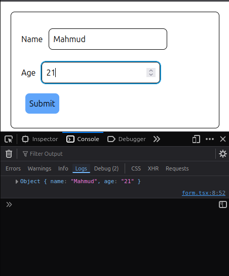

## Applying validation

Suppose , the user enters a name, the name must be `3 characters long`

This is where data validation comes in...

We're gonna use `formState` for it..

```js
formState: Object { defaultValues: Getter, … }
```

`formState` is also an object in `useForm` that returns another object of differnt functions

```js
const { register, handleSubmit, formState } = useForm(); // destructuring assignment
```

Let's log this object..

```js
const { register, handleSubmit, formState } = useForm(); // destructuring assignment
console.log(formState);
```

**Log**

```js
Object { defaultValues: Getter, … }
​defaultValues: ​
dirtyFields:
​disabled:
errors:
isDirty:
isLoading:
isReady:
isSubmitSuccessful:
isSubmitted:
isSubmitting:
isValid:
isValidating:
submitCount:
touchedFields:
validatingFields:
```

💡 Basically, this object gives you everything about the state of your form—like whether a field has changed, has errors, or is being submitted—so you can react to it in your UI.

**Use em like this**

```js
{...register("name",{/*validation rules*/})}
```

> Here, you connect your input field to React Hook Form. `"name"` is the **name of your field**, and inside `{}` you put your **validation rules** like required, minLength, pattern, etc. The `...` spreads all the props (`onChange`, `onBlur`, `ref`) so the form can track it automatically.

```js
<input
  {...register("name", { required: true, minLength: 3 })} // validation rules
  type="text"
  id="name"
/>
```

Let's enter nothing and submit..

**Log**

```js
Object { name: {…} }
​
name: Object { type: "required", message: "", ref: input#name.border.border-black.rounded-lg.m-3.p-2
 }
```

Let's enter 1 character

**Log**

```js
Object { name: {…} }
​
name: Object { type: "minLength", message: "", ref: input#name.border.border-black.rounded-lg.m-3.p-2
 }
​
```

So, name is required and it must be atleast 3 char long...

Now, let's add some messege on the UI

```js
<input
  {...register("name", { required: true, minLength: 3 })}
  className="border border-black rounded-lg m-3 p-2"
  type="text"
  id="name"
/>;
{
  // gotta implement conditional rendering.. here we need to access the "errors" object from formState
  <p className="text-red-500 font-mono">Name is required</p>;
}
```

```js
formState.errors <p className="text-red-500 font-mono">Name is required</p>
```

This will lead to an error..

We have to destructure the `formState` and grab the `erros` property in a method called nested destructuring first.

```js
const {
  register,
  handleSubmit,
  formState: { errors },
} = useForm(); // nested destructuring
```

**Final snippet**

```js
<div>
  <label htmlFor="name">Name</label>
  <input
    {...register("name", { required: true, minLength: 3 })}
    className="border border-black rounded-lg m-3 p-2"
    type="text"
    id="name"
  />

  {
    // conditional rendering
    errors.name?.type == "required" ? (
      <p className="text-red-500 font-mono">Name is required</p>
    ) : null
  }
  {
    // conditional rendering
    errors.name?.type == "minLength" && (
      <p className="text-red-500 font-mono">
        Name must be atleast 3 characters long
      </p>
    )
  }
</div>
```

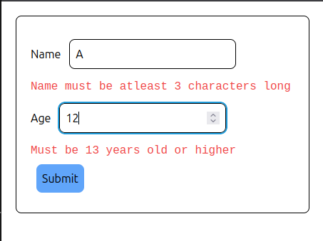

**A short recap**

Both patterns are used for conditional rendering:

```jsx
condition ? <IfTrue /> : null;
```

and

```jsx
condition && <IfTrue />;
```

They’re mostly equivalent when you **only want to render something if the condition is true**.

### **Refining code**

When we do this...

```js
errors.name?.type == "required" ? (
  <p className="text-red-500 font-mono">Name is required</p>
) : null;
```

the `.name?` doesn't appear in the auto completion box (or intellisense) , to make it appear we can make a custom interface and define the types.

like this

```js
import { useForm } from "react-hook-form";

interface FormData{ // interface
  name: string
  age: number
}

export const Form = () => {

  const {register,handleSubmit,formState:{errors}} = useForm<FormData>(); // passing the interface

// ... rest of the code

```

Now they appear.. 😁

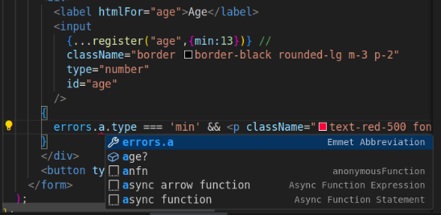

## Schema base validation with `zod`

> Zod allows you to **define and enforce schemas for your data**, keeping all validation rules in one place. Without Zod, rules are **scattered across your code**, requiring you to manually check each field with repetitive `if` statements, which is tedious and error-prone.

**[Official documentation](https://zod.dev/)**

```bash
npm install zod
```

```js
import { z } from "zod";
```

**Added validation rules inside a single object**

```js
import { useForm } from "react-hook-form";
import {z} from 'zod';

const schema = z.object({ // object
  name: z.string().min(3),
  age: z.number().min(13)
})

interface FormData{ // We can replace it with - type FormData = z.infer<typeof schema>`.

  name: string
  age: number
}

export const Form = () => {

// ... the rest
```

We can replace the manual interface with Zod’s inferred type:

- Use `z.infer<typeof schema>` to auto-generate the TypeScript type.
- Keeps type in sync with the schema—no manual updates needed.
- Reduces errors when schema changes.
- Cleaner and more maintainable code.

**Now when you hover on it, TypeScript will show the correct type automatically, based on the Zod schema.**

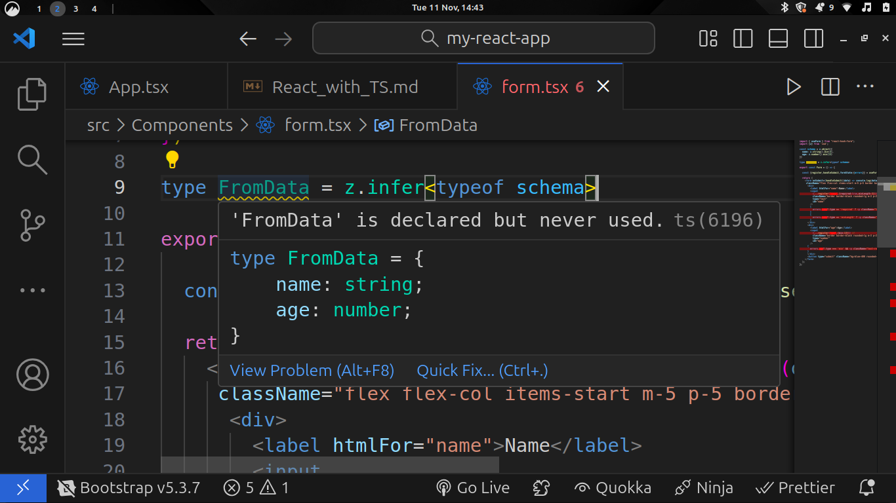

**Now,**

install..

```bash
npm i @hookform/resolvers
```

That’s a package that **connects Zod (or other schema libraries) with React Hook Form**.

Basically:

- React Hook Form handles form state and validation.
- Zod defines validation rules.
- `@hookform/resolvers` lets RHF understand Zod schemas directly.

**Final code after**

- adding resolver , schema type

```js
import { useForm } from "react-hook-form";
import { z } from "zod";
import { zodResolver } from "@hookform/resolvers/zod";

// schema with coercion for age
const schema = z.object({
  name: z.string().min(3, "Name must be at least 3 characters long"),
  age: z.coerce.number().min(13, "Must be 13 years old or higher"),
});

// TypeScript type inferred from schema
type InputData = z.input<typeof schema>;

export const Form = () => {
  const {
    register,
    handleSubmit,
    formState: { errors },
  } = useForm <
  InputData >
  {
    resolver: zodResolver(schema), // connect Zod with RHF (react-hook-form)
  };

  return (
    <form
      onSubmit={handleSubmit((data) => console.log(data))}
      className="flex flex-col items-start m-5 p-5 border border-black rounded-lg"
    >
      <div>
        <label htmlFor="name">Name</label>
        <input
          {...register("name")} // removed manual validation rules 😄
          className="border border-black rounded-lg m-3 p-2"
          type="text"
          id="name"
        />
        {errors.name && (
          <p className="text-red-500 font-mono">{errors.name.message}</p>
        )}
      </div>

      <div>
        <label htmlFor="age">Age</label>
        <input
          {...register("age")}
          type="number"
          className="border border-black rounded-lg m-3 p-2"
          id="age"
        />
        {errors.age && (
          <p className="text-red-500 font-mono">{errors.age.message}</p>
        )}
      </div>

      <button type="submit" className="bg-blue-400 rounded-lg p-2 m-2">
        Submit
      </button>
    </form>
  );
};
```

## Disabling the submit button

Include `isValid` property where `formState` is destructured.

```js

export const Form = () => {
  const {
    register,
    handleSubmit,
    formState: { errors, isValid }, // `isValid` returns a boolean value..
  } = useForm<InputData>({
    resolver: zodResolver(schema),
  });

```

**Button**

```js
<button
  disabled={!isValid} // here
  type="submit"
  className="bg-blue-400 rounded-lg p-2 m-2"
>
  Submit
</button>
```

**Done**

Now, the form **won’t submit unless a valid data is entered**.

**Final code**

```js
import { useForm } from "react-hook-form";
import { z } from "zod";
import { zodResolver } from "@hookform/resolvers/zod";

// schema with coercion for age
const schema = z.object({
  name: z.string().min(3, "Name must be at least 3 characters long"),
  age: z.coerce.number().min(13, "Must be 13 years old or higher"),
});

// TypeScript type inferred from schema
type InputData = z.input<typeof schema>;

export const Form = () => {
  const {
    register,
    handleSubmit,
    formState: { errors, isValid },
  } = useForm <
  InputData >
  {
    resolver: zodResolver(schema), // connect Zod with RHF
  };

  return (
    <form
      onSubmit={handleSubmit((data) => console.log(data))}
      className="flex flex-col items-start m-5 p-5 border border-black rounded-lg"
    >
      <div>
        <label htmlFor="name">Name</label>
        <input
          {...register("name")}
          className="border border-black rounded-lg m-3 p-2"
          type="text"
          id="name"
        />
        {errors.name && (
          <p className="text-red-500 font-mono">{errors.name.message}</p>
        )}
      </div>

      <div>
        <label htmlFor="age">Age</label>
        <input
          {...register("age")}
          type="number"
          className="border border-black rounded-lg m-3 p-2"
          id="age"
        />
        {errors.age && (
          <p className="text-red-500 font-mono">{errors.age.message}</p>
        )}
      </div>

      <button
        disabled={!isValid}
        type="submit"
        className="bg-blue-400 rounded-lg p-2 m-2"
      >
        Submit
      </button>
    </form>
  );
};
```

## Project: Expense tracker

**Source code:** [https://github.com/mahmud-ops/Expense_tracker](https://github.com/mahmud-ops/Expense_tracker)

**Live preview:** [https://expense-tracker-kohl-two-64.vercel.app/](https://expense-tracker-kohl-two-64.vercel.app/)

# Connecting with backend

## Understanding the `effect` hook

- **Purpose of Effect Hook**:

  - React components should be pure functions: no side effects and same output for same input.
  - Some operations (like accessing local storage, calling servers, or manipulating DOM) are side effects and don’t belong in the render phase.
  - `useEffect` allows running such code **after a component renders**, keeping the component “pure.”

- **Example: Focusing an Input Field**

  1. Use `useRef` to create a reference to the input element.
  2. Attach the ref to the input.
  3. Inside `useEffect`, check if the ref exists and call `.focus()`—this modifies the DOM, a side effect.

- **Key Points About `useEffect`**:

  - Runs after every render by default.
  - Can be used multiple times for different tasks (e.g., focusing input, changing document title).
  - Must be called at the **top level** of the component, not inside loops or conditionals.

- **Benefits**:

  - Separates side effects from render logic.
  - Lets React manage DOM updates and external interactions cleanly.

**What does "pure" mean here ?**

If your component is doing something “outside” React while rendering (DOM changes, API calls, timers, local storage), it’s impure. Wrap it in useEffect to keep your component pure.

A pure function is a function that:

Always returns the same output for the same input

```js
function add(a, b) {
  return a + b; // always same result for same a and b
}
```

Has no side effects (doesn’t change anything outside itself)

- Doesn’t modify global variables
- Doesn’t change the DOM
- Doesn’t call APIs or write to localStorage
- Example of impure function:

```js
let counter = 0;

function increment() {
  counter++; // changes something outside
  return counter;
}
```

Even if you call increment() multiple times, output changes because it modifies counter outside the function → impure.

**Pure React components**

A React component is considered pure if:

- For the same props and state, it always renders the same JSX
- Doesn’t directly manipulate DOM or do API calls during render

Impure things like focusing an input, changing the document title, or fetching data should happen after render, which is why we use useEffect.

```js
import { useRef } from "react";

const App = () => {
  const ref = useRef < HTMLInputElement > null;

  return <input ref={ref} type="text" className="border-2 w-[90%] m-3" />;
};

export default App;
```

**Explanation**

- `useRef` = a **pointer container object**.
- `ref.current` = the **actual pointer**.
- Initially: `ref.current = null` → points to nothing.
- After render: `ref.current` points to the **real `<input>` DOM object**.
- Updating or reading `ref.current` **doesn’t trigger a re-render**.
- In the code, the ref is attached but **not used yet**, so `ref.current` exists but isn’t accessed.

Basically: it’s a **way to hold a direct pointer to a DOM element**, like raw memory access in C/C++.

Now, adding this line in the code,

```js
if (ref.current) ref.current.focus();
```

This focuses on the input element.. this doesn't have anything to do with the actuall `App` componet, **It's a sideeffect**. We have to take it in a `useEffect` hook to make the `App` component pure.

```js
import { useEffect, useRef } from "react";

const App = () => {
  const ref = useRef < HTMLInputElement > null;

  // side effects : Doesn't have connection with the actual function.
  useEffect(() => {
    if (ref.current) ref.current.focus();
    // We can start writing in the input right after rendering.. It gets selected automatically.
  });

  useEffect(() => {
    document.title = "Effect hook";
  });

  return <input ref={ref} type="text" className="border-2 w-[90%] m-3" />;
};

export default App;
```

## Effect dependencies

`useEffect` is basically a **hook that acts like a function pointer you give to React**, telling it: “Hey, run this function after you finish drawing the component.”

- **Why we need it:** Some stuff can’t happen while the component is rendering, like fetching data from a server, updating the DOM manually, or timers. If you do it directly in the render, you’ll mess up the flow.

- **What it does:** Think of it like a **callback function** that React calls after the component has finished its render cycle.

- **How it works:**

  1. You pass a **function** to `useEffect`. React will call it after render.
  2. By default, it runs **every render**. If inside that function you update a state, it triggers another render → infinite loop.
  3. To control it, you pass a **dependencies array**:

     - Empty array `[]` → run only once, like `componentDidMount`.
     - `[stateOrProp]` → run only when this variable changes, like a **dirty flag**.

Basically, `useEffect` = **pointer to a post-render function** + **rules on when to re-call it**.

**Code: Create a new component and add initialise an empty array and then put some value in it after rendering (`useEffect`)**

```js
import { useEffect, useState } from "react";

const ProductList = () => {
  const [products, setProducts] = useState([]);

  setProducts(["Apple", "Mango", "Banana", "Pinapple"]);

  return (
    <>
      <ol>
        {products.map((product) => (
          <li>{product}</li>
        ))}
      </ol>
    </>
  );
};

export default ProductList;
```

This is supposed to put the new products in the array.. right ? 🙃.. **Not really.**

> Error: Type 'string' is not assignable to type 'never'.

TS sees your initial state `useState([])` as **empty array of nothing**, so it infers element type = `never`.
Then you shove strings in → TS: “Bro, that’s not _never_.”
Fix: tell it the type:

```js
const [products, setProducts] = useState<string[]>([]); // gotta set the type to `string` explicitly.
```

**Now, let's set the array after re-rendering.. (useEffect)**

```js
import { useEffect, useState } from "react";

const ProductList = () => {
  const [products, setProducts] = useState<string[]>([]);

  useEffect(() => {
    setProducts(["Apple", "Mango", "Banana", "Pinapple"]);
  })

  return (
    <>
      <ol>
        {products.map((product) => (
          <li>{product}</li>
        ))}
      </ol>
    </>
  );
};

export default ProductList;
```

> **My device is lagging now.. ☠**

Without `[]`, `useEffect` runs **after every render**.
Since it sets state → causes **another** render → infinite loop → lag.

```js
import { useEffect, useState } from "react";

const ProductList = () => {
  const [products, setProducts] = useState<string[]>([]);

  useEffect(() => {
    setProducts(["Apple", "Mango", "Banana", "Pinapple"]);
  },[/*We'll add more dependencies in here later on ...*/]) // forgot the Square bracket '[]'.

  return (
    <>
      <ol>
        {products.map((product,index) => (
          <li key={index}>{product}</li>
        ))}
      </ol>
    </>
  );
};

export default ProductList;
```

**Issue solved**

**New code: We're gonna use the dependecy section now.. `[]`**

```js
import { useEffect, useState } from "react";

const ProductList = () => {
  const categories: string[] = [
    "Clothing",
    "Electronics",
    "Foods",
    "Stationaries",
  ];
  const [selected, setSelected] = useState("");

  useEffect(() => {
    if (selected) console.log("Selected category: ", selected);
  }, [selected]);

  return (
    <>
      <select
        className="m-3 p-3"
        onChange={(event) => setSelected(event.target.value)}
      >
        {categories.map((item, index) => (
          <option value={item} key={index}>
            {item}
          </option>
        ))}
      </select>
    </>
  );
};

export default ProductList;
```

**Output**
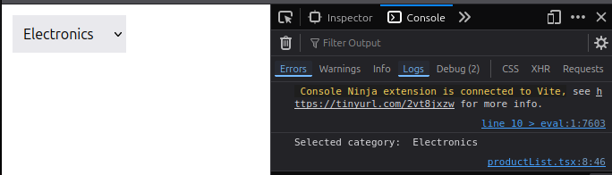

**Logged when the selected category changes**

```js
useEffect(() => {
  if (selected) console.log("Selected category: ", selected);
}, [selected /*Dependency*/]);
```

## Effect Clean up

Cleanup in `useEffect` exists so you don’t leave a bunch of “open tabs” in the background , like active subscriptions, event listeners, intervals, or server connections , after a component is removed or re-rendered. If you don’t clean those up, they keep running, leak memory, duplicate requests, or cause weird bugs. Cleanup is just you undoing whatever side effect you started, making sure your app doesn’t turn into a glitchy resource-eating monster.

> React’s version of destructors.

**Code**
```js
import { useEffect } from "react";

const connect = () => console.log("Connected");
const disconnect = () => console.log("Disconnected");

const App = () => {

  useEffect(() => {
    connect();
    return () => disconnect(); // clean up
  })


  return (
    <div>App</div>
  )
}

export default App
```

## Fetching data

React needs a way to pull data from servers. We can use the native `fetch()` API, but **Axios** is usually preferred because it auto-parses JSON, has cleaner syntax, and handles errors better. When we call a server, it’s not instant; that’s an async operation. So these functions return a promise: basically a placeholder for a future value. A promise has a `.then()` method that runs when the response arrives so we can use the returned data. To practice this without building our own backend, we can use JSONPlaceholder, a free fake API with endpoints like `/users`, `/posts`, and `/comments` that let us test real server interactions while learning.

1. Install axios

```
npm i axios
```

2. Get api key from **[jsonplaceholder](https://jsonplaceholder.typicode.com/)**

3. fetch api via axios
```js
import axios from "axios"
import { useEffect, useState } from "react"

const App = () => {

  useEffect(() => {
    axios.get('https://jsonplaceholder.typicode.com/users')
      .then(response => console.log(response.data[0].name /*Leanne Graham*/))
  },[]) 

  return (
    <div>App</div>
  )
}

export default App
```

**Doubt solve**

**`response`**

When Axios finishes talking to the server, it gives us an object with the result. We call that object `response`.

It looks roughly like:

```js
{
  data: [...],    // the actual JSON from the server
  status: 200,    // success code
  headers: {...}, // metadata
  ...
}
```

We name the parameter `response` so we can access all that stuff.
If we wrote `res` or `banana` instead, it would work the same — it’s just a variable name.

**`.then()`**

`axios.get()` doesn’t give results instantly. It returns a **Promise**.
`.then()` is how we *use the result later* when the promise is fulfilled.

Think of a promise like ordering food:

* You place the order → Axios sends request
* You wait → async
* Food arrives → Promise resolves
* `.then()` is the callback that runs when the food arrives

So this:

```js
.then(response => console.log(response.data[0]))
```

means:

> “When the server replies, take the response and log the first user.”

---

TL;DR:

* **response** = server’s reply object
* **then** = “run this code after the async data is ready”

**Creating an array of objects of the users**

```js
import axios from "axios"
import { useEffect, useState } from "react"

const App = () => {

  const [users,setUsers] = useState([]);

  useEffect(() => {
    axios.get('https://jsonplaceholder.typicode.com/users')
      .then(response => setUsers(response.data))
  },[])

  return (
    <div>
      <ul>
        {
          users.map(user => (
            <li key={user.name}>{user.id}. {user.name} ({user.username})</li>
          ))
        }
      </ul>
    </div>
  )
}

export default App
```

> **Error:** Property 'name/id/username' does not exist on type 'never'.

TypeScript is freaking out because `useState([])` gives it zero clues about what the array will contain, so it assumes the array holds `never`

We have to define an interface of **what a user object looks like** (its id, name, username, etc.) and tell TypeScript that our `users` state will store an array of those user objects, so it stops assuming the array is `never` and allows us to safely access those properties.

```js
import axios from "axios";
import { useEffect, useState } from "react";

interface User {
  name: string;
  id: number;
  email: string;
}

const styles = {
  table: "w-full border-collapse",
  th: "border-b border-gray-500 text-left p-2 bg-gray-800 text-white",
  td: "border-b border-gray-400 p-2",
  row: "hover:bg-gray-200 transition",
};

const App = () => {
  const [users, setUsers] = useState<User[]>([]);

  useEffect(() => {
    axios
      .get("https://jsonplaceholder.typicode.com/users")
      .then((response) => setUsers(response.data));
  }, []);

  return (
    <div className="p-6">
      <table className={styles.table}>
        <thead>
          <tr>
            <th className={styles.th}>ID</th>
            <th className={styles.th}>Name</th>
            <th className={styles.th}>Email</th>
          </tr>
        </thead>

        <tbody>
          {users.map((user) => (
            <tr key={user.id} className={styles.row}>
              <td className={styles.td}>{user.id}</td>
              <td className={styles.td}>{user.name}</td>
              <td className={styles.td}>{user.email}</td>
            </tr>
          ))}
        </tbody>
      </table>
    </div>
  );
};

export default App;
```

**Output**


## Understanding HTTP request

**HTTP Requests with Axios — Quick Notes**

Axios → sends **HTTP requests** to a server
HTTP → protocol for transferring data over the internet

When Axios `.get()` runs:

* Browser sends a **request** to server
* Server sends a **response** back
* Response includes **data** like JSON

HTTP message structure:

* **Headers** → metadata (URL, status code, content type, etc.)
* **Body** → actual data (e.g., array of objects)

DevTools Network tab shows:

* Request URL
* Request method (GET)
* Status code (200 = success)
* Response time + size
* Response data (formatted JSON)

Strict mode in React may trigger double requests (development only)

That’s basically what Axios does under the hood.


> Go to **Inspect > Network** to see the full HTTP request and response details — headers, status codes, payloads, and timing — so you know exactly what your Axios call is doing.

## Handling errors

`.catch()` method will catch the errors while fetching data from the api 

```js
useEffect(() => {
  axios
    .get("https://jsonplaceholder.typicode.com/users")
    .then((response) => setUsers(response.data))
    .catch((err) => console.log(err.message));
}, []);
```

**Rendering the error message**

```js
import axios from "axios";
import { useEffect, useState } from "react";

interface User {
  name: string;
  id: number;
  email: string;
}

const styles = {
  table: "w-full border-collapse",
  th: "border-b border-gray-500 text-left p-2 bg-gray-800 text-white",
  td: "border-b border-gray-400 p-2",
  row: "hover:bg-gray-200 transition",
};

const App = () => {
  const [users, setUsers] = useState<User[]>([]);
  const [error, setError] = useState("");

  useEffect(() => {
    axios
      .get("https://jsonplaceholder.typicode.com/users")
      .then((response) => setUsers(response.data))
      .catch((err) => setError(err.message));
  }, []);

  return (
    <div className="p-6">
      <table className={styles.table}>
        <thead>
          <tr>
            <th className={styles.th}>ID</th>
            <th className={styles.th}>Name</th>
            <th className={styles.th}>Email</th>
          </tr>
        </thead>

        {/* rendering error message */}
        {error && <p className="text-red-500 bg-red-200 p-3 m-4 rounded-lg text-center">{error}</p>}

        <tbody>
          {users.map((user) => (
            <tr key={user.id} className={styles.row}>
              <td className={styles.td}>{user.id}</td>
              <td className={styles.td}>{user.name}</td>
              <td className={styles.td}>{user.email}</td>
            </tr>
          ))}
        </tbody>
      </table>
    </div>
  );
};

export default App;
```

## Working with `async` and `await`

Now , we're gonna fetch data from an api with `async` and `await`..

Previously we saw this:
- The `get` method returns a promise
- Now, if this promise is resolved, we'll get a response object..

But , if something goes wrong
- we get an error.

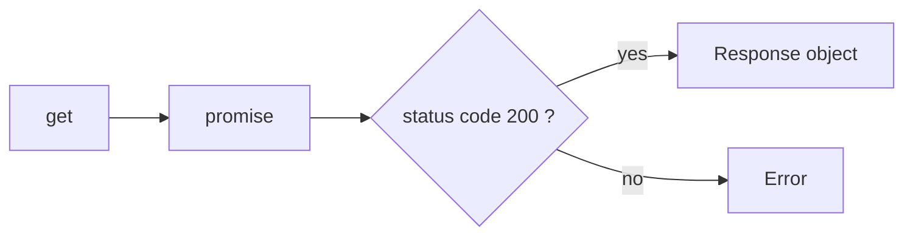

Async/await is basically just a cleaner, less-annoying way to handle promises. Instead of chaining `.then()` for success and `.catch()` for failure, you write code that *looks* synchronous — but under the hood it’s still promises doing the work. `await` literally pauses inside an `async` function until the promise settles. If it resolves, you get the value. If it rejects, the error gets thrown and you catch it like normal errors.

**Key differences**

* `.then()` → callbacks chain; messy if long sequences
* `await` → pauses execution inside `async`; code reads top-to-bottom like normal
* `.catch()` handles rejected promises
* `try/catch` handles rejections + any sync errors in async code
* Logic flow is easier to trace, especially with multiple async steps

If you’re dealing with more than one async call, async/await is just way less headache.

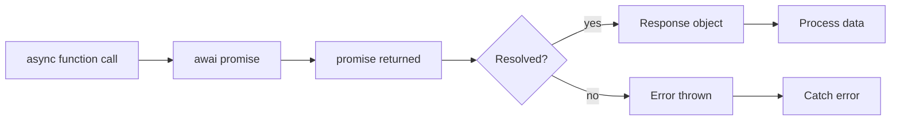

So, we can put the await keyword before the promise to get the result..

```js
useEffect(() => {
  const response = await axios
    .get("https://jsonplaceholder.typicode.com/users")
}, []);
```

> Error: 'await' expressions are only allowed within async functions and at the top levels of modules.

So, we put it in an `async` function

```js
// just turn it into...
const function_name = () => {
  // code..
}
```

**This**

```js
const function_name = async () => {
  const response_object = await promise;
}
```

**Code after correction**

```js
useEffect(() => {
  const getUserData = async () => {
    const response = await axios.get("https://jsonplaceholder.typicode.com/users");

    setUsers(response.data);
};

  getUserData();
}, []);
```
We can do **multiple awaits** in one async function.
That’s the whole flex of async/await — we can chain async steps *without* callback hell.

Example:

```js
useEffect(() => {
  const getUserData = async () => {
    const res1 = await axios.get("https://jsonplaceholder.typicode.com/users");
    const res2 = await axios.get("https://jsonplaceholder.typicode.com/posts");

    setUsers(res1.data);
    setPosts(res2.data);
  };

  getUserData();
}, []);
```

So the missing word is:

> **multiple `await` calls**

Each `await` will pause until its promise resolves or throws an error.
Cleaner than `.then().then().then()` chains — and your brain doesn’t melt reading it.

### Handling error

Put the whole thing in a `try-catch` method

```js
 useEffect(() => {
    const getUserData = async () => {


      try {
        const response = await axios.get(
          "https://jsonplaceholder.typicode.com/users"
        );
        setUsers(response.data);
      } 
      catch (error) {
        setError((error as AxiosError).message); /* import axios, { AxiosError } from "axios"*/
      }


    };

    getUserData();
  }, []);
```

`.then()`,`.catch` method seems cleaner.. 😑

## Cancelling a fetch request

Previously we learned [`effect cleanup`](./React_with_TS.md/#effect-clean-up)

We cancel a fetch request mainly to **avoid unnecessary work and potential bugs**. In React (or any frontend framework), this is super important because components can unmount while a request is still running. If the request finishes **after the component is gone**, and we try to update state, we get a **memory leak warning**.

Other reasons:

* **Performance:** No point keeping network traffic going if the result won’t be used.
* **Avoid race conditions:** If multiple requests happen in quick succession, an old request finishing later might overwrite newer data.
* **User experience:** Cancelling outdated requests can make wer app feel snappier.

In React, we often handle this with **AbortController** or by checking a `mounted` flag inside `useEffect`.

### Using AbortController

`AbortController` is an object.

It has two main properties/methods:

- signal → a property you pass to fetch (or axios) so the request knows it can be aborted.
- abort() → a method you call to actually cancel the request.

`AbortController` is a **built-in browser API** that lets you **cancel a fetch request** (or any other async task that supports it). Basically, you create a controller, pass its `signal` to the fetch, and then call `abort()` when you want to cancel it.

**Key points:**

* `controller.signal` → tells fetch which request can be aborted
* `controller.abort()` → stops the fetch
* Use it in `useEffect` cleanup to **prevent memory leaks**

```js
useEffect(() => {

      const controller = new AbortController();
        axios.get<User[]>("https://jsonplaceholder.typicode.com/users", { signal: controller.signal /* It links the fetch request to the controller so calling controller.abort() can cancel that request. */})
        .then(res => setUsers(res.data))
        .catch(err => setError(err.message));

        return () => controller.abort(); // cleanup
    },[]
  )
```
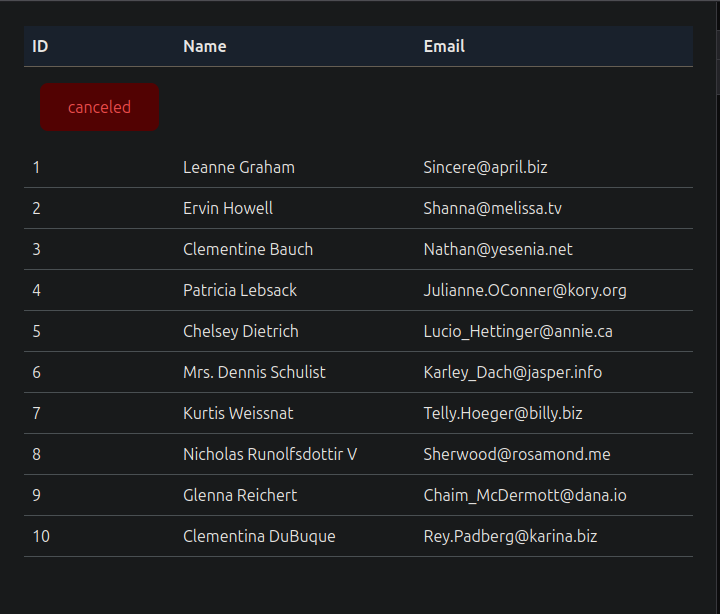

> What's that `Canceled` thing on top ?

It means the fetch request was intentionally stopped using `AbortController`...

Looks bad.. gotta remove it. Since that `Canceled` text is an error , we can remove it by tweaking the `.catch()` method.

```js
.catch(err => {
  if(err instanceof CanceledError) return;  
  else setError(err.message)
});
```

It basically says:

> “If the error is a canceled request, do nothing; otherwise, save the error message.”


Now, let's look at the networt tab (in devtools > XHR)

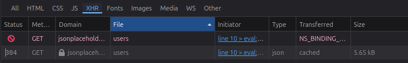

The request cancellation pattern **prevents memory leaks and race conditions** by stopping network calls when UI components unmount.

It also ensures **accurate error handling**, as genuine failures are displayed while expected cancellations are silently ignored.

## Showing a loading indicator..

We're gonna take a boolean value (ex: isLoading) and then render it if it's true... **SIMPLE**

```js
const [isLoading, setLoading] = useState(false);

  useEffect(() => {
    const controller = new AbortController();

    setLoading(true); // initially ... loading

    axios
      .get<User[]>("https://jsonplaceholder.typicode.com/users", {
        signal: controller.signal,
      })

      .then((res) => {
        setUsers(res.data);

        setLoading(false); // if fetched ... stop loading
      })
      .catch((err) => {
        if (err instanceof CanceledError) return;
        else setError(err.message);

        setLoading(false);
      });

    return () => controller.abort(); 
  }, []);

  return (
    <>
      // ... ... ... other code
        // rendering loading spinner
        {isLoading && (
          < Loader/> // imported component 
        )}
    </>
  )
```
## Deleting data

First we should add a delete button next to every data..

```js
{users.map((user) => (
  <tr key={user.id} className={styles.row}>
    <td className={styles.td}>{user.name}</td>
    <td><button onClick = {() => deleteUser()} className={styles.button}>Delete</button></td>
  </tr>
))}
```

Now, we gotta actually delete the data.. 
there's 2 ways to delete :
1. Optimistic update
2. Pessimistic update

| Feature                | **Optimistic Update**                                 | **Pessimistic Update**                              |
| ---------------------- | ----------------------------------------------------- | --------------------------------------------------- |
| **Default Assumption** | The server call *will succeed*                        | The server call *might fail*                        |
| **When UI Updates**    | **Immediately**, before server response               | **After** server response                           |
| **User Experience**    | Fast, snappy, feels instant                           | Slower, blocked until server replies                |
| **Risk**               | UI may show wrong state if server fails               | No mismatch — UI always correct                     |
| **Error Handling**     | Needs rollback (undo the optimistic change)           | Simple — UI updates only on success                 |
| **Use Case**           | Apps where speed matters (feeds, likes, todo updates) | Critical operations (payments, destructive actions) |
| **Complexity**         | Higher (maintain previous state, handle failures)     | Lower (straightforward flow)                        |
| **Network Dependence** | More tolerant (UI doesn’t wait)                       | Highly dependent on latency                         |

I prefer the optimistic update in this case...

```js
const originalUsers = [...users];
  
  const deleteUser = (user: User) => {
    setUsers(users.filter(u => u.id != user.id)); // Delete from UI

    // Delete from backend
    axios.delete("https://jsonplaceholder.typicode.com/users/" + user.id)
      
    // if error , show error message + rollback
    .catch( err => {
      setError(err.message);
      setUsers(originalUsers);
    })
}
```
## Creating data

Optimistic update...

```js
  const addUser = () => {
    const newUser = {id: 0, name: "Mahmud"};
    setUsers([newUser,...users]);

    axios.post('https://jsonplaceholder.typicode.com/users/',newUser)
      .then(response => setUsers([response.data,...users]))
      .catch(error => {
        setError(error.message);
        setUsers(originalUsers);
      });
    }
```

Now use this function to any button or wherever needed...

## Updating data

> use `axios.patch()`

## Extracting a Reusable API client

**What’s Being Improved**

* The app’s code had the same backend URL duplicated in multiple places.
* This is messy and hard to maintain.

**Solution: Create a Central API Client**

* A new `services` folder is created.
* Inside it, a file called `api-client.ts` is added.
* An Axios instance is created there using `axios.create()`.

**Base Configuration**

* The backend base URL is set once in the Axios config.
* Only the common part of the URL is used (not `/users`) so it stays reusable.
* Optional headers (like API keys) can be added if needed, but they’re removed here since not required.

**Cleaner Imports**

* Axios is removed from the App component.
* Instead, the custom `apiClient` is imported from `services/api-client`.

**Handling Cancelled Requests**

* `CanceledError` is imported inside `api-client.ts`.
* It is then exported and reused in the App component.

**Replacing Axios Everywhere**

* All old `axios.get`, `axios.post`, `axios.delete`, and `axios.patch` calls are replaced with:

  * `apiClient.get`
  * `apiClient.post`
  * `apiClient.delete`
  * `apiClient.patch`

**Final Benefit**

* No more repeated base URLs.
* Cleaner, more maintainable code.
* Any future backend call just uses the same API client.

**Services/api_client**

```js
import { CanceledError } from "axios";
import axios from "axios";

export default axios.create({
    baseURL: "https://jsonplaceholder.typicode.com"
})

export {CanceledError} 
```

**Replaced `axios(url)` with `apiClient`**
```js
apiClient
  .get<User[]>("/users", {
    signal: controller.signal,
  })


apiClient.post('/users/',newUser)
  .then(response => setUsers([response.data,...users]))
  .catch(error => {
    setError(error.message);
    setUsers(originalUsers);
  });
}

//... and other api calls
```

## Extracting the user services

**Problem with the Component**

* Handles too much: HTTP requests, endpoints, request methods, and canceling requests.
* Mixes responsibilities: should only handle UI and user interactions.

**Solution / What We’re Going to Do**

* Move all HTTP logic into a separate `UserService`.
* `UserService` will have methods for:

  * Getting all users
  * Creating a user
  * Updating a user
  * Deleting a user


* Hide implementation details like abort controllers; the 
component just calls the service.
* Component now only handles rendering UI, showing loading/errors, and interacting with users.

**Benefits**

* Cleaner, modular code.
* Better separation of concerns.
* HTTP logic is reusable across the app.

**Code part**

**File: Services/ user_services.ts**

```js

import apiClient from "./api_client"

class UserServices {
    // in this class there's gonna be methods for the CRUD (Create, Read, Update, and Delete) operations
}

export default new UserServices();
```

**We'll move some parts of the code in the userService file**

```js

interface User { // move
  name: string;
  id: number;
}
```

```js
apiClient.post('/users/',newUser)
  .then(response => setUsers([response.data,...users]))
  .catch(error => {
    setError(error.message);
    setUsers(originalUsers);
  });
}
```

```js
const controller = new AbortController(); // move

setLoading(true); 

apiClient
  .get<User[]>("/users", { // move
    signal: controller.signal,
  })
```

**After replacement**
```js
useEffect(() => {
  setLoading(true); 

    const {request,cancel} = user_services.getAllUser();
    request
    .then((res) => {
      setUsers(res.data);

      setLoading(false); 
    })
    .catch((err) => {
      if (err instanceof CanceledError) return;
      else setError(err.message);

      setLoading(false);
    });

    return () => cancel();

}, []);
```

Now our effect hook knows nothing about making http requests.. it's seperately handled in the `Services/user_services.ts` file.


**Extracting the user service from this..**
```js
const deleteUser = (user: User) => {
  setUsers(users.filter(u => u.id != user.id)); 

  // Should be handled seperately
  apiClient.delete("/users/" + user.id)
    
    .catch( err => {
      setError(err.message);
      setUsers(originalUsers);
    })
}
```

**Replaced**

```js
//Service/user_services.ts
import apiClient from "./api_client"

export interface User { 
  name: string;
  id: number;
}

class UserServices {
    getAllUser(){
    const controller = new AbortController(); 
            
        const request = apiClient.get<User[]>("/users", { 
        signal: controller.signal,
      })

      return ({request,cancel: () => controller.abort()});
    }

    // handled here
    deleteUser(id:number){
          return apiClient.delete("/users/" + id)
    }

}

export default new UserServices();
```
```js
// App.tsx

const deleteUser = (user: User) => {
  setUsers(users.filter(u => u.id != user.id)); 

  // Handled seperately 
  user_services.deleteUser(user.id)
    .catch( err => {
      setError(err.message);
      setUsers(originalUsers);
    })
}
```

**Now this**
```js
const addUser = () => {
  const newUser = {id: 0, name: "Mahmud"};
  setUsers([newUser,...users]);

  apiClient.post('/users/',newUser)
    .then(response => setUsers([response.data,...users]))
    .catch(error => {
      setError(error.message);
      setUsers(originalUsers);
    });
}
```

```js
// Services/user_service.ts
addUser(newUser:String){
  return apiClient.post('/users/',newUser)
}

// App.tsx
const addUser = () => {
const newUser = {id: 0, name: "Mahmud"};
setUsers([newUser,...users]);

// Handled seperately
user_services.addUser(newUser.name)
  .then(response => setUsers([response.data,...users]))
  .catch(error => {
    setError(error.message);
    setUsers(originalUsers);
  });
}
```

All clear, now `App.tsx` doesn't care about **how HTTP requests are made, how controllers or signals work, or any API endpoint details—it just calls methods from the service and handles state/UI updates.**

**Final code after some cleanup**
```js

// App.tsx

import { CanceledError } from "axios";
import { useEffect, useState } from "react";
import Loader from "./Components/Loader";
import { styles } from "./Components/Style";
import user_services, {type User} from "../Services/user_services"


const App = () => {
  const [users, setUsers] = useState<User[]>([]);
  const [error, setError] = useState("");
  const [isLoading, setLoading] = useState(false);
  const originalUsers = [...users];
  
  const addUser = () => {
    const newUser = {id: 0, name: "Mahmud"};
    setUsers([newUser,...users]);

    // Handled seperately
    user_services.addUser(newUser.name)
      .then(response => setUsers([response.data,...users]))
      .catch(error => {
        setError(error.message);
        setUsers(originalUsers);
      });
    }

  const deleteUser = (user: User) => {
    setUsers(users.filter(u => u.id != user.id)); // Delete from UI

    // Delete from backend
    user_services.deleteUser(user.id)
      // if error , show error message + rollback
      .catch( err => {
        setError(err.message);
        setUsers(originalUsers);
      })
  }

  useEffect(() => {
    setLoading(true); 

      const {request,cancel} = user_services.getAllUser();
      request
      .then((res) => {
        setUsers(res.data);

        setLoading(false); 
      })
      .catch((err) => {
        if (err instanceof CanceledError) return;
        else setError(err.message);

        setLoading(false);
      });

      return () => cancel();

  }, []);

  return (
    <div className="p-6">
      <table className={styles.table}>
        
        {error && (
          <p className="text-red-500 bg-red-200 p-3 m-4 rounded-lg text-center">
            {error}
          </p>
        )}


        <div className="my-4 flex justify-center">
        {(
          isLoading &&
          < Loader/>
        )}
        </div>

        <div className="bg-yellow-200 w-fit p-5 rounded-lg">       
          <button onClick={() => addUser()} type="submit" className={styles.button_2}>Add</button>  
        </div>
        

        <tbody>
          {users.map((user) => (
            <tr key={user.id} className={styles.row}>
              <td className={styles.td}>{user.name}</td>
              <td><button onClick={() => deleteUser(user)} className={styles.button}>Delete</button></td>
            </tr>
          ))}
        </tbody>
      </table>
    </div>
  );
};

export default App;


// Services/user_services.ts

import apiClient from "./api_client"

export interface User { 
  name: string;
  id: number;
}

class UserServices {
    getAllUser(){
    const controller = new AbortController(); 
            
        const request = apiClient.get<User[]>("/users", { 
        signal: controller.signal,
      })

      return ({request,cancel: () => controller.abort()});
    }

    deleteUser(id:number){
          return apiClient.delete("/users/" + id)
    }

    addUser(newUser:String){
      return apiClient.post('/users/',newUser)
    }

}

export default new UserServices;
```

## Creating a generic HTTP service

In our current setup, `UserServices` is tightly coupled to the `User` type and the `/users` endpoint. Every time we need a service for a new entity, like posts or products, we end up duplicating almost identical CRUD methods (`getAllUser`, `addUser`, `deleteUser`), and even in `App.tsx`, we have to handle users specifically, passing `User` objects and hardcoding endpoints.

And that’s where the **generic HTTP service** comes in. It lets us write a **reusable, type-safe service** that works for any entity. The benefits are:

* **Single reusable class:** One service handles CRUD for any entity using a generic type parameter `T`.
* **Endpoint flexibility:** Pass the endpoint dynamically when creating an instance instead of hardcoding it.
* **Type safety:** TypeScript ensures the entities have required properties (like `id`) while keeping methods generic.
* **Cleaner components:** Components like `App.tsx` only handle UI logic without worrying about repeated CRUD boilerplate.
* **Easier maintenance:** Changes to HTTP logic only happen in one place, reducing errors and duplication.

This approach keeps the code DRY, scalable, and easy to extend to new entities.

1. Open file `Services/http_services.ts`
2. Copy the whole code from  `Services/user_services.ts` and paste it in `Services/http_services.ts`.

**Initial look (We're gonna turn it into generic http service)**

```js
import apiClient from "./api_client"

// we won't need this , cuz it's gonna be type independent.
export interface User { 
  name: string;
  id: number;
}

class UserServices {
    getAllUser(){
    const controller = new AbortController(); 
            
        const request = apiClient.get<User[]>("/users", { 
        signal: controller.signal,
      })

      return ({request,cancel: () => controller.abort()});
    }

    deleteUser(id:number){
          return apiClient.delete("/users/" + id)
    }

    addUser(newUser:String){
      return apiClient.post('/users/',newUser)
    }

}

export default new UserServices;
```
**Start**
```js
class UserServices<T> {
  // what does "T" mean ??
    getAllUser(){
    const controller = new AbortController(); 
            
        const request = apiClient.get<T[]>("/users", { 
        signal: controller.signal,
      })
    }

    // .... code
}
```

### Generic type parameter

`T` here is a **generic type parameter**. Think of it as a placeholder for whatever type of entity your service will handle.

In your `UserServices<T>` class:

```ts
class  <T> {
    getAllUser() {
        const request = apiClient.get<T[]>("/users");
    }
}
```

* `T` could be `User`, `Post`, `Product`, or any other type you define.
* When you **instantiate** the class, you specify the type:

```ts
const userService = new UserServices<User>();
const postService = new UserServices<Post>();
```

* Inside the class, `T[]` means “an array of whatever type `T` is.” So `apiClient.get<T[]>` tells TypeScript: “This request will return an array of `T` objects.”

Basically, `T` lets your service class **stay generic and reusable** without being tied to one specific type like `User`.


```js
import apiClient from "./api_client"


// We fixed the class to accept an endpoint
class HttpServices {
  endpoint: String;

  constructor (endpoint: String){ // same as c++ oop constructor
    this.endpoint = endpoint;
  }

  
    getAll<T> (){


      const controller = new AbortController(); 
      const request = apiClient.get<T[]>("/users", { 
        signal: controller.signal,
      })

      return ({request,cancel: () => controller.abort()});
    }

    deleteUser(id:number){
          return apiClient.delete("/users/" + id)
    }

    addUser(newUser:String){
      return apiClient.post('/users/',newUser)
    }

}

export default new HttpServices;
```

**We fixed the class to accept an endpoint when creating the service. Now, we have to replace all hardcoded URLs (`"/users"`) in the methods with `this.endpoint` so the class actually uses the endpoint we pass.**

**Replaced + Did some cleanup and modifications**

```js
import apiClient from "./api_client";

class HttpServices<T> {
  endpoint: string;

  constructor(endpoint: string) {
    this.endpoint = endpoint;
  }

  getAll() {
    const controller = new AbortController();
    const request = apiClient.get<T[]>(this.endpoint, { signal: controller.signal });
    return { request, cancel: () => controller.abort() };
  }
  
  add(entity: T) { // replaced params to make it generic . Not limited to one type
    return apiClient.post(this.endpoint, entity);
  }

  update(id: number | string, entity: T) { // replaced params to make it generic . Not limited to one type
    return apiClient.put(`${this.endpoint}/${id}`, entity);
  }

  delete(id: number | string) { // replaced params to make it generic . Not limited to one type
    return apiClient.delete(`${this.endpoint}/${id}`);
  }
}

export default HttpServices;
```

**We're done making a generic http service component, now we can use it anywhere we want.. #DRY**

**Let's use it on `user_services.ts`**

**`user_services.ts`**
```js
import apiClient from "./api_client"

export interface User { 
  name: string;
  id: number;
}

// we can delete all these now.. and replace em with our generic service
class UserServices {
    getAllUser(){
    const controller = new AbortController(); 
            
        const request = apiClient.get<User[]>("/users", { 
        signal: controller.signal,
      })

      return ({request,cancel: () => controller.abort()});
    }

    deleteUser(id:number){
          return apiClient.delete("/users/" + id)
    }

    addUser(newUser:String){
      return apiClient.post('/users/',newUser)
    }

}

export default new UserServices;
```

**user_services.ts**
```js

// clean 😎
import create from "./http_services"

export interface User { 
  name: string;
  id: number;
}

export default new create("/users");
```

Now, in `App.tsx` we have to replace all direct calls to `UserServices` methods (`getAllUser`, `addUser`, `deleteUser`) with calls to our new generic service instance (`getAll`, `add`, `delete`) from `create("/users")`.

**App.tsx**

```js
// replaced addUser with add
user_services.add(newUser.name)
  .then(response => setUsers([response.data,...users]))
  .catch(error => {
    setError(error.message);
    setUsers(originalUsers);
  });
}

// replaced deleteUser with delete
user_services.delete(user.id)
  .catch( err => {
    setError(err.message);
    setUsers(originalUsers);
  })

// ... and so on..
```

**Wait, now there's an error**

```js
useEffect(() => {
  setLoading(true); 

    const {request,cancel} = user_services.getAll();
    request
    .then((res) => {
      setUsers(res.data); // error here

      setLoading(false); 
    })
    .catch((err) => {
      if (err instanceof CanceledError) return;
      else setError(err.message);

      setLoading(false);
    });

    return () => cancel();

}, []);
```

> Argument of type 'unknown[]' is not assignable to parameter of type 'SetStateAction<User[]>'.
>  Type 'unknown[]' is not assignable to type 'User[]'.
>    Type 'unknown' is not assignable to type 'User'.ts(2345)


**Fix:** Whenever your service is *generic*, always tell it the type when calling it, e.g., <User>. Otherwise, TS defaults to unknown.

```js
const {request,cancel} = user_services.getAll<User>(); // always tell it the type when calling it (e.g. <User>)
request
.then((res) => {
  setUsers(res.data);
```

**All done**

## Creating a custom data fetching hook

What if tomorrow your app grows…
and suddenly **another component** needs the same users data?
A dropdown. A modal. A dashboard widget.

Now what?

You rewrite the same three states again: `data`, `error`, `loading`.
You write the same `useEffect`.
You wire the same API call.
Again. And again. And again.

At this point, copy-paste isn’t convenience — it’s a **maintenance crisis**. One small bug fix means updating logic in multiple places. Miss one, and boom… inconsistent behavior.

This is exactly where **custom hooks** step in.

A custom hook is just a **regular function** that bundles reusable logic. Instead of scattering the same state and side-effect code across components, we extract it once and reuse it everywhere. This keeps components clean, logic centralized, and the codebase actually DRY — not the pretend kind.

So far, our app works fine. But the moment we need the **same data-fetching logic in more than one component**, things start to get messy and repetitive. Custom hooks solve this by letting us move shared state and effects into a single, reusable abstraction.

Let’s fix the mess by extracting our user-fetching logic into a custom hook and reuse it wherever we need it.

1. Open a folder `src/hooks`
2. Inside hooks , let's open `useUsers.ts` (A custom hook, Every hook starts with `use` , that's why it's named like this)

**Now, In App.tsx**

```js
import { CanceledError } from "axios";
import { useEffect, useState } from "react";
import Loader from "./Components/Loader";
import { styles } from "./Components/Style";
import user_services, {type User} from "../Services/user_services"


const App = () => {

  // We can take all these and put em in useUsers.ts and use them as a hook.

  // from here 👇
  const [users, setUsers] = useState<User[]>([]);
  const [error, setError] = useState("");
  const [isLoading, setLoading] = useState(false);
  const originalUsers = [...users];
  
  const addUser = () => {
    const newUser = {id: 0, name: "Mahmud"};
    setUsers([newUser,...users]);

    user_services.add(newUser.name)
      .then(response => setUsers([response.data,...users]))
      .catch(error => {
        setError(error.message);
        setUsers(originalUsers);
      });
    }

// .... more code 

        setLoading(false); 
      })
      .catch((err) => {
        if (err instanceof CanceledError) return;
        else setError(err.message);

        setLoading(false);
      });

      return () => cancel();

  }, []);

// to here 👆
  return (
    <div className="p-6">

    
    //  ... ... .. code

export default App;
```

**useUsers.ts**
```js

// everything from App.tsx
import { useEffect, useState } from "react";
import type { User } from "../../Services/user_services";
import user_services from "../../Services/user_services";
import { CanceledError } from "axios";


const useUsers = () => {

    const [users, setUsers] = useState<User[]>([]);
    const [error, setError] = useState("");
    const [isLoading, setLoading] = useState(false);
    const originalUsers = [...users];
  
  const addUser = () => {
    const newUser = {id: 0, name: "Mahmud"};
    setUsers([newUser,...users]);

    user_services.add(newUser.name)
      .then(response => setUsers([response.data,...users]))
      .catch(error => {
        setError(error.message);
        setUsers(originalUsers);
      });
    }

  const deleteUser = (user: User) => {
    setUsers(users.filter(u => u.id != user.id)); // Delete from UI

    // Delete from backend
    user_services.delete(user.id)
      // if error , show error message + rollback
      .catch( err => {
        setError(err.message);
        setUsers(originalUsers);
      })
  }

  useEffect(() => {
    setLoading(true); 

      const {request,cancel} = user_services.getAll<User>();
      request
      .then((res) => {
        setUsers(res.data);

        setLoading(false); 
      })
      .catch((err) => {
        if (err instanceof CanceledError) return;
        else setError(err.message);

        setLoading(false);
      });

      return () => cancel();

  }, []);


  return {users, error, isLoading, setUsers, setError, addUser, deleteUser} 
  // return all the methods from here
}

export default useUsers;
```

Now, we can use this hook in `App.tsx`

**App.tsx**

```js
import Loader from "./Components/Loader";
import { styles } from "./Components/Style";
import useUsers from "./hooks/useUsers";


const App = () => {
 
  // Everything replaced with a single hook 😎
  const{users, error, isLoading, addUser, deleteUser} = useUsers(); 

  return (
    <div className="p-6">
      <table className={styles.table}>
        
        {error && (
          <p className="text-red-500 bg-red-200 p-3 m-4 rounded-lg text-center">
            {error}
          </p>
        )}


        <div className="my-4 flex justify-center">
        {(
          isLoading &&
          < Loader/>
        )}
        </div>

        <div className="bg-yellow-200 w-fit p-5 rounded-lg">       
          <button onClick={() => addUser()} type="submit" className={styles.button_2}>Add</button>  
        </div>
        

        <tbody>
          {users.map((user) => (
            <tr key={user.id} className={styles.row}>
              <td className={styles.td}>{user.name}</td>
              <td><button onClick={() => deleteUser(user)} className={styles.button}>Delete</button></td>
            </tr>
          ))}
        </tbody>
      </table>
    </div>
  );
};

export default App;
```

## Summary

**Terms**

* Axios → HTTP client
* Front-end → Sends HTTP requests
* Back-end → Handles HTTP requests & sends responses
* Effect Hook → Used for side effects
* HTTP Response → Data returned from the server
* Side Effects → Operations outside rendering (data fetch, DOM update, etc.)

**Summary**

* We use the effect hook to perform side effects, such as fetching data or updating the DOM.
* The effect hook takes a function that performs the side effect and an optional dependency array. Whenever the dependencies change, the effect hook runs again.
* To clean up resources created by the effect hook, we can return a cleanup function that runs when the component unmounts or when dependencies change.
* React is a front-end library, but real applications also require a back-end server to handle business logic, data storage, and other functionality.
* Communication between the front-end and back-end happens over HTTP. The front-end sends an HTTP request, and the back-end responds with an HTTP response.
* Each HTTP request and response includes a header and a body. The header contains metadata (content type, status code, etc.), while the body carries the actual data.

# Project : Game hub 

## Project Overview: Video Game Discovery App

In this hands-on project, you will consolidate everything you’ve learned by building a professional video game discovery application inspired by the popular **RAWG platform**. Rather than focusing on heavy upfront design, this module adopts a pragmatic, "code-first" approach where you will build features incrementally and refactor as you go. This iterative process is designed to mimic real-world development, giving you practical experience in creating a modern, responsive user interface with a focus on usability and clean code.

### Key Features & Learning Objectives

* **Theming:** Implement a toggle to switch seamlessly between **Dark and Light modes**.
* **Search & Discovery:** Build a robust search bar and filtering system to find games by **genre or platform** (e.g., PC, PlayStation, Xbox).
* **User Experience:** Integrate **loading skeletons** to enhance perceived performance while data is being fetched.
* **Data Organization:** Add **sorting capabilities** to allow users to organize game lists based on specific criteria.
* **Refactoring:** Learn to improve your implementation and structure through a continuous, evolutionary coding process.


**Github repo:** [https://github.com/mahmud-ops/GameHub](https://github.com/mahmud-ops/GameHub)

**Live:** [https://game-hub-three-zeta-86.vercel.app/](https://game-hub-three-zeta-86.vercel.app/)

# Next : Part 2

[Click here](./React_with_TS_2.md) to proceed

**This part of the course levels up your React + TypeScript skills by moving beyond basics into real-world, production-grade patterns.** You’ll focus on performance, scalability, and structure while extending the GameHub project into something that actually feels like a professional web app—the kind you’d confidently put in a portfolio.

* **Intermediate React concepts**: data fetching, caching, and state management
* **Performance upgrades**: caching strategies and infinite scrolling
* **Routing & structure**: multi-page flow using React Router
* **Real project evolution**: extending the existing GameHub app
* **Outcome-focused**: build a robust, scalable app ready to showcase to employers or clients

