# React with typescript part 2 ( Intermediate topics )

> Precaution: Iam using chakra ui here

**This part of the course shifts from learning React to using React the way it’s used in real production apps.** Instead of isolated concepts, you’ll focus on how different pieces—data fetching, caching, state, and routing—work together to build something scalable and performant. The GameHub project is expanded step by step, turning it from a basic app into a polished, real-world application that reflects professional development practices.

- **Intermediate React + TypeScript workflows** focused on real app architecture
- **Data management & caching** to reduce unnecessary network calls and improve performance
- **Global state handling** for sharing data cleanly across components
- **Infinite scrolling** for loading content efficiently as users interact
- **Routing with React Router** to support multiple pages and deep linking
- **Game details page** to demonstrate structured navigation and data reuse
- **Portfolio-ready outcome** that showcases practical React skills, not just theory

# Fetching and updating data using `react query`

- React Query is used to manage **server state** in React applications
- It simplifies **data fetching, caching, syncing, and updating** from APIs
- Queries handle loading, error, and success states automatically
- Built-in caching and background refetching improve performance
- Supports **pagination and infinite scrolling** with cached pages
- Mutations handle **CRUD operations** and can use **optimistic updates**
- Custom hooks and services keep components clean and reusable
- Applied to the GameHub project to add caching, infinite scroll, and refactor the codebase
- Final outcome is a **faster, cleaner, and more scalable React application**

**Here we're fetching a list from an API ... but, there's some problem here**

```js
const TodoList = () => {
  const [todos, setTodos] = useState<Todo[]>([]);
  const [error, setError] = useState();

  useEffect(() => {
    axios
      .get("https://jsonplaceholder.typicode.com/todos")
      .then((res) => setTodos(res.data))
      .catch((err) => setError(err.message));
  }, []);

```

**Problems**

1. No request cancellation
2. No seperation of concerns
3. No retries
4. No automatic refresh / refetch
5. No `caching`

## Caching

- **Definition:** Caching is the process of storing data in a place where it can be accessed quickly in the future instead of fetching it from the original source every time.

- **Purpose:**

  - Reduces server requests
  - Speeds up data retrieval
  - Improves application performance
  - Enhances user experience

- **In React Applications:**

  - Frequently used data can be stored **on the client side**, inside the user's browser.
  - Example: User profile info, recent search results, or product listings can be cached so they don’t need to be fetched from the server every time the page loads.

- **How it works (example scenario):**

  1. User opens a dashboard. React fetches user data from the server.
  2. Data is stored in the browser cache (e.g., `localStorage`, `sessionStorage`, or in-memory cache).
  3. Next time the user visits, React checks the cache first.
  4. If data exists in the cache, it’s loaded instantly without calling the server.

- **Benefits:**

  - Faster page loads
  - Less network traffic
  - Reduced server load
  - Smooth and responsive user experience

- **Things to keep in mind:**

  - Cached data can get outdated (stale), so sometimes it needs to be refreshed.
  - Not all data should be cached, especially sensitive or frequently changing data.

## Setting up react query

**Doc:** [https://tanstack.com/query/v4/docs/framework/react/installation](https://tanstack.com/query/v4/docs/framework/react/installation)

1. Install react-query
2. `main.tsx`

```js
import { StrictMode } from "react";
import { createRoot } from "react-dom/client";
import { ChakraProvider } from "@chakra-ui/react";
import "./index.css";
import App from "./App.tsx";

import { QueryClient, QueryClientProvider } from "@tanstack/react-query"; /* New import */

const queryClient = new QueryClient(); /* New */

createRoot(document.getElementById("root")!).render(
  <StrictMode>
    <ChakraProvider>
      <QueryClientProvider client={queryClient}> /* New */
        <App />
      </QueryClientProvider>
    </ChakraProvider>
  </StrictMode>
);
```

## Fetching data

**Problems (without React Query)**

- **No request cancellation**
  If a component unmounts or the user navigates away, the API request may still run in the background, wasting resources and possibly causing errors.

- **No separation of concerns**
  Data fetching logic, loading states, error handling, and UI code get mixed together, making components messy and harder to maintain.

- **No retries**
  If a request fails due to a temporary network issue, it fails immediately with no automatic retry mechanism.

- **No automatic refresh / refetch**
  Data does not update automatically when the user revisits a page, switches tabs, or when data becomes stale. You have to manually handle refetching.

- **No caching**
  The same data is fetched again and again, even if it hasn’t changed, leading to unnecessary API calls and slower performance.

➡️ **All of these problems can be solved by React Query**, which handles data fetching, caching, retries, background refetching, and request management out of the box.

```js
const TodoList = () => {
  // You don’t have to memorize anything - everything comes from the React Query documentation.
  // converted to async function

  const fetchTodos = async () => {
    const res = await axios.get<Todo[]>(
      "https://jsonplaceholder.typicode.com/todos"
    );
    return res.data;
  };

  const { data } = useQuery({
    queryKey: ["todos"],
    queryFn: fetchTodos,
  });
```

**New version (with React Query)**

- **No request cancellation issues**
  React Query automatically cancels in-flight requests when components unmount or when a new request replaces the old one.

- **Clear separation of concerns**
  Data fetching, caching, loading, and error states are handled by React Query, keeping the component focused only on rendering UI.

- **Automatic retries**
  Failed requests are retried automatically (configurable), so temporary network issues don’t instantly break the UI.

- **Automatic refresh / refetch**
  Data can refetch on window focus, reconnect, or after a certain time without manual `useEffect` logic.

- **Built-in caching**
  Fetched data is cached and reused, preventing unnecessary API calls and making the app faster.

➡️ **Result:** No `useEffect`, no manual `useState`, less boilerplate, cleaner code, and better performance out of the box.

## Error handling

```js
const { data: todos, error } = useQuery({
  queryKey: ["todos"],
  queryFn: fetchTodos,
});

if (error) return <Text>{error}</Text>; // error
```

**Error**

> Type '{}' is not assignable to type 'ReactNode'.

- error from `useQuery` is typed as unknown by default in v4.

- You can’t just render unknown in JSX. TypeScript doesn’t know it’s a string.

**Fix**

```js
const { data: todos, error } = useQuery({
  queryKey: ["todos"],
  queryFn: fetchTodos,
});

if (error instanceof Error) return <Text>{error.message}</Text>; // fix
```

**Or, declare type while calling `useQuery`**

```js
  const { data: todos, error } = useQuery<Todo[],Error>({ // fix
    queryKey: ["todos"],
    queryFn: fetchTodos,
  });

  if (error) return <Text>{error.message}</Text>;
```

## Showing a loading indicator

```js
const { data: todos, error, isLoading } = useQuery<Todo[],Error>({
  queryKey: ["todos"],
  queryFn: fetchTodos,
});

if (isLoading) return <Text>Loading...</Text>
```

**There's still a problem left : Seperation of concerns**

our quering logic is still being handled in the `TodoList` component.. It should be handled seperately in hook (ex: `useTodos.ts`)

`Hooks/useTodos.ts`

**Cut-pasted and made some minimal changes from `TodoList.tsx`**

```js
import { useQuery } from "@tanstack/react-query";
import axios from "axios";

interface Todo {
  id: number;
  title: string;
  completed: boolean;
}

const useTodos = () => {
  const fetchTodos = () =>
    axios
      .get<Todo[]>("https://jsonplaceholder.typicode.com/todos")
      .then((res) => res.data);

  return useQuery<Todo[], Error>({
    queryKey: ["todos"],
    queryFn: fetchTodos,
  });
};

export default useTodos;
```

`TodoList.tsx`

```js
import { Badge, Flex, ListItem, OrderedList, Text } from "@chakra-ui/react";
import useTodos from "../Hooks/useTodos";

const TodoList = () => {
  const { data: todos, error, isLoading } = useTodos();
  // ....
};
```

## React query devtools

**Doc:** [https://tanstack.com/query/v4/docs/framework/react/devtools](https://tanstack.com/query/v4/docs/framework/react/devtools)

1. Install

```bash
npm i @tanstack/react-query-devtools@4
```

1. `main.tsx`

```js
import { StrictMode } from "react";
import { createRoot } from "react-dom/client";
import { ChakraProvider } from "@chakra-ui/react";
import { QueryClient, QueryClientProvider } from "@tanstack/react-query";
import { ReactQueryDevtools } from '@tanstack/react-query-devtools' // New

import "./index.css";
import App from "./App.tsx";

const queryClient = new QueryClient();

createRoot(document.getElementById("root")!).render(
  <StrictMode>
    <ChakraProvider>
      <QueryClientProvider client={queryClient}>
        <App />
        <ReactQueryDevtools /> // New
      </QueryClientProvider>
    </ChakraProvider>
  </StrictMode>
);
```

**Done**


## Customising query settings

**Doc:** [Stackoverflow](https://stackoverflow.com/questions/74203305/how-to-change-the-default-options-for-usequery-in-react-query)

`main.tsx`

```js
import { StrictMode } from "react";
import { createRoot } from "react-dom/client";
import { ChakraProvider } from "@chakra-ui/react";
import { QueryClient, QueryClientProvider } from "@tanstack/react-query";
import { ReactQueryDevtools } from '@tanstack/react-query-devtools'

import "./index.css";
import App from "./App.tsx";

// customisation

const queryClient = new QueryClient({
  defaultOptions: {
    queries: {
      retry: 3,              // Retries a failed request 3 times before throwing an error
      staleTime: 10 * 1000,  // Data stays fresh for 10 seconds (no refetch during this time)
      cacheTime: 300_0000,   // Cached data stays in memory for 50 minutes after becoming unused
    },
  },
});


createRoot(document.getElementById("root")!).render(
  <StrictMode>
    <ChakraProvider>
      <QueryClientProvider client={queryClient}>
        <App />
        <ReactQueryDevtools />
      </QueryClientProvider>
    </ChakraProvider>
  </StrictMode>
);
```

Here are the **common React Query `defaultOptions.queries`** with **one-line explanations** (note-style, clean):

- **staleTime**: How long data is considered fresh before it becomes stale and eligible for refetching.

- **cacheTime**: How long inactive (unused) cached data stays in memory before being garbage-collected.

- **retry**: Number of times a failed query is retried before throwing an error.

- **retryDelay**: Time to wait between retry attempts.

- **refetchOnWindowFocus**: Automatically refetches data when the browser window/tab regains focus.

- **refetchOnReconnect**: Refetches data when the network reconnects after being offline.

- **refetchOnMount**: Refetches data when a component mounts if the data is stale.

- **enabled**: Controls whether the query runs automatically or waits for a condition.

- **keepPreviousData**: Keeps old data while fetching new data to avoid UI flicker.

- **select**: Transforms or filters the fetched data before it reaches the component.

- **onSuccess**: Callback that runs when the query succeeds.

- **onError**: Callback that runs when the query fails.

- **onSettled**: Callback that runs when the query either succeeds or fails.

### React Query refetches data by default under **3 conditions**

- **On component mount**
  When a component using a query mounts and the cached data is **stale**, React Query refetches it.

- **On window focus**
  When the user switches back to the browser tab/window, React Query refetches stale data.

- **On network reconnect**
  When the device goes offline and then comes back online, React Query refetches stale data.

These defaults are what keep data **fresh without manual `useEffect` logic**.

We can also customize these behaviors in `queryOptions.queries` using options like `refetchOnMount`, `refetchOnWindowFocus`, and `refetchOnReconnect`.

---

We can customize these behaviors **per query**, instead of applying them globally from `main.tsx`.

Like this

`useTodos.ts`

```js
const useTodos = () => {
  const fetchTodos = () =>
    axios
      .get<Todo[]>("https://jsonplaceholder.typicode.com/todos")
      .then((res) => res.data);

  return useQuery<Todo[], Error>({
    queryKey: ["todos"],
    queryFn: fetchTodos,
    staleTime: 10_000 // custom stale time
  });
};
```

## **Exercise Problem**

There is a component that fetches posts from the backend (**JSONPlaceholder**) using **`useState`** and **`useEffect`**.

👉 Your task is to replace that logic by creating a **custom hook that fetches posts using React Query**, eliminating the need for manual state and effect hooks.

### Solution

`usePosts.ts`

```js
import { useQuery } from "@tanstack/react-query"
import axios from "axios"

interface Post {
    userId: number
    id: number
    title: string
    body: string
}

const usePosts = () => {

    const fetchPosts = () =>
        axios
    .get('https://jsonplaceholder.typicode.com/posts')
            .then(res => res.data)

    return useQuery<Post[],Error>({
        queryKey: ['posts'],
        queryFn: fetchPosts
    })

}

export default usePosts
```

## Parameterised queries

Here we’re going to **parameterize queries** so they can fetch data dynamically based on input, and then **filter posts by user** to only show posts belonging to a specific user.

`usePosts.ts`

```js

    const fetchPosts = () =>
        axios
    .get('https://jsonplaceholder.typicode.com/posts')
            .then(res => res.data)

    return useQuery<Post[],Error>({
        queryKey: ['posts'], // we're gonna work here
        queryFn: fetchPosts
    })

}
```

`postList.tsx`

```js
const [userId, setUserId] = useState<number>();
    const { data: posts, error, isLoading } = usePosts(userId); // current userId as argument

    if (isLoading) return <Text>Loading...</Text>;
    if (error instanceof Error) return <Text>{error.message}</Text>;
  return (
    <>
      <Select
        placeholder="Select user"
        onChange={(e) => setUserId(parseInt(e.target.value))}
        value={userId} // this value is being passed as the argument
      >
        <option value="1">User 1</option>
        <option value="2">User 2</option>
        <option value="3">User 3</option>
      </Select>
```

### Query Key Hierarchy When Using Parameters

In React Query, a query key follows a **hierarchical** structure when parameters are included. This hierarchy is intentional and is used to **organize cached data** in a predictable and scalable way.

```js
const usePosts = (userId: number | undefined) => { // userId as parameter

    const fetchPosts = () =>
        axios
    .get('https://jsonplaceholder.typicode.com/posts', {
        params: { userId } // url: https://jsonplaceholder.typicode.com/posts?userId=1
    })
            .then(res => res.data)

    return useQuery<Post[],Error>({
        queryKey: ['users',userId,'posts'], // hierarchical (url : /user/1/posts , for id = 1)
        queryFn: fetchPosts
    })

}
```

Done, Now we can filter posts by user


### Parameterised Queries – Wrap up

- We began with a **static posts query** that always fetched all posts, regardless of user selection. This meant the data was fixed and not responsive to user input.

- We introduced a **`userId` state** in the UI, allowing the user to select a specific user from a dropdown. This state became the source of truth for which posts should be displayed.

- The selected `userId` was then **passed as an argument to the `usePosts` hook**, turning the hook into a dynamic, reusable data-fetching function instead of a hardcoded one.

- Inside the hook, we used `userId` to **parameterize the API request**, ensuring that only posts belonging to the selected user are fetched from the server rather than filtering on the client side.

- We updated the **query key to include `userId`**, forming a hierarchical structure. This allows React Query to cache posts separately for each user while keeping them logically grouped.

- Because the query key changes when `userId` changes, **React Query automatically refetches the data**, eliminating the need for manual refetch logic.

Overall, this approach makes the data flow predictable, keeps the cache well-organized, and allows the UI to react instantly to user selection while only fetching the data it actually needs.

### Cached Data and Instant Switching

- Once posts for a specific user are fetched, React Query **stores them in the cache** under their hierarchical query key.
- When the user switches to another previously selected user, **no new API request is made**; React Query retrieves the data directly from the cache.
- This makes **moving between users instant**, providing a smooth and responsive experience.
- The hierarchical query key ensures that each user’s posts are **cached separately**, so switching users does not overwrite other cached data.
- This caching strategy improves performance, reduces unnecessary network requests, and makes the app feel faster and more efficient.

## Paginated queries

**PostList.tsx**

Define page state and page size

```js
const PostList = () => {
  const pageSize = 10; // each page will have 10 posts
  const [page, setPage] = useState(1);

  // .... .... ....
};
```

**usePosts.ts**

- Defined the pagination query structure

```ts
interface postQuery {
  page: number;
  pageSize: number;
}
```

- Passed pagination data into the hook

```ts
const usePosts = (query: postQuery) => {
```

- Calculated the starting index for pagination

```ts
_start: (query.page - 1) * query.pageSize;
```

- Limited the number of posts per request

```ts
_limit: query.pageSize;
```

- Sent pagination values as URL parameters

```ts
params: {
  _start: (query.page - 1) * query.pageSize,
  _limit: query.pageSize
}
```

- Used pagination data in the query key

```ts
queryKey: ["posts", query];
```

- Returned paginated data through React Query

```ts
return useQuery<Post[], Error>({
  queryKey: ["posts", query],
  queryFn: fetchPosts,
});
```

**Final code**

```js
interface postQuery {
    page: number
    pageSize: number
}

const usePosts = (query: postQuery) => {

    const fetchPosts = () =>
        axios.get('https://jsonplaceholder.typicode.com/posts', {
        params: {
            _start: (query.page - 1) * query.pageSize,
            _limit: query.pageSize
         } // url: https://jsonplaceholder.typicode.com/posts?_start=0&_limit=10
    })
    .then(res => res.data)

    return useQuery<Post[],Error>({
        queryKey:  ['posts', query],
        queryFn: fetchPosts
    })

}
```

This will show 1st 10 posts.. now , we're gonna implement pagination buttons

```js
<ButtonGroup variant={"outline"} colorScheme="blue">
  <Button disabled={page === 1} onClick={() => setPage(page - 1)}>
    Previous
  </Button>
  <Button onClick={() => setPage(page + 1)}>Next</Button>
</ButtonGroup>
```

## Infinite queries

- With `useInfiniteQuery`, we **don’t need to track page numbers manually**—React Query handles pagination internally.
- We can remove any `page` state or related logic from our component.
- `pageParam` is automatically passed to the query function by React Query for each fetch.
- Use `pageParam` to calculate offsets, cursors, or anything else needed to fetch the next page of data.
- `getNextPageParam` tells React Query what the **next `pageParam`** should be, or `undefined` if there are no more pages.

Example bullet:

- **Initial fetch:** `pageParam = 1`
- **Next fetch:** `getNextPageParam` returns `2` → React Query calls query function with `pageParam = 2`

First,

**usePosts.ts**

1. **Remove manual page state**

```ts
interface postQuery {
  pageSize: number;
  // removed page: number
}
```

- We no longer track `page` in state.
- React Query handles the page cursor internally using `pageParam`.

---

1. **Use `pageParam` in query function**

```ts
const fetchPosts = ({ pageParam = 1 }: QueryFunctionContext) =>
  axios
    .get("https://jsonplaceholder.typicode.com/posts", {
      params: {
        _start: ((pageParam as number) - 1) * query.pageSize,
        _limit: query.pageSize,
      },
    })
    .then((res) => res.data);
```

- `pageParam` defaults to `1` (initial page).
- Calculated `_start` based on `pageParam`.
- No reference to external `page` state anymore.

---

1. **Set up `useInfiniteQuery`**

```ts
return useInfiniteQuery<Post[], Error>({
  queryKey: ["posts", query],
  queryFn: fetchPosts,
  keepPreviousData: true,
  getNextPageParam: (lastPage, allPages) => {
    return lastPage.length > 0 ? allPages.length + 1 : undefined;
  },
});

// lastPage = posts from last fetch, allPages = [[page1], [page2], ...]
// if lastPage has items, next page = allPages.length + 1
```

- `queryKey` now only depends on `query` object.
- `getNextPageParam` calculates next page automatically:

  - If `lastPage` has items → next page = `allPages.length + 1`
  - Else → `undefined` (stops fetching)

---

✅ **Special changes we made**:

- Removed manual `page` state from `postQuery`.
- Used `pageParam` instead of `query.page`.
- Defaulted `pageParam = 1`.
- `getNextPageParam` handles next page logic automatically.
- Query function fully self-contained; React Query handles pagination internally.

## Mutations (Mutating Data)

Up to now, we’ve only been **fetching and reading data** using queries. Queries are great for loading data and keeping it in sync automatically.

Now we’re moving to **mutating data** — meaning **changing something on the server**.

This includes things like:

- Adding new items (form submit)
- Updating existing data
- Deleting data

In React Query, **mutations are handled with `useMutation`**.

Unlike queries:

- Queries run automatically and are cache-driven
- Mutations run **only when you trigger them** (usually via user actions like form submit)

In this section, we’ll:

- Create a **simple form**
- Submit data using `useMutation`
- Send a `POST` request with Axios
- Handle success and error states
- Update the UI after mutation by:

  - Invalidating the cache **or**
  - Updating the cache directly

The goal here is to understand **how mutations work**, not to build a full-featured app.

**Made a basic input field for taking form data**

```js
import { Button, Input } from "@chakra-ui/react";
import { useRef } from "react";

const TodoForm = () => {
  const ref = useRef < HTMLInputElement > null;

  return (
    <form
      style={{ width: "70vw", display: "flex" }}
      onSubmit={(event) => {
        event.preventDefault(); // prevent the form from being posted to the server and being reloded
      }}
    >
      <Input placeholder="Enter task" ref={ref} />
      <Button variant={"outline"} colorScheme="green" type="submit">
        Add
      </Button>
    </form>
  );
};

export default TodoForm;
```

**App.tsx**

```js
import TodoForm from "./React_Query/TodoForm";
import TodoList from "./React_Query/TodoList";

const App = () => {
  return (
    <div>
      <TodoForm />
      <TodoList />
    </div>
  );
};

export default App;
```

**Now, here comes mutation**

**FIRST.....**

1. `useMutation` returns an object that contains methods and state variables for performing and tracking a mutation, such as `mutate`, `mutateAsync`, `isLoading`, `isError`, `isSuccess`, and `data`.

In short, it gives you both the **function to trigger the mutation** and the **current status of that mutation**.

1. `mutate` is the function returned by `useMutation` that you call to send data to the server (like a POST request), and it automatically tracks whether the request is loading, succeeded, or failed so you can update your UI accordingly.

```js
const TodoForm = () => {
  const ref = useRef < HTMLInputElement > null;

  //1. store the object generated by `useMutation()` in postTodo..
  const postTodo = useMutation({
    mutationFn: (todo: Todo) =>
      axios
        .post("https://jsonplaceholder.typicode.com/posts", todo) // sends the todo data to the server via a POST request
        .then((res) => res.data),
  });

  return (
    <form
      style={{ width: "70vw", display: "flex" }}
      onSubmit={(event) => {
        event.preventDefault();

        // 2. call the returned `mutate` function with a todo object to trigger this POST.
        postTodo.mutate({
          id: 0,
          title: ref.current?.value,
          completed: false,
          userId: 1,
        });
      }}
    >
      <Input placeholder="Enter task" ref={ref} />
      <Button variant={"outline"} colorScheme="green" type="submit">
        Add
      </Button>
    </form>
  );
};

export default TodoForm;
```

> Error : Type 'string | undefined' is not assignable to type 'string'.
> Type 'undefined' is not assignable to type 'string'.

This error means TypeScript expects a `string`, but your value might be `undefined`, so you need to ensure it’s always a `string` before using it.

**Fix:** Check , if `ref.current` exists ?

```js
if (ref.current && ref.current.value) {
  postTodo.mutate({
    id: 0,
    title: ref.current?.value,
    completed: false,
    userId: 1,
  });
}
```

Let's test it

1. Enter something in the form and submit it.
2. Nothing happens because we haven’t added any functionality to handle or display the submission.

But, something happened under the hood.

Go to : `inspect > network > xhr > request`


A new post with the given data was successfully sent to the server via a POST request.

**Rendering the new post**

```js
const postTodo = useMutation({
  mutationFn: (todo: Todo) =>
    axios.post <
    Todo >
    ("https://jsonplaceholder.typicode.com/posts", todo).then(
      (res) => res.data
    ),

  onSuccess: (savedTodo: Todo, newTodo: Todo) => {
    console.log(savedTodo); // the request worked, and the response data is what you see in the console.
  },
});
```

Now you can **use that response to update your UI** instead of just logging it. For example:

- **Add the new todo to a list** so it appears instantly on the page.
- **Clear the form input** after a successful submission.
- **Show a success message** to the user.
- **invalidate the cached list of todos** so React Query refetches the latest data from the server.

**Invalidating the cache**

In programming (and React Query specifically), **invalidate** means to **mark cached data as outdated**, so the next time it’s needed, it will be **refetched from the server** instead of using the old cached version.

Plain English: _“this data is no longer fresh, go get the latest.”_

```js
// this method invalidates queries..
const queryClient = useQueryClient();

onSuccess: (savedTodo: Todo, newTodo: Todo) => {
  console.log(savedTodo);
  queryClient.invalidateQueries({
    queryKey: ["todos"],
  });
};
```

Unfortunately, this approach doesn’t work on `jsonplaceholder` because it’s a **fake online REST API**

so, we have to use this

**APPROACH 2: Updating the data in the cache directly**

```js
  const postTodo = useMutation({
    mutationFn: (todo: Todo) =>
      axios
        .post<Todo>("https://jsonplaceholder.typicode.com/posts", todo)
        .then((res) => res.data),

      onSuccess: (savedTodo: Todo, newTodo: Todo) => {
        console.log(savedTodo);
        //                              ([query key], updater function)
        queryClient.setQueryData<Todo[]>(['todos'], todos => [savedTodo,...(todos || [])])
      }
  });
```

**Done**


## Handling mutation errors

```js
{
  postTodo.error && <Alert status="error">{postTodo.error.message}</Alert>;
}
```

> Error: Property 'message' does not exist on type '{}'.

So, we have to **cast or type** the error (usually as `Error`) before accessing `.message`.

```js
  const postTodo = useMutation<Todo, Error, Todo>({ // type cast here
    mutationFn: (todo: Todo) =>
      axios
        .post<Todo>("https://jsonplaceholder.typicode.com/postsx", todo)
        .then((res) => res.data),


        //.... .... ....
  })
```

> You don’t have to memorise these types — when you start typing, TypeScript (and your editor) will show tooltips and generics, so you just pick the right ones instead of guessing.

You type `useMutation<`

VS Code pops the order: `TData`, `TError`, `TVariables`, `TContext`

## Showing mutation progress

```js
<Button
  disabled={postTodo.isLoading}
  variant={"outline"}
  colorScheme="green"
  type="submit"
>
  {postTodo.isLoading ? "Adding..." : "Add"}
</Button>
```

## Building a custom mutation hook

```js
import { Alert, Button, Input, Spinner } from "@chakra-ui/react";
import { useMutation, useQueryClient } from "@tanstack/react-query";
import { useRef } from "react";
import type { Todo } from "./Hooks/useTodos";
import axios from "axios";

// --------- Gotta move all these to a seperate file ----------
// ------------------------------------------------------------
const TodoForm = () => {
  const queryClient = useQueryClient();

  const postTodo = useMutation<Todo, Error, Todo>({
    mutationFn: (todo: Todo) =>
      axios
    .post<Todo>("https://jsonplaceholder.typicode.com/posts", todo)
    .then((res) => res.data),

    onSuccess: (savedTodo: Todo) => {
      console.log(savedTodo);
      queryClient.setQueryData<Todo[]>(["todos"], (todos) => [
        savedTodo,
        ...(todos || []),
      ]);

      if (ref.current) ref.current.value = "";
    },
  });
  // ------------------------------------------------------------
  // ------------------------------------------------------------

  const ref = useRef<HTMLInputElement>(null);
  return (
    <>
      {postTodo.error && <Alert status="error">{postTodo.error.message}</Alert>}
      <form
        style={{ width: "70vw", display: "flex" }}
        onSubmit={(event) => {
          event.preventDefault();

          if (ref.current && ref.current.value) {
            postTodo.mutate({
              id: 0,
              title: ref.current?.value,
              completed: false,
              userId: 1,
            });
          }
        }}
      >
        <Input placeholder="Enter task" ref={ref} />
        <Button
          disabled={postTodo.isLoading}
          variant={"outline"}
          colorScheme="green"
          type="submit"
          >
          {postTodo.isLoading ? <Spinner /> : "Add"}
        </Button>
      </form>
    </>
  );
};

export default TodoForm;
```

1. Create hook (ex: `useAddTodos.ts`) and move the specific part there

- Some minor changes

```js
import axios from "axios";
import type { Todo } from "./useTodos";
import { useQueryClient, useMutation } from "@tanstack/react-query";


const useAddTodos = (onAdd: () => void) => {

    const queryClient = useQueryClient();

  return useMutation<Todo, Error, Todo>({
    mutationFn: (todo: Todo) =>
      axios
    .post<Todo>("https://jsonplaceholder.typicode.com/posts", todo)
    .then((res) => res.data),

    onSuccess: (savedTodo: Todo) => {
      console.log(savedTodo);
      queryClient.setQueryData<Todo[]>(["todos"], (todos) => [
        savedTodo,
        ...(todos || []),
      ]);

    //   if (ref.current) ref.current.value = "";
    //  we're gonna pass a function as a param instead
      onAdd(); // will be called
    },
  });
  // ------------------------------------------------------------

}
export default useAddTodos;
```

1. `TodoForm.tsx`

```js
import { Alert, Button, Input, Spinner } from "@chakra-ui/react";
import { useRef } from "react";
import useAddTodos from "./Hooks/useAddTodos";

const TodoForm = () => {
  const ref = useRef<HTMLInputElement>(null);

  // Replace direct useMutation with useAddTodos
  // Clears input on success
  const postTodo = useAddTodos(() => ref.current && (ref.current.value = ""));

  return (
      // ... ... code
  )
};

export default TodoForm;
```

## Creating reusable API client

In our current implementation, we’re duplicating logic across multiple hooks, which leads to repeated code and maintenance headaches. To solve this, we can create a reusable API client that handles all HTTP requests in one place. This keeps our hooks clean, avoids duplication, and makes our code easier to maintain and extend.

1. Open file `Services/apiClient.ts`

```js
import axios from "axios";

// recap: generic type <T>
class APIclient <T> {
    endpoint: string;

    constructor (endpoint: string){
        this.endpoint = endpoint
    }

    getData(){
        return axios
            .get<T[]>(this.endpoint)
            .then(res => res.data);
    }

    post(data: T){
        return axios
            .post(this.endpoint,data)
            .then(res => res.data);
    }

}

export default APIclient
```

**Now we can get rid of the Axios boilerplate in our hooks.**

1. `Hooks/useTodos.ts`

```js
import { useQuery } from "@tanstack/react-query";
import APIclient from "../Services/apiClient";

export interface Todo {
  id: number;
  title: string;
  completed: boolean;
  userId: number
}

const useTodos = () => {
const apiClient = new APIclient<Todo>("https://jsonplaceholder.typicode.com/posts"); //✨ Replaced

  return useQuery<Todo[], Error>({
    queryKey: ["todos"],
    queryFn: apiClient.getData, // ✨
    staleTime: 10_000
  });
};

export default useTodos;
```

---

<p style="color: red;">
  Uncaught TypeError: todos.map is not a function  
  TodoList TodoList.tsx:19  
  React 13  
  TodoList.tsx:19:15
</p>

---

**Debugging**

Open Inspect, jump to TodoList.tsx:19:15, pause at the breakpoint, and see what it’s returning.

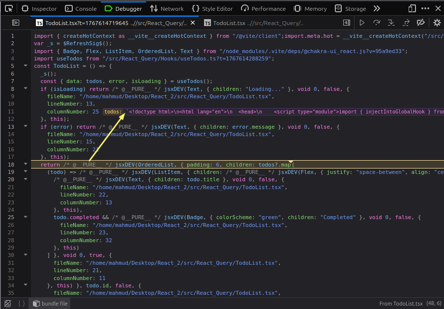

Look at the return value... `todos` is not an array of objects (only arrays can be mapped)

Now, why is this happening ? It's supposed to return an array of objects of `todos`

**Debugging more 😓**

`apiClient.ts`

```js
import axios from "axios";

class APIclient <T> {
    endpoint: string;

    constructor (endpoint: string){
        this.endpoint = endpoint
    }

    getData(){
        debugger; // ✨✨✨
        return axios
            .get<T[]>(this.endpoint)
            .then(res => res.data);
    }

    post(data: T){
        return axios
            .post(this.endpoint,data)
            .then(res => res.data);
    }

}

export default APIclient
```

`debugger` **pauses execution right there** when DevTools is open, letting you inspect variables and flow.
Basically a **manual breakpoint in code**.

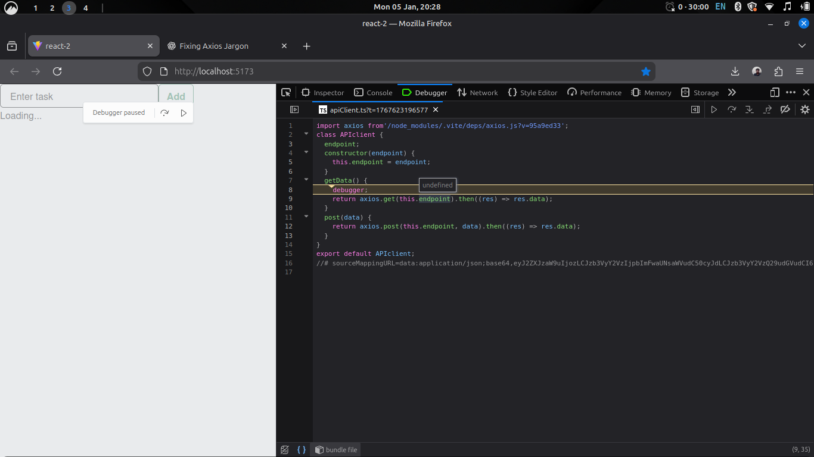

**`this.endpoint` is undefined**

- The error occurs because `getData` is passed as a callback, causing it to lose its `this` context.
- As a result, `this.endpoint` becomes `undefined` when React Query executes the function.

**Fix**

use arrow functions

`apiClient.ts`

```js
import axios from "axios";

class APIclient <T> {
    endpoint: string;

    constructor (endpoint: string){
        this.endpoint = endpoint
    }

    getData = () => {
        return axios
            .get<T[]>(this.endpoint)
            .then(res => res.data);
    }

    post = (data: T) => {
        return axios
            .post(this.endpoint,data)
            .then(res => res.data);
    }

}

export default APIclient
```

**Do the same this for mutation**

```js
return (
  useMutation < Todo,
  Error,
  Todo >
    {
      mutationFn: apiClient.post,

      // ... ... ...
    }
);
```

## Creating a reusable HTTP service

We’ve improved our code a lot, but there’s still one issue: the API endpoint is duplicated in multiple places. This makes the app fragile and hard to maintain. To fix this, we’ll create a single shared API client instance in a service file and reuse it across the app, reducing duplication and preventing errors.

1. Open new file `Services/ todoService.ts`

2. Code

```js
import APIclient from "./apiClient";

export interface Todo {
  id: number;
  title: string;
  completed: boolean;
  userId: number;
}

export default new APIclient() <
  Todo >
  "https://jsonplaceholder.typicode.com/posts";
```

**Now, in `useTodos.ts`**

```js
import { useQuery } from "@tanstack/react-query";
import type { Todo } from "../Services/todoService";
import todoService from "../Services/todoService";

const useTodos = () => {

// no need to explicitly create an API client anymore like this
// const apiClient = new APIclient<Todo>("https://jsonplaceholder.typicode.com/posts");


  return useQuery<Todo[], Error>({
    queryKey: ["todos"],
    queryFn: todoService.getData, // ✨✨✨
    staleTime: 10_000
  });
};

export default useTodos;
```

**Same for mutation (eg: `useAddTodos.ts`)**

## Understanding the application layers

Let’s break down our app layer by layer. At the bottom, the API client handles HTTP requests. On top, HTTP services are dedicated API client instances for specific data types, like todos or posts. Next, custom React Query hooks manage fetching, caching, and updating data. Finally, components use these hooks to interact with data. Each layer has a single responsibility, making the architecture clean, maintainable, and scalable.

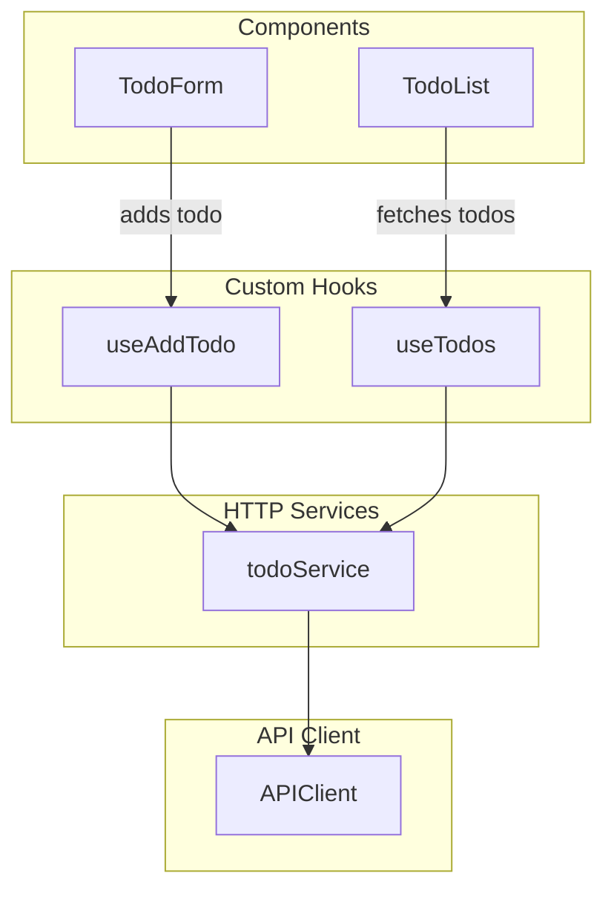

Here’s a **step-by-step breakdown** of the flow in the graph from bottom to top:

---

**1. Infrastructure Layer (API Client)**

- **`APIClient`** is the foundation.
- Handles **raw HTTP requests** (`GET`, `POST`, etc.) to the backend.
- Provides generic methods (`getData`, `post`) that can be reused by all services.

---

**2. Service Layer (HTTP Services)**

- **`todoService`** is an instance of `APIClient` dedicated to `Todo` data.
- Abstracts API details away from the rest of the app.
- Provides clear methods like `getData()` or `addTodo()` specifically for todos.
- Reduces duplication and ensures a **single source of truth** for API calls.

---

**3. Logic Layer (Custom Hooks)**

- **`useTodos`** fetches todos and caches them using **React Query**.
- **`useAddTodo`** handles adding new todos and updating the cache.
- Both hooks **call the service layer**, never the raw API directly.
- They manage **state, caching, and side effects**, keeping components clean.

---

**4. UI Layer (Components)**

- **`TodoList`** displays todos by calling `useTodos`.
- **`TodoForm`** lets users add todos via `useAddTodo`.
- Components **don’t care about API logic**; they just use the hooks.
- This keeps the UI **decoupled** from backend details.

---

### **Flow Summary**

1. Component → calls Hook (`TodoForm` → `useAddTodo`)
2. Hook → calls Service (`useAddTodo` → `todoService`)
3. Service → calls API Client (`todoService` → `APIClient`)
4. Data flows back **up** through the layers to update the UI.

---

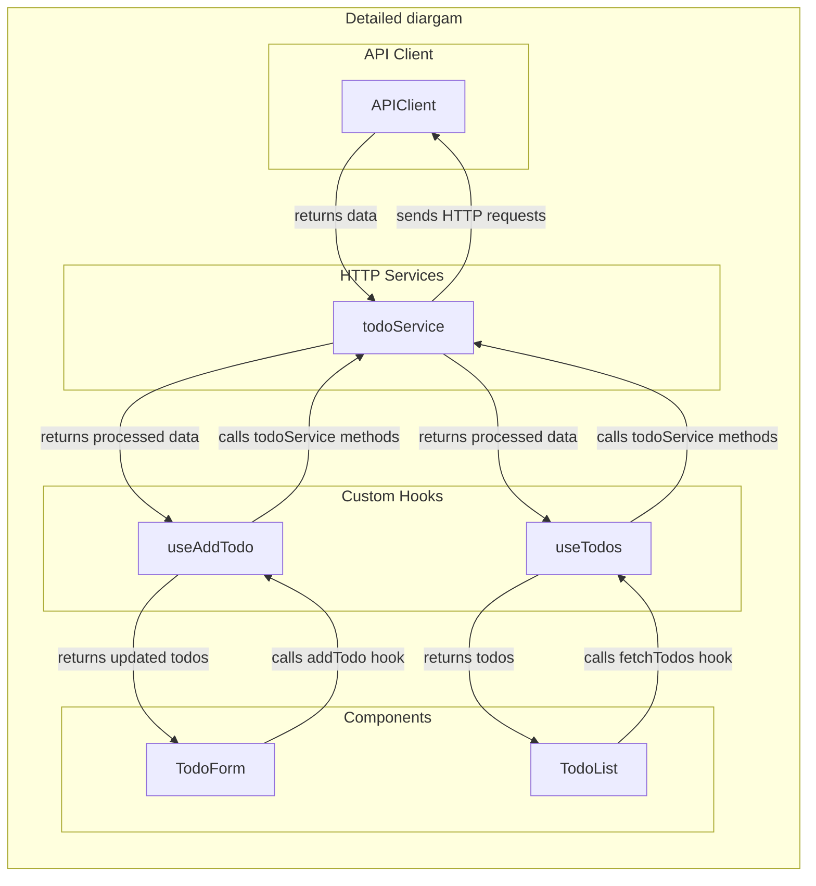

## Project work

V1: [GameHub](https://game-rfy9eu2gg-abdullah-al-mahmuds-projects.vercel.app/)

V2: [GameHub (updated)](https://game-bl31hqhjk-abdullah-al-mahmuds-projects.vercel.app/)

# Global state management

**Intro**

This section of the course focuses on how to manage state in a React app the right way. Instead of handling state only inside single components, you will learn how to manage and share state across the whole application. The goal is to clear confusion around common tools and help you understand when and why to use each one.

**What you will learn**

• How reducers help you organize and control state logic
• How React Context is used to share data between components
• When Context is enough and when you should look at other state tools
• The real difference between Context and Redux
• An introduction to Zustand for managing global state
• How to choose the right tool for your project instead of following hype

## Consolidating state logic with a reducer

**Reducer:** A function that allows us to centralise state updates in a component

**A basic counter**

```js
export default function Counter() {
  const [count, setCount] = useState(0);

  const inc = () => setCount((c) => c + 1);
  const dec = () => setCount((c) => c - 1);
  const reset = () => setCount(0);

  return (
    <Box
      minH="100vh"
      display="flex"
      alignItems="center"
      justifyContent="center"
    >
      <VStack spacing={6}>
        <Text fontSize="3xl" fontWeight="bold">
          Count: {count}
        </Text>

        <HStack spacing={4}>
          <Button onClick={dec}>-</Button>
          <Button onClick={reset}>Reset</Button>
          <Button onClick={inc}>+</Button>
        </HStack>
      </VStack>
    </Box>
  );
}
```

Now, we have to centralise the state updates in a seperate component

1. Open new file (eg: `Reducers/counterReducer.ts`)

```js
interface Action {
  type: string;
}

const counterReducer = (state: number, action: Action): number => {
  if (action.type == "Increament") return state + 1;
  if (action.type == "Decreament") return state - 1;
  if (action.type == "Reset") return 0;
  return state;
};

export default counterReducer;
```

2. In `Counter.tsx` component

```js
export default function Counter() {
  // dispatch = send (sending an action to reducer)
  const [count, dispatch] = useReducer(counterReducer, 0); // no need to memorise , appears in suggestion

  return (
    <Box
      minH="100vh"
      display="flex"
      alignItems="center"
      justifyContent="center"
    >
      <VStack spacing={6}>
        <Text fontSize="3xl" fontWeight="bold">
          Count: {count}
        </Text>

        <HStack spacing={4}>
          <Button onClick={() => dispatch({ type: "Decreament" })}>-</Button>
          <Button onClick={() => dispatch({ type: "Reset" })}>Reset</Button>
          <Button onClick={() => dispatch({ type: "Increament" })}>+</Button>
        </HStack>
      </VStack>
    </Box>
  );
}
```

Now , all our state management logic is in a seperate folder... (Seperation of concerns)

## Creating complex actions

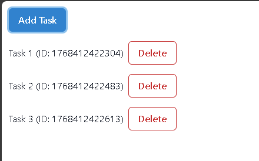

```js
import { Button, HStack, Table, Text } from "@chakra-ui/react";
import { useState } from "react";

// ---- gotta move these ----
interface Task {
  id: number;
  title: string;
}

const TaskList = () => {
  const [tasks, setTasks] = useState<Task[]>([]);

  const addTask = () => {
    const newTask: Task = {
      id: Date.now(),
      title: `Task ${tasks.length + 1}`,
    };
    setTasks([...tasks, newTask]);
  };

  const deleteTask = (id:number) => {
    setTasks(tasks.filter(t => t.id !== id))
  }
// --------------------------

  return (
    <Table p={4}>
      <Button colorScheme="blue" onClick={addTask}>
        Add Task
      </Button>

      {tasks.map((task) => (
        <HStack key={task.id} marginY={4}>
          <Text>
            {task.title} (ID: {task.id})
          </Text>
          <Button variant={"outline"} colorScheme="red" onClick={() => deleteTask(task.id)}>Delete</Button>
        </HStack>
      ))}
    </Table>
  );
};

export default TaskList;
```

We have to handle the state logic in a seperate file

1. Create `Reducers/taskReducer.ts`

```js
interface Task {
  id: number;
  title: string;
}

interface AddTask {
    type: "ADD"
    task: Task
}

interface DeleteTask {
    type: "DELETE"
    taskId: number
}

const taskReducer = (tasks:Task[],action:AddTask | DeleteTask) => {
    switch (action.type){
        case "ADD":
            return [...tasks,action.task]
        case "DELETE":
            return tasks.filter(task => task.id !== action.taskId);
        default:
            return tasks;
    }
}

export default taskReducer;
```

2. In `TaskList.tsx` component

```js
import { useReducer } from "react";
import taskReducer from "./Reducers/taskReducer";

const TaskList = () => {
  const [tasks, dispatch] = useReducer(taskReducer, []);

  return (
    <div>
      <button
        onClick={() =>
          dispatch({
            type: "ADD",
            task: { id: tasks.length + 1, title: `Task ` + Date.now() },
          })
        }
      >
        Add Task
      </button>

      {tasks.map((task) => (
        <div key={task.id} style={{ margin: "8px 0" }}>
          <span>{task.id + ". " + task.title}</span>
          <button onClick={() => dispatch({ type: "DELETE", taskId: task.id })}>
            Delete
          </button>
        </div>
      ))}
    </div>
  );
};

export default TaskList;
```

## Sharing state using react context

**The Core Problem: Prop Drilling**

When state lives in one component but is needed deep down the tree, React forces you to pass it through every middle component.

That means:

* Components receive props they don’t even use
* Code becomes noisy and fragile
* Refactoring becomes painful
* One small change breaks many layers

This mess is called **prop drilling**.

---

**Prop Drilling — Visual**

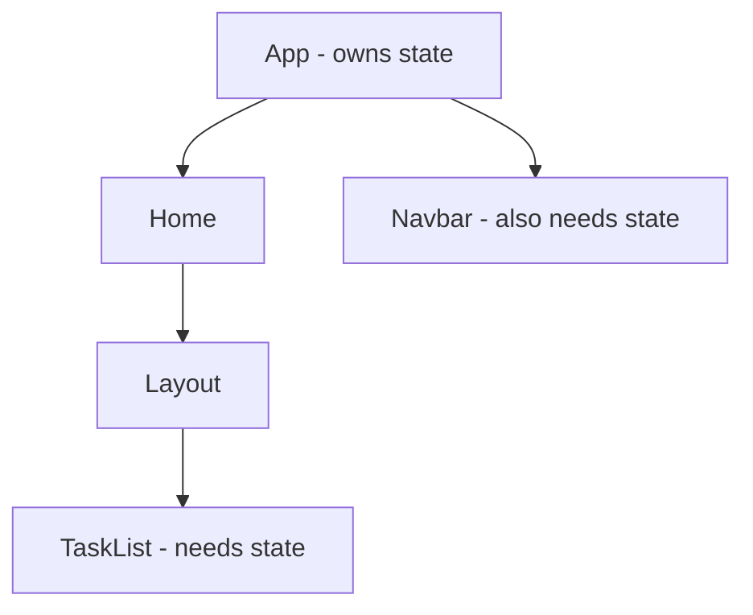

State has to travel through **Home → Layout** even though they don’t care about it.
That’s wasted plumbing.

---

**The Real Fix: React Context**

React Context lets you:

* Store shared state in one place
* Provide it to the whole component tree
* Access it directly where needed
* Skip all the middlemen

Think of context like a **truck** carrying a **box of data**.
Any component can open the box — no drilling required.

---

**What React Context Solves**

Instead of this:

* Lifting state up
* Passing props down
* Repeating props everywhere

You get this:

* One provider at the top
* Direct access anywhere
* Cleaner, safer, scalable code

---

**High-Level Flow**

* State is lifted to the closest common parent (usually `App`)
* A context is created to hold:

  * the state
  * the dispatch function
* The app is wrapped with a `Provider`
* Any component can read the data using `useContext`

---

**Implementation — Step by Step**

**1. Lift state to App**

You move your reducer from a local component into `App` so the data lives at the top.

This makes the state global *inside your app tree* — not global like Redux, just shared.

---

**2. Define the Context Shape**

You decide what goes in the “box”.

Usually:

* the state
* the dispatch function

Example idea:

* `tasks: Task[]`
* `dispatch: Dispatch<TaskAction>`

This is where TypeScript shines — it locks the contract.

---

**3. Create the Context**

You use `createContext` and tell TS what kind of data this context carries.

Instead of passing real values, you define the **shape** of the data.

This keeps everything type-safe across your app.

---

**4. Wrap Components with Provider**

At the top level (often in `App`):

* Wrap your UI with `<TasksContext.Provider>`
* Pass `{ tasks, dispatch }` as the value

Now the data truck is on the road.

---

**5. Consume the Context**

Inside any component that needs the data:

* Use `useContext(TasksContext)`
* Destructure what you need

  * only `tasks`
  * or only `dispatch`
  * or both

No props. No drilling. No noise.

---

**Why This Is Better (No Copium, Just Facts)**

Context gives you:

* Less boilerplate
* Fewer bugs
* Easier refactors
* Cleaner mental model
* Real scalability

Prop drilling works for tiny apps.
Context is for apps that actually grow.

---

**When NOT to Use Context**

Don’t abuse it.

Avoid context if:

* State is used by only 1–2 components
* Data changes every millisecond (can cause re-renders)

Use it when:

* Multiple distant components need the same state
* You’re tired of passing props like a courier service

### Implementation

In `taskList.tsx`

```js
import { useReducer } from "react";
import taskReducer from "./Reducers/taskReducer";

const TaskList = () => {
  const [tasks, dispatch] = useReducer(taskReducer, []); // state management ( Gotta lift it up to App.tsx)

  return (
    <div>
      <button
        type="button"
        onClick={() =>
          dispatch({
            type: "ADD",
            task: { id: tasks.length + 1, title: `Task ` + Date.now() },
          })
        }
      >
        Add Task
      </button>

      {tasks.map((task) => (
        <div key={task.id} style={{ margin: "8px 0" }}>
          <span>{task.id + ". " + task.title}</span>
          <button onClick={() => dispatch({ type: "DELETE", taskId: task.id })}>
            Delete
          </button>
        </div>
      ))}
    </div>
  );
};

export default TaskList;
```

**App.tsx**

```js
const App = () => {
  const [tasks, dispatch] = useReducer(taskReducer, []); // state management

  return (
    <TaskList/>
  )
}
```

**Now,**

Open `Contexts/taskContext.ts`

React context is like a truck for transporting a box, 

first, we have to define the shape of that box

- **Context** = the truck
- **TaskContextType** = the box design
- **{ tasks, dispatch }** = what’s inside the box

```js
import type { Dispatch } from "react";
import type { ActionType, Task } from "../Reducers/taskReducer";
import React from "react";

interface TaskContextType {
    tasks: Task[];
    dispatch: Dispatch<ActionType>
}

const TasksContext = React.createContext<TaskContextType>({} as TaskContextType);

export default TasksContext;
```

Now, move it up to `App.tsx`

```js
import { useReducer } from "react";
import taskReducer from "./Global_state/Reducers/taskReducer";
import TaskList from "./Global_state/TaskList";
import TasksContext from "./Global_state/Contexts/taskContext";
import NavBar from "./Global_state/NavBar";

const App = () => {
  const [tasks, dispatch] = useReducer(taskReducer, []); // state management

  return (
    <TasksContext.Provider value={{ tasks, dispatch }}>
      <NavBar />
      <TaskList />
    </TasksContext.Provider>
  );
};

export default App;
```

**Finally, In `TaskList.tsx`**

```js
import { useContext } from "react";
import TasksContext from "./Contexts/taskContext";

const TaskList = () => {

  const {tasks, dispatch} = useContext(TasksContext); // state

  return (
    <div>
      <button
        type="button"
        onClick={() =>
          dispatch({
            type: "ADD",
            task: { id: tasks.length + 1, title: `Task ` + Date.now() },
          })
        }
      >
        Add Task
      </button>

      {tasks.map((task) => (
        <div key={task.id} style={{ margin: "8px 0" }}>
          <span>{task.id + ". " + task.title}</span>
          <button onClick={() => dispatch({ type: "DELETE", taskId: task.id })}>
            Delete
          </button>
        </div>
      ))}
    </div>
  );
};

export default TaskList;
```

**NavBar.tsx**

```js
import { useContext } from "react"
import TasksContext from "./Contexts/taskContext"
import { Text } from "@chakra-ui/react";

const NavBar = () => {

    const {tasks} = useContext(TasksContext);

  return (
    <div>
        <Text>
            Task count : 
            {
                tasks.length
            }
        </Text>
    </div>
  )
}

export default NavBar
```
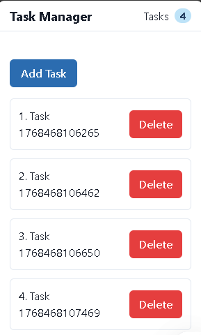

In this setup, the app uses `useReducer` in `App` to manage a single task state and shares it through `TasksContext`, so both `TaskList` and `NavBar` read from the same source of truth—when you add or delete a task, the action is dispatched to the reducer, the state updates once, and React automatically re-renders both components, keeping the task list and the task count perfectly in sync without any prop drilling.

**Excercise: create LoginReducer**

After implementation , in `App.tsx`

```js
const App = () => {
  const [tasks, taskDispatch] = useReducer(taskReducer, []);
  const [user, authDispatch] = useReducer(loginReducer, null);

  return (
    <LoginContext.Provider value={{ user, dispatch: authDispatch }}>
      <TasksContext.Provider value={{ tasks, dispatch: taskDispatch }}>
        <NavBar />
        <TaskList />
      </TasksContext.Provider>
    </LoginContext.Provider>
  );
};

export default App;
```
## Creating custom provider

In the previous version of our app, we were managing multiple reducers (`taskReducer` and `loginReducer`) inside the `App` component. This forced us to rename dispatch functions (`taskDispatch`, `authDispatch`) and wrap components with multiple context providers manually, which made the root component crowded and harder to maintain.

To fix this, we moved related state and logic into dedicated **Provider components**. This makes the architecture cleaner, more modular, and much easier to scale.

**Problems with the old approach (as seen in `App`)**

* Too many reducers and dispatch functions in one place
* Awkward naming like `taskDispatch` and `authDispatch`
* `App` became cluttered with nested providers
* Harder to reuse state logic in other parts of the app

**Benefits of the new approach**

* Each feature manages its own state via its own Provider
* `App` stays clean and focused on layout, not logic
* No dispatch name conflicts — every context has its own `dispatch`
* Easier to move, reuse, or scale features like Auth and Tasks
* Matches real-world React architecture patterns

1. Create `AuthProvider.tsx`

```js
import { useReducer, type ReactNode } from "react";
import loginReducer from "./Reducers/loginReducer";
import LoginContext from "./Contexts/loginContext";

interface Props {
    children: ReactNode;
}

const AuthProvider = ({children}:Props) => {

  const [user, dispatch] = useReducer(loginReducer, null);

  return (
    <LoginContext.Provider value={{user,dispatch}}>
        {children}
    </LoginContext.Provider>
  )
}

export default AuthProvider
```

2. In `App.tsx`

```js
const App = () => {
  const [tasks, taskDispatch] = useReducer(taskReducer, []);

  return (
    <AuthProvider> // wrapped with custom provider
      <TasksContext.Provider value={{ tasks, dispatch: taskDispatch }}>
        <NavBar />
        <TaskList />
      </TasksContext.Provider>
    </AuthProvider>
  );
};

export default App;
```

3. Did the same thing with `TaskProvider.tsx`

4. Final result

**App.tsx**

```js
import AuthProvider from "./Global_state/AuthProvider";
import NavBar from "./Global_state/NavBar";
import TaskList from "./Global_state/TaskList";
import TaskProvider from "./TaskProvider";

/*
1. Reduced a huge amount of imports
2. Removed reducer + context logic from App
3. App now focuses only on layout, not state management
4. No more dispatch naming conflicts (taskDispatch, authDispatch, etc.)
5. Providers handle their own state → better separation of concerns
6. Easier to scale: add more providers without touching App logic
7. Matches real-world React architecture (modular + reusable) 
*/

const App = () => {
  return (
    <AuthProvider>
      <TaskProvider>
        <NavBar />
        <TaskList />
      </TaskProvider>
    </AuthProvider>
  );
};

export default App;
```

## Creating a hook to access context

**Goal : Gaining better seperation of concerns and data hiding**

Create `Hooks/useAuth.ts`

```js
import { useContext } from "react";
import LoginContext from "../Contexts/loginContext";

const useAuth = () => useContext(LoginContext)

export default useAuth;
```

Now, in `Login.tsx`

```js
// reduced imports
import useAuth from "./Hooks/useAuth";

const Login = () => {

  const {user,dispatch} = useAuth(); // hidden context

  return (
    // .... code
  );
};

export default Login;
```

## Organising code for scalability and maintainability

**Modular Code Organization in React**

**1. Current Structure Issue**

* Components, context, hooks, and reducers for tasks are scattered across the project.
* This makes the code less maintainable and harder to scale.

**2. Solution: Encapsulation in a Module**

* Create a dedicated folder/package (e.g., `tasks`) to keep all related building blocks together.
* Analogy: Like keeping kitchenware in one kitchen instead of scattered across rooms.
* Benefits: Easier imports, modularity, scalability, and maintainability.

**3. Moving Building Blocks**

* Moved reducer, custom hook, context, and components (`TaskList`, `TasksProvider`) into the `tasks` folder.
* Updated imports accordingly.

**4. Public vs Private Interface**

* Principle: Only expose what consumers need; hide implementation details.
* Example:

  * Public: `TaskList`, `TasksProvider`
  * Private: Reducer logic, custom hook if only used internally

**5. Internal Refactoring**

* Merged reducer code directly into `TasksProvider` component.
* Removed unnecessary exports for private building blocks.
* Simplified project structure by inlining the custom hook into the component that uses it (`TaskList`).

**6. Managing Imports**

* Created `index.ts` inside the `tasks` package to expose only public interfaces:

  ```ts
  export { default as TasksProvider } from './TasksProvider';
  export { default as TaskList } from './TaskList';
  ```
* Now other parts of the app import directly from the package instead of internal files.

**7. Developer Convenience**

* To find symbols inside files: use `Command+T` (Mac) / `Ctrl+T` (Windows) instead of searching by filename.
* Keeps everything modular without losing accessibility.

**8. Benefits of This Structure**

* Implementation details (like which reducer or state management method is used) are hidden.
* Future changes inside the `tasks` package won’t affect the rest of the application.
* Only the public interface (`TaskList`, `TasksProvider`) is exposed to consumers.

**Key Takeaways**

* Modularize related code in packages/folders.
* Expose only what’s necessary (public interface).
* Keep implementation details private to ensure flexibility and maintainability.
* Refactor thoughtfully based on actual usage, not blindly following patterns.

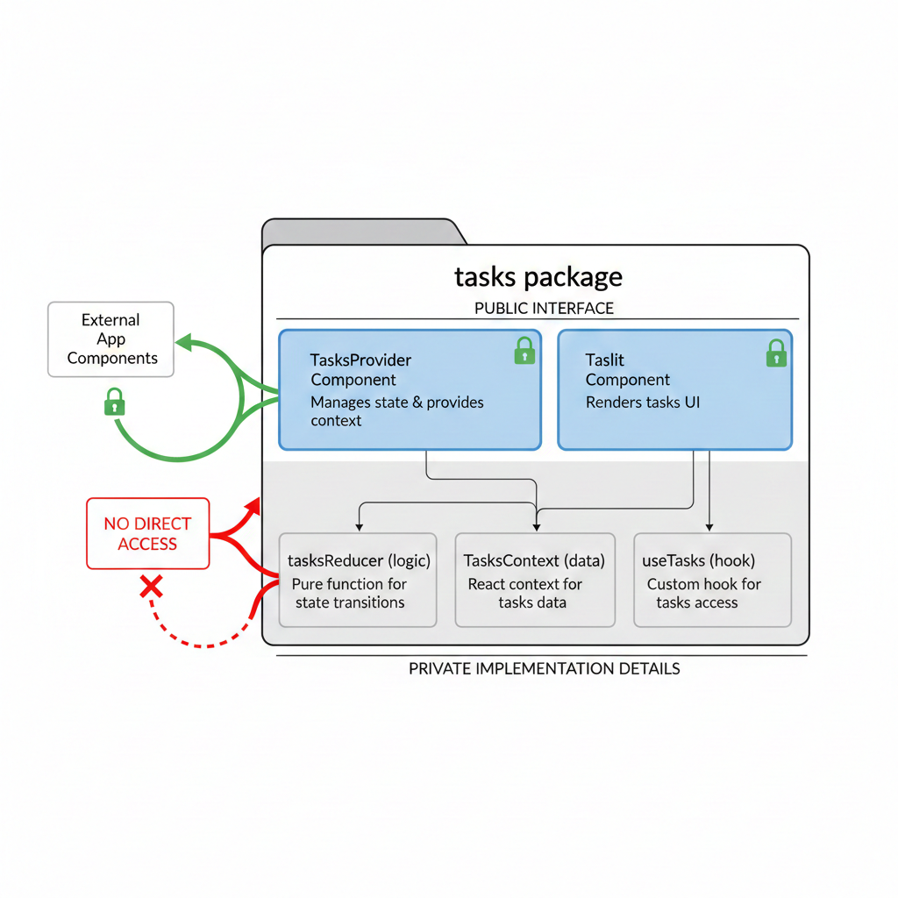

1. Open folder `Tasks/`
2. put all the building blocks in here

```
Tasks/
├─ taskContext.ts
├─ TaskList.tsx
├─ taskReducer.ts
└─ useTasks.ts
```

And fix the imports

Aaaand we're done..

**Practice task: Do the same for auth**

**Done**
```
Auth/
├─ AuthProvider.tsx
├─ Login.tsx
├─ loginContext.ts
└─ useAuth.ts
```

## **Splitting Context for Efficient Rendering**

**React context** is a powerful way to share data across your application. **However, anytime a value in a context changes, all components consuming that context will rerender.** To avoid unnecessary updates, a context should **only hold related values that tend to change together**, i.e., it should have a **single responsibility**.

**Example & Why It Matters**

* Imagine we have **two separate contexts**: `TasksContext` and `UserContext`.
* If our **NavBar** component uses both, it will rerender whenever **either the user or the tasks change**.
* If the NavBar only needs **current user info**, it shouldn’t subscribe to `TasksContext`. This way, it **rerenders only when necessary**.
* Combining unrelated values into one context can lead to **unnecessary rerenders** and reduce performance.

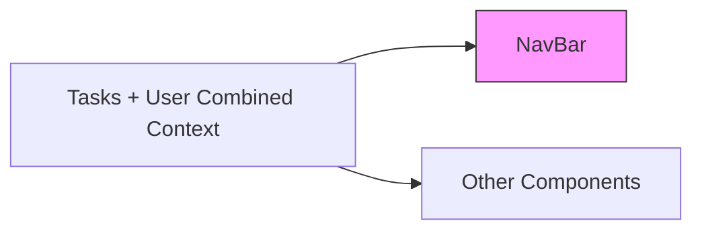

**Guidelines for Context Design**

* **Split contexts by purpose:** each context should have a **single responsibility**.
* Example: `UserContext` handles user info, `TasksContext` handles task state.
* Avoid making contexts **too fine-grained** (e.g., separate state and dispatch) — it can make the component tree **messy and harder to maintain**.

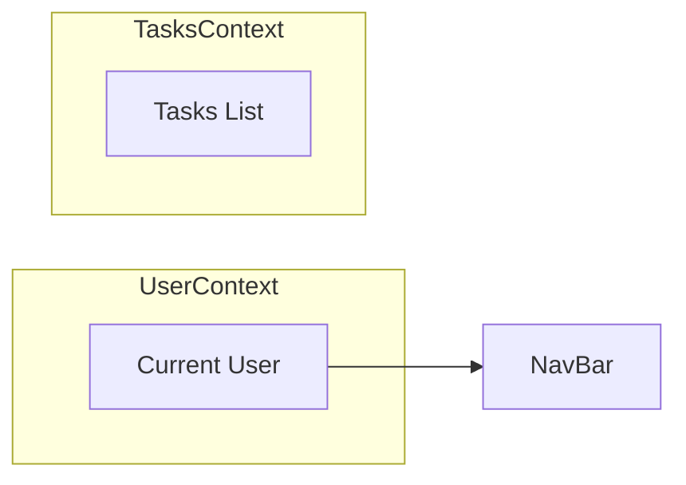

**Common Mistakes**

* **Separating state and dispatch** into two contexts:

  * Leads to a **complex component tree**.
  * Tasks and the function to update them are **closely related**, so separating them is unnecessary.
* Keep **state and its updater together** in the same context.

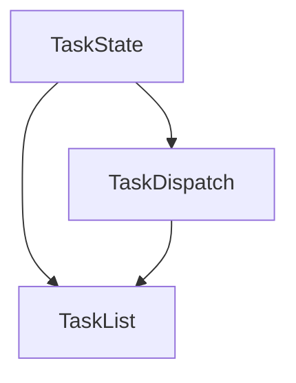
**Best Practices & Takeaways**

* **React context is not bad** — misuse causes issues.
* Only use context for **shared state that multiple components need**, and **split it wisely**.
* Think of context like a **tool**: the right tool used properly can save time, improve performance, and simplify your code.

## **When to Use React Context**

**React context** is useful for sharing **state between components**, but not every type of state should go there.

| **State Type**   | **Description**                                 | **Use Context?** | **Recommended Tool**                |
| ---------------- | ----------------------------------------------- | ---------------- | ----------------------------------- |
| **Server State** | Data fetched from backend (tasks, genres, tags) | ❌ No             | React Query / SWR                   |
| **Client State** | UI-related state (current user, theme, filters) | ✅ Yes            | React Context + useState/useReducer |

---

### **Best Practices**

* **Lift state up** to the nearest common parent if multiple children need it.
* **Keep context focused:** Each context should have a **single responsibility**.
* Split contexts if they cause **unnecessary rerenders**.
* If splitting doesn’t help, consider **state management tools** like Redux, MobX, Recoil, Zustand, Jotai.
* Zustand is simple and sufficient for most applications.

---

**Summary:**

> Use **context for client/UI state** that multiple components need.
> Use **React Query or other tools** for server state.
> Keep **contexts focused and minimal** to avoid performance issues.

Here’s a **concise, clear note** based on your transcript, in an academic + coding style:

---

## **State Management with Zustand**

**Documentation: [https://zustand.docs.pmnd.rs/getting-started/introduction](https://zustand.docs.pmnd.rs/getting-started/introduction)**

Zustand is a **lightweight state management library** that lets you store and manage application state **without the boilerplate** of reducers, context providers, or Redux.


**Why use Zustand?**

* Centralizes state in a **single store**.
* No need for **context providers** to wrap components.
* Eliminates the need for **reducers and dispatching actions** with string constants.
* Makes state **accessible anywhere** in the app through a simple hook.
* Keeps code **clean, concise, and maintainable**.

**How Zustand works**

1. Define a **store interface** (shape of the state and functions).
2. Use `create()` to build the store.
3. Implement state properties and **methods** to update them (increment, reset, etc.).
4. Use the generated **hook** (`useCounterStore`) in any component.

**Example:**

```ts
interface CounterStore {
  counter: number;
  increment: () => void;
  reset: () => void;
}

const useCounterStore = create<CounterStore>((set) => ({
  counter: 0,
  increment: () => set((state) => ({ counter: state.counter + 1 })),
  reset: () => set({ counter: 0 }),
}));
```

Components can now **directly access and update the store**:

```ts
const { counter, increment, reset } = useCounterStore();
```

No context, provider, or reducer needed.

**Why not Context + React Query for everything?**

| **State Type**      | **Recommended Tool**  | **Reason**                                                             |
| ------------------- | --------------------- | ---------------------------------------------------------------------- |
| **Server State**    | React Query / SWR     | Automatically handles caching, fetching, and updates.                  |
| **Client/UI State** | Zustand / Local State | Lightweight, central store for UI state, avoids unnecessary rerenders. |

* Using **context** for complex or widely shared client state can cause **performance issues** due to unnecessary rerenders.
* Using **context for server state** adds boilerplate and duplicates what React Query already handles efficiently.

**Summary**

> Zustand is perfect for **client state** where multiple components need access.
> Context + React Query is only needed for **sharing simple state** or **server-fetched data**, respectively.
> Using Zustand simplifies state logic, removes boilerplate, and keeps components **decoupled and maintainable**.