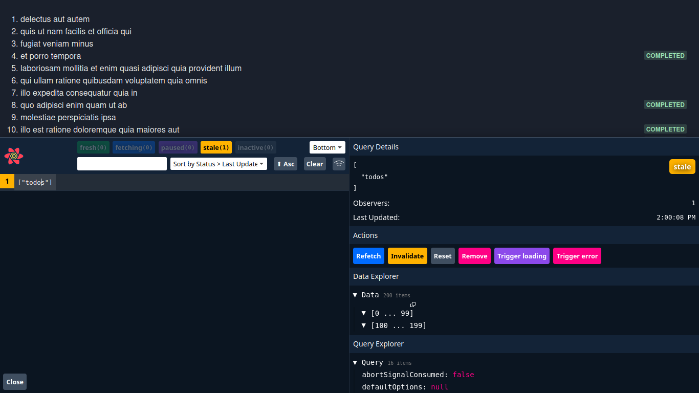
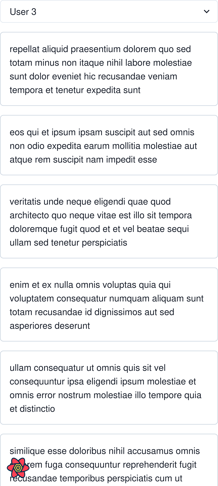
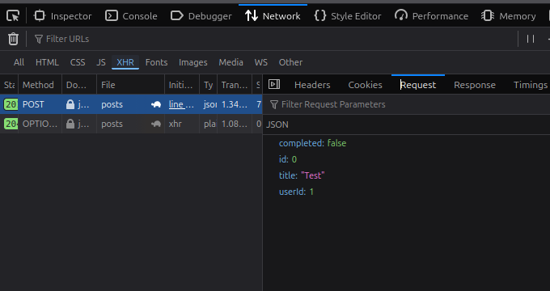
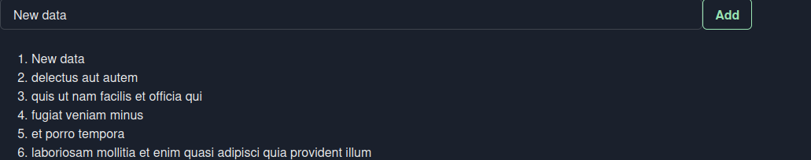

# React with typescript part 2 ( Intermediate topics )

> Precaution: Iam using chakra ui here

**This part of the course shifts from learning React to using React the way it’s used in real production apps.** Instead of isolated concepts, you’ll focus on how different pieces—data fetching, caching, state, and routing—work together to build something scalable and performant. The GameHub project is expanded step by step, turning it from a basic app into a polished, real-world application that reflects professional development practices.

- **Intermediate React + TypeScript workflows** focused on real app architecture
- **Data management & caching** to reduce unnecessary network calls and improve performance
- **Global state handling** for sharing data cleanly across components
- **Infinite scrolling** for loading content efficiently as users interact
- **Routing with React Router** to support multiple pages and deep linking
- **Game details page** to demonstrate structured navigation and data reuse
- **Portfolio-ready outcome** that showcases practical React skills, not just theory

# Fetching and updating data using `react query`

- React Query is used to manage **server state** in React applications
- It simplifies **data fetching, caching, syncing, and updating** from APIs
- Queries handle loading, error, and success states automatically
- Built-in caching and background refetching improve performance
- Supports **pagination and infinite scrolling** with cached pages
- Mutations handle **CRUD operations** and can use **optimistic updates**
- Custom hooks and services keep components clean and reusable
- Applied to the GameHub project to add caching, infinite scroll, and refactor the codebase
- Final outcome is a **faster, cleaner, and more scalable React application**

**Here we're fetching a list from an API ... but, there's some problem here**

```js
const TodoList = () => {
  const [todos, setTodos] = useState<Todo[]>([]);
  const [error, setError] = useState();

  useEffect(() => {
    axios
      .get("https://jsonplaceholder.typicode.com/todos")
      .then((res) => setTodos(res.data))
      .catch((err) => setError(err.message));
  }, []);

```

**Problems**

1. No request cancellation
2. No seperation of concerns
3. No retries
4. No automatic refresh / refetch
5. No `caching`

### Caching

- **Definition:** Caching is the process of storing data in a place where it can be accessed quickly in the future instead of fetching it from the original source every time.

- **Purpose:**

  - Reduces server requests
  - Speeds up data retrieval
  - Improves application performance
  - Enhances user experience

- **In React Applications:**

  - Frequently used data can be stored **on the client side**, inside the user's browser.
  - Example: User profile info, recent search results, or product listings can be cached so they don’t need to be fetched from the server every time the page loads.

- **How it works (example scenario):**

  1. User opens a dashboard. React fetches user data from the server.
  2. Data is stored in the browser cache (e.g., `localStorage`, `sessionStorage`, or in-memory cache).
  3. Next time the user visits, React checks the cache first.
  4. If data exists in the cache, it’s loaded instantly without calling the server.

- **Benefits:**

  - Faster page loads
  - Less network traffic
  - Reduced server load
  - Smooth and responsive user experience

- **Things to keep in mind:**

  - Cached data can get outdated (stale), so sometimes it needs to be refreshed.
  - Not all data should be cached, especially sensitive or frequently changing data.

## Setting up react query

**Doc:** [https://tanstack.com/query/v4/docs/framework/react/installation](https://tanstack.com/query/v4/docs/framework/react/installation)

1. Install react-query
2. `main.tsx`

```js
import { StrictMode } from "react";
import { createRoot } from "react-dom/client";
import { ChakraProvider } from "@chakra-ui/react";
import "./index.css";
import App from "./App.tsx";

import { QueryClient, QueryClientProvider } from "@tanstack/react-query"; /* New import */

const queryClient = new QueryClient(); /* New */

createRoot(document.getElementById("root")!).render(
  <StrictMode>
    <ChakraProvider>
      <QueryClientProvider client={queryClient}> /* New */
        <App />
      </QueryClientProvider>
    </ChakraProvider>
  </StrictMode>
);
```

## Fetching data

**Problems (without React Query)**

- **No request cancellation**
  If a component unmounts or the user navigates away, the API request may still run in the background, wasting resources and possibly causing errors.

- **No separation of concerns**
  Data fetching logic, loading states, error handling, and UI code get mixed together, making components messy and harder to maintain.

- **No retries**
  If a request fails due to a temporary network issue, it fails immediately with no automatic retry mechanism.

- **No automatic refresh / refetch**
  Data does not update automatically when the user revisits a page, switches tabs, or when data becomes stale. You have to manually handle refetching.

- **No caching**
  The same data is fetched again and again, even if it hasn’t changed, leading to unnecessary API calls and slower performance.

➡️ **All of these problems can be solved by React Query**, which handles data fetching, caching, retries, background refetching, and request management out of the box.

```js
const TodoList = () => {
  // You don’t have to memorize anything - everything comes from the React Query documentation.
  // converted to async function

  const fetchTodos = async () => {
    const res = await axios.get<Todo[]>(
      "https://jsonplaceholder.typicode.com/todos"
    );
    return res.data;
  };

  const { data } = useQuery({
    queryKey: ["todos"],
    queryFn: fetchTodos,
  });
```

**New version (with React Query)**

- **No request cancellation issues**
  React Query automatically cancels in-flight requests when components unmount or when a new request replaces the old one.

- **Clear separation of concerns**
  Data fetching, caching, loading, and error states are handled by React Query, keeping the component focused only on rendering UI.

- **Automatic retries**
  Failed requests are retried automatically (configurable), so temporary network issues don’t instantly break the UI.

- **Automatic refresh / refetch**
  Data can refetch on window focus, reconnect, or after a certain time without manual `useEffect` logic.

- **Built-in caching**
  Fetched data is cached and reused, preventing unnecessary API calls and making the app faster.

➡️ **Result:** No `useEffect`, no manual `useState`, less boilerplate, cleaner code, and better performance out of the box.

## Error handling

```js
const { data: todos, error } = useQuery({
  queryKey: ["todos"],
  queryFn: fetchTodos,
});

if (error) return <Text>{error}</Text>; // error
```

**Error**

> Type '{}' is not assignable to type 'ReactNode'.

- error from `useQuery` is typed as unknown by default in v4.

- You can’t just render unknown in JSX. TypeScript doesn’t know it’s a string.

**Fix**

```js
const { data: todos, error } = useQuery({
  queryKey: ["todos"],
  queryFn: fetchTodos,
});

if (error instanceof Error) return <Text>{error.message}</Text>; // fix
```

**Or, declare type while calling `useQuery`**

```js
  const { data: todos, error } = useQuery<Todo[],Error>({ // fix
    queryKey: ["todos"],
    queryFn: fetchTodos,
  });

  if (error) return <Text>{error.message}</Text>;
```

## Showing a loading indicator

```js
const { data: todos, error, isLoading } = useQuery<Todo[],Error>({
  queryKey: ["todos"],
  queryFn: fetchTodos,
});

if (isLoading) return <Text>Loading...</Text>
```

**There's still a problem left : Seperation of concerns**

our quering logic is still being handled in the `TodoList` component.. It should be handled seperately in hook (ex: `useTodos.ts`)

`Hooks/useTodos.ts`

**Cut-pasted and made some minimal changes from `TodoList.tsx`**

```js
import { useQuery } from "@tanstack/react-query";
import axios from "axios";

interface Todo {
  id: number;
  title: string;
  completed: boolean;
}

const useTodos = () => {
  const fetchTodos = () =>
    axios
      .get<Todo[]>("https://jsonplaceholder.typicode.com/todos")
      .then((res) => res.data);

  return useQuery<Todo[], Error>({
    queryKey: ["todos"],
    queryFn: fetchTodos,
  });
};

export default useTodos;
```

`TodoList.tsx`

```js
import { Badge, Flex, ListItem, OrderedList, Text } from "@chakra-ui/react";
import useTodos from "../Hooks/useTodos";

const TodoList = () => {
  const { data: todos, error, isLoading } = useTodos();
  // ....
};
```

## React query devtools

**Doc:** [https://tanstack.com/query/v4/docs/framework/react/devtools](https://tanstack.com/query/v4/docs/framework/react/devtools)

1. Install

```bash
npm i @tanstack/react-query-devtools@4
```

2. `main.tsx`

```js
import { StrictMode } from "react";
import { createRoot } from "react-dom/client";
import { ChakraProvider } from "@chakra-ui/react";
import { QueryClient, QueryClientProvider } from "@tanstack/react-query";
import { ReactQueryDevtools } from '@tanstack/react-query-devtools' // New

import "./index.css";
import App from "./App.tsx";

const queryClient = new QueryClient();

createRoot(document.getElementById("root")!).render(
  <StrictMode>
    <ChakraProvider>
      <QueryClientProvider client={queryClient}>
        <App />
        <ReactQueryDevtools /> // New
      </QueryClientProvider>
    </ChakraProvider>
  </StrictMode>
);
```

**Done**



## Customising query settings

**Doc:** [Stackoverflow](https://stackoverflow.com/questions/74203305/how-to-change-the-default-options-for-usequery-in-react-query)

`main.tsx`

```js
import { StrictMode } from "react";
import { createRoot } from "react-dom/client";
import { ChakraProvider } from "@chakra-ui/react";
import { QueryClient, QueryClientProvider } from "@tanstack/react-query";
import { ReactQueryDevtools } from '@tanstack/react-query-devtools'

import "./index.css";
import App from "./App.tsx";

// customisation

const queryClient = new QueryClient({
  defaultOptions: {
    queries: {
      retry: 3,              // Retries a failed request 3 times before throwing an error
      staleTime: 10 * 1000,  // Data stays fresh for 10 seconds (no refetch during this time)
      cacheTime: 300_0000,   // Cached data stays in memory for 50 minutes after becoming unused
    },
  },
});


createRoot(document.getElementById("root")!).render(
  <StrictMode>
    <ChakraProvider>
      <QueryClientProvider client={queryClient}>
        <App />
        <ReactQueryDevtools />
      </QueryClientProvider>
    </ChakraProvider>
  </StrictMode>
);
```

Here are the **common React Query `defaultOptions.queries`** with **one-line explanations** (note-style, clean):

- **staleTime**: How long data is considered fresh before it becomes stale and eligible for refetching.

- **cacheTime**: How long inactive (unused) cached data stays in memory before being garbage-collected.

- **retry**: Number of times a failed query is retried before throwing an error.

- **retryDelay**: Time to wait between retry attempts.

- **refetchOnWindowFocus**: Automatically refetches data when the browser window/tab regains focus.

- **refetchOnReconnect**: Refetches data when the network reconnects after being offline.

- **refetchOnMount**: Refetches data when a component mounts if the data is stale.

- **enabled**: Controls whether the query runs automatically or waits for a condition.

- **keepPreviousData**: Keeps old data while fetching new data to avoid UI flicker.

- **select**: Transforms or filters the fetched data before it reaches the component.

- **onSuccess**: Callback that runs when the query succeeds.

- **onError**: Callback that runs when the query fails.

- **onSettled**: Callback that runs when the query either succeeds or fails.

### React Query refetches data by default under **3 conditions**

* **On component mount**
  When a component using a query mounts and the cached data is **stale**, React Query refetches it.

* **On window focus**
  When the user switches back to the browser tab/window, React Query refetches stale data.

* **On network reconnect**
  When the device goes offline and then comes back online, React Query refetches stale data.

These defaults are what keep data **fresh without manual `useEffect` logic**.

We can also customize these behaviors in `queryOptions.queries` using options like `refetchOnMount`, `refetchOnWindowFocus`, and `refetchOnReconnect`.

--- 

We can customize these behaviors **per query**, instead of applying them globally from `main.tsx`.

Like this

`useTodos.ts`
```js
const useTodos = () => {
  const fetchTodos = () =>
    axios
      .get<Todo[]>("https://jsonplaceholder.typicode.com/todos")
      .then((res) => res.data); 

  return useQuery<Todo[], Error>({
    queryKey: ["todos"],
    queryFn: fetchTodos,
    staleTime: 10_000 // custom stale time
  });
};
```

## **Exercise Problem**

There is a component that fetches posts from the backend (**JSONPlaceholder**) using **`useState`** and **`useEffect`**.

👉 Your task is to replace that logic by creating a **custom hook that fetches posts using React Query**, eliminating the need for manual state and effect hooks.

### Solution

`usePosts.ts`
```js
import { useQuery } from "@tanstack/react-query"
import axios from "axios"

interface Post {
    userId: number
    id: number
    title: string
    body: string
}

const usePosts = () => {
    
    const fetchPosts = () => 
        axios
    .get('https://jsonplaceholder.typicode.com/posts')
            .then(res => res.data)

    return useQuery<Post[],Error>({
        queryKey: ['posts'],
        queryFn: fetchPosts
    })

}

export default usePosts
```

## Parameterised queries

Here we’re going to **parameterize queries** so they can fetch data dynamically based on input, and then **filter posts by user** to only show posts belonging to a specific user.

`usePosts.ts`
```js
    
    const fetchPosts = () => 
        axios
    .get('https://jsonplaceholder.typicode.com/posts')
            .then(res => res.data)

    return useQuery<Post[],Error>({
        queryKey: ['posts'], // we're gonna work here 
        queryFn: fetchPosts
    })

}
```

`postList.tsx`

```js
const [userId, setUserId] = useState<number>();
    const { data: posts, error, isLoading } = usePosts(userId); // current userId as argument
    
    if (isLoading) return <Text>Loading...</Text>;
    if (error instanceof Error) return <Text>{error.message}</Text>;
  return (
    <>
      <Select
        placeholder="Select user"
        onChange={(e) => setUserId(parseInt(e.target.value))}
        value={userId} // this value is being passed as the argument
      >
        <option value="1">User 1</option>
        <option value="2">User 2</option>
        <option value="3">User 3</option>
      </Select>
```

### Query Key Hierarchy When Using Parameters

In React Query, a query key follows a **hierarchical** structure when parameters are included. This hierarchy is intentional and is used to **organize cached data** in a predictable and scalable way.

```js
const usePosts = (userId: number | undefined) => { // userId as parameter
    
    const fetchPosts = () =>
        axios
    .get('https://jsonplaceholder.typicode.com/posts', {
        params: { userId } // url: https://jsonplaceholder.typicode.com/posts?userId=1
    })
            .then(res => res.data)

    return useQuery<Post[],Error>({
        queryKey: ['users',userId,'posts'], // hierarchical (url : /user/1/posts , for id = 1)
        queryFn: fetchPosts
    })

}
```

Done, Now we can filter posts by user



### Parameterised Queries – Wrap up

* We began with a **static posts query** that always fetched all posts, regardless of user selection. This meant the data was fixed and not responsive to user input.

* We introduced a **`userId` state** in the UI, allowing the user to select a specific user from a dropdown. This state became the source of truth for which posts should be displayed.

* The selected `userId` was then **passed as an argument to the `usePosts` hook**, turning the hook into a dynamic, reusable data-fetching function instead of a hardcoded one.

* Inside the hook, we used `userId` to **parameterize the API request**, ensuring that only posts belonging to the selected user are fetched from the server rather than filtering on the client side.

* We updated the **query key to include `userId`**, forming a hierarchical structure. This allows React Query to cache posts separately for each user while keeping them logically grouped.

* Because the query key changes when `userId` changes, **React Query automatically refetches the data**, eliminating the need for manual refetch logic.

Overall, this approach makes the data flow predictable, keeps the cache well-organized, and allows the UI to react instantly to user selection while only fetching the data it actually needs.

### Cached Data and Instant Switching

* Once posts for a specific user are fetched, React Query **stores them in the cache** under their hierarchical query key.
* When the user switches to another previously selected user, **no new API request is made**; React Query retrieves the data directly from the cache.
* This makes **moving between users instant**, providing a smooth and responsive experience.
* The hierarchical query key ensures that each user’s posts are **cached separately**, so switching users does not overwrite other cached data.
* This caching strategy improves performance, reduces unnecessary network requests, and makes the app feel faster and more efficient.

## Paginated queries

**PostList.tsx**

Define page state and page size

```js

const PostList = () => {
    
    const pageSize = 10 // each page will have 10 posts
    const [page, setPage] = useState(1);

// .... .... ....

}
```

**usePosts.ts**

* Defined the pagination query structure

```ts
interface postQuery {
  page: number
  pageSize: number
}
```

* Passed pagination data into the hook

```ts
const usePosts = (query: postQuery) => {
```

* Calculated the starting index for pagination

```ts
_start: (query.page - 1) * query.pageSize
```

* Limited the number of posts per request

```ts
_limit: query.pageSize
```

* Sent pagination values as URL parameters

```ts
params: {
  _start: (query.page - 1) * query.pageSize,
  _limit: query.pageSize
}
```

* Used pagination data in the query key

```ts
queryKey: ["posts", query]
```

* Returned paginated data through React Query

```ts
return useQuery<Post[], Error>({
  queryKey: ["posts", query],
  queryFn: fetchPosts
})
```

**Final code**

```js
interface postQuery {
    page: number
    pageSize: number
}

const usePosts = (query: postQuery) => { 
    
    const fetchPosts = () =>
        axios.get('https://jsonplaceholder.typicode.com/posts', {
        params: { 
            _start: (query.page - 1) * query.pageSize, 
            _limit: query.pageSize
         } // url: https://jsonplaceholder.typicode.com/posts?_start=0&_limit=10
    })
    .then(res => res.data)

    return useQuery<Post[],Error>({
        queryKey:  ['posts', query],
        queryFn: fetchPosts
    })

}
```

This will show 1st 10 posts.. now , we're gonna implement pagination buttons

```js
<ButtonGroup variant={"outline"} colorScheme="blue">
  <Button disabled={page === 1} onClick={() => setPage(page - 1)}>
    Previous
  </Button>
  <Button onClick={() => setPage(page + 1)}>Next</Button>
</ButtonGroup>
```

## Infinite queries

* With `useInfiniteQuery`, we **don’t need to track page numbers manually**—React Query handles pagination internally.
* We can remove any `page` state or related logic from our component.
* `pageParam` is automatically passed to the query function by React Query for each fetch.
* Use `pageParam` to calculate offsets, cursors, or anything else needed to fetch the next page of data.
* `getNextPageParam` tells React Query what the **next `pageParam`** should be, or `undefined` if there are no more pages.

Example bullet:

* **Initial fetch:** `pageParam = 1`
* **Next fetch:** `getNextPageParam` returns `2` → React Query calls query function with `pageParam = 2`

First,

**usePosts.ts**

1. **Remove manual page state**

```ts
interface postQuery {
    pageSize: number
    // removed page: number
}
```

* We no longer track `page` in state.
* React Query handles the page cursor internally using `pageParam`.

---

2. **Use `pageParam` in query function**

```ts
const fetchPosts = ({ pageParam = 1 }: QueryFunctionContext) =>
    axios
        .get('https://jsonplaceholder.typicode.com/posts', {
            params: { 
                _start: (pageParam as number - 1) * query.pageSize, 
                _limit: query.pageSize
            } 
        })
        .then(res => res.data)
```

* `pageParam` defaults to `1` (initial page).
* Calculated `_start` based on `pageParam`.
* No reference to external `page` state anymore.

---

3. **Set up `useInfiniteQuery`**

```ts
return useInfiniteQuery<Post[], Error>({
    queryKey: ['posts', query],
    queryFn: fetchPosts,
    keepPreviousData: true,
    getNextPageParam: (lastPage, allPages) => {
        return lastPage.length > 0 ? allPages.length + 1 : undefined;
    }
})

// lastPage = posts from last fetch, allPages = [[page1], [page2], ...]
// if lastPage has items, next page = allPages.length + 1

```

* `queryKey` now only depends on `query` object.
* `getNextPageParam` calculates next page automatically:

  * If `lastPage` has items → next page = `allPages.length + 1`
  * Else → `undefined` (stops fetching)
---

✅ **Special changes we made**:

* Removed manual `page` state from `postQuery`.
* Used `pageParam` instead of `query.page`.
* Defaulted `pageParam = 1`.
* `getNextPageParam` handles next page logic automatically.
* Query function fully self-contained; React Query handles pagination internally.

## Mutations (Mutating Data)

Up to now, we’ve only been **fetching and reading data** using queries. Queries are great for loading data and keeping it in sync automatically.

Now we’re moving to **mutating data** — meaning **changing something on the server**.

This includes things like:

* Adding new items (form submit)
* Updating existing data
* Deleting data

In React Query, **mutations are handled with `useMutation`**.

Unlike queries:

* Queries run automatically and are cache-driven
* Mutations run **only when you trigger them** (usually via user actions like form submit)

In this section, we’ll:

* Create a **simple form**
* Submit data using `useMutation`
* Send a `POST` request with Axios
* Handle success and error states
* Update the UI after mutation by:

  * Invalidating the cache **or**
  * Updating the cache directly

The goal here is to understand **how mutations work**, not to build a full-featured app.

**Made a basic input field for taking form data**

```js
import { Button, Input } from "@chakra-ui/react";
import { useRef } from "react";

const TodoForm = () => {
  const ref = useRef<HTMLInputElement>(null);

  return (
    <form
      style={{ width: "70vw", display: "flex" }}
      onSubmit={(event) => {
        event.preventDefault(); // prevent the form from being posted to the server and being reloded
      }}
    >
      <Input placeholder="Enter task" ref={ref} />
      <Button variant={"outline"} colorScheme="green" type="submit">
        Add
      </Button>
    </form>
  );
};

export default TodoForm;

```

**App.tsx**

```js
import TodoForm from "./React_Query/TodoForm"
import TodoList from "./React_Query/TodoList"

const App = () => {
  return (
    <div>
      <TodoForm/>
      <TodoList/>
    </div>
  )
}

export default App
```

**Now, here comes mutation**

**FIRST.....**

1. `useMutation` returns an object that contains methods and state variables for performing and tracking a mutation, such as `mutate`, `mutateAsync`, `isLoading`, `isError`, `isSuccess`, and `data`.

In short, it gives you both the **function to trigger the mutation** and the **current status of that mutation**.

2. `mutate` is the function returned by `useMutation` that you call to send data to the server (like a POST request), and it automatically tracks whether the request is loading, succeeded, or failed so you can update your UI accordingly.

```js
const TodoForm = () => {
  const ref = useRef<HTMLInputElement>(null);

  //1. store the object generated by `useMutation()` in postTodo..
  const postTodo = useMutation({
    mutationFn: (todo: Todo) => 
      axios
        .post('https://jsonplaceholder.typicode.com/posts',todo) // sends the todo data to the server via a POST request
        .then(res => res.data)
  })

  return (
    <form
      style={{ width: "70vw", display: "flex" }}
      onSubmit={(event) => {
        event.preventDefault(); 

        // 2. call the returned `mutate` function with a todo object to trigger this POST.
        postTodo.mutate({
          id: 0,
          title: ref.current?.value,
          completed: false,
          userId: 1
        });
      }}
    >
      <Input placeholder="Enter task" ref={ref} />
      <Button variant={"outline"} colorScheme="green" type="submit">
        Add
      </Button>
    </form>
  );
};

export default TodoForm;
```

> Error : Type 'string | undefined' is not assignable to type 'string'.
>  Type 'undefined' is not assignable to type 'string'. 

This error means TypeScript expects a `string`, but your value might be `undefined`, so you need to ensure it’s always a `string` before using it.

**Fix:** Check , if `ref.current` exists ?

```js
if (ref.current && ref.current.value) {
  postTodo.mutate({
    id: 0,
    title: ref.current?.value,
    completed: false,
    userId: 1,
  });
}
```

Let's test it

1. Enter something in the form and submit it.
2. Nothing happens because we haven’t added any functionality to handle or display the submission.

But, something happened under the hood. 

Go to : `inspect > network > xhr > request`



A new post with the given data was successfully sent to the server via a POST request.

**Rendering the new post**

```js
  const postTodo = useMutation({
    mutationFn: (todo: Todo) =>
      axios
        .post<Todo>("https://jsonplaceholder.typicode.com/posts", todo) 
        .then((res) => res.data),

      onSuccess: (savedTodo: Todo, newTodo: Todo) => {
        console.log(savedTodo); // the request worked, and the response data is what you see in the console.
      }
  });
```

Now you can **use that response to update your UI** instead of just logging it. For example:

* **Add the new todo to a list** so it appears instantly on the page.
* **Clear the form input** after a successful submission.
* **Show a success message** to the user.
* **invalidate the cached list of todos** so React Query refetches the latest data from the server.

**Invalidating the cache**

In programming (and React Query specifically), **invalidate** means to **mark cached data as outdated**, so the next time it’s needed, it will be **refetched from the server** instead of using the old cached version.

Plain English: *“this data is no longer fresh, go get the latest.”*

```js
// this method invalidates queries..
const queryClient = useQueryClient();

onSuccess: (savedTodo: Todo, newTodo: Todo) => {
  console.log(savedTodo);
  queryClient.invalidateQueries({
    queryKey: ['todos']
  })
}
```

Unfortunately, this approach doesn’t work on `jsonplaceholder` because it’s a **fake online REST API**

so, we have to use this

**APPROACH 2: Updating the data in the cache directly**

```js
  const postTodo = useMutation({
    mutationFn: (todo: Todo) =>
      axios
        .post<Todo>("https://jsonplaceholder.typicode.com/posts", todo)
        .then((res) => res.data),

      onSuccess: (savedTodo: Todo, newTodo: Todo) => {
        console.log(savedTodo);
        //                              ([query key], updater function)
        queryClient.setQueryData<Todo[]>(['todos'], todos => [savedTodo,...(todos || [])])
      }
  });
```

**Done**



