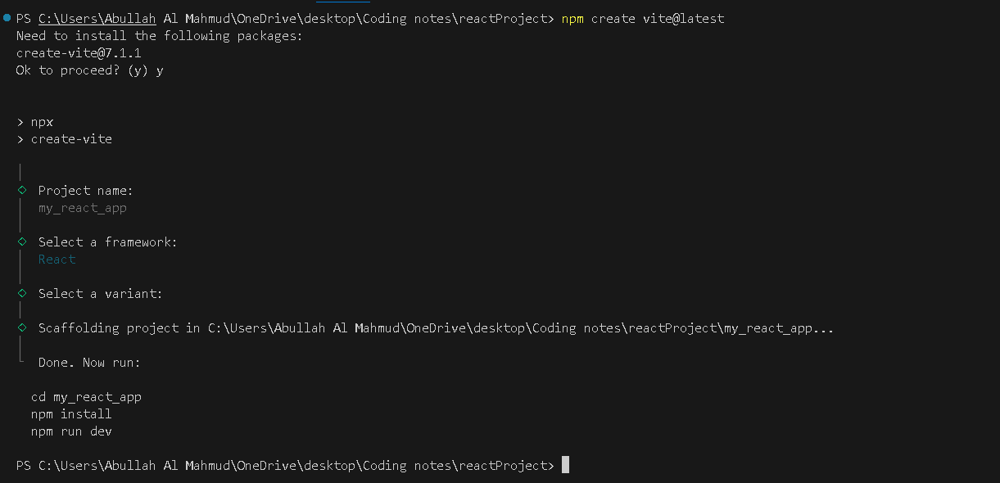
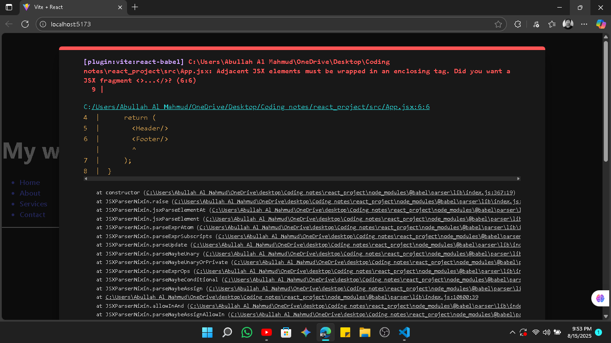

**React JS (by Bro code)**

<i style = "color:red">A specific amount of images got deleted due to some technical error, sorry for the inconvenience </i>

---
**Video link : [https://youtu.be/CgkZ7MvWUAA](https://youtu.be/CgkZ7MvWUAA)**

Pre reqs : HTML , CSS , JS

# Environment setup and Introduction
1. Install `Node.js`


2. Open project folder in vs code.
3. Go to terminal , write 
```cmd
npm create vite@latest
```
- Install vite 
- Name project
- Choose framework : React
- Choose languge : JavaScript



4. Open the project folder in terminal
5. write command 
```cmd
npm run dev
```
5. Click the localhost link
```
http://localhost:5173/
```
**Setup successful**
```
react_project/
├─ public/
│  └─ vite.svg
├─ src/  <---- We'll work here , most of the time.
│  ├─ assets/
│  │  └─ react.svg
│  ├─ App.css
│  ├─ App.jsx ( Component )
│  ├─ index.css
│  └─ main.jsx
├─ .gitignore
├─ eslint.config.js
├─ index.html
├─ package-lock.json
├─ package.json
├─ README.md
└─ vite.config.js
```

We're gonna use the `App.jsx` as the root component . We're gonna import other componts here.

First things first , delete the whole sample code in `App.jsx`.

- We're gonna make a `Components` folder to keep our other components.

```
src/  
  ├─ Components/ --- ( Some function based components )
  │  └─ header.jsx
  │  └─ component_1.jsx
  │  └─ component_2.jsx
  │  └─ component_3.jsx
  ├─ assets/
  │  └─ react.svg
  ├─ App.css
  ├─ App.jsx ( Component )
  ├─ index.css
  └─ main.jsx
```
**Basic setup**

These are function based components

* A function-based component is a simple JavaScript function.
* It returns JSX (what you want to show on screen).
* Use hooks like `useState` for data and `useEffect` for side tasks.
* It’s the most common and easy way to make components in React.

**App.jsx**
```jsx
function App() {
  return (/* component */);
}

export default App;
```

**Header.jsx**
```jsx
function Header() {
    
}

export default Header;
```

# Start coding

## Header component
`App.jsx` is the root folder , we're gonna import other components here.

**App.jsx**
```jsx
// src/App.jsx

// 1. We import the 'Header' component from a separate file.
// This is how we bring in other building blocks (components) to use here.
// './' means the current directory.
import Header from './Components/Header.jsx'

// 2. This is a functional component named 'App'.
// In React, a component is a reusable piece of UI (like a button, a form, or a whole page).
// 'App' is a common name for the main or root component of an application.
function App() {
    
    // 3. The 'return' statement is where we define what the component renders.
    // The code inside the parentheses is JSX (JavaScript XML), a syntax extension for JavaScript.
    // It looks like HTML but allows us to use JavaScript logic and components.
    return (
      // 4. Here, we are rendering our 'Header' component.
      // This is how we use a component we imported.
      // Think of it like a custom HTML tag.
      <Header/>
    );
}

// 5. We 'export' the 'App' component so it can be used in other files,
// typically in 'main.jsx' or 'index.js' where the application is "mounted" to the web page.
// 'default' means it's the primary thing this file exports.
export default App;
```
```jsx
import Header from './Components/Header.jsx'
function App() {
    return (
      <Header/>
    );
}

export default App;
```
**Components/Header.jsx**
```jsx
function Header() {
    return (
        <header>
            <h1>Mahmud</h1>
        </header>
    );
}

export default Header;
```
**Output**


***Congrats 🎉 , you just made a react component***

**Let's tweak the header component even more . like , making a navigation bar**

```jsx
function Header() {
    return (
        <header>
            <h1>My website</h1>

            <nav>
                <ul>
                    <a href="">
                        <li>Home</li>
                    </a>
                    <a href="">
                        <li>About</li>
                    </a>
                    <a href="">
                        <li>Services</li>
                    </a>
                    <a href="">
                        <li>Contact</li>
                    </a>
                </ul>
            </nav>

            <hr />
        </header>
    );
}

export default Header;
```

we don't have to make any edits in the `App.jsx` file , we're gonna just import `Header` from `./Components/Header.jsx`

```jsx
import Header from './Components/Header.jsx'
function App() {
    return (
      <Header/>
    );
}

export default App;
```


There's some pre-made stylings in the `index.css` file.

## Footer component
Open another component file , `./Components/Footer.jsx`

```jsx
function Footer() {
    return (
        <footer>
            <p>&copy my website</p>
        </footer>
    );
}

export default Footer;
```

Now in `App.jsx`

```jsx
import Header from './Components/Header.jsx'
import Footer from './Components/Footer.jsx'

function App() {
    return (
      <Header/>
      <Footer/>
    );
}

export default App;
```
import and return footer... This should work , right 😕 ?

Not really


> Adjacent JSX elements must be wrapped in an enclosing tag.

```jsx
import Header from './Components/Header.jsx'
import Footer from './Components/Footer.jsx'
function App() {
    return (
      // Just wrap it with an empty tag
      <> 
        <Header/>
        <Footer/>
      </>
    );
}

export default App;
```

Add a `date` object in the footer

use `{}` for js code in a component
```jsx
function Footer() {
    return (
        <footer>
            <p>&copy; {new Date().getFullYear()} my website</p>
        </footer>
    );
}

export default Footer;
```


## Using JS variables and methods

Create a `Food` component

```jsx
function Food() {

    const food1 = "Banana";
    const food2 = "Orange";
    const food3 = "Mango";

    return (

        <ul>
            <li>Apple</li>
            <li>{food1}</li>
            <li>{food2.toUpperCase()}</li>
            <li>{food3.toLocaleLowerCase()}</li>
        </ul>
    );
}

export default Food;
```

import it and done


***We can reuse , rearrange our components as we like.***

# Card component
Open file `Components/Card.jsx`

Include the picture in `assets` folder

> In react , we write `className` instead of `class`.

**Card.jsx**
```jsx
import profilePic from '../assets/pfp.jpg'

function Card() {
    return (
        <>
            <div className="card">
                
                <h2>Mahmud</h2>
                <p>Lorem ipsum dolor sit amet consectetur adipisicing elit. Quaerat quibusdam adipisci cumque necessitatibus doloremque molestias nemo neque deleniti esse dicta.</p>
            </div>
        </>
    );
}

export default Card;
```

Import in `App.jsx`


Needs some styling.

Style in `index.css` ( We're gonna delete everything and start from fresh )

**index.css**
```css
.card{
  border: solid 1px;
  border-radius: 10px;
  width: 300px;
  padding: 10px;
  box-shadow: 5px 5px 5px rgba(0, 0, 0, 0.413);
  margin: 10px auto;
}

.image{
  width: inherit;
  border-radius: 10px;
}
```


# Styling react components ( With css )

Not including external framework (like Tailwind / Bootstrap)

1. External (style in `index.css`)
2. Modules ( Creating a dedicated stylesheet for a component )
3. Inline

## Modules 
- Open a folder `Components/Button/`
- Inside it open `Button.jsx` and `Button.module.css`

**Button.jsx**
```jsx
import styles from './Button.module.css' // CSS file as a module

function Button() {
    return (
        // styles.class_name
        <button className={styles.button}>Click me</button>
    );
}

export default Button;
```
**Button.module.css**
```css
.button{
    border: none;
    padding: 10px;
    background-color: cornflowerblue;
    color: white;
    font-weight: bold;
    border-radius: 5px;
}
```

**App.jsx**
```jsx
import Button from "./Components/Button/Button.jsx";

function App() {
    return (
      <>
        <Button/>
      </>
    );
}

export default App;
```


## Inline

Delete the `Button.module.css` file. We won't need it anymore.

Work on `Button.jsx` (Make a `styles` object)

**Button.jsx**
```jsx

function Button() {
    const styles = {
        border: "none",
        padding: "10px",
        backgroundColor: "cornflowerblue",
        color: "white",
        fontWeight: "bold",
        borderRadius: "5px"
    }

    return (
        <button style={styles}>Click me</button>
    );
}

export default Button;
```
**Output : A blue button**

# Props

- Read only properties that are shared between components
- A parent component can send data to a child component
```jsx
<component key = value>
```

Open file `Components/Student.jsx`

```jsx
function Student(prop) { // Kinda works like class (OOP).
    return (
        <div>
            <p>Name : {prop.name} </p>
            <p>Age : {prop.age} </p>
            <p>Department : {prop.dept} </p>
        </div>
    );
}

export default Student;
```

**App.jsx**
```jsx
import Student from "./Components/Student.jsx";

function App() {
    return (
      <>
        <Student name = "Mahmud" age = '21' dept = "CSE"/>
      </>
    );
}

export default App;
```


## propTypes

A mechanism that ensures that the passed value is of the correct datatype. ( Mainly used for debugging purpose )

```
age : propType.number
```

*Will learn later*

## Default props

Default values for props , incase they're not passed from the parent component.

*Will learn later*


# Conditional rendering

Rendering something on DOM based on a condition.

Open folder `Components/UserGreeting.jsx` 
**UserGreeting.jsx**
```jsx
function UserGreeting(props) {
    if(props.isLoggedIn){
        return (
            <h1>Welcome {props.userName}</h1>
        );
    }
    else{
        return(
            <h1>Please log in</h1>
        );
    }
}

export default UserGreeting;
```

**App.jsx**
```jsx
import UserGreeting from "./Components/UserGreeting.jsx"

function App() {
  return (
    <>
      <UserGreeting isLoggedIn={true} userName="Mahmud" />
    </>
  );
}

export default App
```
**Output : It's obvious 😒**

***Even better , use ternary operator***
```jsx
function UserGreeting(props) {
  return (
    <>
    {props.isLoggedIn ? <h1>Welcome {props.userName}</h1> : <h1>Please log in</h1>}
    </>
  );
}

export default UserGreeting;
```