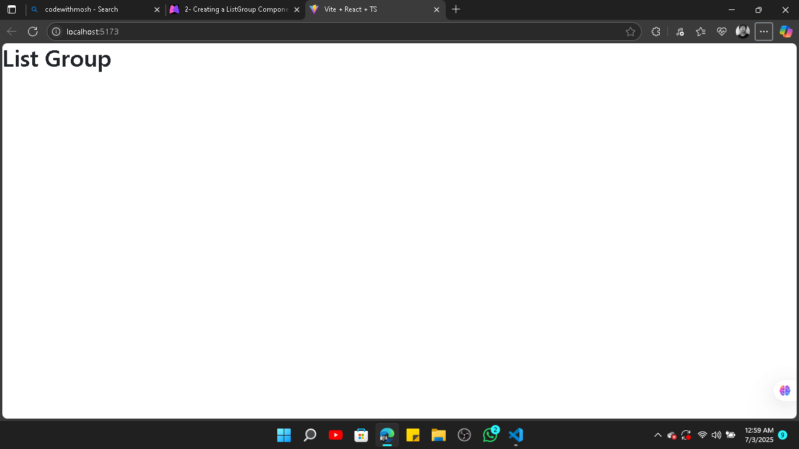

# React JS

**By Mosh Hamedani**
[Repo : The codes used in this course](https://github.com/mosh-hamedani/react-course-part1)

**Prerequisites**

- HTML
- CSS
- jS
- Typescript (Optional)

## Environment setup (VS code)

Gotta install nodeJS version 16+


after installing , check


> `Prettier` vscode extention is recommended. (Settngs > Enable `Format on save`)

## What's react ?

React is a JavaScript library that helps you build user interfaces, especially the front-end of web apps. Instead of messing with `document.createElement` or a bunch of DOM code, React lets you build stuff using components—small, reusable pieces of code that return HTML-looking syntax called JSX. It updates the UI automatically when data changes, so you don’t have to manually control what changes where. Basically, it makes your web apps faster, cleaner, and way easier to manage once things get big.

## First react app

There are two tools for it

- Create react app (CRA)
- Vite
  We're gonna use vite.
  **Start**

* Open **CMD** and navigate to the folder where you want your project:

  ```bash
  cd "C:\Users\YourName\Path\To\Folder"
  ```

* Run the Vite project setup command:

  ```bash
  npm create vite@latest
  ```

* When prompted:

  - 📦 Enter a **project name** (e.g., `first_react_app`)
  - ⚛️ Select **React** as the framework
  - 🟦 Choose **TypeScript** or **JavaScript** (you picked TypeScript)

* Once done, navigate into your new project folder:

  ```bash
  cd first_react_app
  ```

* Install the dependencies:

  ```bash
  npm install
  ```

* Start the dev server:

  ```bash
  npm run dev
  ```

* ✅ Your app will be live on something like `http://localhost:5173`


**This is what the folder looks like with the installed packeges**


Now go touch grass after seeing that sweet React welcome screen 🌱

## Create a react component

Extension : .ts (Used for typscript) , **.tsx (Used for typescript based react components)**

1. first , open a new .tsx file in the src folder
   

2. The `app.tsx` is the main folder

3. Write some code in the `messege.tsx` file. (Testing)

**We're making a function based component**

```js
// Defining a functional React component named Messege
function Messege() {
  // JSX (JavaScript XML): This lets us write HTML-like syntax in JS
  return <h1>Hello world</h1>; // Renders an <h1> element with "Hello world"
}

// Exporting the Messege component as the default export from this file
export default Messege;
```

4. Import `Messege` to `App.tsx`;

**App.tsx**

```tsx
import Messege from "./messege";

function App() {
  return (
    <div>
      <Messege />
    </div>
  );
}

export default App; // So , it can be used somewhere else.
```

5. Run it like this

- Go to terminal (powershell)
- Locate the file (cd filepath)
- type `Set-ExecutionPolicy -Scope Process -ExecutionPolicy Bypas'`
  > just for this terminal session, don’t block script files. Let me run what I want (like npm.ps1). I’m grown.”
- then type `npm run dev`
- Follow the `localhost` link
  

### How does react work

[Video : You won't understand it at first](https://youtu.be/7YhdqIR2Yzo)

---

### Creating a ListGroup component

1. First , we're gonna install `bootstrap`

- powershell > Locate file > `npm install bootstrap@latest`

```
PS C:\Users\Abullah Al Mahmud\OneDrive\Desktop\Coding notes\first_react_app> npm install bootstrap@latest
>>

added 2 packages, and audited 193 packages in 31s

50 packages are looking for funding
  run `npm fund` for details

found 0 vulnerabilities
```

2. Now go to `main.tsx`

```tsx
import { StrictMode } from "react";
import { createRoot } from "react-dom/client";
import "./index.css";
import App from "./App.tsx";

createRoot(document.getElementById("root")!).render(
  <StrictMode>
    <App />
  </StrictMode>
);
```

We're gonna work on this

```tsx
import "./index.css";
```

Replace with

```tsx
import "bootstrap/dist/css/bootstrap.css";
```

**Before replacing**


**After**


**I just opened a new file called `listGroup.tsx`**

**listGroup.tsx**

```tsx
function ListGroup() {
  return <h1>List Group</h1>;
}

export default ListGroup;
```

**App.tsx**

```tsx
import ListGroup from "./Components/listGroup";

function App() {
  return (
    <div>
      <ListGroup />
    </div>
  );
}

export default App; // So , it can be used somewhere else.
```

**Localhost**

;

As we can see , the Header is live. Now we have to add a bootstrap list group.

**Go to ➡️** [Bootstrap listGroup](https://getbootstrap.com/docs/4.0/components/list-group/)

- Copy the code.
- Paste it into `listGroup.tsx` and modify it a bit. (Class -> className)

**Paste it and use prettier code formatter to format it (ctrl + shift + p > Search : format document > Choose prettier)**

```tsx
function ListGroup() {
  return (
    <ul className="list-group">
      <li className="list-group-item">Cras justo odio</li>
      <li className="list-group-item">Dapibus ac facilisis in</li>
      <li className="list-group-item">Morbi leo risus</li>
      <li className="list-group-item">Porta ac consectetur ac</li>
      <li className="list-group-item">Vestibulum at eros</li>
    </ul>
  );
}

export default ListGroup;
```

**Output**


### Fragment

```tsx
function ListGroup() {
  return (
    <ul className="list-group">
      <li className="list-group-item">Cras justo odio</li>
      <li className="list-group-item">Dapibus ac facilisis in</li>
      <li className="list-group-item">Morbi leo risus</li>
      <li className="list-group-item">Porta ac consectetur ac</li>
      <li className="list-group-item">Vestibulum at eros</li>
    </ul>
  );
}
```

What if , I want to add a heading on top .

```tsx
function ListGroup() {
  return (
    <h1>List</h1> // Here
    <ul className="list-group">
      <li className="list-group-item">Cras justo odio</li>
      <li className="list-group-item">Dapibus ac facilisis in</li>
      <li className="list-group-item">Morbi leo risus</li>
      <li className="list-group-item">Porta ac consectetur ac</li>
      <li className="list-group-item">Vestibulum at eros</li>
    </ul>
  );
}
```

> **Error : JSX expressions must have one parent element.ts(2657)**

Because you can’t return **two sibling JSX elements** without wrapping them in a **single parent**.

You’re doing this:

```tsx
return (
  <h1>List</h1>   ❌
  <ul>...</ul>     ❌
);
```

---

**✅ Fix:**

Wrap them with a parent — either a `<div>` or a `<fragment`:

```tsx
return (
  <div>
    {" "}
    // jsx can have only one root element.
    <h1>List</h1>
    <ul className="list-group">
      <li className="list-group-item">Cras justo odio</li>
      <li className="list-group-item">Dapibus ac facilisis in</li>
      <li className="list-group-item">Morbi leo risus</li>
      <li className="list-group-item">Porta ac consectetur ac</li>
      <li className="list-group-item">Vestibulum at eros</li>
    </ul>
  </div>
);
```

No more drama. JSX needs **one root element** — that’s the golden rule.

Let's use fragment on it

```tsx
import { Fragment } from "react";

function ListGroup() {
  return (
    <Fragment>
      <h1>List</h1>
      <ul className="list-group">
        <li className="list-group-item">Cras justo odio</li>
        <li className="list-group-item">Dapibus ac facilisis in</li>
        <li className="list-group-item">Morbi leo risus</li>
        <li className="list-group-item">Porta ac consectetur ac</li>
        <li className="list-group-item">Vestibulum at eros</li>
      </ul>
    </Fragment>
  );
}

export default ListGroup;
```

**Or we can just do this**

```tsx
function ListGroup() {
  return (
    <>
      <h1>List</h1>
      <ul className="list-group">
        <li className="list-group-item">Cras justo odio</li>
        <li className="list-group-item">Dapibus ac facilisis in</li>
        <li className="list-group-item">Morbi leo risus</li>
        <li className="list-group-item">Porta ac consectetur ac</li>
        <li className="list-group-item">Vestibulum at eros</li>
      </ul>
    </>
  );
}

export default ListGroup;
```


### Rendering list

What if we create an array an render it as a list in react.

```tsx
let array = ["Apple", "Banana", "Pineapple"];

function ListGroup() {
  return (
    <>
      <h1>List</h1>
      <ul className="list-group">
        {array.map(
          (
            item // Mapping each item as a `li`
          ) => (
            <li className="list-group-item">{item}</li>
          )
        )}
      </ul>
    </>
  );
}

export default ListGroup;
```

After running this , go to inspect

```
Error :
react-dom-client.development.js:24027  Each child in a list should have a unique "key" prop.

Check the render method of `ListGroup`. See https://react.dev/link/warning-keys for more information.
```

**Each child in a list should have a unique "key" prop**

React uses the `key` prop to **track each item** in a list when updating the DOM.

If you don’t give a unique `key`, React can get confused during re-renders — like accidentally updating the wrong `<li>`, or messing up animations.

So when mapping, always do:

```tsx
array.map((item) => <li key={item}>{item}</li>);
```

🔑 TL;DR: `key` helps React know **"which list item is which"** — so updates don’t go wonky.


### Conditional rendering

If the list is empty generate a messege.

```tsx
let array = ["Apple", "Banana", "Pineapple"];

function ListGroup() {
  return (
    <>
      <h1>List</h1>
      <ul className="list-group">
        if(array.length == 0){<p>No items found</p>}
        {array.map(
          (
            item // Mapping each item as a `li`
          ) => (
            <li className="list-group-item">{item}</li>
          )
        )}
      </ul>
    </>
  );
}

export default ListGroup;
```

💀💀💀

- JSX can’t handle `if () {}` directly inside return
- Use ternary or `&&` for conditional rendering [Visit GFG](https://www.geeksforgeeks.org/reactjs-conditional-rendering/)
- Always wrap mapped `<li>`s in a parent tag only **if** there's content

```tsx
let array = ["Apple", "Banana", "Pineapple", "Orange"];

function ListGroup() {
  return array.length === 0 ? (
    <p>No item found</p>
  ) : (
    <>
      <h1>List</h1>
      <ul className="list-group">
        {array.map((item) => {
          return (
            <li className="list-group-item" key={item}>
              {item}
            </li>
          );
        })}
      </ul>
    </>
  );
}

export default ListGroup;
```


### Handling events

When we click on an item on the list , it should appear on the console.

```js
let array = ["Apple", "Banana", "Pineapple", "Orange"];

function ListGroup() {
  return array.length === 0 ? (
    <p>No item found</p>
  ) : (
    <>
      <h1>List</h1>
      <ul className="list-group">
        {array.map((item) => {
          return (
            <li
              className="list-group-item"
              key={item}
              onClick={() => console.log(item)} // Added an onClick event
            >
              {item}
            </li>
          );
        })}
      </ul>
    </>
  );
}

export default ListGroup;
```

This React component `ListGroup` checks if the `array` is empty — if yes, it shows “No item found.” Otherwise, it displays a list of items like "Apple", "Banana", etc. Each item is rendered as a clickable `<li>`; when you click on one, it logs the item’s name (like `"Banana"`) to the browser console. So it's a simple interactive list with click feedback.

**What if we use `event` as a parameter of the arrow function inside the click event**

```js
onClick={(event) => console.log(event)} // log event
```

SyntheticBaseEvent = React’s custom, safe version of browser events.
It looks and behaves like a regular event, but it's Reactified.

```
SyntheticBaseEvent {
  _reactName: "onClick",
  _targetInst: null,
  type: "click",
  nativeEvent: PointerEvent,
  target: li.list-group-item,
  altKey: false,
  bubbles: true,
  button: 0,
  buttons: 0,
  cancelable: true,
  clientX: 195,
  clientY: 67,
  ctrlKey: false,
  currentTarget: null,
  defaultPrevented: false,
  detail: 1,
  eventPhase: 3,
  getModifierState: ƒ modifierStateGetter(keyArg),
  isDefaultPrevented: ƒ functionThatReturnsFalse(),
  isPropagationStopped: ƒ functionThatReturnsFalse(),
  isTrusted: true,
  metaKey: false,
  movementX: 0,
  movementY: 0,
  pageX: 195,
  pageY: 67,
  relatedTarget: null,
  screenX: 217,
  screenY: 201,
  shiftKey: false,
  target: li.list-group-item,
  timeStamp: 358644,
  type: "click",
  view: Window,
  [[Prototype]]: Object
}
```

> **You'll get a bigass object dump** in your console if you `console.log(event)` from an `onClick`.
> Don’t freak out — it’s just React being React. Scroll through that monster and you’ll find your treasure.

When building larger projects, defining functions like `onClick={() => console.log(item)}` directly inside JSX can clutter the code and hurt readability. To keep things clean and maintainable, it’s better to define such functions outside (or at least as a named function inside the component) and just reference them in the JSX.

```js
const handleClick = (event) => console.log(event);
```

> Warning : Parameter 'event' implicitly has an 'any' type.ts(7006)

That warning means TypeScript doesn’t know what type `event` is, so it assumes it's `any`, which defeats the purpose of using TypeScript. To fix it, you should **explicitly type the parameter**.

```js
// ✅ Importing MouseEvent type from React to explicitly type the event parameter
import type { MouseEvent } from "react";

let array = ["Apple", "Banana", "Pineapple", "Orange"];

// ✅ Explicitly typing the event parameter as MouseEvent fixes the TS(7006) warning
const handleClick = (event: MouseEvent) => console.log(event);

function ListGroup() {
  return array.length === 0 ? (
    <p>No item found</p>
  ) : (
    <>
      <h1>List</h1>
      <ul className="list-group">
        {array.map((item) => {
          return (
            <li
              className="list-group-item"
              key={item}
              // ✅ Passing the typed handler here ensures proper type inference for the event
              onClick={handleClick}
            >
              {item}
            </li>
          );
        })}
      </ul>
    </>
  );
}

export default ListGroup;
```

### Managing state

When I select a list item , it'll be highlighted

```js
className = "list-group-item active"; // Added 'active' class
```


Every element is highlighted , Not what i wanted 😑

TO do that we have to create a variable to _keep track of the index of the selected item_.

```js
let selectedIndex = -1;
```

`selectedIndex = -1` means no item is selected yet—since array indexes start from 0, -1 is used as a default to indicate "nothing chosen" before the user makes a selection.

Use conditional rendering on the list

```js
className={selectedIndex === index ? 'list-group-item active' : 'list-group-item'}
```

Now we have to handle the click event : Click => Highlight (selectedIndex = index)

```js
<li
  className={selectedIndex === index ? 'list-group-item active' : 'list-group-item'}
  key={item}
  onClick={() => {
  selectedIndex = index; // Expected to change selectedIndex
}}
>
```
But , when i click on an element , **nothing changes**

**Why it doesn’t work:**
Because `selectedIndex` is just a regular variable, React doesn’t know it changed, so it won’t re-render the component to show the new selection. React only updates the UI when **state or props** change, not when plain variables get reassigned.

**How to fix it:**
Use React’s `useState` hook to store `selectedIndex` as state. Then, when you update it with the setter function, React knows to re-render the component and update the UI accordingly. This keeps your UI synced with the selection changes.

`useState(-1)` returns an array where the first element is the state variable (like `selectedIndex`), and the second is a function to update that state (like `setSelectedIndex`). You use array destructuring to grab them, so React can track changes and re-render your component when the state updates.

```js
import { useState } from "react";

let array = ["Apple", "Banana", "Pineapple", "Orange"];

function ListGroup() {
  // -1 is the initial state (index -1)
  const [selectedIndex, setSelectedIndex] = useState(-1);
  
  return array.length === 0 ? (
    <p>No item found</p>
  ) : (
    <>
      <h1>List</h1>
      <ul className="list-group">
        {array.map((item, index) => {
          return (
            <li
              className={
                selectedIndex === index
                  ? "list-group-item active"
                  : "list-group-item"
              }
              key={item}
              onClick={() => {
                setSelectedIndex(index); // Call
              }}
            >
              {item}
            </li>
          );
        })}
      </ul>
    </>
  );
}

export default ListGroup;
```


If you add another `ListGroup` component in your `App.tsx`, each instance will have its own separate `selectedIndex` state because React hooks like `useState` are scoped to the individual component instance. That means both lists will share the same structure and behavior but maintain independent selections — clicking an item in one list won’t affect the other. So you get two identical UI blocks working separately, each tracking its own active item without interfering with each other. React’s component-based design makes this super easy and clean.

### Passing data via props

What if we want to create a list of something else , like colors. We're not gonna make another component , We're gonna reuse this `ListGroup` component

When i change the items to colors , the heading will also change

To do all these , there's a typescript feature called interface. 
```js
import { useState } from "react";

let array = ["Apple", "Banana", "Pineapple", "Orange","kiwi"];
interface ListGroupProps {
  items : string[];
  heading : string;
}
function ListGroup() {
  // -1 is the initial state (index -1)
  const [selectedIndex, setSelectedIndex] = useState(-1);
  
  return array.length === 0 ? (
    <p>No item found</p>
  ) : (
    <>
      <h1>List</h1>
      <ul className="list-group">
        {array.map((item, index) => {
          return (
            <li
              className={
                selectedIndex === index
                  ? "list-group-item active"
                  : "list-group-item"
              }
              key={item}
              onClick={() => {
                setSelectedIndex(index); // Call
              }}
            >
              {item}
            </li>
          );
        })}
      </ul>
    </>
  );
}

export default ListGroup;
```
Alright, here’s the explanation for just the `interface` part in your code.

---

**TypeScript Interface: ListGroupProps**

```ts
interface ListGroupProps {
  items: string[];
  heading: string;
}
```

*Purpose*

* This interface defines the shape (structure) of the props expected by a component named `ListGroup`.
* It’s a contract that ensures type safety when the component is used.

*Fields*

* `items: string[]`
  Expects an array of strings. This would typically be the list items to render (e.g., fruits).

* `heading: string`
  Expects a string. Used for displaying a heading or title above the list.

---

**Issue in Current Code**

* The `ListGroupProps` interface is defined, but not actually used.
* The component `ListGroup` does **not** take any props currently. It's using a hardcoded `array` and `h1` instead.

---

**Expected Usage**

Here’s how it *should* be used:

```ts
function ListGroup({ items, heading }: ListGroupProps) {
  // now use `items` instead of `array`
}
```

* This would allow the list content and heading to be dynamic and passed from a parent component.

If i write these parameters in the function and check on App.tsx If you write the parameters like this:

```ts
function ListGroup(prop: ListGroupProps) {
```

...and then check in `App.tsx`, you'll **access the props using `prop.items` and `prop.heading`**, not directly as `items` and `heading`.
So if you wrote the JSX like this inside the component:

```tsx
<h1>{heading}</h1>
```

**It will throw an error, because `heading` is not defined in the current scope. You'd have to write:**

```tsx
<h1>{prop.heading}</h1>
```

OR

You can destructure the props inside the parameter like this instead:

```ts
function ListGroup({ items, heading }: ListGroupProps) {
```

This way, you can access `items` and `heading` directly without the `prop.` prefix.

Let me know if you wanna see the `App.tsx` example to complete the whole usage chain.
```js
import { useState } from "react";

interface ListGroupProps {
  item : string[];
  heading : string;
}

function ListGroup({item,heading}: ListGroupProps) {
  // -1 is the initial state (index -1)
  const [selectedIndex, setSelectedIndex] = useState(-1);
  
  return item.length === 0 ? (
    <p>No item found</p>
  ) : (
    <>
      <h1>{heading}</h1>
      <ul className="list-group">
        {item.map((item, index) => {
          return (
            <li
              className={
                selectedIndex === index
                  ? "list-group-item active"
                  : "list-group-item"
              }
              key={item}
              onClick={() => {
                setSelectedIndex(index); // Call
              }}
            >
              {item}
            </li>
          );
        })}
      </ul>
    </>
  );
}

export default ListGroup;
```
**Moved the array from listGroup.tsx to App.tsx**
**App.tsx**
```js
import ListGroup from "./Components/listGroup"

function App() {
    let array = ["Apple", "Banana", "Pineapple", "Orange","kiwi"]; // Here

    return <div><ListGroup item={array} heading="Fruits"/></div>
}

export default App; 
```
You're leveraging **props and typing** in a way that makes `ListGroup` **reusable** with any string array. Let’s break down exactly how and why this works:

---

**Why `item: string[]` makes the component reusable**

* Your interface:

  ```ts
  interface ListGroupProps {
    item: string[];
    heading: string;
  }
  ```

  says:
  *“Hey, this component accepts any array of strings and a string heading.”*

* So you can pass in:

  ```ts
  let cars = ["Toyota", "BMW", "Tesla"];
  ...
  <ListGroup item={cars} heading="Car Brands" />
  ```

* Or:

  ```ts
  let languages = ["Python", "C++", "Rust"];
  ...
  <ListGroup item={languages} heading="Languages I Fear" />
  ```

---

**In short:**

* `item={array}` in `App.tsx` just passes a variable.
* That variable can be **any array of strings**.
* As long as you pass it to a prop named `item`, you're good.

---

**Optional Tip**

If you want to make it even more flexible in the future (e.g., list of numbers, or objects), you could make the component generic — but for now, for string-based lists, you're doing it perfectly.

Let me know if you wanna see how to make it support objects or more complex data types.

**We could import the array instead of bringing it in App.tsx**
```ts
import { useState } from "react";

interface ListGroupProps {
  item : string[];
  heading : string;
}

let array = ["Apple", "Banana", "Pineapple", "Orange","kiwi"];  // Array (Global)

function ListGroup({item,heading}: ListGroupProps) {
  const [selectedIndex, setSelectedIndex] = useState(-1);
  
  return item.length === 0 ? (
    <p>No item found</p>
  ) : (
    <>
      <h1>{heading}</h1>
      <ul className="list-group">
        {item.map((item, index) => {
          return (
            <li
              className={
                selectedIndex === index
                  ? "list-group-item active"
                  : "list-group-item"
              }
              key={item}
              onClick={() => {
                setSelectedIndex(index); // Call
              }}
            >
              {item}
            </li>
          );
        })}
      </ul>
    </>
  );
}

export default ListGroup;
export {array} 
```
```ts
import ListGroup from "./Components/listGroup"
import { array } from "./Components/listGroup";

function App() {
    return <div><ListGroup item={array} heading="Fruits"/></div>
}

export default App; // So , it can be used somewhere else.
```

### Passing function via props
The list items highlight when we click on them, This time they should call a function when we select them , Like each item should return it's name to the console.

```ts
interface ListGroupProps {
  item : string[];
  heading : string;
  onSelect : (item : string) => void;
}
```
`(item: string) => void` is the standard way to type a **function that takes a string and returns nothing** — super common in React with TypeScript when passing callbacks like `onClick`, `onChange`, etc.

Don't forget to pass the `onSelect` prop as a parameter:
```ts
function ListGroup({item,heading,onSelect}: ListGroupProps) {
```
We have to call the function in `onClick` in the listgroup component
```ts
key={item}
onClick={() => {
  setSelectedIndex(index); 
  onSelect(item);
}}
```
Now , in the App.tsx we have to define the function , we can write an inline function like this :
```ts
return <div><ListGroup item={array} heading="Fruits" onSelect={(array) => console.l(array)}/></div>
```
OR, Define a seperate funtion function and pass it in:
```ts
import ListGroup from "./Components/listGroup"
import { array } from "./Components/listGroup";

let handleSelect = (array:string) => console.log(array)


function App() {
    return <div><ListGroup item={array} heading="Fruits" onSelect={handleSelect}/></div>
}

export default App; // So , it can be used somewhere else.
``` 

### Props vs State
| **Feature**           | **PROPS**                                                                 | **STATE**                                                                |
| --------------------- | ------------------------------------------------------------------------- | ------------------------------------------------------------------------ |
| **Definition**        | Props are external data passed *into* a component from its parent.        | State is internal data *managed* by the component itself.                |
| **Analogy**           | Think of props like **function parameters** — they come from the outside. | Think of state like **local variables** — controlled and updated within. |
| **Mutability**        | Props are **read-only** — the child component cannot change them.         | State is **mutable** — it can be updated using hooks like `useState()`.  |
| **Trigger Re-render** | Yes — if parent props change, the component **re-renders**.               | Yes — updating state using its setter **re-renders** the component.      |

### Passing children
**Recommended extension : ES7+ React/Redux/React-Native snippets**

Create a new component `Alert.tsx` and define the function:

```ts
export const Alert = () => {
  return (
    <div>Alert</div>
  )
}
```
You can generate it by just typing `rafce` (Snippet)
> A feature of the extension (ES7+ React/Redux/React-Native snippets)

**App.tsx**
```ts
import Alert from "./Components/Alert"

const App = () => {
  return (
    <div className="alert alert-danger"><Alert/></div>
  )
}

export default App
```
