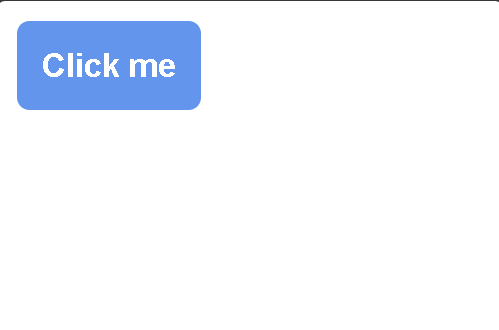
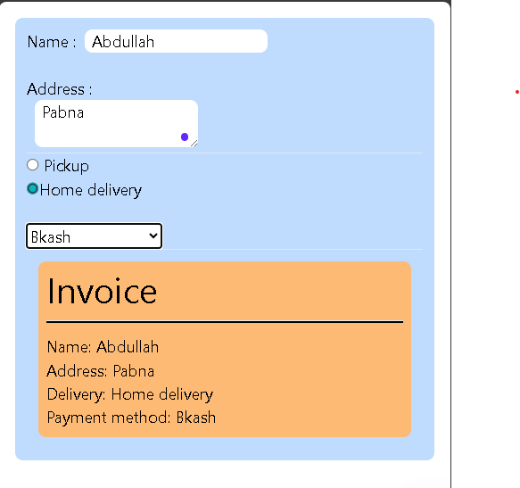

**React JS (by Bro code)**

<i style = "color:red">A specific amount of images got deleted due to some technical error, sorry for the inconvenience </i>

---

**Video link : [https://youtu.be/CgkZ7MvWUAA](https://youtu.be/CgkZ7MvWUAA)**

Pre reqs : HTML , CSS , JS

# Environment setup and Introduction

1. Install `Node.js`


2. Open project folder in vs code.
3. Go to terminal , write

```cmd
npm create vite@latest
```

- Install vite
- Name project
- Choose framework : React
- Choose languge : JavaScript


4. Open the project folder in terminal
5. write command

```cmd
npm run dev
```

5. Click the localhost link

```
http://localhost:5173/
```

**Setup successful**

```
react_project/
├─ public/
│  └─ vite.svg
├─ src/  <---- We'll work here , most of the time.
│  ├─ assets/
│  │  └─ react.svg
│  ├─ App.css
│  ├─ App.jsx ( Component )
│  ├─ index.css
│  └─ main.jsx
├─ .gitignore
├─ eslint.config.js
├─ index.html
├─ package-lock.json
├─ package.json
├─ README.md
└─ vite.config.js
```

We're gonna use the `App.jsx` as the root component . We're gonna import other componts here.

First things first , delete the whole sample code in `App.jsx`.

- We're gonna make a `Components` folder to keep our other components.

```
src/
  ├─ Components/ --- ( Some function based components )
  │  └─ header.jsx
  │  └─ component_1.jsx
  │  └─ component_2.jsx
  │  └─ component_3.jsx
  ├─ assets/
  │  └─ react.svg
  ├─ App.css
  ├─ App.jsx ( Component )
  ├─ index.css
  └─ main.jsx
```

**Basic setup**

These are function based components

- A function-based component is a simple JavaScript function.
- It returns JSX (what you want to show on screen).
- Use hooks like `useState` for data and `useEffect` for side tasks.
- It’s the most common and easy way to make components in React.

**App.jsx**

```jsx
function App() {
  return (/* component */);
}

export default App;
```

**Header.jsx**

```jsx
function Header() {}

export default Header;
```

# Start coding

## Header component

`App.jsx` is the root folder , we're gonna import other components here.

**App.jsx**

```jsx
// src/App.jsx

// 1. We import the 'Header' component from a separate file.
// This is how we bring in other building blocks (components) to use here.
// './' means the current directory.
import Header from "./Components/Header.jsx";

// 2. This is a functional component named 'App'.
// In React, a component is a reusable piece of UI (like a button, a form, or a whole page).
// 'App' is a common name for the main or root component of an application.
function App() {
  // 3. The 'return' statement is where we define what the component renders.
  // The code inside the parentheses is JSX (JavaScript XML), a syntax extension for JavaScript.
  // It looks like HTML but allows us to use JavaScript logic and components.
  return (
    // 4. Here, we are rendering our 'Header' component.
    // This is how we use a component we imported.
    // Think of it like a custom HTML tag.
    <Header />
  );
}

// 5. We 'export' the 'App' component so it can be used in other files,
// typically in 'main.jsx' or 'index.js' where the application is "mounted" to the web page.
// 'default' means it's the primary thing this file exports.
export default App;
```

```jsx
import Header from "./Components/Header.jsx";
function App() {
  return <Header />;
}

export default App;
```

**Components/Header.jsx**

```jsx
function Header() {
  return (
    <header>
      <h1>Mahmud</h1>
    </header>
  );
}

export default Header;
```

**Output**


**_Congrats 🎉 , you just made a react component_**

**Let's tweak the header component even more . like , making a navigation bar**

```jsx
function Header() {
  return (
    <header>
      <h1>My website</h1>

      <nav>
        <ul>
          <a href="">
            <li>Home</li>
          </a>
          <a href="">
            <li>About</li>
          </a>
          <a href="">
            <li>Services</li>
          </a>
          <a href="">
            <li>Contact</li>
          </a>
        </ul>
      </nav>

      <hr />
    </header>
  );
}

export default Header;
```

we don't have to make any edits in the `App.jsx` file , we're gonna just import `Header` from `./Components/Header.jsx`

```jsx
import Header from "./Components/Header.jsx";
function App() {
  return <Header />;
}

export default App;
```


There's some pre-made stylings in the `index.css` file.

## Footer component

Open another component file , `./Components/Footer.jsx`

```jsx
function Footer() {
  return (
    <footer>
      <p>&copy my website</p>
    </footer>
  );
}

export default Footer;
```

Now in `App.jsx`

```jsx
import Header from './Components/Header.jsx'
import Footer from './Components/Footer.jsx'

function App() {
    return (
      <Header/>
      <Footer/>
    );
}

export default App;
```

import and return footer... This should work , right 😕 ?

Not really


> Adjacent JSX elements must be wrapped in an enclosing tag.

```jsx
import Header from "./Components/Header.jsx";
import Footer from "./Components/Footer.jsx";
function App() {
  return (
    // Just wrap it with an empty tag
    <>
      <Header />
      <Footer />
    </>
  );
}

export default App;
```

Add a `date` object in the footer

use `{}` for js code in a component

```jsx
function Footer() {
  return (
    <footer>
      <p>&copy; {new Date().getFullYear()} my website</p>
    </footer>
  );
}

export default Footer;
```


## Using JS variables and methods

Create a `Food` component

```jsx
function Food() {
  const food1 = "Banana";
  const food2 = "Orange";
  const food3 = "Mango";

  return (
    <ul>
      <li>Apple</li>
      <li>{food1}</li>
      <li>{food2.toUpperCase()}</li>
      <li>{food3.toLocaleLowerCase()}</li>
    </ul>
  );
}

export default Food;
```

import it and done


**_We can reuse , rearrange our components as we like._**

# Card component

Open file `Components/Card.jsx`

Include the picture in `assets` folder

> In react , we write `className` instead of `class`.

**Card.jsx**

```jsx
import profilePic from "../assets/pfp.jpg";

function Card() {
  return (
    <>
      <div className="card">
        
        <h2>Mahmud</h2>
        <p>
          Lorem ipsum dolor sit amet consectetur adipisicing elit. Quaerat
          quibusdam adipisci cumque necessitatibus doloremque molestias nemo
          neque deleniti esse dicta.
        </p>
      </div>
    </>
  );
}

export default Card;
```

Import in `App.jsx`


Needs some styling.

Style in `index.css` ( We're gonna delete everything and start from fresh )

**index.css**

```css
.card {
  border: solid 1px;
  border-radius: 10px;
  width: 300px;
  padding: 10px;
  box-shadow: 5px 5px 5px rgba(0, 0, 0, 0.413);
  margin: 10px auto;
}

.image {
  width: inherit;
  border-radius: 10px;
}
```


# Styling react components ( With css )

Not including external framework (like Tailwind / Bootstrap)

1. External (style in `index.css`)
2. Modules ( Creating a dedicated stylesheet for a component )
3. Inline

## Modules

- Open a folder `Components/Button/`
- Inside it open `Button.jsx` and `Button.module.css`

**Button.jsx**

```jsx
import styles from "./Button.module.css"; // CSS file as a module

function Button() {
  return (
    // styles.class_name
    <button className={styles.button}>Click me</button>
  );
}

export default Button;
```

**Button.module.css**

```css
.button {
  border: none;
  padding: 10px;
  background-color: cornflowerblue;
  color: white;
  font-weight: bold;
  border-radius: 5px;
}
```

**App.jsx**

```jsx
import Button from "./Components/Button/Button.jsx";

function App() {
  return (
    <>
      <Button />
    </>
  );
}

export default App;
```



## Inline

Delete the `Button.module.css` file. We won't need it anymore.

Work on `Button.jsx` (Make a `styles` object)

**Button.jsx**

```jsx
function Button() {
  const styles = {
    border: "none",
    padding: "10px",
    backgroundColor: "cornflowerblue",
    color: "white",
    fontWeight: "bold",
    borderRadius: "5px",
  };

  return <button style={styles}>Click me</button>;
}

export default Button;
```

**Output : A blue button**

# Props

- Read only properties that are shared between components
- A parent component can send data to a child component

```jsx
<component key = value>
```

Open file `Components/Student.jsx`

```jsx
function Student(prop) {
  // Kinda works like class (OOP).
  return (
    <div>
      <p>Name : {prop.name} </p>
      <p>Age : {prop.age} </p>
      <p>Department : {prop.dept} </p>
    </div>
  );
}

export default Student;
```

**App.jsx**

```jsx
import Student from "./Components/Student.jsx";

function App() {
  return (
    <>
      <Student name="Mahmud" age="21" dept="CSE" />
    </>
  );
}

export default App;
```


## propTypes

A mechanism that ensures that the passed value is of the correct datatype. ( Mainly used for debugging purpose )

If you can't find the file `prop-types` in the node module.

```
npm install prop-types
```

```
age : propType.number
```

_Irrelevent after version 19+_

## Default props

Default values for props , incase they're not passed from the parent component.

_Irrelevent after version 19+_

# Conditional rendering

Rendering something on DOM based on a condition.

Open folder `Components/UserGreeting.jsx`
**UserGreeting.jsx**

```jsx
function UserGreeting(props) {
  if (props.isLoggedIn) {
    return <h1>Welcome {props.userName}</h1>;
  } else {
    return <h1>Please log in</h1>;
  }
}

export default UserGreeting;
```

**App.jsx**

```jsx
import UserGreeting from "./Components/UserGreeting.jsx";

function App() {
  return (
    <>
      <UserGreeting isLoggedIn={true} userName="Mahmud" />
    </>
  );
}

export default App;
```

**Output : It's obvious 😒**

**_Even better , use ternary operator_**

```jsx
function UserGreeting(props) {
  return (
    <>
      {props.isLoggedIn ? (
        <h1>Welcome {props.userName}</h1>
      ) : (
        <h1>Please log in</h1>
      )}
    </>
  );
}

export default UserGreeting;
```

# Rendering list

Iam gonna make an array of fruits and render them

folder : `Components/List.jsx`

```jsx
function List() {
  const fruits = ["apple", "orange", "banana", "pinapple", "mango"];
  return <ul>{fruits}</ul>;
}

export default List;
```

**Output**

```
appleorangebananapinapplemango
```

😑😑😑

We have to `map` each element of the array as a list item.

```jsx
function List() {
  const fruits = ["apple", "orange", "banana", "pinapple", "mango"];

  // Fix
  const listItems = fruits.map((fruit) => {
    return <li>{fruit}</li>;
  });

  return <ul>{listItems}</ul>;
}

export default List;
```

**Output**

> - apple
> - orange
> - banana
> - pinapple
> - mango

## Array of objects

```jsx
function List() {
  const students = [
    { Name: "Mahmud", Dept: "CSE" },
    { Name: "Tanvir", Dept: "EEE" },
    { Name: "Rahad", Dept: "CE" },
    { Name: "Ahnaf", Dept: "EECE" },
  ];

  const listItems = students.map((student) => {
    return (
      <li>
        {student.Name} - {student.Dept}{" "}
      </li>
    );
  });
  return <ul>{listItems}</ul>;
}

export default List;
```

**Output**


But , Checkout devtools (inspect)

```
List.jsx:10
 Each child in a list should have a unique "key" prop.

Check the render method of `List`. See https://react.dev/link/warning-keys for more information.
```

React throws that warning because when you render lists, it needs a **unique `key` prop** on each item to track changes efficiently. Without keys, React can misidentify items when the list updates. The fix is to give each `<li>` a stable identifier (like an `id` or array index if no better option).

```jsx
function List() {
  const students = [
    { Key: 1, Name: "Mahmud", Dept: "CSE" },
    { Key: 2, Name: "Tanvir", Dept: "EEE" },
    { Key: 3, Name: "Rahad", Dept: "CE" },
    { Key: 4, Name: "Ahnaf", Dept: "EECE" },
  ];

  const listItems = students.map((student) => {
    return (
      <li key={student.Key}>
        {student.Name} - {student.Dept}{" "}
      </li>
    );
  });
  return <ul>{listItems}</ul>;
}

export default List;
```

> No error

## Sorting

**List.jsx**

```jsx
function List() {
  const students = [
    { Key: 1, GPA: 3.44, Name: "Mahmud", Dept: "CSE" },
    { Key: 2, GPA: 3.45, Name: "Tanvir", Dept: "EEE" },
    { Key: 3, GPA: 3.35, Name: "Rahad", Dept: "CE" },
    { Key: 4, GPA: 3.34, Name: "Ahnaf", Dept: "EECE" },
  ];

  const listItems = students.map((student) => {
    return (
      <li key={student.Key}>
        {student.Name} - {student.Dept} (GPA : {student.GPA})
      </li>
    );
  });
  return <ul>{listItems}</ul>;
}

export default List;
```

**Output**

- Mahmud - CSE (GPA : 3.44)
- Tanvir - EEE (GPA : 3.45)
- Rahad - CE (GPA : 3.35)
- Ahnaf - EECE (GPA : 3.34)

**Alphabetical sort**

```jsx
function List() {
  const students = [
    { Key: 1, GPA: 3.44, Name: "Mahmud", Dept: "CSE" },
    { Key: 2, GPA: 3.45, Name: "Tanvir", Dept: "EEE" },
    { Key: 3, GPA: 3.35, Name: "Rahad", Dept: "CE" },
    { Key: 4, GPA: 3.34, Name: "Ahnaf", Dept: "EECE" },
  ];

  //sort
  students.sort((a, b) => a.Name.localeCompare(b.Name));

  const listItems = students.map((student) => {
    return (
      <li key={student.Key}>
        {student.Name} - {student.Dept} (GPA : {student.GPA})
      </li>
    );
  });
  return <ul>{listItems}</ul>;
}

export default List;
```

**Output**

- Ahnaf - EECE (GPA : 3.34)
- Mahmud - CSE (GPA : 3.44)
- Rahad - CE (GPA : 3.35)
- Tanvir - EEE (GPA : 3.45)

**Reverse aphabetical**

```jsx
students.sort((a, b) => b.Name.localeCompare(a.Name));
```

**Numerical (By GPA)**

```jsx
students.sort((a, b) => a.GPA - b.GPA);
```

**Reverse numerical (By GPA)**

```jsx
students.sort((a, b) => b.GPA - a.GPA);
```

## Filtering by GPA

```jsx
function List() {
  const students = [
    { Key: 1, GPA: 3.44, Name: "Mahmud", Dept: "CSE" },
    { Key: 2, GPA: 3.45, Name: "Tanvir", Dept: "EEE" },
    { Key: 3, GPA: 3.35, Name: "Rahad", Dept: "CE" },
    { Key: 4, GPA: 3.34, Name: "Ahnaf", Dept: "EECE" },
    { Key: 5, GPA: 3.8, Name: "Sabbir", Dept: "CSE" },
    { Key: 6, GPA: 2.95, Name: "Nayeem", Dept: "EEE" },
    { Key: 7, GPA: 1.85, Name: "Rafi", Dept: "CE" },
    { Key: 8, GPA: 3.1, Name: "Sami", Dept: "EECE" },
    { Key: 9, GPA: 2.5, Name: "Imran", Dept: "CSE" },
    { Key: 10, GPA: 3.65, Name: "Jahid", Dept: "EEE" },
    { Key: 11, GPA: 1.95, Name: "Rakib", Dept: "CE" },
    { Key: 12, GPA: 2.2, Name: "Shakil", Dept: "EECE" },
    { Key: 13, GPA: 3.0, Name: "Tareq", Dept: "CSE" },
    { Key: 14, GPA: 2.75, Name: "Farhan", Dept: "EEE" },
    { Key: 15, GPA: 1.6, Name: "Hasan", Dept: "CE" },
  ];

  // Filter students with GPA < 3
  const lowGPAStudents = students.filter((student) => student.GPA < 3);

  // Sort ascending by GPA
  const sorted = lowGPAStudents.sort((a, b) => a.GPA - b.GPA);

  // Map to JSX elements
  const listItems = sorted.map((student) => (
    <li key={student.Key}>
      {student.Name} ({student.GPA})
    </li>
  ));

  return <ul>{listItems}</ul>;
}

export default List;
```

**Output**

- Hasan (1.6)
- Rafi (1.85)
- Rakib (1.95)
- Shakil (2.2)
- Imran (2.5)
- Farhan (2.75)
- Nayeem (2.95)

## Setting up category

```jsx
function List({ category }) {
  // gotta set catagory as parameter
  const students = [
    { Key: 1, GPA: 3.44, Name: "Mahmud", Dept: "CSE" },
    { Key: 2, GPA: 3.45, Name: "Tanvir", Dept: "EEE" },
    { Key: 3, GPA: 3.35, Name: "Rahad", Dept: "CE" },
    { Key: 4, GPA: 3.34, Name: "Ahnaf", Dept: "EECE" },
    { Key: 5, GPA: 3.8, Name: "Sabbir", Dept: "CSE" },
    { Key: 6, GPA: 2.95, Name: "Nayeem", Dept: "EEE" },
    { Key: 7, GPA: 1.85, Name: "Rafi", Dept: "CE" },
    { Key: 8, GPA: 3.1, Name: "Sami", Dept: "EECE" },
    { Key: 9, GPA: 2.5, Name: "Imran", Dept: "CSE" },
    { Key: 10, GPA: 3.65, Name: "Jahid", Dept: "EEE" },
    { Key: 11, GPA: 1.95, Name: "Rakib", Dept: "CE" },
    { Key: 12, GPA: 2.2, Name: "Shakil", Dept: "EECE" },
    { Key: 13, GPA: 3.0, Name: "Tareq", Dept: "CSE" },
    { Key: 14, GPA: 2.75, Name: "Farhan", Dept: "EEE" },
    { Key: 15, GPA: 1.6, Name: "Hasan", Dept: "CE" },
  ];

  // Filter students with GPA < 3
  const lowGPAStudents = students.filter((student) => student.GPA < 3);

  // Sort ascending by GPA
  const sorted = lowGPAStudents.sort((a, b) => a.GPA - b.GPA);

  // Map to JSX elements
  const listItems = sorted.map((student) => (
    <li key={student.Key}>
      {student.Name} ({student.GPA})
    </li>
  ));

  // Here
  return (
    <>
      <h1>{category}</h1>
      <ul>{listItems}</ul>
    </>
  );
}

export default List;
```

**App.jsx**

```jsx
import List from "./Components/List";

function App() {
  return (
    <>
      <List category="Low gpa students" />
    </>
  );
}

export default App;
```


_<p style = "color : cyan"> I just installed tailwind </p>_

**Applied the knowledge**

This code :

- Defines a `List` component that receives `items` and `category` as props, maps over `items`, and renders each item as a bullet point in a list.
- Displays a heading above the list showing the category name.
- In `App.jsx`, it defines the `fruits` array and passes it along with the category `"Fruits"` to the `List` component.
- Renders a list of fruits (Apple, Mango, Orange, Banana) with a heading `"Fruits"` on the page.

Basically, it displays a titled list of items dynamically.

**App.jsx**

```jsx
import List from "./Lists";
import { fruits, vegetables, snacks } from "./Lists";

function App() {
  return (
    <div className="flex flex-wrap justify-center">
      <div className="w-64">
        <List items={fruits} category="Fruits" />
      </div>
      <div className="w-64">
        <List items={vegetables} category="Vegetables" />
      </div>
      <div className="w-64">
        <List items={snacks} category="Snacks" />
      </div>
    </div>
  );
}

export default App;
```

**List.jsx**

```jsx
export const fruits = [
  { id: 1, name: "Apple" },
  { id: 2, name: "Mango" },
  { id: 3, name: "Orange" },
  { id: 4, name: "Banana" },
];

export const vegetables = [
  { id: 5, name: "Tomato" },
  { id: 6, name: "Okra" },
  { id: 7, name: "Gourd" },
  { id: 8, name: "Banana" },
];

export const snacks = [
  { id: 9, name: "Chips" },
  { id: 10, name: "Cookies" },
  { id: 11, name: "Popcorn" },
  { id: 12, name: "Nuts" },
];

function List({ items, category }) {
  const listItems = items.map((item) => <li key={item.id}>{item.name}</li>);

  return (
    <div className="bg-orange-200 shadow-md p-4 rounded m-3">
      <h2 className="text-xl font-bold mb-2 text-slate-800">{category}</h2>
      <ul className="list-disc pl-5">{listItems}</ul>
    </div>
  );
}

export default List;
```

**Output**


### Adding conditional rendering.

```jsx
export const fruits = [
  { id: 1, name: "Apple" },
  { id: 2, name: "Mango" },
  { id: 3, name: "Orange" },
  { id: 4, name: "Banana" },
];

export const vegetables = [
  // No item
];

export const snacks = [
  { id: 9, name: "Chips" },
  { id: 10, name: "Cookies" },
  { id: 11, name: "Popcorn" },
  { id: 12, name: "Nuts" },
];

function List({ items, category }) {
  const listItems = items.map((item) => <li key={item.id}>{item.name}</li>);

  return (
    <div className="bg-orange-200 shadow-md p-4 rounded m-3">
      <h2 className="text-xl font-bold mb-2 text-slate-800">{category}</h2>
      <ul className="list-disc pl-5">
        {/* Conditional rendering */}
        {items.length > 0 ? (
          items.map((item) => <li key={item.id}>{item.name}</li>)
        ) : (
          <li>No item available</li>
        )}
      </ul>
    </div>
  );
}

export default List;
```

**Output**


**We can also use && for conditional rendering**

- In this case , if `false` it'll return null.. Not _No item available_

```jsx
{
  items.length > 0 && items.map((item) => <li key={item.id}>{item.name}</li>);
}
```

# Click event

An interaction when a user clicks on a specific element .

- We can respond to clicks by passing a callback to the `onClick` event handler.

```jsx
export default function Button() {
  const handleClick = (name) => {
    console.log(`${name} stop clicking me`);
  };

  return (
    <button
      onClick={handleClick("Bro")}
      className="bg-blue-400 hover:bg-blue-500 transition-colors p-2 rounded-md m-2"
    >
      Click me
    </button>
  );
}
```

It's supposed to log `Bro, stop clicking me` **after we click the button**. BUT

> It logs the text anyway, **before we click**... why?

Because when you put the arguments in parentheses in the `onClick` function, like this:

```jsx
{
  handleClick("Bro");
}
```

it **invokes immediately**.

**Solution**

Put an arrow function in it.

```jsx
{
  () => handleClick("Bro");
}
```

```jsx
export default function Button() {
  const handleClick = (name) => {
    console.log(`${name} stop clicking me`);
  };

  return (
    <button
      onClick={() => handleClick("Bro")}
      className="bg-blue-400 hover:bg-blue-500 transition-colors p-2 rounded-md m-2"
    >
      Click me
    </button>
  );
}
```

**Something extra**

```jsx
export default function Button() {
  let count = 0;
  const handleClick = (name) => {
    if (count < 3) {
      count++;
      console.log(`You've clicked ${count} times`);
    } else {
      console.log(`${name} stop clicking me.`);
    }
  };

  return (
    <button
      onClick={() => handleClick("Bro")}
      className="bg-blue-400 hover:bg-blue-500 transition-colors p-2 rounded-md m-2"
    >
      Click me
    </button>
  );
}
```

## Event handler

In React JS, **event handlers** are functions that run in response to user actions like clicks, typing, or mouse movements. Unlike plain HTML, you attach them using **camelCase** syntax (e.g., `onClick`, `onChange`) and pass a **function reference**, not the result of a function call. For example:

```jsx
<button onClick={(e) => handleClick(e)}>Click Me</button>
```

Here, `handleClick` runs only when the button is clicked. If you write `handleClick()`, it runs immediately when the component renders. Event handlers in React can also take **arguments** using arrow functions, and they work seamlessly with the component’s **state and props** to update UI dynamically.

React’s approach ensures predictable updates and avoids direct DOM manipulation, keeping your UI in sync with the app state.

```jsx
export default function Button() {
  const handleClick = (e) => console.log(e);
  return (
    <button
      onClick={(e) => handleClick(e)}
      className="bg-blue-400 hover:bg-blue-500 transition-colors p-2 rounded-md m-2"
    >
      Click me
    </button>
  );
}
```

**Console**

```
SyntheticBaseEvent {_reactName: 'onClick', _targetInst: null, type: 'click', nativeEvent: PointerEvent, target: button.bg-blue-400.hover:bg-blue-500.transition-colors.p-2.rounded-md.m-2, …}
```

Here’s a beginner-friendly note on that:

In React, events like clicks or typing don’t give you the **native browser event** directly. Instead, React wraps it in a **`SyntheticEvent`**. This is an object that behaves like the normal DOM event but works the same across all browsers. For example, when you log a click event:

```jsx
const handleClick = (e) => {
  console.log(e);
};
<button onClick={handleClick}>Click Me</button>;
```

You’ll see something like:

```
SyntheticBaseEvent {_reactName: 'onClick', type: 'click', nativeEvent: PointerEvent, target: button, …}
```

- `type` → the event type (`click`, `change`, etc.)
- `target` → the element that triggered the event
- `nativeEvent` → the original browser event wrapped by React

You can use all normal event properties (like `e.target.value`), and React handles cross-browser quirks for you.

In the generated object , there's a key named `target`.Let's use that. In target, there's `textContent`.

```jsx
export default function Button() {
  const handleClick = (e) => {
    e.target.textContent = "Ouch 🤕";
  };
  return (
    <button
      onClick={(e) => handleClick(e)}
      className="bg-blue-400 hover:bg-blue-500 transition-colors p-2 rounded-md m-2"
    >
      Click me
    </button>
  );
}
```



```mermaid
flowchart LR
    A[Click me] --click--> B[Ouch 🤕]
```

# React hooks

Special function that allows functional components to use react features without writing class components (available after react v16.8)

Examples : `useState` , `useEffect` , `useContext` , `useRecducer` and more.

- [useState](./reactJS.md/#usestate)

# useState

A react hook that allows the creation of a stateful variable and a setter function to update it's value in the virtual DOM.

```
[name,setName]
```

```jsx
import React, { useState } from "react"; // gotta import `useState`

export default function Button() {
  // [name] holds the state value, [setName] is the setter function
  const [name, setName] = useState(); // useState initializes state

  function handleClick() {
    setName("Mahmud");
  }

  return (
    <div className="m-4">
      <p>Name : {name}</p>
      <button className="bg-blue-400 p-3 rounded-md m-3" onClick={handleClick}>
        Set name
      </button>
    </div>
  );
}
```
**Output**

*after pressing the `Set name` button*


What it we want to keep a default value first , before pressing the button.
```jsx
  const [name,setName] = useState("Default");
```


**Here’s a clean breakdown of how **`useState`** works:**

---

* `useState` is a React Hook that lets you add state to functional components.
* It returns **an array with two values**:

  * The **state value** (current data).
  * The **setter function** (used to update the state).
* When the setter function is called, React schedules a **re-render** of the component.
* Each call to `useState` creates its **own independent piece of state**.
* You can pass an **initial value** (e.g., `useState("")`) to define the starting state.
* State updates are **asynchronous** and React batches them for performance.
* On re-render, the state value persists — it doesn’t reset unless you explicitly change it.

**Age increament button**

A simple button , that increases count.

```jsx
import { useState } from "react";

export default function Button(){
  const [age,increaseAge] = useState(0);

  const handleClick = () => {
    increaseAge(age + 1);
  }

  return (
    <div className="bg-green-300 rounded-lg m-3 p-4 align-middle">
      <p>Age : {age}</p>
      <button onClick={handleClick} className="bg-black hover:bg-opacity-90 text-white p-2 rounded-lg mt-4">Age ++</button>
    </div>
  );
}
```

## Toggle status
Here’s a concise intro note you can use for that example:

---

**Intro:**
This example demonstrates how to use React’s `useState` hook to **toggle a button’s text and style dynamically**. By storing the button’s status in state (`clickState`), we can conditionally render both the **label** and the **CSS class** whenever the button is clicked. This is a common pattern in React for creating **interactive, state-driven UI elements**.

```jsx
import { useState } from "react";

export default function Button(){

  const [clickState,setState] = useState(true);
  
  const set_state = () => {
      setState(!clickState);
  }

  return(
    <div>
      <button onClick={set_state} className={clickState ? "btn" : "btn_2"}>{clickState ? "Click me":"Clicked"}</button>
    </div>   
  );
}
```
**Output**

Button text and style toggle between `"Click me"`/`btn` and `"Clicked"`/`btn_2` on each click.


> **Task** : Make a mini project With an increament, decreament and a reset button.

## onChange event handler

`onChange` is an event in React (and HTML) that triggers a function whenever the value of an input, textarea, or select element changes. It’s used to capture and respond to user input in real time.

**Example**

This React component `Form` renders an input field and a paragraph. The key part is the `onChange` handler on the input:

* `onChange={handleTextChange}` listens for any change in the input field.
* Whenever the user types a number, `handleTextChange` is called with the event `e`.
* Inside `handleTextChange`, `changeText(e.target.value)` updates the component state `text` with the current input value.
* Because `text` is used both as the input’s `value` and inside the `<p>`, typing instantly updates the paragraph to match what’s typed.

In short: **`onChange` keeps the input and the paragraph in sync by updating state every time the user types.**

```jsx
import { useState } from "react";

export default function Form() {

    const [text,changeText] = useState();

    const handleTextChange = (e) => {
        changeText(e.target.value)
    }

  return (
    <div>
        <p className="m-4 bg-red-300 inline-block">{text}</p><br />
        <input value={text} onChange={handleTextChange} className="border-solid m-3 p-4 bg-green-200" type="number" />
    </div>
  );
}
```
**Output**


*Whatever I type in the `input` bar , it's gets typed in `<p>`*

### Mini project : Order invoice generator

This component is a **live invoice form**:

* Lets the user enter **name, address**, choose **delivery method** (radio), and **payment method** (dropdown).
* All inputs update the **invoice preview below in real-time**.
* Fully controlled React state ensures the invoice always shows what’s typed/selected.


```jsx
import { useState } from "react";

export default function Invoice() {
  const [name, setName] = useState();
  const [address, setAddress] = useState();
  const [delivery, setDelivery] = useState();
  const [payment, setPayment] = useState();

  return (
    <div className="bg-blue-200 m-4 p-3 rounded-lg">
      <label htmlFor="Name">
        Name :
        <input
          onChange={(e) => setName(e.target.value)}
          value={name}
          className="rounded-lg ml-2 ps-2"
          type="text"
        />
      </label>
      <br />
      <br />
      <label htmlFor="Address">Address : </label>
      <br />
      <textarea
        onChange={(e) => setAddress(e.target.value)}
        className="rounded-lg ml-2 ps-2"
      />
      <br />
      <hr />
      <input
        type="radio"
        name="delivery"
        value="Pickup"
        checked={delivery === "Pickup"}
        onChange={(e) => setDelivery(e.target.value)}
      />{" "}
      Pickup <br />
      <input
        type="radio"
        name="delivery"
        value="Home delivery"
        checked={delivery === "Home delivery"}
        onChange={(e) => setDelivery(e.target.value)}
      />
      Home delivery <br />
      <br />
      <select
        name="payment"
        value={payment}
        onChange={(e) => setPayment(e.target.value)}
      >
        <option value="Cash on delivery">Cash on delivery</option>
        <option value="Bkash">Bkash</option>
        <option value="Nagad">Nagad</option>
        <option value="Card">Card</option>
      </select>
      <hr />
      <div className="p-2 m-3 bg-orange-300 rounded-lg">
        <h1 className="text-4xl">Invoice</h1>
        <hr className="my-3 p-[1px] bg-black" />
        <p>Name: {name}</p>
        <p className="text-wrap">Address: {address}</p>
        <p>Delivery: {delivery}</p>
        <p>Payment method: {payment}</p>
      </div>
    </div>
  );
}
```


## Updater function 

A function passed as an argument to `setState` (like `setCount`) is called an **updater function**. Instead of giving React the next value directly, you give it a function that receives the **previous state** (`prev`) and returns the new state. This ensures the update always uses the latest state value, even if multiple updates are batched together.

**Example:**

```js
setCount(prev => prev + 1);
```
Here, `prev => prev + 1` is the updater function.

[Video Link ](https://youtu.be/nbAaUpNDhRY?list=PLZPZq0r_RZOMQArzyI32mVndGBZ3D99XQ)

**Just made a basic counter**
```jsx
import { useState } from "react";

export default function Counter(){
    
    const[count,setCount] = useState(0)
    
    const increament = () => {
        setCount(count + 1);
    }

    const decreament = () => {
        setCount(count - 1);
    }

    const reset = () => {
        setCount(0);
    }

    return(
        <div className="w-fit mx-auto">
            <h1 className="text-center text-5xl font-extrabold">{count}</h1>
            <button className="btn" onClick={decreament}>-</button>
            <button className="btn" onClick={reset}>Reset</button>
            <button className="btn" onClick={increament}>+</button>
        </div>
    );
}
```


It icreases by 1. Now if we call `secCount(count + 1)` **3 times** in the `increament` function , it's supposed to increase by 3 , right ?? 

**Not really.**

When you call `setCount(count + 1)` multiple times in the same function, React doesn’t instantly update `count` after each call—it batches state updates for performance. That means every call still uses the old `count` value instead of the new one, so even if you write it three times, the result is just `+1` instead of `+3`. To fix this, you use the functional form `setCount(prev => prev + 1)`, which always works with the latest state and makes multiple updates behave as expected.

The right way is to use the functional updater form of `setCount`, which ensures each update works on the latest state instead of the stale one. This way, multiple updates in a row actually stack up properly. Here’s how it works step by step:

* Write `setCount(prev => prev + 1)` instead of `setCount(count + 1)`.
* On the first call, `prev` is the current `count`.
* React updates `count` behind the scenes but gives the next call the new value of `prev`.
* Each subsequent call adds `+1` to the most recent state, so the increments accumulate correctly.
* This guarantees that three calls will result in `+3`, not just `+1`.

```jsx
    const increament = () => {
        setCount(prev => prev + 1);
        setCount(prev => prev + 1);
        setCount(prev => prev + 1);
    }

    const decreament = () => {
        setCount(prev => prev - 1);
        setCount(prev => prev - 1);
        setCount(prev => prev - 1);
    }

    const reset = () => {
        setCount(0);
    }
```
**Workflow**

```mermaid
flowchart LR

A[Initial count = 0] --> B["setCount(prev => prev + 1)"]
B --> C["prev = 0 → new = 1"]
C --> D["setCount(prev => prev + 1)"]
D --> E["prev = 1 → new = 2"]
E --> F["setCount(prev => prev + 1)"]
F --> G["prev = 2 → new = 3"]
G --> H[Final count = 3]

```


## Updating object state
```jsx
import { useState } from "react";

export default function Obj(){

    const [car,setCar] = useState({
        year: 2025,
        make: "Ford",
        name: "Mustang"
    });

    const handleYear = () => {
        setCar({year : 2026});
    }

    return (
        <div className="p-4">
            <p>I have a {car.year} {car.make} {car.name}</p>
            <input onChange={handleYear} className="bg-gray-300 block m-2 p-2" type="number" value={car.year}/>
            <input className="bg-gray-300 block m-2 p-2" type="text" value={car.make}/>
            <input className="bg-gray-300 block m-2 p-2" type="text" value={car.name}/>
        </div>
    );
}
```


If i change the year 


The rest of text is missing.

**Why ?**

When you do `setCar({ year: 2026 })`, React **replaces the entire `car` object** with the new one, instead of merging it with the existing properties. That’s why the other fields (`make` and `name`) disappear — they’re not included in the new object. To preserve them, you need to **spread the existing object** like `setCar({ ...car, year: 2026 })`, which keeps all old properties and updates only the one you want.

**Solution**

The solution is to use the **spread operator** to keep the existing properties while updating the one you want. For example, `setCar({ ...car, year: 2026 })` creates a new object with all the old fields intact and updates only `year`. For handling multiple inputs dynamically, you can use a single change handler with `setCar(prev => ({ ...prev, [name]: value }))`, where `name` matches the property, ensuring every field updates correctly without losing the others.

```jsx
const handleYear = () => {
        setCar({...car,year : 2026});
}
```


```jsx
import { useState } from "react";

export default function Obj(){

    const [car,setCar] = useState({
        year: 2025,
        make: "Ford",
        name: "Mustang"
    });

    const handleYear = (e) => {
        setCar(c => ({...c,year : e.target.value}));
    }
    const handleMake = (e) => {
        setCar(c => ({...c,make : e.target.value}));
    }
    const handleName = (e) => {
        setCar(c => ({...c,name : e.target.value}));
    }

    return (
        <div className="p-4">
            <p>I have a {car.year} {car.make} {car.name}</p>
            <input onChange={handleYear} className="bg-gray-300 block m-2 p-2" type="number" value={car.year}/>
            <input onChange={handleMake} className="bg-gray-300 block m-2 p-2" type="text" value={car.make}/>
            <input onChange={handleName} className="bg-gray-300 block m-2 p-2" type="text" value={car.name}/>
        </div>
    );
}
```


## Update array state

SOmething like a to do list